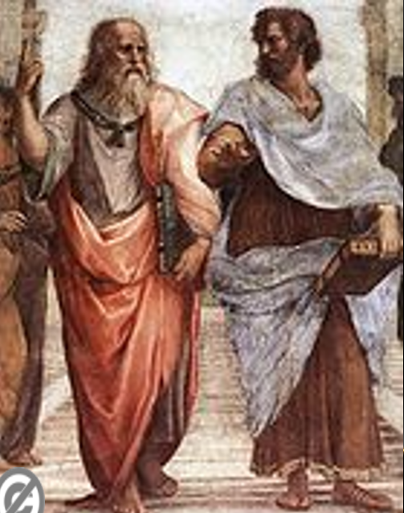
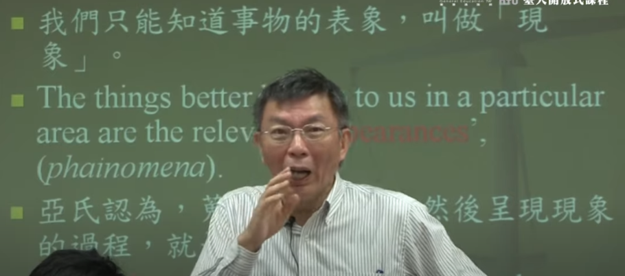

**概论**

[苑举正](https://zh.wikipedia.org/wiki/%E8%8B%91%E8%88%89%E6%AD%A3)

回答三个问题：

```
1 我们的真善美的标准哪里来的
2 我们讲究的人权的价值来自哪儿来的【基督教的人权】
3 中国的道德环境是哪里来的
```

[TTC课程](https://www.thegreatcourses.com/) 

1 回答三个问题

- [ ] 我们的真善美的标准哪里来的
- [ ] 我们讲究的人权的价值来自哪儿来的【基督教的人权】
- [ ] 中国的道德环境是哪里来的

2 为什么希腊产生了西方哲学？

- [ ] 民主自由

- [ ] 世界是语言说出来的

  > 理论是不断辩论出来的

3 西方哲学的三条脉络

- [ ] 批判理性的传统
- [ ] 语言
- [ ] 理性的认识的缩小


# 自然哲学和智者学派

希腊哲学的三个特点

- [ ] 语言决定人类世界的存在
- [ ] 神话世界理性化的过程
- [ ] 独一无二中的文化传统产生的民主政治制度


本节课的三个重点

- [ ] 1 物理学的起源
- [ ] 2 用语言决定世界的存在会导致一个什么样的混乱的局面
- [ ] 3 苏格拉底的兴起是为了解决这个混乱的局面


所有一切的前提都在追问，这一切的变化，变化有没有规律，有没有原则，他的基础是什么，他的原因是什么。于是产生希腊哲学的追问。

先苏哲学的方法论

- [x] 1 批判理性主义

> 西方哲学的进展都是建立在批判的基础上进一步获得突破的可能）

- [x] 2 抽象思维的不断提高


## 自然哲学


米利都学派

> 泰勒斯 水本原
> 阿那克西曼德 无定形
> 阿那克西美尼


毕达哥拉斯学派
> 数和音乐，追求和谐，宗教氛围浓厚。

爱菲斯学派 -赫拉克利特
> 火本原说，一切都在变化。逻各斯

伊利亚学派 
> 巴门尼德 存在和非存在
> 芝诺 悖论

原子论学派
> 德谟克利特

## 智者学派

6大自然哲学的结果(自说自话)

在一个民主的社会中，谁有权利去说服别人，产生智者去教别人说法的技巧。重要的是***理性的论证和理性的说服只有一线之隔***。知道真理没有用，讲到所有人都哑口无言才叫厉害。在哪个说话能力重要的社会，每个人都是自己的律师，只有用说话保护自己，苏格拉底就是这样的人。Sophists是社会中最会赚钱的人。说话技巧在社会中非常重要。


1 先苏哲学（自然哲学）

2 智者和苏柏拉图亚里士多德

> 苏格拉底进行了西方哲学的第一次的革命【伦理学革命】
>
> 基督教哲学和儒家哲学很像，新教伦理与资本主义精神

## 苏格拉底

### 主张

•一、思考的對象，應為人性本質，而非自然本質。

> 苏格拉底进行了西方哲学的第一次的革命【伦理学革命】

•二、透過語言的對話，可以突顯人類獲得真理的限制。

> 通过对话，不断的去找哪些真的东西。助产术和辩证法

•三、張揚具有理想性格的知識份子。

•四、人人皆應作一個遵守國家法律的公民。


### 道德知识主义

•哲學家的思想重點，在於實現道德知識主義。

> I know what is true
>
> I know what is right to do 
>
> 一场思辨之旅
>
> 我们每个人都有道德直觉，但是并不能让我们决定所有事。 

•道德知識主義，就是「知行合一」。

•沒有人會作錯事，只有「無知」的人，會作錯事。

•「有知識的人」，就是會依照真理去做事的人。

因此，真知具有道德的強制性。


### 反诘法

学习西洋哲学一定要有对话的热情

•蘇格拉底哲學中最重要的部分（反詰法）：提問與回答。

•提問的目的是什麼？答案：進行對話交流。

•提問的意義是什麼？答案：進行捍衛對抗。

•提問的效用是什麼？答案：進行反諷啟發。

•提問的結果是什麼？答案：承認無知

•對話、捍衛與反諷之間的循環，構成學習的過程，其目的在於討論表面與真實之間的差別。

•哲學就是一個否定表面認知，探究真實本質的活動。


### 负责任的公民

蘇格拉底被柏拉圖塑造為一位忠於國家的人，因為他因捍衛國家法律的尊嚴，接受「蠱惑青年」的罪名，判處死刑。

在蘇格拉底的教育中，他鄙視感官上的滿足，卻因為提升美感而感到高興。

他將其一身的經歷，均奉獻給雅典公民，在市中心的廣場，不斷與來往的人進行對話，探討各種哲學理念。

蘇格拉底被公認為西洋哲學的奠基者，也是這種思想的實踐者。


> 苏格拉底的死亡，很重要？
> 对柏拉图留下一个很重要的问题，大家都说民主制度最理性，为什么最理性的制度会做出最不理性的判决？
> 柏拉图否定民主制，提出哲学家皇帝


### 总结

最重要的是反诘法

伦理学、知识论、修辞学、政治学（怎么成为一个公民）


# 智者学派和苏格拉底


```
The Sophists may be said to be the first Greek sceptics. The materialism of the Atomists, the idealism of the Eleatics, and the doctrine of universal change with which Heraclitus (Ephesians) was associated — all these tendencies resulted in a condition of unrest, out of which philosophy could not advance to a more satisfactory state until an enquiry was made into the problem of the value of knowledge. The Sophists did not undertake that enquiry, but they called attention to the existence of knowledge at all.
The Sophists【智者，诡辩学派】 may be said to be the first Greek sceptics【怀疑论者】. The materialism【唯物主义】 of the Atomists【原子论】, the idealism【唯心主义】 of the Eleatics【爱利亚学派】, and the doctrine【学说、教义】 of universal【common 普遍】 change with which Heraclitus【赫拉克利特】 (Ephesians) was associated — all these tendencies resulted in a condition of unrest【动荡】, out of which philosophy could not advance to a more satisfactory state until【直到】 an enquiry was made into the problem of the value of knowledge. The Sophists did not undertake【从事】 that enquiry, but they called attention to the existence of knowledge at all。
智者派可以说是最早的希腊怀疑论者。原子论者的唯物主义、埃利亚学派的唯心主义，以及与赫拉克利特（以弗所人）相关的普遍变化学说——所有这些倾向都导致了一种动荡的状态，哲学无法从这种状态中前进到更令人满意的状态，直到对知识的价值问题进行了调查。 智者并没有进行那种探究，但他们提请注意知识的存在。
```

## Sophistic


```
In brief, the Sophistic method was different from the Socratic method by being the method of strife (Eristic method) in contrast to the Socratic method of discovery (Heuristic method). Sophism is of great importance historically, because it was the evil influence of the Sophists that inspired Socrates with the idea of refuting them by showing the conditions of true knowledge.

In brief, the Sophistic method【智者的方法】 was different from the Socratic method【苏格拉底的方法】 by being the method of strife【斗争】 (Eristic method) in contrast to the Socratic method of discovery (Heuristic method). Sophism is of great importance historically, because it was the evil influence of the Sophists that inspired【启发】 Socrates with the idea of refuting【反驳】 them by showing the conditions of true knowledge.
简而言之，智者方法与苏格拉底方法的不同之处在于，它是斗争的方法（Eristic 方法），与苏格拉底的发现方法（启发式方法）相对。 Sophism 在历史上具有重要意义，因为正是 Sophists 的邪恶影响启发了苏格拉底，通过展示真知识的条件来反驳他们。
```

## Protagoras

```
Protagoras of Abdera (same as Democritus and learned philosophy from the Atomist),called the Individualist (for Plato, relativist) because he says rather famously: "Man is the measure of all things: of things which are, that they are, and of things which are not, that they are not”
```

```
Protagoras【普罗泰戈拉】 of Abdera (same as Democritus【德谟克利特】 and learned philosophy from the Atomist【原子论】),called the Individualist (for Plato, relativist) because he says rather famously: "Man is the measure of all things: of things which are, that they are, and of things which are not, that they are not”
阿布德拉的普罗泰戈拉（与德谟克利特相同，从原子论者那里学习哲学），
被称为个人主义者（对于柏拉图来说，是相对主义者），因为他说得相当有名：“人是万物的尺度：存在的事物存在的事物存在，不存在的事物存在的事物存在”
```


## Gorgias

```
Gorgias was called the Nihilist because of his doctrine:
Nothing exists; 
Even if something exists, nothing can be known about it; and 
Even if something can be known about it, knowledge about it can't be communicated to others. 
Even if it can be communicated, there is no incentive【动力】 to do so.
高尔吉亚因其学说而被称为虚无主义者：
什么都不存在；
即使某物存在，也无从知晓； 和
即使可以知道关于它的某些东西，关于它的知识也不能传达给他人。
即使可以传达，也没有这样做的动机。 
```

## hippias

```
Hippias was called the Polymathist because he was a man of very extensive knowledge, and he occupied himself not only with rhetorical【修辞学】, philosophical【哲学】 and political【政治】 studies, but was also well versed【谙练、熟悉】 in poetry, music, mathematics, painting and sculpture【雕塑】, and he claimed some practical skill in the ordinary arts of life, for he used to boast of wearing on his body nothing that he had not made himself with his own hands. 
On the other hand, his knowledge always appears superficial as he does not enter into the details of any particular【特定的】 art or science, and is satisfied with certain generalities【概括性】, which enabled him to speak on everything without a thorough knowledge of any. 
希庇亚斯被称为博学者，因为他知识渊博，不仅精通修辞学、哲学和政治学，而且精通诗歌、音乐、数学、绘画和雕塑，他声称有一些实用的知识。 他精通日常的生活艺术，因为他曾经吹嘘自己身上所穿的任何东西都不是他亲手做的。
另一方面，他的知识总是显得肤浅，因为他不深入任何特定的艺术或科学的细节，而满足于某些概括性的东西，这使他能够在没有透彻了解任何事物的情况下谈论一切。
博学vs精通
```

## prodicus

```
Prodicus, called the Moralist because in his discourses, especially in that which he entitled "Hercules at the Cross-roads" (concerning the stake of selecting either virtue or vice), he strove【努力】 to inculcate【教授】 moral lessons, although he did not attempt to reduce conduct to principles, but taught rather by proverb, epigram, and illustration. He is the only sophist being somewhat praised by Socrates and Plato and the reason is clearly that his teaching contained moral lessons to take. But he still collect a handsome amount of money for offering lectures.

Prodicus，被称为道德家，因为在他的演讲中，尤其是在他题为“十字路口的大力神”（关于选择美德或恶习的利害关系）中，他努力灌输道德教训，尽管他没有试图减少 行为原则，而是通过谚语、警句和例证来教导。 他是唯一受到苏格拉底和柏拉图赞扬的诡辩家，原因很明显是因为他的教导包含了可以吸取的道德教训。 但他仍然收集了一大笔钱用于讲学。

很多东西区分不出来好的还是坏的。
```


## Gorgias by Plato

- [x] Gorgias: Rhetoric, Socrates, is my art.
- [ ]  高尔吉亚:苏格拉底，修辞学是我的艺术。
- [x] Socrates: Then I am to call you a rhetorician?
- [ ]  苏格拉底:那么我该称你为修辞学家?
- [x] Gorgias: Then pray do.
- [ ]  高尔吉亚:那就祈祷吧。
- [x] Socrates: And are we to say that you are able to make other men rhetoricians?
- [ ]  苏格拉底:我们能说你能让其他人成为修辞学家吗?
- [x] Gorgias: Yes, that is exactly what I profess to make them, not only at Athens, but in all places.
- [ ]  高尔吉亚:是的，这正是我所宣称的，不仅在雅典，而且在所有的地方。
- [x] Socrates: Then why, if you call rhetoric the art which treats of discourse, and all the other arts treat of discourse, do you not call them arts of rhetoric?
- [ ]  苏格拉底:那么，如果你把修辞学称为论述的艺术，而所有其他的艺术都是论述的艺术，你为什么不把它们称为修辞学呢?
- [x] Gorgias: Because, Socrates, the knowledge of the other arts has only to do with some sort of external action, as of the hand; 
- [ ]  高尔吉亚:因为，苏格拉底，其他艺术的知识只与某种外部行为有关，比如手; 
- [x] but there is no such action of the hand in rhetoric which works and takes effect only through the medium of discourse. 
- [ ]  但是在修辞学中却没有这样的手的作用，只有通过话语的媒介才能起作用。 
- [x] And therefore I am justified in saying that rhetoric treats of discourse.
- [ ]  因此，我有理由说修辞学处理的是话语。
- [x] Socrates: But there are other arts which work wholly through the medium of language, and require either no action or very little, as, for example, the arts of arithmetic, of calculation, of geometry, and of playing draughts.
- [ ]  苏格拉底:但是，还有一些艺术完全通过语言媒介发挥作用，不需要任何行动，或者只需要很少行动，例如，算术、计算、几何和下棋的艺术。
- [x] Gorgias: Exactly.
- [ ]  高尔吉斯:没错。
- [x] Gorgias: If you have the power of uttering this word, you will have the physician your slave, and the trainer your slave, and the money-maker of whom you talk will be found to gather treasures, not for himself, but for you who are able to speak and to persuade the multitude.
- [ ]  高尔吉亚:如果你有说出这句话的能力，你就会让医生成为你的奴隶，训练师成为你的奴隶，而你所说的那个赚钱的人也会为你聚集财富，不是为他自己，而是为你这个能说话并能说服众人的人。
- [x] Socrates: Now I think, Gorgias, that you have very accurately explained what you conceive【构思】 to be the art of rhetoric that rhetoric is the artificer of persuasion, having this and no other business, and that this is her crown and end.  
- [ ] 苏格拉底:我认为，高尔吉亚，你已经非常准确地解释了你所认为的修辞学艺术，修辞学是说服的工匠，只有这一点，没有其他的事情，这是她的冠冕和目的。 
- [x] Do you know any other effect of rhetoric over and above that of producing persuasion?
   除了产生说服力之外，你知道修辞还有什么其他作用吗?
- [x] Gorgias: No: the definition seems to me very fair, Socrates; 
- [ ]  高尔吉亚:不，这个定义在我看来很公平，苏格拉底。
- [x]  for persuasion is the chief end of rhetoric.
- [ ]  因为说服是修辞的主要目的。
- [x] Socrates: You, Gorgias, like myself, have had great experience of disputations, and you must have observed that disagreements are apt to arise; 
- [ ]  苏格拉底:你，高尔吉亚，和我一样，对辩论有着丰富的经验，你一定注意到分歧很容易产生;
- [x]  somebody says that another has not spoken truly or clearly;  
- [ ] 有人说另一个人说得不真实、不清楚; 
- [x] and then they get into a passion and begin to quarrel.  
- [ ] 然后他们就开始争吵起来。 
- [x] But I cannot help feeling that you are now saying what is not quite consistent or accordant with what you were saying at first about rhetoric.  
- [ ] 但我不禁觉得，你现在所说的与你最初所说的修辞不太一致或一致。 
- [x] And I am afraid to point this out to you that I speak, not for the sake of discovering the truth.
- [ ]  我害怕向你们指出，我说话，不是为了发现真理。
- [x] Now if you are one of my sort, I should like to cross-examine you, but if not I will let you alone.  
- [ ] 如果你是我的同类，我愿意盘问你，但如果不是，我就不打扰你了。
- [x]  And what is my sort?  
- [ ] 我是什么样的人?
- [x]  I am one of those who are very willing to be refuted if I say anything which is not true, and very willing to refute any one else who says what is not true, and quite as ready to be refuted as to refute. 
- [ ]  如果我说了什么不正确的话，我是那种非常愿意被反驳的人，我也非常愿意反驳任何说了不正确的话的人，我愿意被反驳，就像愿意反驳一样。
- [x]  For I imagine that there is no evil which a man can endure so great as an erroneous opinion about the matters of which we are speaking and if you claim to be one of my sort, let us have the discussion out, but if you would rather have done, no matter-let us make an end of it. 
- [ ] 因为在我看来，一个人所能忍受的最大的罪恶莫过于对我们正在谈论的问题持有错误的意见，如果你自称是我这一类人，那就让我们把这个问题讨论出来吧，但如果你宁愿这样做，那也无所谓——让我们就此结束吧。


```
Gorgias: Rhetoric, Socrates, is my art.
Socrates: Then I am to call you a rhetorician?
Gorgias: Then pray do.
Socrates: And are we to say that you are able to make other men rhetoricians?
Gorgias: Yes, that is exactly what I profess to make them, not only at Athens, but in all places.

Socrates: Then why, if you call rhetoric the art which treats of discourse, and all the other arts treat of discourse, do you not call them arts of rhetoric?
Gorgias: Because, Socrates, the knowledge of the other arts has only to do with some sort of external action, as of the hand; but there is no such action of the hand in rhetoric which works and takes effect only through the medium of discourse. And therefore I am justified in saying that rhetoric treats of discourse.
Socrates: But there are other arts which work wholly through the medium of language, and require either no action or very little, as, for example, the arts of arithmetic, of calculation, of geometry, and of playing draughts.
Gorgias: Exactly.


Gorgias: If you have the power of uttering this word, you will have the physician your slave, and the trainer your slave, and the money-maker of whom you talk will be found to gather treasures, not for himself, but for you who are able to speak and to persuade the multitude.
Socrates: Now I think, Gorgias, that you have very accurately explained what you conceive to be the art of rhetoric that rhetoric is the artificer of persuasion, having this and no other business, and that this is her crown and end. Do you know any other effect of rhetoric over and above that of producing persuasion?
Gorgias: No: the definition seems to me very fair, Socrates; for persuasion is the chief end of rhetoric.
Socrates: You, Gorgias, like myself, have had great experience of disputations, and you must have observed that disagreements are apt to arise; somebody says that another has not spoken truly or clearly; and then they get into a passion and begin to quarrel. But I cannot help feeling that you are now saying what is not quite consistent or accordant with what you were saying at first about rhetoric. And I am afraid to point this out to you that I speak, not for the sake of discovering the truth. 
Now if you are one of my sort, I should like to cross-examine you, but if not I will let you alone. And what is my sort? I am one of those who are very willing to be refuted if I say anything which is not true, and very willing to refute any one else who says what is not true, and quite as ready to be refuted as to refute. For I imagine that there is no evil which a man can endure so great as an erroneous opinion about the matters of which we are speaking and if you claim to be one of my sort, let us have the discussion out, but if you would rather have done, no matter-let us make an end of it.

高尔吉亚：修辞学，苏格拉底，是我的艺术。
苏格拉底：那我要称你为修辞学家？
高尔吉亚：那就祈祷吧。
苏格拉底：我们是说你能让其他人成为修辞学家吗？
高尔吉亚：是的，这正是我自称制造它们的原因，不仅在雅典，而且在所有地方。

苏格拉底：那么，如果你把修辞学称为处理话语的艺术，而所有其他处理话语的艺术，你为什么不称它们为修辞学的艺术呢？
高尔吉亚：因为，苏格拉底，其他艺术的知识只与某种外部行为有关，比如手； 但是在修辞学中没有这种只有通过话语媒介才能发挥作用的手的动作。 因此，我有理由说修辞处理话语。
苏格拉底：但是还有其他一些艺术完全通过语言来运作，不需要或不需要任何动作，例如算术、计算、几何和玩跳棋的艺术。

高尔吉亚：没错。
高尔吉亚：如果你有说出这句话的能力，你就会有医生成为你的奴隶，训练师成为你的奴隶，你所说的赚钱的人将会被发现收集财富，不是为他自己，而是为你 能言善辩，能说服众人。
苏格拉底：现在我认为，高尔吉亚，你已经非常准确地解释了你所认为的修辞艺术，即修辞是说服的技师，有这个而不是其他的业务，这是她的最高点和终点。 除了产生说服力之外，你还知道修辞的其他效果吗？
高尔吉亚：不，这个定义在我看来很公平，苏格拉底； 因为说服是修辞的主要目的。
苏格拉底：你，高尔吉亚，和我一样，有丰富的辩论经验，你一定已经观察到分歧很容易出现； 有人说另一个人没有真实或清楚地说话； 然后他们陷入激情并开始争吵。 但我不禁觉得你现在所说的与你最初所说的修辞学不太一致或不一致。 我不敢向你指出这一点，我不是为了发现真相而说话。
现在，如果你是我这样的人，我想盘问你，但如果不是，我会让你一个人呆着。 我是什么类型的？ 如果我说任何不真实的话，我是非常愿意被反驳的人之一，并且非常愿意反驳任何其他说不真实的人，并且非常愿意被反驳而不是反驳。 因为我想，没有什么比对我们正在谈论的事情的错误观点更能让一个人忍受的罪恶了，如果你自称是我的一员，让我们讨论一下，但如果你愿意 已经完成了，无论如何——让我们结束它。

Gorgias: Rhetoric, Socrates, is my art.
Socrates: Then I am to call you a rhetorician?
Gorgias: Then pray【祈祷】 do.
Socrates: And are we to say that you are able to make other men rhetoricians?
Gorgias: Yes, that is exactly what I profess【自称、承认】 to make them, not only at Athens, but in all places.
高尔吉亚：修辞学，苏格拉底，是我的艺术。
苏格拉底：那我要称你为修辞学家？
高尔吉亚：那就祈祷吧。
苏格拉底：我们是说你能让其他人成为修辞学家吗？
高尔吉亚：是的，这正是我自称制造它们的原因，不仅在雅典，而且在所有地方。
Socrates: Then why, if you call rhetoric the art which treats【处理】 of discourse【讨论、论谈】, and all the other arts treat of discourse, do you not call them arts of rhetoric?
Gorgias: Because, Socrates, the knowledge of the other arts has only to do with some sort of external【外部的】 action, as of the hand; but there is no such action of the hand in rhetoric which works and takes effect only through the medium【媒介】 of discourse. And therefore I am justified【有正当理由】 in saying that rhetoric treats of discourse.
Socrates: But there are other arts which work wholly through the medium of language, and require either no action or very little, as, for example, the arts of arithmetic【算术】, of calculation, of geometry【几何】, and of playing draughts【跳棋】.
Gorgias: Exactly.
苏格拉底：那么，如果你把修辞学称为处理话语的艺术，而所有其他处理话语的艺术，你为什么不称它们为修辞学的艺术呢？
高尔吉亚：因为，苏格拉底，其他艺术的知识只与某种外部行为有关，比如手； 但是在修辞学中没有这种只有通过话语媒介才能发挥作用。 因此，我有理由说修辞处理话语。
苏格拉底：但是还有其他一些艺术完全通过语言来运作，不需要或不需要任何动作，例如算术、计算、几何和玩跳棋的艺术。
Gorgias: If you have the power of uttering【说出】 this word, you will have the physician【医生】 your slave, and the trainer your slave, and the money-maker of whom you talk will be found to gather【收集】 treasures【宝物】, not for himself, but for you who are able to speak and to persuade【说服】 the multitude【众人】.
高尔吉亚：如果你有说出这个词的能力，你就会有医生成为你的奴隶，训练师成为你的奴隶，你所说的赚钱的人将会被发现收集财富，不是为他自己，而是为你 能言善辩，能说服众人。
Socrates: Now I think, Gorgias, that you have very accurately【精确地】 explained【解释】 what you conceive【构思设想】 to be the art of rhetoric that rhetoric is the artificer【技工】 of persuasion, having this and no other business, and that this is her crown【王冠】 and end. Do you know any other effect of rhetoric over and above that of producing persuasion?
苏格拉底：现在我认为，高尔吉亚，你已经非常准确地解释了你所认为的修辞艺术，即修辞是说服的技师，有这个而不是其他的业务，这是她的最高点和终点。 除了产生说服力之外，你还知道修辞的其他效果吗？
Gorgias: No: the definition seems to me very fair, Socrates; for persuasion is the chief end of rhetoric【修辞】.
高尔吉亚：不，这个定义在我看来很公平，苏格拉底； 因为说服是修辞的主要目的。
Socrates: You, Gorgias, like myself, have had great experience of disputations【辩论】, and you must have observed that disagreements【不一致，分歧】 are apt【易于】 to arise【产生】; somebody says that another has not spoken truly or clearly; and then they get into a passion【爱恋、激情】 and begin to quarrel【争吵、拌嘴】. But I cannot help【禁不住】 feeling that you are now saying what is not quite consistent【一致】 or accordant【和谐的】 with what you were saying at first about rhetoric. And I am afraid to point this out to you that I speak, not for the sake【利益】 of discovering the truth. 
苏格拉底：你，高尔吉亚，和我一样，有丰富的辩论经验，你一定已经观察到分歧很容易出现； 有人说另一个人没有真实或清楚地说话； 然后他们陷入激情并开始争吵。 但我不禁觉得你现在所说的与你最初所说的修辞学不太一致或不一致。 我不敢向你指出这一点，我不是为了发现真相而说话。
Now if you are one of my sort【类，排序】, I should like to cross-examine【检查】 you, but if not I will let you alone. And what is my sort? I am one of those who are very willing to be refuted【反驳】 if I say anything which is not true, and very willing to refute any one else who says what is not true, and quite as ready to be refuted as to refute. For I imagine that there is no evil which a man can endure【忍受】 so great as an erroneous【错误】 opinion about the matters【事情】 of which we are speaking and if you claim to be one of my sort, let us have the discussion out, but if you would rather have done, no matter-let us make an end of it.
现在，如果你是我这样的人，我想盘问你，但如果不是，我会让你一个人呆着。 我是什么类型的？ 如果我说任何不真实的话，我是非常愿意被反驳的人之一，并且非常愿意反驳任何其他说不真实的人，并且非常愿意在反驳的时候被反驳而。 因为我想，没有什么比对我们正在谈论的事情的错误观点更能让一个人忍受的罪恶了，如果你自称是我的一员，让我们讨论一下，但如果你愿意已经完成了，无论如何——让我们结束它。


高尔吉亚:苏格拉底，修辞是我的艺术。
Gorgias: Rhetoric, Socrates, is my art.
苏格拉底:那么我要称你为修辞学家?
Socrates: Then I am to call you a rhetorician?
戈吉斯:那就请吧。
Gorgias: Then pray do.
苏格拉底:那我们可以说你能使别人成为雄辩家吗?
Socrates: And are we to say that you are able to make other men rhetoricians?
戈吉斯:是的，我就是这么做的，不仅在雅典，而且在所有地方。
Gorgias: Yes, that is exactly what I profess to make them, not only at Athens, but in all places.
苏格拉底:那么，如果你称修辞学是处理话语的艺术，而其他所有的艺术都是处理话语的艺术，你为什么不称它们为修辞艺术呢?
Socrates: Then why, if you call rhetoric the art which treats of discourse, and all the other arts treat of discourse, do you not call them arts of rhetoric?
高尔吉亚:苏格拉底，因为其他艺术的知识只与某种外在的活动有关，比如手; 
Gorgias: Because, Socrates, the knowledge of the other arts has only to do with some sort of external action, as of the hand; 
但是在修辞学中没有这样的手的行动，只有通过话语的媒介才能起作用。  
but there is no such action of the hand in rhetoric which works and takes effect only through the medium of discourse. 
因此我有理由说，修辞学是研究话语的。
 And therefore I am justified in saying that rhetoric treats of discourse.
苏格拉底:但还有一些艺术，是完全通过语言这一媒介发挥作用的，不需要任何动作，或只需要很少的动作，例如算术、计算、几何和跳棋的艺术。
 Socrates: But there are other arts which work wholly through the medium of language, and require either no action or very little, as, for example, the arts of arithmetic, of calculation, of geometry, and of playing draughts.
高尔吉斯:没错。
Gorgias: Exactly.
戈尔吉亚:如果你有能力说出这句话，你就会让医生成为你的奴隶，驯兽师成为你的奴隶，你所谈论的赚钱的人也会被发现去收集财宝，不是为他自己，而是为你这个会说话并能说服众人的人。
 Gorgias: If you have the power of uttering this word, you will have the physician your slave, and the trainer your slave, and the money-maker of whom you talk will be found to gather treasures, not for himself, but for you who are able to speak and to persuade the multitude.
苏格拉底:现在我认为，戈吉斯，你已经非常准确地解释了你所设想的修辞艺术，修辞是说服的设计者，只有这一点，没有其他的事情，这是她的王冠和结局。 
Socrates: Now I think, Gorgias, that you have very accurately explained what you conceive to be the art of rhetoric that rhetoric is the artificer of persuasion, having this and no other business, and that this is her crown and end. 
你知道除了说服别人之外，修辞还有什么其他作用吗?
  Do you know any other effect of rhetoric over and above that of producing persuasion?
戈吉斯:不，这个定义在我看来很公平，苏格拉底; 
Gorgias: No: the definition seems to me very fair, Socrates; 
因为说服是修辞的主要目的。
 for persuasion is the chief end of rhetoric.
苏格拉底:你，高尔吉亚，和我一样，对争论有着丰富的经验，你一定注意到分歧是容易出现的; 
Socrates: You, Gorgias, like myself, have had great experience of disputations, and you must have observed that disagreements are apt to arise; 
有人说另一个人说得不真实或不清楚;  
somebody says that another has not spoken truly or clearly; 
然后他们就变得很生气，开始争吵。  
and then they get into a passion and begin to quarrel. 
但我不禁觉得你现在所说的与你最初所说的修辞不太一致或不一致。 
But I cannot help feeling that you are now saying what is not quite consistent or accordant with what you were saying at first about rhetoric. 
我恐怕要告诉你们，我说话不是为了发现真相。
And I am afraid to point this out to you that I speak, not for the sake of discovering the truth.
如果你和我一样，我愿意盘问你;如果不是，我就让你自己去。
Now if you are one of my sort, I should like to cross-examine you, but if not I will let you alone.
我是什么类型的?  And what is my sort?
我是那种非常愿意被反驳的人之一，如果我说了什么不真实的东西，我也非常愿意反驳任何其他说了不真实的东西的人，我既愿意被反驳，也愿意反驳。  
I am one of those who are very willing to be refuted if I say anything which is not true, and very willing to refute any one else who says what is not true, and quite as ready to be refuted as to refute. 
因为我想，对于我们正在谈论的事情，一个人所能忍受的最坏的事情莫过于错误的意见。如果你声称你是我这一类人，那就让我们把这个问题讨论出来，但如果你愿意这样做，那没关系，让我们把它结束。  
For I imagine that there is no evil which a man can endure so great as an erroneous opinion about the matters of which we are speaking and if you claim to be one of my sort, let us have the discussion out, but if you would rather have done, no matter-let us make an end of it.
```


## unexamin life

"An unexamined life is not worth living"


```
"An unexamined life is not worth living"
Someone will say: Yes, Socrates, but cannot you hold your tongue【舌头】, and then you may go into a foreign city, and no one will interfere【干涉】 with you? 
Now I have great difficulty in making you understand my answer to this. For if I tell you that this would be a disobedience【违反】 to a divine【神的】 command【命令】, and therefore that I cannot hold my tongue, you will not believe that I am serious; and if I say again that the greatest good of man is daily to converse【交谈】 about virtue【道德】, and all that concerning【关于】 which you hear me examining【审视】 myself and others, and that the life which is unexamined is not worth living - that you are still less likely to believe. And yet what I say is true, although a thing of which it is hard for me to persuade you.
有人会说：是的，苏格拉底，但你不能闭嘴，然后你可能会去一个外国城市，没有人会干涉你吗？
现在我很难让你理解我对此的回答。 因为如果我告诉你这是对神圣命令的违背，因此我不能闭嘴，你不会相信我是认真的； 如果我再说一遍，人最大的好处是每天谈论美德，以及所有你听到我审视自己和他人的事情，未经审视的生活不值得过——你更不可能相信。 然而我说的是真的，虽然我很难说服你。
```

- [x] Someone will say: Yes, Socrates, but cannot you hold your tongue, and then you may go into a foreign city, and no one will interfere with you?
- [ ] 有人会说:是的，苏格拉底，但是你就不能闭上你的舌头，这样你就可以进入一个陌生的城市，没有人会干涉你吗?
- [x] Now I have great difficulty in making you understand my answer to this.  
- [ ] 现在我很难让你理解我对这个问题的回答。
- [x]  For if I tell you that this would be a disobedience to a divine command, and therefore that I cannot hold my tongue, you will not believe that I am serious;  
- [ ] 我若对你们说，这是违背神的命令，所以我不能闭口，你们就不信我是严肃的。
- [x]  and if I say again that the greatest good of man is daily to converse【谈论】 about virtue, and all that concerning【关于】 which you hear me examining myself and others, and that the life which is unexamined is not worth living - that you are still less likely to believe. 
- [ ]  如果我再说一遍，人最大的善是每天谈论美德，以及你听到我审查自己和他人的一切，未经审查的生活是不值得过的——那么你就更不可能相信了。 
- [x] And yet what I say is true, although a thing of which it is hard for me to persuade you.
- [ ]  然而我说的是真的，虽然我很难说服你。


## the only thing

•“The only thing I know is that I do not know anything!”

•我唯一知道的東西就是我什麼也不知道！

------

At last I went to the **artisans**, for I was **conscious**【意识到】 that I knew nothing at all, as I may say, and I was sure that they knew many fine things; and in this I was not mistaken, for they did know many things of which I was ignorant【无知】, and in this they certainly were wiser than I was. But I observed that even the good artisans fell into the same error as the poets; because they were good workmen they thought that they also knew all sorts of **high matters**【问题，物】, and this defect【缺陷】 in them overshadowed【黑暗，遮蔽】 their wisdom - therefore I asked myself **on behalf of** 【代表】the oracle【神谕，甲骨文】, whether I would like to be as I was, neither having their knowledge nor their ignorance, or like them in both; and I made answer to myself and the oracle that I was better off as I was. 

------


- [x] At last I went to the artisans【工匠】, for I was conscious【意识到】 that I knew nothing at all, as I may say, and I was sure that they knew many fine things;  
- [ ] 最后我去找那些工匠，因为我意识到我什么都不知道，我可以说，我相信他们知道许多好东西。 
- [x] and in this I was not mistaken, for they did know many things of which I was ignorant【无知】, and in this they certainly were wiser than I was.  
- [ ] 在这一点上我并没有错，因为他们确实知道许多我不知道的事情，在这一点上他们肯定比我聪明。 
- [x] But I observed that even the good artisans fell into the same error as the poets;  
- [ ] 但我注意到，即使是优秀的工匠也会像诗人一样犯同样的错误; 
- [x] because they were good workmen they thought that they also knew all sorts of high matters, and this defect in them overshadowed【遮蔽】 their wisdom - therefore I asked myself on behalf of the oracle, whether I would like to be as I was, neither having their knowledge nor their ignorance, or like them in both;  
- [x] 因为他们是优秀的工匠，所以他们认为自己也懂得各种深奥的事情，他们的这种缺陷掩盖了他们的智慧——因此我代表神谕问我自己，我是否愿意像我一样，既不具备他们的知识，也不具备他们的无知，还是两者都像他们一样; 
- [ ] and I made answer to myself and the oracle that I was better off as I was. 
- [x] 我对自己和神谕说，我这样过得更好。


# Socratic-plato-从苏格拉底到柏拉图

呈现的关键，柏拉图的思想为什么会变成西洋哲学的主要思想？

> 同样的，为什么儒家会成为中国的主要思想


1 柏拉图和苏格拉底到底有什么不一样

2 思想来源 雅典学院--包括先苏哲学家 和苏格拉底

3 面对同样的哲学问题（变化、无常）为什么柏拉图脱颖而出


## 苏格拉底到柏拉图

苏格拉底

> 好    
>
> 乐
>
> 迪

 柏拉图

> 顶  理想主义
>
> 福  超越主义
>
> 启  神圣主义


数学天赋、数学的推理能力

>数学推理能力哪里来的？前世的理型生活在我们脑海里留下的记号


## 雅典学派-思想来源

拉斐尔的名画-雅典学派



> - [x] 柏拉图      指天   天国（演绎推理  数学）
> - [x] 亚里士多德  指地   （实验归纳得到  科学   ）


科学和数学

> - [ ]  科学的本质并不真，它原来并不当真的（归纳法，黑天鹅）
> - [ ] 真实的是数学，但我们并不知道数学和外在世界的关系是什么


柏拉图的思想为基督教的神学思想提供了丰富的思想资源和铺垫

- [ ] 数学的推理能力似乎有种神奇的力量。

- [ ] 柏拉图指着天上，似乎带着强烈的宗教思想和神秘主义。

柏拉图指着天上，但活在人间，这一点和亚里士多德是一致的。

- [ ] 在哲学上，为什么柏拉图一般比亚里士多德厉害

  理型的世界永远都达不到（得不到的永远在骚动）


赫拉克利特

> 唯一不变的是变化。罗格斯

巴门尼德

> 存在，讲没有不存在的东西

毕达哥拉斯

> 数学，讲经验的本质（哲学和宗教、神秘主义浓厚）

柏拉图不单继承了苏格拉底，还继承了先苏哲学的东西


## 柏拉图的特殊

柏拉图的特殊性在哪儿呢？

为什么只有柏拉图的著作留下来？

> 和政治相关(类似罢黜百家，独尊儒术)

特洛伊战争特殊之处

> - [ ] 没有好人和坏人，只有人和神。
> - [ ] 人和神的区别是偶然的。
> - [ ] 木马屠城记


我们生活中的标准
> 正义优先于友谊？为什么，其实每个人都渴望friendship，那为什么次之了

柏拉图思想的关键四点
- [ ] idea的世界
- [ ] 灵魂的不灭
- [ ] 光照的理论（模仿）
- [ ] 回忆的理论


•在这个发展中，柏拉图思想的最大特色就是「贬抑日常观察，推崇抽象思想」。
> 这个其实在先苏哲学家就早有的传统，经验世界的认知都是异见

•我们在日常生活中观察到的事务裡，表面上出现许多特征（例如：真(truth) 、善(goodness) 、美(beauty) 、大(bigness) 、正(justice) 、似(likeness) 、合(unity) 、有(being) 、同(sameness) 、異(difference) ），但它们都是表面上观察到的【经验世界】，并不是「**真正真实的**」。 


## idea世界-洞穴寓

在这个发展中，柏拉图思想的最大特色就是「贬抑日常观察，推崇抽象思想」。

> 这个其实在先苏哲学家就早有的传统，经验世界的认知都是异见

我们在日常生活中观察到的事务裡，表面上出现许多特征（例如：真(truth) 、善(goodness) 、美(beauty) 、大(bigness) 、正(justice) 、似(likeness) 、合(unity) 、有(being) 、同(sameness) 、異(difference) ），但它们都是表面上观察到的【经验世界】，并不是「**真正真实的**」。 

> 所以一个丑陋的人，因为他是idea世界的映射，他也是真善美的？？？？

它们「看似」真实的原因，在于有「一」个只存在思维中的「理型」 (Form) 。 「理型」是唯一的、思想的，以及真实的；理型使得观察成为可能，因为在观察的过程中，理型应用于外在对象，赋予这些对象被理解的可能。 

> 建构了一套理型的世界系统，所有经验世界、现象世界都是idea世界的仿有，idea世界是真、善、美的。
> 现实中的锤子是idea世界中完美锤子的仿有（有点类似类和对象的关系）

柏拉图的哲学，基本上完全在于分析这个介于「表象」与「实在」之间的区分，而分析的目的，则是透过对话中的相互诘问而达成的。我们以这种对话的方式，称所有柏拉图的作品为《对话錄》 ，但其实在对话中，柏**拉图刻意地在展显一种辩证方法**，证明在「思想交流」中，抽象事物可以因为语言的表述，呈现其为真的条件与本质。 

## 有关理型的掌握。

A 、灵魂的地位高于身体

B 、前世的地位高于今世

C 、理解的地位高于无知。

## 对话的掌握

- [ ] A 、几乎所有柏拉图的作品都采用「对话录」方式写作的。唯一著名的例外，就是《苏格拉底的自我辩护》(Apology) 。即使是这一篇，也同样是苏格拉底在西元前399年，回答一连串问题所做的「答辩」。因此，我们至少可以说，所有柏拉图的著作都是以「回答问题」为主导。


- [ ] B 、柏拉图的「对话录」不同于戏剧剧本中的「对话」。为什么？因为柏拉图的目的不在于说故事，也不在于创造神话世界。他的目的在于引用戏剧的对话方式，阐扬哲学讨论，辩论哲学议题。


- [ ] C 、真实的历史人物，而且每一个人在进行对话的场景也很具体（例如，探视牢房、拜访富人、饮酒作乐、宗教场合、运动场合、沿街散步等）。总之， 《对话录》总是以一个具体的社会为背景，而不是「不食人间烟火」的知识份子之间的对话。


>不同的场景[光和阴影，太阳的不同的相]，你的身份角色不同，你相关的理念不同（idea世界的光照不同），这样不同之间找到相同的抽象的东西，才能找到idea。
>
>你如果把这个人的观念用同一个标准去检验的话，那这个人肯定不是人？，每一个人不同的情景下【哪个敢保证在同一个情景下，根本不可能，这是违背人性】，柏拉图的厉害之处，就是他用最矛盾的方式，来呈现反而最真实的部分。

- [ ] D《对话录》进行的三部曲；


> 一、引对话人进入对话的情境；
>
> 二、评论对话人针对自己具体环境所做的描述；
>
> 三、批判这个描述中所涵盖的情况。
>


为什么柏拉图要以「对话录」的方式呈现他的作品？

> 对话的写作方式是非常难得，得把握住多人的心理状态。


真正该学习的东西是发问，对话，通过对话去找到真理【说话要非常大胆，能用最高级就不要用比较级】。engage 参与。处处怕丢脸，怕说话，那你怎么提升，怎么找到真理。

对于柏拉图来说，哲学philosophy是一个动词而不是名词（对话、交流、批判中去认识,去找到按个真理）


## 知识论

最后，要能够欣赏柏拉图哲学的特色，最为重要的例子，就是他对于「知识」是什么，所做的区分。

第一、知道(to know) ，不同于感知(to perceive) ，但感知与知道之间，并非完全无关。

A 、如果说，一个人只活在感知世界中，那么他的视觉、听觉、嗅觉、味觉与触觉将会不断地提供讯息，但这些讯息彼此之间，经常处于矛盾之中。

> 例如，我们的视觉有限，以致于我们看不到太远或太小的事物。其他各种感觉也一样，都会造成认知上的困扰，并且也会因人而异。

B 、在《门农篇》中，苏格拉底以问答的方式，让一个没有受过教育的十岁奴隶，能够证明几何学的运算（如何将一个1X1的正方形，做成为一个正好两倍的正方形）。

C 、感知(perception) ，如果能够在理性运作的控制下，将超越自我，成为知识(knowledge) ，但是这是一开始浑然不自觉的知识，而是经过反省后承认(recognition)的知识。


这个知识论代表了两个层面的不解：

•A  如果所有人所能知道的，都只是感知的话，那么人人所感知的内容将「因人而异」。解决人与人之间因为感知而导致的差异，往往就是诉诸政治上的暴力。政治暴力在人人心中产生恐惧，而恐惧却是让大家不得不接受政治暴力的理由。这是一个多么让人感到沮丧的结果啊！

•B 如果知识就是经过理性所管控下的感知，那么存在于每一个人意识中的知识，又是从哪里来的呢？柏拉图延续希腊神话中长期认定的「灵魂不灭」观念认为说，知识来自于另一个世界，那个只有灵魂才能「看」到的世界。这是一个多么让人感到奇异的答案啊？


第三、这两类的「不解」，彼此之间正好构成一个知识论架构：

A  如果世间一切仅有「人云亦云」的感知，而无任何其他「判准」的话，那么这不表示说，暴力与恐惧真的成为「实际的判准」吗？ （古希腊人可以在多数暴力的情况下，决定那位智者，苏格拉底的生死吗？）不可以！ ！ ！

B  那么，让人「心服口服」的判准在哪里？柏拉图说，在你心里！你的心灵，可以对感知自行进行理性管控，得到属于另一个世界的知识。另一个世界是一个完美的世界，其中每一项事物都是理想，就像人的灵魂一样，是没有缺憾的，不受肉体的限制。

C 因此，任何人在获得这一身皮囊之前，都是活在完美的世界中，「看」到的，都是知识。但是，在今世中，在身体的限制下，这些知识受到感知的蒙蔽，被遮掩了。理性的思考，活像是一只手，揭开遮蔽知识的感知表象，让知识呈现出来。

> 禅宗，本来无一物，何事惹尘埃。
>
> 空的思想

 D 理性的思考，是追求真实的道路，是照耀启蒙的光线，是进入另一个世界的通路。这个「新世界」中的什么呢？这是柏拉图的重点：这个新世界中的「实在」，不是我们能够感知的，而是我们能够理解的。这是什么呢？

E 数学是一个例子！数学提供了一个具体的说明，解释为什么理解的对象是完美的，而感知的对象必然是有缺陷的。请注意，这个解释是知识论的，但是他的终极目的，却是政治的；数学是一个「新判准」，解决了所有人云亦云的问题。

F 知识是什么？知识可以分为下列七种情况：

> AB 、 AC 、 CB 、 AD 、 DC 、 CE 、 EB
>
> ADCEB
>
> AB ＝ 所有知识的可能范围。
>
> AC ＝ 所有感知的可能范围。
>
> CB ＝ 所有理解的可能范围。
>
> AD ＝ 所有感知中，全凭想像，没有任何真实的范围。
>
> DC ＝ 所有使得感知成为可能的经验世界，适合于感官知觉查知的范围。
>
> CE ＝ 所有理解成为可能所依附的公理假设（例如几何学的公理）。
>
> EB ＝ 所有使得理解成为可能的范围，知识的真实基础，使哲学成为可能的范围。
>
> ADCEB
>
> 七种情况之间的关系为： AC/CB = AD/DC = CE/EB
>
> 这个关系说明了柏拉图的哲学目的。
>
> A 、知识之间有高低之分，代表知识能够与感知分享真实。 （ AC能为真，是因为CB ； AD能为真，是因为DC ； CE能为真，是因为EB ）。
>
> B 、 AC相较于CB而言，比较没有价值，但却是知识探求的起点。
>
> C 、 DC提供AC想像的题材，但本身也只是感官察觉到的现象。
>
> D、最重要的一点，是柏拉图对于CE的态度。如果他接受数学为真实的知识，那么柏拉图就会与毕达哥拉斯无异，全面发展几何与代数。不！ CE成为可能的知识对象，原因在于EB 。 EB是什么？这个问题，是哲学问题，不是数学问题。 CE成为知识对象的原因，在于这个范围中对于知识所做的假设，但是假设不是真理，而是一种模仿真理的理想化。做出这个假设的基础，在于EB ，其中包含宗教信仰、生活经验、政治理念等等。


## 结论

第一、柏拉图为哲学是什么这个问题，提出新的途径，排除感官世界的同时，也不会全然受到数理世界的吸引。

第二、柏拉图的哲学长期处在与科学对立的情况中，反而构成科学的进步与发展。


# Phaedo-斐多篇

在苏格拉底死后，柏拉图一直在问一个问题，就是为什么一个令人自傲的直接民主会干下这场滔天大祸。把全国最有智慧，最懂得讲话，最吸引年轻人的苏格拉底抓去，判了死刑。

恶法亦法？民主不能把权力平均的分配到每一个人身上

苏格拉底的死，在西洋哲学史占有很大的作用

> 苏格拉底的申辩apology、克里同篇、斐多篇phaedo、宴饮篇symposium从不同的层面去讨论了苏格拉底的死

道德的依据---上帝（神圣）、灵魂不灭、人的自由意志-黑格尔的说法

## Phaedo

1 The bodily senses【意义，感觉】 can’t give knowledge.

(1) The bodily senses can pollute【污染】 the soul, but not the soul of philosophers.

(2) Philosophers are not afraid of death because they have a life nearly half in death.

(3) In what sense do philosophers use the word “death”?

1 肉体的感官无法提供知识。

(1) 肉体的感官可以污染灵魂，但不能污染哲学家的灵魂。

(2) 哲学家不怕死，因为他们的一生几乎一半都在死亡中度过【练习死亡】。

(3) 哲学家们在什么意义上使用“死亡”这个词?


## **Plato’s Dualistic Scheme**

| **The  First Column**    | **The  Second Column**                  |
| ------------------------ | --------------------------------------- |
| **Reality**              | **Appearance**  （外观）                |
| **Ideas**                | **Sensible  Objects**  （可感觉的对象） |
| **Reason**【理由、理性】 | **Sense-Perception**  （感觉）          |
| **Soul**                 | **Body**                                |


- [ ] 第一列比第二列好
- [x] The 1st column is superior to the second
- [ ] 死亡:灵魂从肉体中解脱出来。
- [x] Death: The release【释放】 of the soul from the body.
- [ ] 哲学家蔑视肉体的需要。
- [x] Philosopher despises【轻视】 the bodily needs.
- [ ] 死亡是灵魂独立的成就。 
- [x] Death is the achievement【实现】 of the soul’s independence.

>感官世界不重要的，死后的世界不可怕的【希腊人本身其实沉迷于感官世界，惧怕死亡】
>
>老师推荐<感官帝国>
>
>铺垫：诋毁感官，成就未来
>
>如果大家都活在感官世界，谁还需要道德,需要理论？其实诋毁感官世界，是为了建立道德世界，


## Pure soul overcoming death.

- [ ] Philosophers pursue the pure soul by thinking.
- [ ] Reality is accessible by thinking, not by perceiving sensible objects. 
- [ ] The body is a hindrance to the very anticipated Reality.
- [ ] Philosopher will be able to completely actualize his desire for truth only after death.
- [ ] Life is only a “rehearsal” for philosophers.


- [ ] 纯洁的灵魂战胜死亡。
- [x] Pure【纯洁】 soul overcoming death.
- [ ] 哲学家通过思考追求灵魂的纯洁。
- [x] Philosophers pursue【追求】 the pure soul by thinking.
- [ ] 真实是通过思考而不是通过感知可感知的物体来获得的。
- [x] Reality is accessible【可到达的】 by thinking, not by perceiving【感知】 sensible objects.
- [ ] 身体是非常预期的实相的一个障碍。
- [x] The body is a hindrance【阻碍】 to the very anticipated【预期】 Reality.
- [ ] 哲学家只有死后才能完全实现他对真理的渴望。
- [x]  Philosopher will be able to completely actualize his desire for truth only after death.
- [ ] 对哲学家来说，生活只是一场“预演”。
- [x]  Life is only a “rehearsal”【排练演习】 for philosophers.


## Knowledge as recollection 

- [ ] The soul is from another world.
- [ ] The life world is in opposition to the world of the souls (Heraclitus and Anaximander).
- [ ] Learning is retrieving something back in mind which we have forgotten.
- [ ] We need to be reminded of what we have known in the previous life.
- [ ] The way of reminding is done by questioning and the answers are produced from within.
- [ ] The example of “absolute equality” exists no where in the life world, but constantly reminded by the perceptions of sensible objects. 

------


- [ ] 作为回忆的知识:
- [x]  Knowledge as recollection (reminiscence):
- [ ] 灵魂来自另一个世界。
- [x]  The soul is from another world.
- [ ] 生命世界与灵魂世界是对立的(赫拉克利特和阿那克西曼德)。 
- [x]  The life world is in opposition to the world of the souls (Heraclitus and Anaximander).
- [ ] 学习就是把遗忘的东西回忆起来。
- [x]  Learning is retrieving【取回、会议】 something back in mind which we have forgotten.
- [ ] 我们需要被提醒我们在前世所知道的。 
- [x]  We need to be reminded【提醒】 of what we have known in the previous life.
- [ ] 提醒的方式是通过提问来完成的，答案是从内部产生的。
- [x]  The way of reminding is done by questioning and the answers are produced from within【里面】.
- [ ] “绝对平等”的例子并不存在于生活世界的任何地方，而是不断地被可感知对象的知觉所提醒。
- [x]  The example of “absolute equality” exists no where in the life world, but constantly reminded by the perceptions of sensible objects.


柏拉图哲学的好处：分析现象的原因（分析他成为现象的结构条件，探究背后的形式）


## The Connection between

The Connection between Knowledge, Recollection, the Forms and the Soul’s Immortality.


- [x] The idea of “absolute” which is a Form, existing only in the Soul.
- [ ] Sensible objects always fall short of a complete realization of the Form.
- [ ] The appearances of sensible objects are nothing but the imitations of the Forms

------


- [ ] 知识，回忆，形式和灵魂不朽之间的联系。
- [ ] The Connection between Knowledge, Recollection, the Forms and the Soul’s Immortality【不朽】.


- [ ] 绝对的概念，它是一种形式，只存在于灵魂之中。
   The idea of “absolute” which is a Form, existing only in the Soul.
- [ ] 可感觉的对象总是达不到形式的完全实现。
   Sensible objects always **fall short of** 【达不到】a complete realization of the Form.
- [ ] 可感觉对象的表象不过是形式的摹仿【光照到的】
- [ ]  The appearances of sensible objects are nothing but the imitations【模仿】 of the Forms

------


##  Forms are eternal and unchanging 

- [ ] Forms are eternal and unchanging such as the “absolute form” of relationship is purely “formal”.
- [ ] The idea of absoluteness applies also to that of equality, height, brightness, smallness

------


- [ ] 形式是永恒不变的，如关系的“绝对形式”是纯粹的“形式”。
- [ ]  Forms are eternal【永恒的】 and unchanging such as the “absolute form” of relationship is purely “formal”.
- [ ] 绝对的概念也适用于平等、高度、明亮、渺小 
- [ ] The idea of absoluteness applies also to that of equality, height, brightness, smallness

> 一些形容词（真，善，美）也是idea的模仿，但是也不能被完全体现【一旦确定了某个对象是真的，那其他对象就是不真的，因为一个真就是一个系统【类似欧式几何】，两个真的系统必然矛盾，所以就不能说某个对象完全体现了真】。

## Forms and Things

**Forms and Things**

| **Form;  Soul**                        | **Things;  Body**              |
| -------------------------------------- | ------------------------------ |
| **Invariable** 【不变的】              | **Variable**  【变化的】       |
| **Immutable**  【不变的】              | **Mutable**  【多种的】        |
| **Wisdom**  【智慧】                   | **Senses**  【意见】           |
| **Divine**  【神的，天赐的，直觉猜测】 | **Profane**  【世俗的,亵渎的】 |


## 原文

### in the body

Philosophers would tell themselves: 

We have found, they will say, a path of speculation which seems to bring us and the argument to the conclusion that while we are in the body, and while the soul is mingled with this mass of evil, our desire will not be satisfied, and our desire is of the truth. For the body is a source of endless trouble to us by reason of the mere requirement of food; and also is liable to diseases which overtake and impede us in the search after truth: and by filling us so full of loves, and lusts, and fears, and fancies, and idols, and every sort of folly, prevents our ever having, as people say, so much as a thought. 

------

- [ ] 哲学家会告诉自己:
- [x]  Philosophers would tell themselves:
- [ ] 他们会说，我们已经找到了一条推测的道路，这条道路似乎使我们和论证得出这样的结论:只要我们在肉体中，只要灵魂与这一团罪恶混合在一起，我们的欲望就不会得到满足，我们的欲望是关于真理的。
- [x]  We have found, they will say, a path of speculation【推测】 which seems to bring us and the argument【争论、辩论】 to the conclusion that while we are in the body, and while the soul is mingled【混合】 with this mass【混乱的一群】 of evil, our desire will not be satisfied, and our desire is of the truth. 

> 为什么我们会去读书？为什么要受教育？
>
> 人类内心总有一个欲望，最深层的就是求知，就是form，就是truth。为什么说求知是最深层的，因为求知是非常困难的辛苦的。求知的欲望是需要被激发的，像是埋在瓦砾当中，突然找到那种创世绝学。
>
> 柏拉图的母的

- [ ] 因为我们一吃饭，身体就给我们带来无穷的烦恼。

- [x] For the body is a source of endless trouble to us by reason of the mere【仅仅】 requirement of food; 

- [ ] 我们也容易患上疾病，这些疾病追上我们，阻碍我们追求真理:让我们充满了爱，欲望，恐惧，幻想，偶像，和各种愚蠢，像人们所说的那样，阻止我们拥有哪怕是一个思想。  

- [x] and also **is liable to**【容易】 diseases which overtake【追上】 and impede【妨碍】 us **in the search after**【在寻找】 truth: and by filling us so full of loves, and lusts【欲望】, and fears, and fancies【幻想】, and idols【偶像】 and every sort of folly【愚蠢】, prevents【阻碍】 our ever having, as people say, so much as a thought.

  > 身体上的种种欲望，吃、爱等阻碍了我们 求知的欲望 search  truth?
  >
  > 这个问题需要思考，the true的天国 or body的人间？

------

For whence come wars, and fightings, and factions? whence but from the body and the lusts of the body? For wars are occasioned by the love of money, and money has to be acquired for the sake and in the service of the body; and in consequence of all these things the time which ought to be given to philosophy is lost. Moreover, if there is time and an inclination toward philosophy, yet the body introduces a turmoil and confusion and fear into the course of speculation, and hinders us from seeing the truth. 

-------

- [ ] 战争、争斗和派系从何而来? 

- [ ] For whence【从何处】 come wars, and fightings, and factions【派系】? 

- [ ] 不是出于肉体和肉体的私欲吗。

- [ ] whence but from the body and the lusts of the body? 

- [ ] 因为战争是由爱钱引起的，而获得金钱是为了身体的缘故和为身体服务;  

- [ ] For wars are occasioned【引起】 by the love of money, and money has to be acquired【获得】 for the sake【利益】 and in the service of the body; 

- [ ] 由于所有这些事情，本应用于哲学的时间被浪费了。 

- [ ] and in consequence of【由于...的缘故】 all these things the time which ought【应该】 to be given to philosophy is lost. 

  > 哲学的时间 求知，爱智慧
  >
  > 苑老师问你的求知欲望，哪儿来的？【和复旦教授的对话】
  >
  > 教授说：这是我家的传统，没有理由，不为钱、不为财、也不为跟别人比较，也不为了表现

- [ ] 此外，如果我们有时间和倾向于哲学，但身体会在思辨的过程中引入混乱、困惑和恐惧，阻碍我们看到真理。 

- [ ]  Moreover, if there is time and an inclination【倾向】 toward philosophy, yet the body introduces【介绍、引进】 a turmoil【混乱】 and confusion【困惑】 and fear【恐惧】 into the **course of speculation**【思辨的过程】, and hinders【阻碍】 us from seeing the truth.

-------

### be quit of the body

All experience shows that if we would have pure knowledge of anything we must be quit of the body, and the soul in herself must behold all things in themselves: then I suppose that we shall attain that which we desire, and of which we say that we are lovers, and that is wisdom, not while we live, but after death, as the argument shows;  for if while in company with the body the soul cannot have pure knowledge, one of two things seems to follow-either knowledge is not to be attained at all, or, if at all, after death.

------

- [ ] 所有的经验都表明，如果我们要对任何事物有纯粹的认识，我们就必须脱离肉体，灵魂自身必须从万物本身看到一切事物:那么，我想我们就会得到我们所渴望的，我们自称是情人的东西，那就是智慧，不是在我们活着的时候，而是在我们死后，正如论证所表明的那样; 
- [x] All experience shows that if we would have pure knowledge of anything we must be quit【离开】 of the body, and the soul in herself must behold【看】 all things in themselves: then I suppose【设想】 that we shall attain【实现】 that which we desire, and of which we say that we are lovers, and that is wisdom, not while we live, but after death, as the argument shows;
- [ ] 因为，如果灵魂与肉体同在时不能获得纯粹的知识，那么就会出现两种情况中的一种——要么根本无法获得知识，要么就是在死后才能获得知识。  
- [x] for if while in company with the body the soul cannot have pure knowledge, one of two things seems to follow-either knowledge is not to be attained【实现】 at all, or, if at all, after death.

------

For then, and not till then, the soul will be in herself alone and without the body. In this present life, I reckon that we make the nearest approach to knowledge when we have the least possible concern or interest in the body, and are not saturated with the bodily nature, but remain pure until the hour when God himself is pleased to release us. And then the foolishness of the body will be cleared away and we shall be pure and hold converse with other pure souls, and know of ourselves the clear light everywhere; and this is surely the light of truth. For no impure thing is allowed to approach the pure.

------

- [ ] 因为到那时，也不是到那时，灵魂将在她自己之中，脱离肉体。
- [x]  For then, and not till then, the soul will be in herself alone and without the body. 
- [ ] 在今世，我认为，当我们对身体不关心或不感兴趣，没有被肉体所浸透，而是保持纯洁，直到上帝乐意释放我们的时候，我们就最接近知识了。  
- [x] In this present life, I reckon【认为、料想】 that we make the nearest approach to knowledge when we have the least【一点、很少】 possible concern【关心】 or interest in the body, and are not saturated【充满】 with the bodily nature, but remain【保持】 pure until the hour when God himself is pleased to release us. 
- [ ] 然后，身体的愚蠢将被清除，我们将是纯洁的，并与其他纯洁的灵魂交谈，并认识到我们自己的光明无处不在; 
- [x]  And then the foolishness of the body will be cleared away and we shall be pure and hold converse with other pure souls, and know of ourselves the clear light everywhere; 
- [ ] 这就是真理之光。 
- [x] and this is surely the light of truth. 
- [ ] 因为不洁净之物，不允许接近洁净之物。 
- [x]  For no impure【不纯洁的】 thing is allowed to approach the pure.

> 任何纯粹的东西只要有任何污染，那么就不纯粹了。


## 总结

三个层次

- [x] 基本架构

> 基本架构呼之欲出：通过不怕死的苏格拉底，勾绘出柏拉图的思想架构
>
> idea form  理型的概念
>
> Immortality soul  灵魂的不灭
>
> idea recollection  回忆的概念
>
> idea  illumination  光照的概念。模仿的概念

- [x] 伦理学

突破生死，摒弃感官，呈现哲学家的专属任务，思考的东西高于感知的东西。

- [x] 系统化、综合化

> 苏格拉底不会这么强调死后的世界，不会强调神秘的感觉【个人】。不会强调语言之外的神秘力量。
>
> 个人解释。在裴多篇中，柏拉图已经对苏格拉底的思想进行了批判，你不依靠神秘的世界，你不更进一步使你理论系统成为可能，你光说通过语言，就可以呈现理型的世界。光说在我们的世界中，用我们的道德去实现，那万一不能成功呢。所以呢，柏拉图用他特别的方法，综合了先苏哲学的内容（罗格斯的变化和巴门尼德的存在以及比格达拉斯的数），再配合了古希腊原有的宗教，把宗教的部分和先苏哲学的部分以及苏格拉底的理想，做了一个综合的结合后，想慢慢把这个问题丢出来？通过对话录中不同的点，来告诉你柏拉图系统中的妙用之处。费多篇中告诉了最重要的概念，灵魂不灭的概念，看到的人是苏格拉底，想到的是古希腊的宗教，可是最终要颠覆的是苏格拉底、宗教和先苏哲学。
>
> 通过这个方式，在三个方面，自己的系统、维持了伦理学的转换方向再到政治哲学以及他各个知识论系统作为方法的展现，一直不断问，你这样说的理由是什么基础是什么，的这样质疑问问题的使得我们感觉的出来柏拉图不但突破了苏格拉底，而且思想渐渐成熟，接下来在会饮篇体现。


# Symposium-宴饮篇

這七個人是：

Phaedrus （柏拉圖對話錄中的對話角色）, 

Pausanias （法律專家  鲍桑尼亚）,

Eryximachus （醫生）, 

Aristophanes （有名的劇作家 阿里斯多芬尼斯）, 

Agathon（主人與有名的劇作家 阿迦同）,

Socrates and 

Alcibiades（知名的雅典公民，以俊美著稱 阿尔西比亚德）

## knowledge  and opinion

- [ ] “knowledge”和“opinion”的区别是什么?

- [x]  What is the difference between "knowledge" and ''opinion"? 

- [ ] 有知识的人对某种东西有知识，也就是说，对某种存在的东西有知识，因为不存在的东西什么都不是。  

- [ ] The man who has knowledge has knowledge of something, that is to say, of something that exists, for what does not exist is nothing. (这让人想起巴门尼德。)  (This is reminiscent of Parmenides.) 

- [ ] 因此，知识是绝对正确的，因为它在逻辑上是不可能出错的。  

- [x] Thus knowledge is infallible, since it is logically impossible for it to be mistaken. 

- [ ] 但“opinion”可能是错误的。 

- [x]  But opinion can be mistaken. 

- [ ] 这怎么可能呢?  

- [x] How can this be? 

- [ ] opinion不是不，因为那是不可能的; 
- [x] **Opinion cannot be of what is not, for that is impossible** ;
- [ ] 也不是“what is”，因为那样就成了知识。  
- [x] **nor of what is, for then it would be knowledge**. 
- [ ] 因此，意见必须是什么既是什么又是什么。
- [x] **Therefore opinion must be of what both is and is not**. 
- [ ] 但这怎么可能呢?  
- [x] But how is this possible ?
- [ ] 答案是，特定的事物总是分有相反的性质:美的事物在某些方面同时也是丑的; 
- [x] **The answer is that particular things always partake of opposite characters: what is beautiful is also, in some respects, ugly**; 
- [ ] 正义的东西在某些方面是不公正的;  
- [x] **what is just is, in some respects, unjust**; 
- [ ] 等等。
- [x] and so on.
- [ ]  柏拉图认为，一切特殊的可感知对象都具有这种矛盾的性质;  
- [x] All particular sensible objects, so Plato contends, have this contradictory character;
- [ ]  因此，它们是存在与不存在之间的中介，适合作为观点的对象，而不适合作为知识的对象。
- [x]  **they are thus intermediate between being and not-being**, **and are suitable as objects of opinion, but not of knowledge**. 
- [ ] “但是那些看到绝对、永恒和不变的事物的人，可以说是知道的，而不只是有意见。 
- [x]  "But those who see the absolute and eternal and immutable may be said to know, and not to have opinion only.

> love  is opinion,每个人都不一样，都不相同，都想知道love是什么。
>
> Therefore opinion must be of what both is and is not
>
> The answer is that particular things always partake of opposite characters: what is beautiful is also, in some respects, ugly。
>
> 感悟一：活着的时候【不是思考的时候】，面对具体的事物的时候，总是有分有相反的性质；就像乔丹，即天真可爱，又小气贪财；即清纯漂亮又粗糙抠脚；我们要爱具体的人，而不是抽象的人；其他的人也是这样的；活在人世间的时候，面对具体的人，就是“智慧”、“实践”的意义；
>
> 感悟2：对于哲学和生活的抉择问题【思考和生活的问题】，哲学不能只是思辨哲学的冥思苦想【沉思、meditation，练习死亡】，而应该有马克思的“实践”，有王阳明的“事上磨”，佛家的“百尺竿头更进一步”，有“爱具体的人，而不是抽象的人”，智慧是在具体的事务中，在烦恼中磨砺出来的。因此如果有可能的话，那么就去考一个哲学研究生，丰富部分理论。但不要限于象牙塔中。然后出来工作磨砺几年，实践和理论相结合，有机会有需要才回学校进一步的深造。
>
> 感悟3：“伟大的人物，渺小的人物；高尚的人，卑微的人。智者，愚者。成功者，失败者。什么样的形形色色的人，我们都能遇见。只要我们愿意，经过我们的选择，我们可以和历史上的任何人物进行对话。研究他的思想，你跟他对话跟他进行交流”，但是我们只是和书本上的人对话，不和现实中的人对话，是不是只活在天上呢？你要爱具体的人，而不是抽象的人。
>
> 感悟4：人生有两条路，一条是向上的路（the heavenly way），一条是向下的路（go down），两条路都要走，当太“meditation”，太“思考”，太“向上”的时候，请及时刹住车；向下走go  down，感恩，体会活着的感觉，林中仙女，连岳的观点，家庭和责任，《人世间》、《鸡毛飞上天》都是需要你思考回味的的地方，学习哲学最大的危险就是只向上，而不向下---论理想国中向上的路和向下的路；
> 
>感悟4：林中仙女  青春的活力，生命力，精神力，率真，活力四射，清纯


## Diotima-狄奥提玛


- [ ] 我可以再问你，爱是对有东西的爱还是对什么都没有的爱?
- [x] May I ask you further, Whether love is the love of something or of nothing?
- [ ] 为了说明我的意思，让我再问你们一个问题:难道弟兄不应该从本质上看是某物的弟兄吗?
- [x] Yet let me ask you one more question in order to illustrate my meaning: Is not a brother to be regarded essentially as a brother of something?
- [ ] 现在，苏格拉底说，我要问关于爱的问题:爱是有物还是无物?
- [x] And now, said Socrates, I will ask about Love:— Is Love of something or of nothing?
- [ ] “肯定有什么事，”他回答。
- [x] Of something, surely, he replied.
- [ ] 记住这是什么，告诉我我想知道的——爱者否渴望爱他所爱的东西。
- [x] Keep in mind what this is, and tell me what I want to know — **whether Love desires that of which love is**.
- [ ] 他是否拥有他所热爱和渴望的东西?
- [x] And does he possess, or does he not possess, that which he loves and desires?
- [ ] 我应该说，可能不会。
- [x] Probably not, I should say.
- [ ] 很好。
- [x] Very good. 
- [ ] 是伟大的人渴望变得伟大，还是坚强的人渴望变得坚强?
- [x] **Would he who is great, desire to be great, or he who is strong, desire to be strong?**
- [ ] 不。 No 真实的。 True. 

- [ ] 因为任何事物都不可能想要成为他所是的?

- [x] **For he who is anything cannot want to be that which he is**?

- [ ] 非常真实的。

- [x] Very true.

- [ ] “那么，”苏格拉底说，“他希望他现在所拥有的东西能在将来为他保留下来，这就等于说，他渴望某种对他来说不存在的、他至今还没有得到的东西:

- [x] Then, said Socrates, he desires that what he has at present may be preserved to him in the future, **which is equivalent to saying that he desires something which is non-existent to him, and which as yet he has not got**:

- [ ] 非常正确，他说。

- [x] Very true, he said.

- [ ] 那么，他和每一个有欲望的人，都在渴望他还没有的东西，那是未来而不是现在的东西，那是他所没有的，本身不存在的东西，——这些就是爱和欲望所寻求的东西吗?

- [x] Then he and every one who desires, desires that which he has not already, and which is future and not present, and which he has not, and is not, and of which he is in want;— these are the sort of things which love and desire seek?

- [ ] 非常正确，他说。

- [ ] Very true, he said.


- [ ] “那么，”苏格拉底说，“现在让我们概括一下这个论点。

- [ ] Then now, said Socrates, let us recapitulate the argument.

- [ ] 第一，爱不也是爱一个人所缺乏的吗?

- [ ] **First, is not love of something, and of something too which is wanting to a man**?

  >首先，爱不是为了某件事情吗，而且这件事情对一个人也很重要吗？”
  >
  >句子中的主语是“love”，谓语动词是“is”，后面是一个由两个并列连词“and”连接的并列结构。第一个并列分句是“love of something”，其中“love”是主语，“of something”是介词短语，表示“对某件事情的爱”。第二个并列分句是“of something too which is wanting to a man”，其中“which”引导一个定语从句，修饰“something”，“is wanting to a man”表示“对于一个人来说是必须的”。
  >
  >to a man    对于一个人

- [ ] 是的，他回答。

- [ ] Yes, he replied.

- [ ] 如果这是真的，那么爱是爱美而不是爱残缺?

- [ ] And if this is true, Love is the love of beauty and not of deformity?

- [ ] 他表示同意。

- [ ] He assented.

- [ ] 难道已经承认爱情是一种人想要却没有的东西吗?

- [ ] And the admission has been already made that Love is of something which a man wants and has not?

- [ ] 没错，他说。

- [ ] True, he said.

- [ ] 那么爱需要美，却没有美?

- [ ] **Then Love wants and has not beauty**?

- [ ] 当然可以，他回答。

- [ ] Certainly, he replied.

- [ ] 没有美，也不拥有美的东西，你会称之为美吗?

- [ ] And would you call that beautiful which wants and does not possess beauty?

- [ ] 当然不是。

- [ ] Certainly not.

- [ ] 那么你还会说爱情是美丽的吗?

- [ ] **Then would you still say that love is beautiful?**

- [ ] 善不也是美的吗?

- [ ] **Is not the good also the beautiful?**

- [ ] 是的。

- [ ] **Yes.**

- [ ] 那么爱在想要美的同时，也想要好的吗?

- [ ] **Then in wanting the beautiful, love wants also the good?**

- [ ] 我无法反驳你，苏格拉底

- [ ] I cannot refute you, Socrates

-------


- [ ] 现在，我要向你们告别，我要排练一段我从曼提尼亚的狄奥提玛那里听到的爱情故事。

- [ ] And now, taking my leave of you, I would rehearse a tale of love which I heard from Diotima of Mantineia.

- [ ] 我必须先谈谈爱的存在和本质，然后再谈谈他的作品。

- [ ] I must speak first of the being and nature of Love, and then of his works.

- [ ] 1. 首先，我对她说了几乎和他对我说的一样的话，爱是一位伟大的神，

First I said to her in nearly the same words which he used to me, that Love was a mighty god,

2. 爱情既不公平也不美好。

  **Love was neither fair nor good.**

- [ ] “你是什么意思，狄奥蒂玛，”我说，“那么爱情是邪恶和肮脏的吗? 、


‘What do you mean, Diotima,’ I said, ‘is love then evil and foul?”  ’

- [x] Hush,’ she cried; ‘must that be foul which is not fair?’

- [ ] “嘘，”她喊道那一定是不公平的犯规吗

- [x] ‘Certainly,’ I said. ‘And is that which is not wise, ignorant?

- [ ] “当然，”我说那不是明智的，无知的吗？

- [x] **Do you not see that there is a mean between wisdom and ignorance?’**

- [ ] 你难道没有看到智慧和无知之间有一种隔阂吗？”

  >在这个句子中，“you”是主语，表示说话者的对象，而“Do not you see”是谓语，表示发出疑问。其中，“that”引导的从句“there is a mean between wisdom and ignorance”表示“智慧和无知之间有一个平衡点”，其中“mean”表示“中间的平衡点或妥协”，“between”表示“在两者之间”。
  >
  >在《饮宴篇》中，这个观点是由Diotima这个角色提出的，她是柏拉图哲学中的一位女神。她指出，美是一种令人向往的东西，人们通过追求美来获得智慧，而智慧则是一种平衡点，处于智慧和无知之间的平衡状态，需要通过实践和思考来获得。这个观点也是柏拉图哲学中的中庸主义思想之一。

  

- [x] ‘And what may that be?’ I said.

- [ ] “那可能是什么？”我说。

- [x] ‘Right opinion,’ she replied; ‘which, as you know, being incapable of giving a reason, is not knowledge (for how can knowledge be devoid of reason? nor again, ignorance, for neither can ignorance attain the truth), but is clearly something which is a mean between ignorance and wisdom.’

- [ ] “意见正确，”她回答道正如你所知道的，不能给出理由，这不是知识（因为知识怎么可能没有理由？也不是无知，因为无知也不能获得真理），而是显然是介于无知和智慧之间的一种手段

- [x] ‘Quite true,’ I replied.

- [ ] “真的，”我回答。

- [x] **‘Do not then insist,’ she said, ‘that what is not fair is of necessity foul, or what is not good evil; or infer that because love is not fair and good he is therefore foul and evil; for he is in a mean between them.’**

- [ ] “因此，请不要坚持认为不公平的事情必然是丑恶的，或者不好的事情是邪恶的；也不要推断出，因为爱不是公平和善良的，他就是丑恶和邪恶的，因为他处于它们之间的中间状态。”

> 句子结构比较简单，是一个复杂句。其中包含了一个主句和两个并列的从句。
>
> 主句为：“‘Do not then insist,’ she said”，其中，she said为谓语动词短语，‘Do not then insist’为说话人的话，表示建议或命令。
>
> 第一个从句为：“that what is not fair is of necessity foul, or what is not good evil”。其中，“that”引导宾语从句，表达的是说话人对于“公平”和“好”的定义。该从句采用并列结构，将“不公平”和“不好”都作为“丑恶”的同义词表达。
>
> 第二个从句为：“or infer that because love is not fair and good he is therefore foul and evil; for he is in a mean between them”。其中，“or infer”是并列结构中的第二个选项，表达的是另外一种可能性，即因为爱不公平和善良，就认为他是丑恶和邪恶的。该从句同样采用并列结构，将“爱”与“公平和善良”作为两个极端表达，认为爱处于它们之间的中间状态。

- [x] ‘Well,’ I said, ‘Love is surely admitted by all to be a great god.’
- [ ] “嗯，”我说，“所有人都承认爱是伟大的神。”
- [x]  ‘By those who know or by those who do not know?’
- [ ] 是由知道的人还是由不知道的人？”
- [x] ‘By all.’ ‘And how, Socrates,’ she said with a smile, ‘can Love be acknowledged to be a great god by those who say that he is not a god at all?’
- [ ] “大家好。”“苏格拉底，”她笑着说，“那些说爱根本不是神的人怎么会承认他是一位伟大的神呢？”
- [x] ‘And who are they?’ I said. 
- [ ] “他们是谁？”我说。
- [ ] ‘You and I are two of them,’ she replied.
- [ ] ”“你和我是其中的两个，”她回答。
- [x] ‘How can that be?’ I said.
- [ ] “这怎么可能？”我说。
- [x] ‘It is quite intelligible,’ she replied; ‘for you yourself would acknowledge that the gods are happy and fair — of course you would — would you dare to say that any god was not?’
- [ ] “这很容易理解，”她回答因为你自己会承认上帝是幸福和公平的——当然你会承认——你敢说任何上帝都不是吗
- [x] ‘Certainly not,’ I replied.
- [ ] “当然没有，”我回答。
- [x] ‘And you mean by the happy, those who are the possessors of things good or fair?’
- [ ] “你指的是幸福的人，会是拥有美好或公平事物的人？”
- [x] ‘Yes.’ ‘And you admitted that Love, because he was in want, desires those good and fair things of which he is in want?’
- [ ] “是的。”你承认爱，因为他匮乏，渴望那些他匮乏的美好和公平的东西？”
- [x] ‘Yes, I did.’
- [ ] “是的，我做到了。”
- [x] **‘But how can he (Love) be a god who has no portion in what is either good or fair?’** 
- [ ] “但是他（爱神）既不拥有美好的东西，也不拥有公正的东西，他怎么能成为一个神

>这句话是一个简单的疑问句，由主语“他”、“Love”、谓语动词“be”、连词“who”、主语从句“who has no portion in what is either good or fair”组成。
>
>主语从句中，关系代词“who”引导一个修饰“Love”的定语从句，“has”是谓语动词，它的主语是“what”，意思是“什么东西”，在句子中作“portion”的同位语，定语从句的主语是“what”，谓语动词是“is”，“either good or fair”是形容词短语，修饰“what”，意思是“美好的东西或公正的东西”。
>
>总的来说，这句话是在质疑爱情是否能被称为神，因为它似乎没有美好或公正的特征。

- [ ] ‘Impossible.’ 
- [ ] 不可能
- [ ] ‘Then you see that you also deny the divinity of Love.’
- [ ] ”。”然后你会发现你也否认了爱的神性
- [x] ‘What then is Love?’ I asked; ‘Is he mortal?’
- [ ] “那么爱是什么？”我问；”他会死吗？”
- [x] ‘No.’ ‘What then?’ ‘As in the former instance, he is neither mortal nor immortal, but in a mean between the two.’ ‘What is he, Diotima?’
- [ ] '不'那怎么办？”与前一种情况一样，他既不是凡人，也不是不朽的，而是介于两者之间。”他是什么，迪奥提玛
- [x] ‘He is a great spirit (daimon), and like all spirits he is intermediate between the divine and the mortal.’
- [ ] “他是一个伟大的精灵（戴蒙），和所有的精灵一样，他介于神圣和凡人之间。”
- [x] ‘And what,’ I said, ‘is his power?’
- [ ] “那么，”我说，“他的力量是什么？”
- [x] ‘He interprets,’ she replied, ‘between gods and men, conveying and taking across to the gods the prayers and sacrifices of men, and to men the commands and replies of the gods; he is the mediator who spans the chasm which divides them, and therefore in him all is bound together, and through him the arts of the prophet and the priest, their sacrifices and mysteries and charms, and all prophecy and incantation, find their way.
- [ ] 她回答说：“他在神和人之间解释，将人们的祈祷和祭品传达给神，将神的命令和回复传递给人们；他是那个跨越分隔它们的深渊的调解者，因此所有事物都在他里面联系在一起，通过他，先知和祭司的技艺、他们的祭品、神秘仪式和咒语以及所有预言和咒语都得以传达。
- [x] **For God mingles not with man;** **but through Love all the intercourse and converse of God with man**, **whether awake or asleep, is carried on**.
- [ ] 因为上帝不与人混合；但通过爱，神与人的一切交往和交谈，无论是醒着的还是睡着的，都得以继续。
- [x] The wisdom which understands this is spiritual all other wisdom, such as that of arts and handicrafts, is mean and vulgar. Now these spirits or intermediate powers are many and diverse, and one of them is Love.’
- [ ] 理解这一点的智慧是精神上的，所有其他智慧，如艺术和手工艺，都是中间的和世俗的。现在这些精神的或中间力量是多种多样的，其中之一就是爱
- [x] ‘And who,’ I said, ‘was his father, and who his mother?’ ‘The tale,’ she said, ‘will take time; nevertheless I will tell you. On the birthday of Aphrodite there was a feast of the gods, at which the god Poros or Plenty, who is the son of Metis or Discretion, was one of the guests. When the feast was over, Penia or Poverty, as the manner is on such occasions, came about the doors to beg. Now Plenty who was the worse for nectar (there was no wine in those days), went into the garden of Zeus and fell into a heavy sleep, and Poverty considering her own straitened circumstances, plotted to have a child by him, and accordingly she lay down at his side and conceived Love, who partly because he is naturally a lover of the beautiful, and because Aphrodite is herself beautiful, and also because he was born on her birthday, is her follower and attendant.
- [ ] “那么，”我说，“谁是他的父亲，谁是他的母亲？”“这个故事，”她说，“需要时间；尽管如此，我还是会告诉你。在阿佛洛狄忒的生日那天，有一场众神的盛宴，其中一位客人是梅蒂斯或迪特里蒂翁的儿子波罗斯或丰盛神。宴会结束后，佩尼亚或贫困，就像在这种场合一样，来到门口乞讨。现在，丰盛的花蜜更糟了（那时没有酒），她走进宙斯的花园，沉沉睡去。贫穷考虑到自己的窘迫处境，打算和他生一个孩子，于是她躺在他的身边，怀上了爱，这部分是因为他天生是美丽的情人，也因为阿芙罗狄蒂本人美丽，也因为他出生于她的生日，是她的追随者和随从。
- [x] And as his parentage is, so also are his fortunes. In the first place he is always poor, and anything but tender and fair, as the many imagine him; and he is rough and squalid, and has no shoes, nor a house to dwell in; on the bare earth exposed he lies under the open heaven, in the streets, or at the doors of houses, taking his rest; and like his mother he is always in distress. Like his father too, whom he also partly resembles, he is always plotting against the fair and good; **he is bold, enterprising, strong, a mighty hunter, always weaving some intrigue or other, keen in the pursuit of wisdom, fertile in resources; a philosopher at all times, terrible as an enchanter, sorcerer, sophist.**
- [ ] 正如他的出身，他的命运也是如此。首先，他总是很穷，而且不像许多人想象的那样温柔、公正；他又粗又脏，没有鞋，也没有房子住；他躺在裸露的大地上，躺在空旷的天空下，躺在街道上，或是家门口休息；和他母亲一样，他总是陷入困境。就像他的父亲一样，他也有几分相似，他总是在密谋反对公平和善良；他大胆、进取、坚强、是一个强大的猎人，总是编织一些阴谋或其他阴谋，热衷于追求智慧，资源丰富；任何时候都是一个哲学家，可怕得像魔术师、巫师、智者。
- [x] **He is by nature neither mortal nor immortal**, but alive and flourishing at one moment when he is in plenty, and dead at another moment, and again alive by reason of his father’s nature. But that which is always flowing in is always flowing out, and so he is never in want and never in wealth; **and, further, he is in a mean between ignorance and knowledge. The truth of the matter is this: No god is a philosopher or seeker after wisdom, for he is wise already**; **nor does any man who is wise seek after wisdom.** **Neither do the ignorant seek after wisdom**. **For herein is the evil of ignorance, that he who is neither good nor wise is nevertheless satisfied with himself**: **he has no desire for that of which he feels no want**.’ ‘But who then, Diotima,’ I said, ‘**are the lovers of wisdom, if they are neither the wise nor the foolish**?’
- [ ] 他天生既不是凡人，也不是不朽的，但在他富足的时候，他会在某个时刻活得风生水起，而在另一个时刻他会死去，而由于他父亲的天性，他又会活着。但是，总是流入的总是流出的，所以他永远不会匮乏，永远不会富有；此外，他处于无知和知识之间。事情的真相是：没有一个神是哲学家或追求智慧的人，因为他已经是智慧的人；聪明人也不追求智慧。无知的人也不寻求智慧。因为无知的罪恶就在这里，一个既不善良也不聪明的人仍然满足于自己：他对自己觉得不需要的东西没有欲望。”“那么，提奥提玛，”我说，“谁是智慧的爱好者，如果他们既不聪明也不愚蠢呢？”
- [x] ‘A child may answer that question,’ she replied; ‘**they are those who are in a mean between the two; Love is one of them**. **For wisdom is a most beautiful thing**, **and Love is of the beautiful;** **and therefore Love is also a philosopher or lover of wisdom**, **and being a lover of wisdom is in a mean between the wise and the ignorant.** And of this too his birth is the cause; for his father is wealthy and wise, and his mother poor and foolish. Such, my dear Socrates, is the nature of the spirit Love.
- [ ] “孩子可以回答这个问题，”她回答说他们是介于两者之间的人；爱是其中之一。因为智慧是最美丽的东西，而爱是最美的；因此，爱也是哲学家或智慧的爱好者，而成为智慧的爱好者则介于智者和无知者之间。这也是他的出生原因；因为他的父亲富有而聪明，他的母亲贫穷而愚蠢。亲爱的苏格拉底，这就是爱的本质。
- [x] The error in your conception of him was very natural, and as I imagine from what you say, has arisen out of a confusion of love and the beloved, which made you think that love was all beautiful. For the beloved is the truly beautiful, and delicate, and perfect, and blessed; but the principle of love is of another nature, and is such as I have described.’
- [ ] 你对他的看法中的错误是非常自然的，正如我从你所说的那样，这是由于 love and the beloved的混淆而产生的，这让你认为love是美好的。因为 beloved是真正美丽、精致、完美和幸福的；但爱的原则是另一种性质，正如我所描述的那样
- [x] When a man loves the beautiful, what does he desire?’ I answered her ‘That the beautiful may be his.’ ‘Still,’ she said, ‘the answer suggests a further question: What is given by the possession of beauty?’ ‘To what you have asked,’ I replied, ‘I have no answer ready.’
- [ ] 当一个人爱美丽时，他想要什么，我回答她：“美丽的可能是他的。”“不过，”她说，“答案提出了另一个问题：拥有美丽会给你带来什么？”“对于你所问的，”我回答，“我还没有准备好回答。”
- [x] ‘Then,’ she said, ‘**let me put the word “good” in the place of the beautiful, and repeat the question once more: If he who loves loves the good, what is it then that he loves?’ ‘The possession of the good,’ I said.** **‘And what does he gain who possesses the good?’ ‘Happiness,’** I replied; ‘there is less difficulty in answering that question.’ ‘Yes,’ she said, ‘the happy are made happy by the acquisition of good things. Nor is there any need to ask why a man desires happiness; the answer is already final.’ ‘You are right.’ I said. ‘And is this wish and this desire common to all? and do all men always desire their own good, or only some men?— what say you?’
- [ ] “那么，”她说，“让我把“好”这个词放在美丽的地方，再重复一遍这个问题：如果爱的人爱美好，那么他爱的是什么？”“拥有好东西，”我说拥有善的人能得到什么“幸福，”我回答回答这个问题不那么困难。”“是的，”她说，“获得好东西会让快乐的人变得快乐。”。也没有必要问一个人为什么渴望幸福；答案已经是最终的了你说得对。”我说。”这个愿望和愿望是所有人都有的吗？是所有人都渴望自己的好，还是只有一些人？-你怎么说？”


## 感悟

> 智慧和无知之间，神和人之间，ignorant and knowledge，being and not being，love,有限性和无限性，身体和灵魂，向上的路和向下的路，爱智慧，追求智慧。缺乏和丰盛之间。
> 爱的阶梯，一定是先起源于具体的人，然后向上()。
>
> 逻辑：正义和不正义，快乐和不快乐，逻辑上只有这两种状态，但是介于二者中间的状态非常多，这是语言的局限性。这也是哲学想要说清楚的东西。


## 正文

### 序

- [ ] 这段对话是柏拉图的诗歌和戏剧杰作，讲述了为纪念悲剧作家阿伽通的第一次胜利而举行的“座谈会”或正式的酒会上的事件。 
- [x] This dialogue, Plato's poetic and dramatic masterpiece, relates the events of a 'symposium' or formal drinking party held in honor of the tragedian Agathon's first victorious production. 
- [ ] 费德鲁斯(在以他命名的对话中，他是演讲和修辞的狂热崇拜者)愤怒地后悔希腊诗人和作家对爱神的忽视，为了满足他，大家同意在大家喝酒的时候轮流演讲，赞美爱情。  
- [x] To gratify Phaedrus (the passionate admirer of speeches and rhetoric in the dialogue named after him), who indignantly regrets the neglect by Greek poets and writers of the god of Love, the company agree to give speeches in turn, while they all drink, in praise of Love. 
- [ ] "爱"(希腊的eros)涵盖了男女之间以及男人和少年之间的性吸引和满足，但这里的重点也尤其在于成年男性作为青少年道德和智力教育者的角色这是雅典人传统的后一种关系，无论是否伴随着性。 
- [x]  Love' (Greek eros) covers sexual attraction and gratification between men and women and between men and teenage boys, but the focus here is also and especially on the adult male's role as ethical and intellectual educator of the adolescent that was traditional among the Athenians in the latter sort of relationship, whether accompanied by sex or not. 
- [ ] 有六次演讲，外加第七次演讲是由一个不请自来、喝醉酒的迟到者发表的，他就是雅典政治家和亚西比德将军。 
- [x]  There are six speeches-plus a seventh delivered by an uninvited and very drunk latecomer, the Athenian statesman and general Alcibiades. 
- [ ] 年轻时，亚西比德是苏格拉底的仰慕者之一，他现在以扣人心弦的细节描述了苏格拉底对他进行的引人入胜的反比他扮演了古希腊人恋爱关系中老年人和年轻人的情爱角色苏格拉底成了被追求的人，亚西比德成了追求者。  
- [x] In his youth Alcibiades had been one of Socrates' admiring followers, and he now reports in gripping detail the fascinating rerersal Socrates worked upon him in the erotic roles of the older and the younger man usual among the Greeks in a relationship of love': Socrates became the pursued, Alcibiades the pursuer. 
- [ ] 在普罗塔戈拉斯的书中，所有的演讲者，除了喜剧诗人阿里斯托芬，都是成群结队地去卡利亚家参加诡辩家聚会的人(都是演讲专家):当他进入卡利亚家时，苏格拉底看到了四位会饮篇的演讲者——费德鲁斯和厄律克西马库簇拥在希比阿的周围，阿伽通和包萨尼亚(他的情人)全神贯注地听着普罗迪克斯的话; 
- [x]  Appropriately enough, all the speakers, with the interesting exception of the comic poet Aristophanes, are mentioned in Protagoras as among those who flocked to Callias' house to attend the sophists gathered there (all experts on speaking): as he enters Callias' house, Socrates spots four of the Symposium speakers-Phaedrus and Eryximachus in a crowd round Hippias, and Agathon and Pausanias (his lover) hanging on the words of Prodicus; 
- [ ] 亚西比德很快加入了公司。  
- [x] Alcibiades joins the company shortly afterwards.
- [ ] 苏格拉底自己的演讲被用来报道一段关于爱情的谈话，他说他曾经听过来自曼提尼亚的睿智女人狄奥提玛的谈话。
- [x]  os ts os tomtsSocrates' own speech is given over to reporting a discourse on love he says he once heard from Diotima, a wise woman from Mantinea. 
- [ ] 这个狄奥提玛似乎是苏格拉底(和柏拉图)发明的，目的是在他的报告中把苏格拉底和狄奥提玛的说法拉开距离。  
- [x] This Diotima seems an invention, contrived by Socrates (and Plato) to distance Socrates in his report of it from what she says. 
- [ ] 在任何情况下,狄奥提玛自己说苏格拉底可能没有跟着她的最终和最高的神秘的“爱的仪式”——她的爱情的崛起,开始对个别年轻人的爱,以知识的形式的美,它的总也不来也去世,蜡和减弱的,这样不漂亮和丑陋,也不是一次漂亮的和丑陋的, 
- [x]  **In any event, Diotima herself is made to say that Socrates can probably not follow her in the 'final and highest mystery' of the 'rites of love'-her account of the ascent in love, beginning with love for individual young men, ending with lore for the Form of Beauty, which 'always is and neither comes to be nor passes away, neither waxes nor wanes', and is not beautiful this way and ugly that way, nor beautiful at one time and ugly at another**, 
- [ ] 与一件事物相比也不是美的，与另一件事物相比也不是丑的，而是“美就是美”。 
- [x]  **nor beautiful in relation to one thing and ugly in relation to another' but is 'just what it is to be beautiful**'. 
- [ ] 通过这种方式，柏拉图让我们知道，这个关于美的理论是他自己设计的，而不是苏格拉底(无论是历史上的哲学家还是“苏格拉底式”对话中的哲学家)的想法。
- [x]   In this way Plato lets us know that this theory of the Beautiful is his own contrivance, not really an idea of Socrates (whether the historical philosopher or the philosopher of the 'Socratic' dialogues). 
- [ ] 读者会想把狄奥提玛关于爱情的演讲和《费德鲁斯篇》中苏格拉底的座谈会作比较，也可以把狄奥提玛关于友谊的讨论与《裂解》中的鲍斯作比较。 
- [x]  Readers will want to compare Diotima's speech on Love with those457458Symposiumof Socrates in Phaedrus, and also with Socrates' discussion on friendship with the bous in the Lysis.
- [ ] 在阿伽通家中发生的这一切都是在很久以后由苏格拉底晚年的一位年轻朋友阿波洛多罗斯报道的。 
- [x] The events of this erening at Agathon's house are all reported long afterward by a young friend of Socrates' in his last years, Apollodorus. 
- [ ] 显然，他们在苏格拉底的密友和其他对他感兴趣的人中间很出名。  
- [x] Apparently they had become famous among Socrates' intimates and others who were inter ested in hearing about him. 
- [ ] 无论如何，这就是阿波洛多罗斯留给我们的印象:他自己费了很大的周折，从当时在场的阿里斯托德摩斯那里了解到这一切，并且他刚刚向格劳孔(苏格拉底在《理想国》中的谈话伙伴)报告了这一切。  
- [x] That, at any rate, is the impression Apollodorus leaves us with: he has himself taken the trouble to learn about it all from Aristodemus, who was present on the occasion, and he has just reported on it to Glaucon (Socrates' conversation partner in the Republic). 
- [ ] 现在，他再次向一位不愿透露姓名的朋友——也就是柏拉图《对话录》的读者——汇报。 
- [x]  He now reports again to an unnamed friend who has asked to hear about it all-and to us readers of Plato's dialogue.

------

### 第一节

- [ ] 事实上，你的问题并没有让我措手不及。
- [x] ApoLLoDoRus: In fact, your question does not find me unprepared. 
- [ ] 就在前几天，我从我在法莱隆的家往城里走的时候，一个我认识的人在我后面走，看见了我，从远处喊道:“法莱隆的先生!”他大声喊道，试图搞笑。
- [x] Just the other day, as it happens, I was walking to the city from my home in Phaleron when a man I know, who was making his way behind me, saw me and called from a distance:"The gentleman from Phaleron!" he yelled, trying to be funny.
- [ ]  “嘿,酒会,等等!”  
- [x] "Hey,Apollodorus, wait!"
- [ ] 所以我停下来等着。 
- [x]  So I stopped and waited.
- [ ] “阿波罗多罗斯，我一直在找你!他说。
- [x]   "Apollodorus, I've been looking for you!" he said. 
- [ ] “你知道，有一次在阿伽通家聚会，苏格拉底、亚西比德和他们的朋友们一起吃饭; 
- [x]  "You know there once was a gathering at Agathon's when Socrates, Alcibiades, and their friends had dinner together; 
- [ ] 我想问你关于他们关于爱的演讲。 
- [x]  I wanted to ask you about the speeches they made on Love. 
- [ ] 它们是什么?  
- [x] What were they? 
- [ ] 我听一个人说过，他从菲尼克斯，菲利普的儿子那里得到的，但很混乱，他说该问你。 
- [x]  I heard a version from a man who had it from Phoenix, Philip's son, but it was badly garbled, and he said you were the one to ask. 
- [ ] 所以请你告诉我这一切好吗? 
- [x]  So please, will you tell me all about it? 
- [ ] 毕竟，苏格拉底是你的朋友——谁比你更有权利报道他的谈话呢? 
- [x]  After all, Socrates is your friend-who has a better right than you to report his conversation? 
- [ ] 不过，在你开始之前，”他接着说，“请告诉我，你自己也在场吗?”  
- [x] But before you begin," he added, "tell me this: were you there yourself?"


# THE  REPUBLIC-理想国

## 真-洞穴寓

------

灵魂就像一只眼睛:当灵魂停留在真理和存在所照耀的地方时，它就能感知和理解，并发出智慧的光芒;

The soul is like an eye: when resting upon that on which truth and being shine, the soul perceives and understands, and is radiant with intelligence;

但是，当她走向形成和消亡的黄昏时，她就只有意见了，她东倒西，先有一种意见，然后又有另一种意见，似乎没有智慧....

but when turned towards the twilight of becoming and perishing, then she has opinion only, and goes blinking about, and is first of one opinion and then of another, and seems to have no intelligence....

将真理赋予已知者，将知识的力量赋予知者的，就是我希望你们称之为善的概念，你们将把这看作是科学的原因。

Now what imparts truth to the known and the power of knowing to the knower is what I would have you term the idea of good, and this you will deem to be the cause of science.

------

洞穴的故事：
情景：洞中昏暗，人遭鎖鍊，前面牆，後對火，人見影。
改變：脫離鎖鍊，向光而爬，幾經困難，終於見光。
助人：見光得真，發現錯誤，想要共享，決心回洞。
嘲弄：回洞逢黑，不見五指，想幫助人，卻為人嘲。

```python
"影子：影子不是真实，但是影子也不是完全不真实（他是光的阴影，是真实truth的影子），影子有值得信赖的理由，但是不充分。------是不是躲在道理里看存在"
```


------

## 善--正义

- [ ] 格劳孔和同伴们也加入了我的请求，而Thrasymachus，正如任何人都可以看到的，实际上急于发言;
- [ ] Glaucon and the rest of the company joined in my request and Thrasymachus, as any one might see, was in reality eager to speak;
- [ ] 因为他认为他有一个极好的答案，并将脱颖而出。
- [ ] for he thought that he had an excellent answer, and would distinguish himself.
- [ ] “那么，听着，”他说;
- [ ] Listen, then, he said;
- [ ] 我宣布，正义无非是【nothing than】强者的利益。
- [ ] **I proclaim that justice is nothing else than the interest of the stronger.**
- [ ] 现在为什么你不是我?
- [ ] And now why do you not me?
- [ ] 但你当然不会。
- [ ] But of course you won't.

- [ ] “让我先了解你，”我回答。
- [ ] Let me first understand you, I replied.
- [ ] 正如你所说，正义是强者的利益。
- [ ] justice, as you say, is the interest of the stronger.
- [ ] Thrasymachus，这是什么意思?
- [ ] What, Thrasymachus, is the meaning of this?
- [ ] 难道你的意思是说，因为波利达玛斯，那个吃牛肉的人，比我们强壮，并且发现吃牛肉对他的身体有益，所以吃牛肉对我们这些比他弱的人同样有益，对我们是正确和公正的吗?
- [ ] You cannot mean to say that because Polydamas, the pancratiast, is stronger than we are, and finds the eating of beef conducive to his bodily strength, that to eat beef is therefore equally for our good who are weaker than he is, and right and just for us?
- [ ] 你太可恶了，苏格拉底;
- [ ] That's abominable of you, Socrates;
- [ ] 你选择对论点最不利的词。
- [ ] you take the words in the sense which is most damaging to the argument.
- [ ] 不同形式的政府根据各自的利益，以民主的、贵族的、专制的方式制定法律;
- [ ] **And the different forms of government make laws democratically, aristocratically, tyrannical, with a view to their several interests**;
- [ ] 他们为自己的利益而制定的这些法律，就是他们交给臣民的正义，凡是违反这些法律的人，他们就当作违法者和不公正的人来惩罚。
- [ ] and these laws, which are made by them for their own interests, are the justice which they deliver to their subjects, and him who transgresses them they punish as a breaker of the law, and unjust.
- [ ] 这就是我的意思，当我说在所有国家都有同样的正义原则，这是政府的利益;
- [ ] And that is what I mean when I say that in all states there is the same principle of justice, which is the interest of the government;
- [ ] 既然政府必须被认为拥有权力，唯一合理的结论是，无论在哪里，正义的原则都是强者的利益。
- [ ] and as the government must be supposed to have power, the only reasonable conclusion is, that everywhere there is one principle of justice, which is the interest of the stronger.
- [ ]  我将;
- [ ] I will;
- [ ] 先告诉我，你承认臣民服从统治者是公正的吗?
- [ ] and first tell me, Do you admit that it is just or subjects to obey their rulers?
- [ ] 我做的事。
- [ ] I do.
- [ ] 但是，国家的统治者是绝对正确的，还是他们有时容易犯错?
- [ ] But are the rulers of states absolutely infallible, or are they sometimes liable to err?
- [ ] 当然，他回答说，他们很容易犯错。
- [ ] To be sure, he replied, they are liable to err.
- [ ] 那么在制定他们的法律时，他们可能有时正确，有时不正确?
- [ ] Then in making their laws they may sometimes make them rightly, and sometimes not?
- [ ] 真实的。
- [ ] True.
- [ ] 当他们做出正确的决定时，他们会做出符合自己利益的决定;
- [ ] When they make them rightly, they make them agreeably to their interest;
- [ ] 当他们犯了错误，违背了自己的利益时;
- [ ] when they are mistaken, contrary to their interest;
- [ ] 你承认吗?是的。
- [ ] you admit that?Yes.
- [ ]  他们制定的法律，臣民必须遵守，这就是你所说的正义吗?
- [ ] And the laws which they make must be obeyed by their subjects, -and that is what you call justice?Doubtless.
- [ ] 那么，根据你的论点，正义不仅是服从强者的利益，而且是服从强者的利益?
- [ ] Then justice, according to your argument, is not only obedience to the interest of the stronger but the reverse?
- [ ] 你在说什么?
- [ ] What is that you are saying?
- [ ] 他问道。
- [ ] he asked.
- [ ] 我相信我只是在重复你所说的话。
- [ ] I am only repeating what you are saying, I believe.
- [ ] 但是，让我们想一想:难道我们没有承认，统治者在他们所命令的事情中，他们自己的利益可能是错误的，而且服从他们就是正义吗?
- [ ] But let us consider: Have we not admitted that the rulers may be mistaken about their own interest in what they command, and also that to obey them is justice?
- [ ] 这一点不是已经承认了吗?
- [ ] Has not that been admitted?
- [ ] 是的。
- [ ] Yes.
- [ ] 那么，当统治者无意中命令人们去做不利于他们自己的事情时，你也必须承认正义不是为了强者的利益。
- [ ] Then you must also have acknowledged justice not to be for the interest of the stronger, when the rulers unintentionally command things to be done which are to their own injury.
- [ ] 因为，如果如您所说，正义是臣民对他们命令的服从，那么，最聪明的人啊，在这种情况下，有什么可以逃避这样的结论:命令弱者所做的事，不是为了强者的利益，而是为了强者的伤害?
- [ ] For if, as you say, justice is the obedience which the subject renders to their commands, in that case, O wisest of men, is there any escape from the conclusion that the weaker are commanded to do, not what is for the interest, but what is for the injury of the stronger?


第一，其實兩個人都同意，正義就是擁有權力的人會做對自己有利益的事情。
第二，我們的正義與不正義，來自於有的時候我們並不能夠永遠很清楚的知道什麼是對我們有利益的事情。
第三，正義就直接反映了我們人對事物存在於知與不知之間的這種情況。

拥有权利的人可能做出来的事情是不符合自己的利益的（处在知道于不知道之间），人民由于服从强者吗，最终的结果是对强者的伤害（不是强者的利益）


------


## 美-教育

- [ ] 在我所觉察到的我国制度的许多优点中，仔细一想，没有什么比关于诗歌的规定更令我高兴的了。
- [ ] Of he many excellences which I perceive in the order of our State, there is none which upon reflection pleases me better than the rule about poetry.
- [ ] 你指的是什么?
- [ ] To what do you refer?
- [ ] 拒绝模仿诗歌，这当然是不应该接受的;
- [ ] To the rejection of imitative poetry, which certainly ought not to be received;
- [ ] 因为我现在更清楚地看到灵魂的各个部分已经被区分了。
- [ ] as I see far more clearly now that the parts of the soul have been distinguished.
- [ ]  那么，我们是否可以以我们通常的方式开始探究:当一些人有一个共同的名字时，我们假定他们也有一个相应的思想或形式。
- [ ] Well then, shall we begin the enquiry in our usual manner: Whenever a number of individuals have a common name, we assume them to have also a corresponding idea or form.
- [ ] 你明白我的意思吗?
- [ ] Do you understand me?
- [ ] 我做的事。
- [ ] I do.
- [ ] 让我们举一个常见的例子;
- [ ] Let us take any common instance;
- [ ] 世界上有很多床和桌子，不是吗?
- [ ] there are beds and tables in the world --plenty of them, are there not?
- [ ]  是的。
- [ ] Yes.
- [ ] 但它们只有两种概念或形式——一种是床的概念，另一种是桌子的概念。
- [ ] But there are only two ideas or forms of them --one the idea of a bed, the other of a table.
- [ ] 真实的。
- [ ] True.
- [ ] 他们中的任何一个的制造者都按照思想为我们做了一张床或一张桌子——这是我们在这个和类似的例子中说话的方式——但是没有一个工匠自己创造思想:他怎么能呢?
- [ ] And the maker of either of them makes a bed or he makes a table for our use, in accordance with the idea --that is our way of speaking in this and similar instances --but no artificer makes the ideas themselves: how could he?
- [ ] 等一会儿，你就会有更多的理由这样说了。
- [ ] Wait a little, and there will be more reason for your saying so.
- [ ] 因为这就是荷马，他不仅能制造各种各样的器皿，还能制造植物和动物，他自己和所有其他的事物——大地和天空，以及天上和地下的事物;
- [ ] For this is Homer who is able to make not only vessels of every kind, but plants and animals, himself and all other things --the earth and heaven, and the things which are in heaven or under the earth;
- [ ] 他也创造了神。
- [ ] he makes the gods also.
- [ ]  什么方式呢?
- [ ] What way?
- [ ] 足够简单的方法;
- [ ] An easy way enough;
- [ ] 或者更确切地说，有许多方法可以快速而容易地完成这项壮举，没有比转动一面镜子更快的了——你很快就可以把太阳和天空，地球和你自己，以及其他动物和植物，以及我们刚才谈到的所有其他事物都放在镜子里。
- [ ] or rather, there are many ways in which the feat might be quickly and easily accomplished, none quicker than that of turning a mirror round and round --you would soon enough make the sun and the heavens, and the earth and yourself, and other animals and plants, and all the, other things of which we were just now speaking, in the mirror.
- [ ]  是的，他说;
- [ ] Yes, he said;
- [ ] 但它们只是表象而已。
- [ ] but they would be appearances only.
- [ ] “很好，”我说，“你说到点子上了。
- [ ] Very good, I said, you are coming to the point now.
- [ ] 在我看来，画家也是这样的一个人——一个表象的创造者，不是吗?
- [ ] And the painter too is, as I conceive, just such another --a creator of appearances, is he not?
- [ ] 当然。
- [ ] Of course.
- [ ] 但我想你会说他所创造的是不真实的。
- [ ] But then I suppose you will say that what he creates is untrue.
- [ ] 但在某种意义上，画家也创造了一张床?
- [ ] And yet there is a sense in which the painter also creates a bed?
- [ ] 是的，他说，但不是一张真正的床。
- [ ] Yes, he said, but not a real bed.
- [ ] 那做床的人呢?
- [ ] And what of the maker of the bed?
- [ ] 你不是说他也创造了一张床，而不是我们认为是床的本质的概念，而只是一张特殊的床吗?
- [ ] Were you not saying that he too makes, not the idea which, according to our view, is the essence of the bed, but only a particular bed?
- [ ] 是的，我去了。
- [ ] Yes, I did.
- [ ] 那么，如果他不能创造存在，他就不能创造真正的存在，而只能创造某种存在的假象;
- [ ] Then if he does not make that which exists he cannot make true existence, but only some semblance of existence;
- [ ] 如果有人说，铺床的人或任何其他工人的工作是真实存在的，他几乎不能被认为是在说真话。
- [ ] and if any one were to say that the work of the maker of the bed, or of any other workman, has real existence, he could hardly be supposed to be speaking the truth.

------

# Aristotle--亚里士多德

主要观点

1. 「形式」與「材質」的結合。
Both the form and the matter are stressed. 
2. 從「潛在」到「實現」的過程。
Process from potentiality to actualization.
3. 經驗論與實在論的結合。Empiricism and Realism.
4. 基礎論 Foundationalism。
5. 目的論 Teleology。

> empirically tangible   经验上的可感知性
>
> object：form and matter
>
> 潜在的potential，人去fully actualize完全实现
>
> 是一个过程【从potential到actualize慢慢实现吗，从潜在到实现的过程】
>
> 经验就是你仅有的【不谈knowledge，在经验上无知吗】
>
> 事物的起源要有一个基础
>
> 目的论。

知识论

> 苏：“知识不可知”假称
>
> 怀疑论派都会去怀疑“知识论”
>
>  我们去追求知识的证成是一个伟大的理想
>
> 我们的答案是，知识论拥有的基础是约定俗成，**we agree to agree,we argee to disagree**
>
> 对于亚里士多德的四因说，质料，理型，潜能，目的，你可以讨论可以批判，但柏拉图很早就说，哲学的证成不是我要的最终目的，我要的最终目的是如何用系统的方式建构知识，这个系统建构知识的结果叫做科学，科学需要有解释力就好，科学不需要最终的答案。
>
> 苏格拉底叫我们假称我们什么都不知道，是要我们不断的追求真理，而不是不断的去怀疑我们自己知道什么。
>
> 我们都活在一个共同的经验世界中，当之为基础的，都是约定俗成的，所以我们要扩展我们的知识内容，期待跟别人不一样的想法。**所以受教育的目的，是为了创意**【很重要的人生哲学】。当我们活在一个固定的经验世界中，不吸收不突破不创新，忘掉了我们所生活的经验世界的基础是约定俗成的，是约定的，不是真的基础，既然是约定的，是经验的，就需要去实践突破【举例台湾的社会发展停滞】。


> 苑老师自诉，努力的成果，很落魄，同学不喜欢，社会不接受，回到家里，太太不欣赏，所以一生就非常寂寞，但是entertaining myself


# Logic and Philosophy of Science

逻辑与科学哲学

------

general statement;  一般的说明；

所有的general statement都是约定俗成的。

> 所有人都会死，苏格拉底是人，所以苏格拉底会死。
>
> “所有人都会死”是general statement，是约定俗成的，但是这个前提是约定，是可能改变的。所以这句话是一个到目前为止的一个相对的真理，等到随着历史的改变，这个general statement会改变，可能有些人不会死。

------

Organon   工具  推理法 

Novum Organum 培根  新工具  [新工具](https://zh.wikipedia.org/wiki/%E6%96%B0%E5%B7%A5%E5%85%B7%E8%AE%BA%EF%BC%9A%E6%88%96%E8%A7%A3%E9%87%8A%E8%87%AA%E7%84%B6%E7%9A%84%E4%B8%80%E4%BA%9B%E6%8C%87%E5%AF%BC)

------

對於亞氏而言，追求知識的過程，就是展現經驗確定性的過程。
對於經驗的**確定性追求絕對基礎的觀念是過於極端**的想法。

>科学万能和科学不万能就是由于大家对于科学的错误认识导致的。科学不是绝对真理，只是当前历史经验下总结归纳和演绎推理
>
>对科学戏剧化的夸张     是人就不会有绝对真实的知识，因此我们要采用约定俗成的看法，我们要随着不同的时间有不同的看法

約定的知識基礎是足夠的，也是唯一的。為什麼？
因為「世界的秩序」是給定的，自明的與不變的。

> 为什么「世界的秩序」是給定的，自明的與不變的？我的解释和理解是，在当前的历史条件下，并在目前的一个小的时间段和空间段世界的秩序是给定的不变的，所以对于不超出这个时间段和空间范围的我们来说，这些general  statement，这些约定俗成，的是足够，也是唯一，是自明的与不变的。

-------

亞里斯多德的哲學系統立基於結合觀察與理解（observations and understanding）. 
它們的結合，證成從自然透過觀察所歸納出來的普遍原則。

> 通过实践不断去修正之前下的科学判断
>
> 正义一场思辨之旅-伦理学--

這也導致亞里斯多德科學的起點。

------


1. 經驗論 Empiricism;
2. 實在論 Realism;
3. 思想與語言 Thought and Language;
4. 演繹法 Deduction
5. 科學知識的展示 Demonstration of scientific knowledge
6. 基礎論 Foundationalism. 

> 基础论是约定俗成的，科学与哲学的关系，科学是风筝，哲学是放风筝的人，最后风筝挣脱了放风筝的人，变成了 一个庞然大物

------

對於亞氏而言，理性探究的目標，就是從「我們所知」進步成為「自然所知」。
The general aim of rational inquiry, according to Aristotle, is to advance from what is ‘**better known to us**’, to what is **'better known by nature'**。

> to  us是简单的，因为我们有嗅觉、知觉、听觉、触觉。
>
> 但是by nature是比较难。凭什么说That's the underlying structure of nature as such。
>
> 你看到感觉某件事情很迫切，但这件事情是真的很迫切吗。

我們達到這個目標的前提是：

(1) 我們應用的命題應當是經過理解而為真的命題；例如，數學命題  **(knowing by understanding)**;

(2) 我們也以從歸納而得的普遍原則作為解釋  與證成我們抱持為真的特定真理（例如，「所有人都會死」導致「蘇格拉底會死」。   **(knowing by justifying)**;
(3) 我們也察覺實在中的面向解釋熟悉的面向（例如，「人是唯一擁有語言的動物」）。  **(knowing by convention).**  convention-约定俗成的意思。



> 笑死我了，蒋公一度是民族救星，现在变成民族败类。忽然回过头看摄像机，笑死我了。

a statement, a sentence, a description


