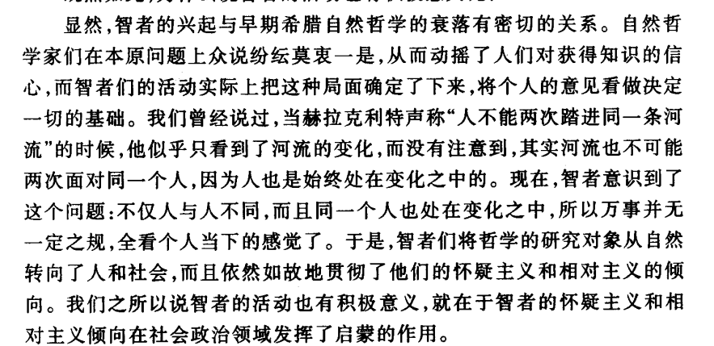

```
自然哲学的缺点，意见。
```


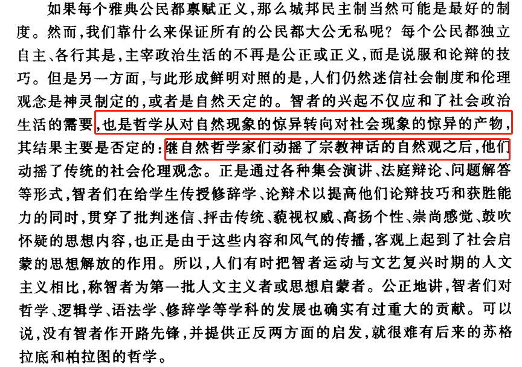


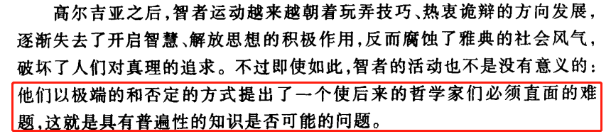

```
普遍性的知识是否可能的问题
```


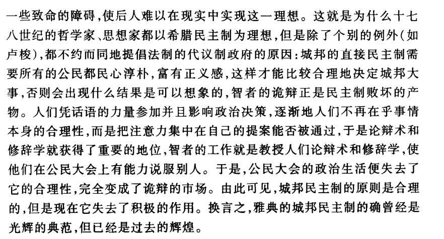


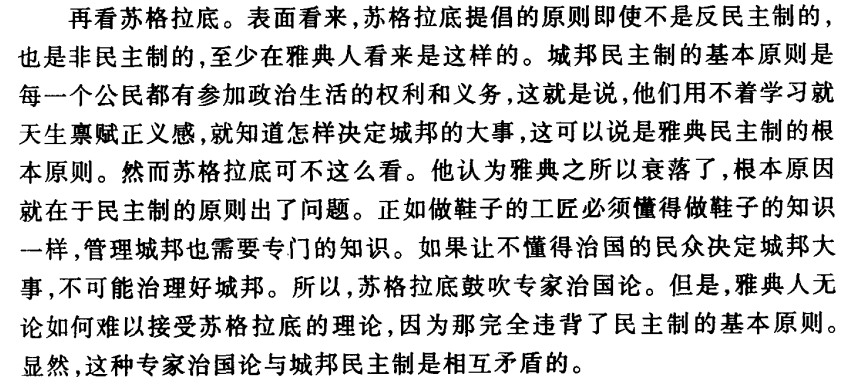

```
精英政治和暴民政治
```

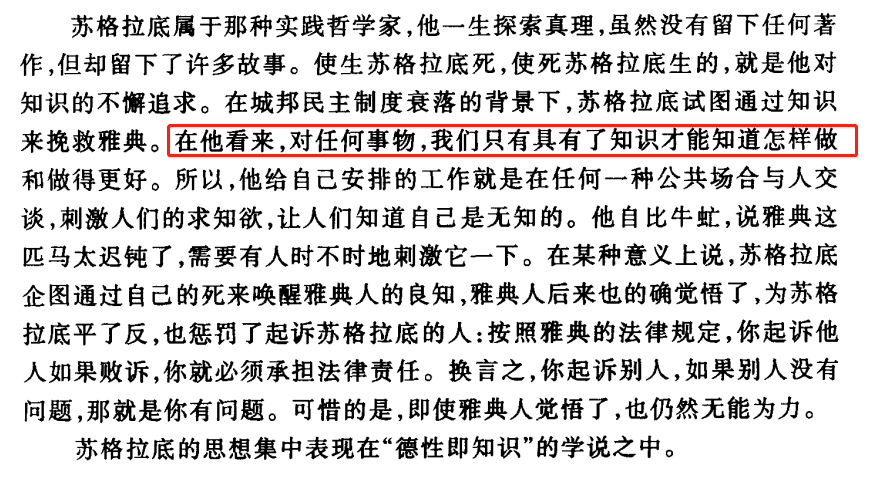


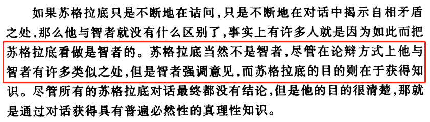


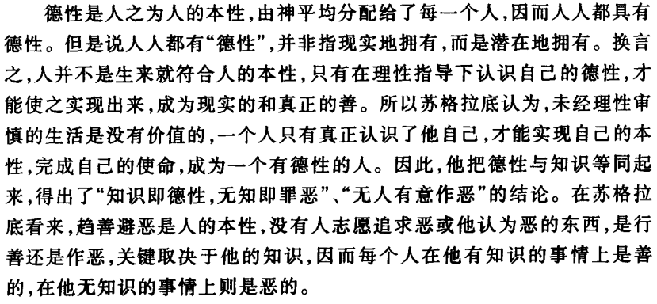

> 德行即知识


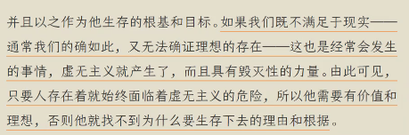


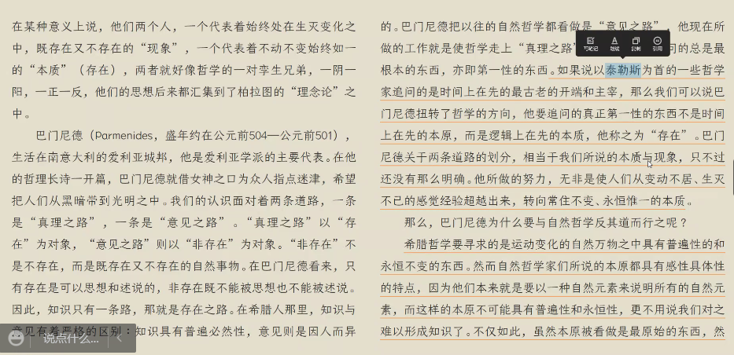


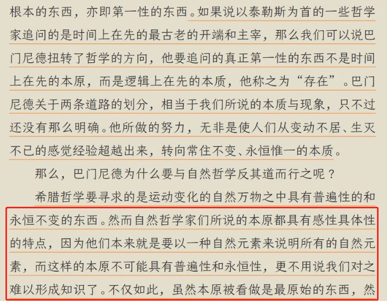

物质上的本原是变化的，不是永恒的，。

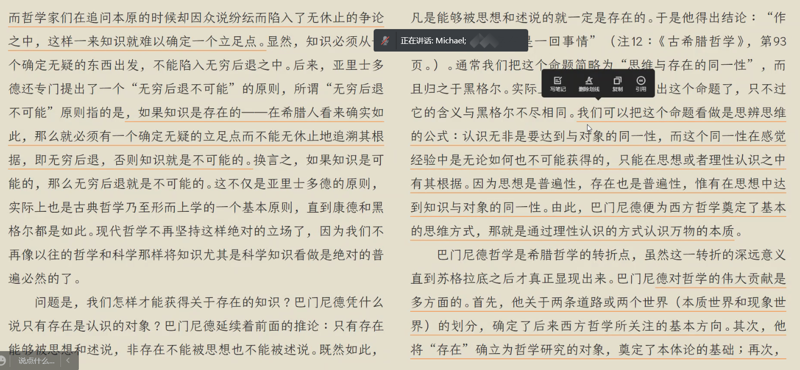


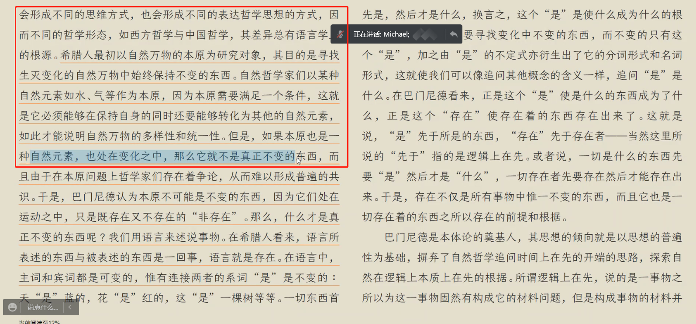

> 如果本原也是一种自然元素，也处在变化之中，那就没有秩序，没有知识。
>
> “知识”：本原上的知识，不变的东西。
>
> “经验知识”：局部的，在某些范围内实现的知识。

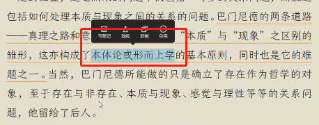