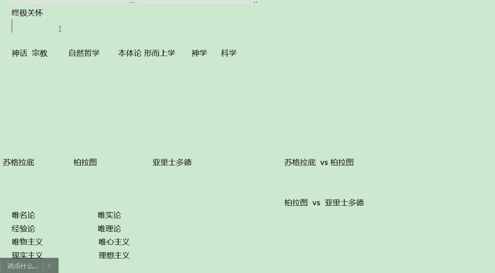
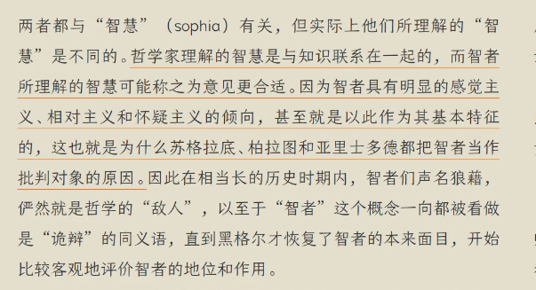
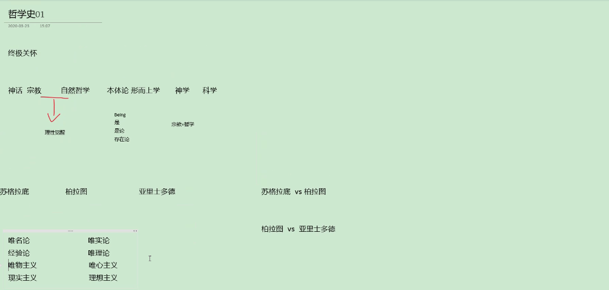
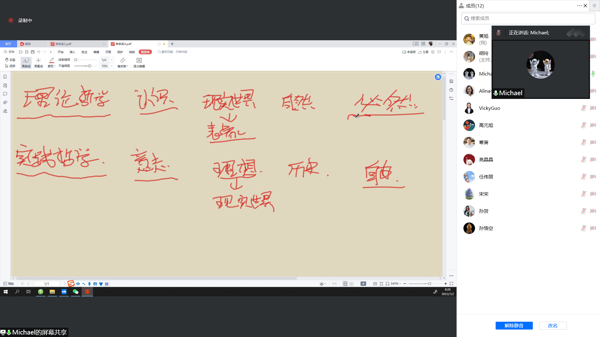

## 自然哲学派

他认为**水**是万物的本原，因为水是万物产生的原创和运动的原因。这是突破传统的神话宇宙论而用自然物质本身来说明万物本原的第一个尝试。这是第一次以哲学的方式（而非神话的方式）表述关于本原的思想。

```
突破了了神话宇宙论(经不住理性的追问，上帝是谁创造的，上帝有空间吗，上帝能杀死上帝吗)
```

**一、米利都学派**

**1泰勒斯**

泰勒斯（Thales，鼎盛年约在公元前585年）被誉为“哲学之父”，他认为**水**是万物的本原，因为水是万物产生的原创和运动的原因。这是突破传统的神话宇宙论而用自然物质本身来说明万物本原的第一个尝试。这是第一次以哲学的方式（而非神话的方式）表述关于本原的思想（尽管“本原”这个概念是由他的学生阿那克西曼德首先使用的）。他由此被看作希腊哲学的创始人。

**2 阿那克西曼德**

阿那克西曼德（Anaximander，鼎盛年约在公元前570年）是泰勒斯的朋友和学生，据说他最早使用“本原”（άρχή，又译作“始基”）这个概念，认为本原应当是一切“无定形之物”（απειρον，即“无定形”之意，又译作“**无限**”）。“无定形”是阿那克西曼德对万物本原的一种否定式的表述，这意味着哲学思维层次的提高。与泰勒斯不同，阿那克西曼德认为事物的产生不是由于某种基本元素（如水）的转化，而是由于永恒的运动把对立物从“无定形”中分离出来，因此，所谓产生即是对立物的分离。

**3 阿那克西美尼**

阿那克西美尼（Anaximenes，鼎盛年约在公元前546年）是阿那克西曼德的学生，他提出了气是万物本原的观点。如果说泰勒斯的水是对万物本原的一种肯定性的表述，而阿那克西曼德的“无定形”是对万物本原的一种否定性的表述，那么阿那克西美尼的**气**则是对万物本原的一种否定之否定的表述。气一方面是一种与水一样的自然物质，另一方面却比水更加具有无定形的特点，它是一切无定形之物中“最”无定形的一个，因而能作为一切无定形之物的代表。“气本原说”表现了一种朴素的物质与精神未分化的思想。


## 苏格拉底--柏拉图--亚里士多德



如果是永恒不变的物质（其实没有永恒不变的物质）。

最根基的东西是存在----研究存在论(being)---是论--本体论...

存在和定义。

巴门尼德---存在

苏格拉底----德行、理性（感性不是途径，理性才是途径，形式辩证法）


## 智者学派

智者学派--“人是万物的尺度”




拜托了自然状态---天人合一---君君臣臣父父子子


柏拉图用的方法一样

都是辩论（诡辩，辩证法）




唯物主义：这个世界的根基是物质

唯心主义：由理念和模型构造的世界

经验论：通过眼睛、经验去认识世界


苏格拉底和柏拉图：辩证法和形而上学

柏拉图和亚里士多德：维名论


知识：经验性的知识和研究存在的知识，

物理、化学、生物：经验性的知识

几何学、数学：通过理性和逻辑去推理的东西。

形而上学：研究存在的知识


## 第三讲

怎样良好生活？享乐主义、禁欲主义、怀疑主义

思辨是最大的快乐？




从必然王国(理论哲学)到自由王国(实践哲学)，

你的选择都是自由的，你的自由意志(自由)。


.........


形而上学：本体论的形而上学（世界是什么）

​                   认识论的形而上学（我们的“认识”，能认识什么，二元论）

​                    方法论的形而上学（世界和眼镜是相互的过程(历史)，是发展中，本体和主体）

发展过程，必须经过人生的历程，才能不断的认识。既是方法论也是认识论。

本体是一种生成过程(?)。

>本体是一种生成过程（存在是逻辑在先的东西，不变的东西）。
>
>存在是逻辑上在先的东西。
>
>

实体即是主体（黑格尔）：实体是一个发展过程。自觉的过程。运动。

过程使用方式是辩证法。


黑格尔的辩证法：理性辩证法

马克思的辩证法：感性辩证法