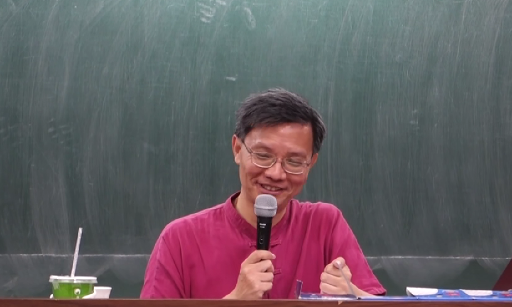

# 天下篇

## 天下之治方术者多矣

天下之治方术者多矣(1)，皆以其有力不可加矣(2)！古之所谓道术者(3)， 果恶乎在？曰：“无呼不在(4)。”曰：“神何由降(5)？明何由出(6)？”“圣有所生，王有所成，皆原于一(7)。”不离于宗(8)，谓之天人(9)；不离于精(10)， 谓之神人(11)；不离于真(12)，谓之至人(13)。以天为宗(14)，以德为本(15)，以道为门(16)，兆于变化(17)，谓之圣人；以人为恩(18)，以义为理(19)，以礼为行(20)，以乐为和(21)，熏然慈仁(22)，谓之君子(23)；以法为分(24)，以名为表(25)，以参为验(26)，以稽为决(27)，其数一二三四是也(28)，百官以此相齿(29)； 以事为常(30)，以衣食为主，蕃息畜藏(31)，老弱孤寡为意，皆有以养，民之理也(32)。古之人其备乎(33)！配神明，醇天地(34)，育万物，和天下，泽及百姓，明于本数(35)，系于未度(36)，六通四辟(37)，小大精粗(38)，其运无乎不在(39)。**其明而在数度者，旧法、世传之史尚多有之**；**其在于《诗》、《书》、《礼》、《乐》者，邹鲁之士、搢绅先生多能明之(40)**。《诗》以道志，《书》以道事，《礼》以道行，《乐》以道和，《易》以道阴阳，《春秋》以道名分(41)。其数散于天下而设于中国者(42)，百家之学时或称而道之。天下大乱(43)，贤圣不明(44)，道德不一。天下多得一察焉以自好(45)。譬如耳目鼻口，皆有所明(46)，不能相通。犹百家众技也，皆有所长，时有所用。虽然，不该
不遍(47)，一曲之士也(48)。判天地之美(49)，析万物之理(50)，察古人之全(51)。寡能备于天地之美(52)，称神明之容(53)。是故内圣外王之道(54)，暗而不明(55)，郁而不发(56)，天下之人各为其所欲焉以自为方(57)。悲夫！百家往而不反(58)，必不合矣！后世之学者，不幸不见天地之纯，古人之大体，道术将为天下裂。

[注释]

> (1)方术：一方之术，即特殊的学问，道术的一部分。
> (2)其有：其所得。指所得的特殊学问，把特殊当作普遍的道术而满足，以为无所复加了。为：
> 以为。
> (3)道术：普遍之术，引申为真理。
> (4)无乎不在：指道理贯通万事万物。
> (5)神：指天，所以说降。《老子》“天之道其犹张弓者欤！”非指神圣。
> (6)明：指地，所以说出。神明：指天道、地道。圣王：指人道。《老子》“圣人之道为而不争”。
> (7)皆原于一：指神明圣王即天道地道人道的作用皆原于一。
> (8)不离：不分离为二。宗：指道，即《老子》中的道“渊兮似万物之宗”的宗，指主宰而言。
> (9)天人：指天人不分离为二的道理。
> (10)精：指道，即《老子》二十一章中的道，“其中有精”的精，指不杂而言。
> (11)神人：见《逍遥游》。
> (12)真：纯真不伪，《老子》二十一章中“其精甚真”的真。
> (13)至人：见《逍遥游》，其它篇中已多见。
> (14)宗：主宰。以无为宗：指至人即天人。
> (15)本：本根。以德为本：指圣人即真人。
> (16)以道为门：门指天门，万物生死的出入门户。
> (17)兆：指变化兆端是深而难测的。
> (18)恩：恩惠。以仁为恩：用仁来恩惠人民。
> (19)理：治理。以义为理：用义来治理人民。
> (20)行：行为。以礼为行，用礼来教化人民的行为。
> (21)乐：音乐。和：调和。以乐为和，用音乐来调和人民的性情。
> (22)熏然：温和的南风可以化物的样子。
> (23)君子：指辅佐圣王的贤者。
> (24)法；法度。分（fèn），分守。
> (25)名，职称。表：标志。
> (26)参：一作操，比较，检验。验：验证。参验：比较，考验，验证。
> (27)稽：考查，考核。决：断定。
> (28)数：等次。一二三四：指上文的法、名、参、稽。
> (29)百官：指能者。齿：序列。
> (30)事，指耕、织、工、商的职业。常：恒常，不变。
> (31)蕃：繁殖。息：生息。畜：积蓄。藏：储藏。
> (32)民之理：犹民之为道，即民之常情。
> (33)古之人：指古代的圣人。备：完备
> (34)配：匹配、合。神明，指神圣明王。醇：通准。准天地：以天地为准则。
> (35)明：表明。本数：指道德仁义。
> (36)末度：指法度为道的末节。
> (37)六通：指六合，即上下四方通达。四辟：指春夏秋冬四时通畅。
> (38)小大精粗：指万物不论小大精粗。
> (39)运：运行。其运：指帝道圣道运行而天所积。
> (40)搢绅，即搢笏而垂绅的儒服。
> (41)道：指言，以上五个道字同。
> (42)中国：指鲁齐卫宋的地区。
> (43)大乱：指战国。
> (44)贤圣：指孔子与其弟子。
> (45)察：通际，一察：一际，指不全。自好（hào）：自意不知变，主观自信不变。
> (46)明：知道。
> (47)该：通赅，完备。遍：普遍。
> (48)一曲之士：看问题片面的人。
> (49)判：分割。
> (50)析：离析，割裂。理：常理。
> (51)察：放散。
> (52)寡：少。
> (53)容：包容。
> (54)内圣：将道藏于内心的是圣人。外王：将道显露于外的是王。
> (55)晴：同闇。
> (56)郁：抑郁。
> (57)方，方术。
> (58)反：通返。

[译文]

> 天下研究特殊学术的人很多，都以为自己的所得无以复加了。古时所谓
> 普遍的道术，究竟何在呢？回答说：“是无所不在的。”问说：“天道从哪
> 里降临？地道从哪里产生？”回答说，“圣有所生，王有所成，都来原子道。”
> 不离开道的人，称做天人；不离开道的精髓的人，叫做神人；不离开道的本
> 真的人，叫做至人。以天为主宰，以德为根本，以道为门径，能预见变化兆
> 端的叫做圣人；用仁恩惠人民，用义治理人民，用礼教化人民的行为，用乐
> 来调和人民的性情，表现温和而仁慈的叫做君子；以法度作为分守，以职称
> 作为标志，以比较为验证，以会计作断定，它们的等次分一二三四，百官以
> 这些相为序列，百姓以耕、织、工、商的职业为常务，以衣食为主，繁殖生
> 息，积蓄储藏，老弱孤寡放在心上，都有所养，这是治理人民的道理。古时
> 的圣人是很完备的了，他们配合神圣明王，以天地为准则，养育万物，调和
> 天下，恩泽百姓；不仅通晓道的根本，而且维系于法度的末节，上下四方通
> 达，春夏秋冬四时通畅，小大精粗，帝圣之道的运行无所不在。那些明显表
> 现于制度的，旧时法规世代相传，史官还记载很多。那些保存在《诗》、《书》、
> 《礼》、《乐》的，邹鲁的士绅儒者先生们大多能明白了。《诗经》是表达
> 志向的，《书经》是记载政事的，《礼》是规范道德行为的，《乐》是陶冶
> 情操的，《易经》是预测阴阳变化的，《春秋》是讲述名分的。这些数度散
> 布于天下而设置于中国，百家学说时常宣扬它。战国天下大乱，贤圣不能明
> 察，道德规范不能统一，天下的学者多是各得一偏而自以为是。就象耳口鼻
> 都有它的知觉功能，而不能相互通用。就象百家众技一样，都有所长，时有
> 所用。虽然如此，但不完备又不普遍，是看问题片面的人。分割天地的完美，
> 离析万物的常理，放散古人的全理，很少具备天地的完美，不能相称于天道
> 地道的包容。所以内圣外王的道理，幽暗不明，抑郁不发，天下的人各自以
> 自己想法为自己的方术。可悲啊！百家皆各尽迷途而不知返，也就不能合于
> 大道了！后世的学者，不幸在于不能看到天地的纯真，不能看到古圣人的全
> 貌，道术将要为天下所割裂。

## 不侈于后世-墨子、禽滑厘

不侈于后世(1)，不靡于万物(2)，不晖于数度(3)，以绳墨自矫，而备世之急(4)。古之道术有在于是者，墨翟、禽滑厘闻其风而说之(5)。为之大过(6)， 已之大循(7)。作为《非乐》(8)，命之曰《节用》(9)；生不歌(10)，死无服(11)。墨子泛爱(12)、兼利而非斗(13)，其道不怒(14)；又好学而博，不异(15)，不与先王同(16)，毁古之礼乐。黄帝有《咸池》，尧有《大章》，舜有《大韶》，禹有《大夏》，汤有《大■》，文王有辟雍之乐，武王、周公作《武庐》(17)。古之丧礼，贵贱有仪(18)，上下有等，天子棺椁七重(19)，诸侯五重，大夫三重，士再重。今墨子独生不歌(20)，死无服，桐棺三寸而无椁(21)，以为法式(22)。以此教人，恐不爱人；以此自行，固不爱己。未败墨子道(23)，虽然，歌而非歌，哭而非哭，乐而非乐，是果类乎？其生也勤(24)，其死也薄(25)， 其道大觳(26)；使人忧，使人悲，其行难为也，恐其不可以为圣人之道，反天下之心，天下不堪。墨子虽独能任，奈天下何！离于天下(27)，其去王也远矣(28)！墨子称道曰：“昔禹之湮洪水(29)，决江河而通四夷九州也(30)。名川三百，支川三千，小者无数。禹亲自操橐耜(31)，而九杂天下之川(32)；腓无胈(33),胫无毛(34)，沐甚雨(35)，栉疾风(36)，置万国(37)。禹大圣也，而形劳天下也如此(38)。”使后世之墨者？多以裘褐为衣(39)，以跂0 为服(40)，日夜不休，以自苦为极，曰：“不能如此，非禹之道也，不足谓墨。”相里勤之弟子(41)， 五侯之徒(42)，南方之墨者若获、已齿、邓陵子之属(43)，俱诵《墨经》而倍谲不同(44)，相谓别墨(45)，以坚白同异之辩相皆(46)，以觭偶不件之辞相应(47)，以钜子为圣人(48)，皆愿为之尸(49)，冀得为其后世(50)，至今不决(51)。墨翟、禽滑厘之意则是(52)其行者非也。将使后世之墨者，必自苦以腓无胈(53)、胫无毛相进而已矣(54)上也，治之下也。虽然，墨子真天下之好也(55)， 将求之不得也(56)，虽枯槁不舍也(57)，才士也夫(58)！ 

[注释]

> (1)侈：奢侈。不侈句：不以奢侈教育后世。指墨家违背周道而用夏政。
> (2)靡（mí），浪费。不靡句：不浪费万物，指墨家的节用说而言。
> (3)晖（huī）：目光，炫耀。数度：数指法律条丈。度指法度。不晖句：指墨家的非乐、薄葬
> 而言。
> (4)绳墨：绳指取正的工具，木匠用做取直的墨线，这里指规矩。矫：励。自矫：自己勉励自己。
> (5)墨翟：战国初年鲁国人，墨家学派的创始人。禽滑厘：墨子的弟子。风，风教说（yuè)：通
> 悦。
> (6)大：同大。
> (7)已：止，停止而不为。为之大过：指泛爱、兼利而言。大：同大。顺：一作循，不及。已之
> 大顺，指非乐、节用。
> (8)非乐：墨子提倡非乐，作《非乐》篇。
> (9)命：叫做，称为。节用：墨子提倡节用，作《节用》篇。
> (10)生：活着。
> (11)无服：不穿礼制上规定的丧服。死无服丧。
> (12)泛爱：即兼爱，爱一切人。
> (13)兼利：使一切人都得到利益。非斗：指非攻，反对非正义的进攻。墨子并不反对一切战争，
> 而反对非正义的大国攻小国、大家攻小家的侵略战争。而主张并参加保卫国家的正义战争。
> (14)怒：怨怒。
> (15)不异：指尚同而言。
> (16)先王：指黄帝尧舜禹夏商周诸帝王。
> (17)《咸池》至《武》，皆为五帝三王时的乐曲。
> (18)有仪：有度。
> (19)椁：外棺。重：层。
> (20)独：唯独。
> (21)桐：桐木。
> (22)法式：效法的样式，榜样。
> (23)末：同莫，各本作未误，败：同毁。
> (24)勤：勤劳。
> (25)薄：瘠薄。
> (26)大：通大。觳（què）：刻。
> (27)离：（lì）通丽，依附。
> (28)王：指外王之道。
> (29)湮：同堙，塞。
> (30)四夷：四方边远的少数民族地区。九州：冀、兖、青、徐、扬、荆、豫、梁、雍。
> (31)橐（tuó）：盛土的器具。耜（sì）：掘土工具。
> (32)九：本作鸠，聚集，杂：同匝，合。九杂：聚合。
> (33)腓（fei）：腿肚子。胈（bá）：汗毛。
> (34)胫（jīng）：小腿。
> (35)沐：沐浴，淋雨。甚雨：暴雨。
> (36)栉（zhì）：梳头发。
> (37)置：建立，设立。万国：许多地方。
> (38)形劳：身体劳苦。
> (39)裘：兽皮。褐：粗布。裘褐：粗衣。
> (40)跂（qí）：通屐，木鞋。0 （jué）：草鞋。
> (41)相里勤：墨子后学，为南方之墨学的代表。
> (42)五侯：墨家弟子姓五名侯。
> (43)苦获、已齿、邓陵子：皆墨家后学。
> (44)倍：通背，背离。谲（jué）：矛盾，相反。
> (45)别墨：墨家中的非正统的派别。
> (46)坚白：见《齐物论》注。訾（zǐ）：诽谤，非议。
> (47)觭（jī）：通奇，单数。偶：双数，仵（wǔ）：通伍，合、同。应：应对，对答。
> (48)钜：同巨。钜子：后期墨家团体的首领。
> (49)尸：尽死。
> (50)翼：希望。
> (51)决，决定。
> (52)意则是：用意是对的。
> (53)相迸，相互争进。
> (54)天下之好：爱天下。
> (55)求之：救助天下。
> (56)舍：合弃。
> (57)才士：指贤能之士。即国家的有用人才。

[译文]

- [ ] 不以奢侈教育后世，不浪费万物，不炫耀于等级制度，用规矩勉励自己而备于当世之急务，古代的道术存在于这方面的。墨翟、禽滑厘听到这种治学风气就喜欢它。实行泛爱兼利太过分了，非乐节用也大过分了。作《非乐》篇，讲《节用》篇，活时不唱歌，死时无丧服。墨子泛爱一切人，使一切人都得到利益而反对侵略战争，他讲对人不怨怒；他又好学而博闻，主张大不异的尚同，也不求与先王相同，主张毁弃古代的礼乐。黄帝时有《咸池》，尧时有《大章》，舜时有《大诏》，禹时有《大夏》，汤时有《大■》，文
  王时有“辟雍”的乐章，武王、周公时作《武》乐。古代的丧礼，贵贱有不
  同的制度，上下有不同的等次，天子的棺椁七层，诸侯五层，大夫三层，士
  二层。现今墨子唯独主张生时不唱歌，死时无丧服，桐木棺材只三寸而无外
  椁，作为效法的样式。用这种主张教人，恐怕不是爱人；用这种主张自行其
  事，当然也不是爱护自己。莫毁墨子的学说。虽然如此，当唱歌时而反对唱
  歌，当哭泣时而反对哭泣，当奏乐时而反对奏乐，这样果真合乎人的感情吗？
  人活着时勤劳，死后那样瘠薄，他的学说太苛刻了；使人忧伤，使人悲哀，
  他的主张难以实行，恐怕这种主张不可以成为圣人之道，违反天下的人心，
  天下人不堪忍受。虽然墨子能独自实行，然而他把天下人又能怎样呢！背离
  于天下的人，这种做法离开外工之道也太远了。墨子宣扬说：“过去大禹堵
  塞洪水，疏通江河，而沟通四夷九州，大川三百，支流三千，小沟无数。禹
  亲自拿着盛土的器具和掘土的工具，而聚合于天下的河流；累得腿上没有肉。
  小腿上没有汗毛，暴雨淋身，疾风梳发，安定了万国。禹是个大圣人，他身
  体为民劳苦到如此地步。”使后代的墨者，多用粗布做衣服，穿着木屐草鞋，
  日夜不息，以吃苦耐劳为准则，有人却说：“不能这样，不是禹的道，不足
  以把他称为墨者。”北方墨者相里勤的弟子，伍侯的门徒，南方的墨者苦获、
  已齿、邓陵子一派，都诵读《墨经》，然而却相互背离相互矛盾不相同，相
  互指责对方是“别墨”；以坚白同异的辩论相互诽谤非议，用奇偶不合的言
  论相互应对；把巨子当作圣人，却愿意为他而尽死，希望为他的后世继承人，
  但至今没有决断。墨翟、禽滑厘的心意是好的，但他们的作为却是错的。他
  使后代的墨者必定要刻苦自励，搞得腿上没有肉，小腿上没有汗毛，相互争
  进罢了。这样乱天下有余，治天下不足。虽然这样，墨子是真想把天下治理
  好的人，即使求之不得，虽然累得形容憔悴不堪也不弃自己的主张，真是一
  位治国的贤能之士啊！

## 不累于俗-宋钘、尹文

不累于俗(1)，不饰于物(2)，不苟于人(3)，不忮【zhì】于众(4)，愿天下之安宁以活民命(5)，人我之养，毕足而止(6)，以此白心(7)。古之道术有在于是者，宋钘[xíng]、尹文(8)闻其风而悦之。作为华山之冠以自表(9)，接万物以别宥为始(10)； 语心之容(11) ，命之曰“心之行”，以聏[ér]合欢(12)，以调海内，请欲置之以为主(13)。见侮不辱，救民之斗，禁攻寝兵，救世之战。以此周行天下，上说下教(14)，虽天下不取，强联而不舍者也(15)，故曰上下见厌而强见也。虽然，其为人太多，其自为太少，曰：“请欲固置(16)，五升之饭足矣。”先生恐不得饱，弟子虽饥，不忘天下，日夜不休，曰：“我必得活哉！”图傲乎救世之士哉！曰：“君子不为苛察(18)，不以身假物。”以为无益于天下者，明之不如已也(19)，以禁攻寝兵为外，以情欲寡浅为内。其小大精粗，其行适至是而止。

[注释]

- [ ] (1)不累于俗：即《逍遥游》中所说的“举世誉之而不加劝，举世非之而不加沮”意思。累，牵
  累。
  (2)不饰于物：即“定乎内外之分，辩乎荣辱之境”的意思。饰，掩饰。
  (3)刘师培、章炳麟谓苟作苛，不可从，不苟于人：指下文的“强聆而不舍”而言。不苟，不苟
  从。
  (4)忮（zhì）：违逆，刚愎。即《齐物论》“大勇不忮”之忮，亦即下文的“以聏合欢，以调海内”。
  (5)安宁：没有战争。活民命：保住人民的性命。愿天下句，指的是禁攻寝兵的意思。
  (6)人我养毕足而止：指的是情欲寡浅的意思。
  (7)白心：纯洁内心，指扫除欲念，抱虚守静，修养内心。
  (8)宋钘：即宋荣子，详见《逍遥游》注。尹文：姓尹名文，齐国人，稷下派人物，著有《尹文
  子》上下篇。
  (9)华山之冠：象华山那样上下均平的帽子。郭象《注》“华山上下均平”。成《疏》、《释文》
  亦略同即指心地均平象华山之冠的上下均平一样。
  (10)别：指别而去之。宥：同囿、蔽。别宥，解蔽，丢掉成见。始：始端。
  (11)语心之容：心之用能包容。
  (12)聏（ér），崔本作腼，同软，柔、和，欢：欢心。
  (13)之：指心之容，心之行。
  (14)上说下教：上指人主，统治者，下指百姓臣民。
  (15)强聒：人家不愿听的话，说个不停。
  (16)固置，谓辞不得当还必欲量之。
  (17)傲：皆解作大。“图傲做乎，救士之士哉！”庄子称赞宋尹之辞。
  (18)苛：不合理。
  (19)已：止。

[译文]

- [ ] 不受世俗所牵累，不以外物来掩饰，不苟从别人。不违逆众志，希望天
  下安稳宁静以保全人民的性命，别人和自己的奉养都知足就够了，以这种观
  点纯洁内心，古时的道术，有属这方面的。宋钘、尹文听到这种治学风气就
  喜欢它。制作象华山上下均平那样的帽子来表明平等，应接万物，以除去成
  见为开端；称道内心的包容，称作内心的行为，以柔和态度合别人的欢心，
  用来调和海内，请求以此作为建立学说的指导思想。受欺侮不以为是耻辱，
  以解救人民的争斗；禁绝互相攻伐，停止战事用兵，平息社会战乱。以此周
  游天下，上劝君主下劝臣民，虽然天下的人不采取，还要说个不停而不舍弃
  其主张。所以说上下都显现厌烦却强求相见。虽然这样，他们为别人做得太
  多，为自己想得太少。说：“辞不得当还要必置，有五升米的饭就够了。”
  宋尹先生恐怕不得吃饱，弟子们虽然在饥饿中，也不忘天下人。他们日日夜
  夜不知道休止。他们说：“我们必得活命呀！”多么高大的救世的人啊！他
  们还说：“君子不用不合理的观点明察万物，不使自身受外物的役使。”认
  为对天下没有益处的，阐明它还不如停止不做。他们把禁止攻伐停止战争做
  为对外的活动，以减少情欲做为内心的修养。他们学说有的小大精粗，及其
  所述所行也就如此罢了。

## 公而不党-田骈、慎到

公而不党(1)，易而无私(2)，决然无主(3)，趣物而不两(4)，不顾于虑(5)， 不谋于知(6)，于物无择(7)，与之俱往。古之道术有在于是者，彭蒙、田骈【 pián】、慎到闻其风而悦之(8)。齐万物以为首(9)，曰：“天能覆之而不能载之，地能载之而不能覆之(10)，大道能包之而不能辩之(11)。知万物皆有所可，有所不可，故曰选则不遍(12)，教则不至(13)，道则无遗者矣(14)。”是故慎到弃知去己(15)，而缘不得已(16)。泠汰于物(17)，以为道理。曰知不知(18)，将薄知而后邻伤之者也(19)。謑髁无任，而笑天下之尚贤也(20)；纵脱无行，而非天下之大圣(21)；椎拍烷断(22)与物宛转(23)；舍是与非，苟可以免，不师知虑(24)， 不知前后，魏然而已矣(25)。推而后行，曳而后往(26)。若飘风之还，若羽之旋，若磨石之隧(27)全而无非(28)动静无过(29)) 未尝有罪(30)。是何故(31)？ 夫无知之物(32)，无建(，) 己之患(33)，无用知之累(34)，动静不离于理(35)，是以终身无誉(36)。故曰至于若无知之物而已(37)，无用贤圣。夫块不失道(38)。豪桀相与笑之曰(39)：“慎到之道(40)，非生人之行，而至死人之理(41)，适得怪焉(42)。” 田骈亦然，学于彭蒙，得不教焉(43)。彭蒙之师曰(44)：“古之道人(45)，至于莫之是、莫之非而已矣(46)。其风窢然(47)，恶可而言(48)？”常反人(49)，不见观(50)，而不免于魭断(51)。其所谓道非道(52)，而所言之韪不免于非(53)。彭蒙、田骈、慎到不知道。虽然，概乎皆尝有闻者也(54)。

[注释]

- [ ] (1)公：公正。党：一作当，偏党。
  (2)易：平易，平允。
  (3)决然：如水决于东则东流，决于西则西流的样子，引申为随和。无主：指没有自我偏见。
  (4)趣物而不两：随物而趋没有二意。趣，通趋。
  (5)不顾：指不顾于虑，不虑过去。
  (6)不谋于知：不用智慧，即指不谋其将来。
  (7)无择：无选择。
  (8)彭蒙：齐人。田骈：齐人。慎到：赵人。说：通悦。
  (9)齐：齐万物之齐。首：首要。
  (10)覆：遮盖，掩盖。
  (11)包：包容辩：分辩。
  (12)选：选择。偏：同遍，全。
  (13)不至：不能达到，不能备至。
  (14)无遗，无遗漏。
  (15)去已：抛开自己成见。
  (16)缘：因循，因顺。
  (17)泠（Iing）汰：听从自然，任其自然。
  (18)知不知：把知当作无知。
  (19)将：要，薄知：鄙薄知识。邻伤：毁伤。
  (20)謑髁（xlkel）：儿戏，随便的样子。无任：无能力。尚贤：推选贤能。
  (21)纵脱：放任。无行：不修德行。
  (22)椎拍：推扑顺遂。輐（wan）断，即下文鲩断，没有棱角。
  (23)物：指事。宛转：婉曲，相应变化。
  (24)师：用，任凭。
  (25)魏：通巍，独立不动。
  (26)曳：拖。
  (27)隧：转动，旋转。
  (28)全，全面，整体。无非：无偏。全而无非：自全而入无非责。
  (29)动静：运动静止。无过：没有过失。
  (30)未尝有罪，不曾有什么罪责。
  (31)是：这，此。
  (32)知：知觉，知识。物：物件，东西。
  (33)无建己之患：指没有建立自己而产生敌对的忧患，这是指去己的思想。
  (34)无用知之累：指不用知虑就没有牵累，用知则争，争则牵累，放弃知虑则无争，无争则无
  累。这讲弃知的思想。
  (35)理：指规律。
  (36)无誉：任何罪都从誉生，无誉就无罪过，这是去誉的思想。
  (37)故曰：指慎子说的话。至：到达，达到。若：象。已：罢了。
  (38)块：土块。道：规律。
  (39)笑：讥笑。
  (40)道：学说。
  (41)生人：活人。行：施行。理：道理。
  (42)适得：理当，应当。怪：责怪，批评。
  (43)不教：不言之教。
  (44)彭蒙之师：犹彭蒙其师，指彭蒙自己。彭蒙之师曰：彭蒙对田骈说。
  (45)道人：得道的人。
  (46)莫之是莫之非：无所谓事非。
  (47)其：指古代有道人的教化。■（xù）：然：风迅速刮过的样子。
  (48)恶（wū）：何。言：语言。
  (49)反人：违反人意。
  (50)不见观：不为人所欣赏。
  (51)魭（yuán）：輐的借字。
  (52)其，代田骈、彭蒙等人。所谓道：所说的道术，即指莫之是莫之非的道。道：天道。下句
  道同。
  (53)韪：是。
  (54)概，概略。尝：曾，曾经。

译文

- [ ] 公正而不偏党，平易而无私欲，随和而无主见，随物而趋不有二意，不虑过去，不谋未来，对事物无选择，参与事物的变化，古代道术有属于这方面的。彭蒙、田骈、慎到听到这种治学风气而喜好它。齐同万物以为首要，说：“天能覆盖万物而不能承载万物，地能承载万物而不能覆盖万物，大道能包容万物而不能分辨万物。他们认识到万物都有可以肯定的，也有可以否定的，所以说选择就不能周全，教化就不能备至，按照道就不会有遗漏了。”所以慎到主张抛弃知识和主观成见，却因顺于不得已，任其自然，做为他的道理，说知识就是无知，要鄙薄知识然后把它毁掉。随随便便无能为力而讥笑天下的尚贤，放任解脱不修德行而非难天下的大圣；椎朴顺遂无棱无角，顺从事物婉曲相应变化；舍弃是与非，且可免于拖累。不用智巧谋虑，不知什么是前后，巍然独立不动就是了。推动而后前进，拖曳而后前往，象飘风的往还，象羽毛的旋转，象磨石的转动，自全而无非难，动静而无过失，未曾有什么罪责。这是什么原因呢？没有智慧的东西，也就没有树立自己之敌的忧患，没有使用智慧的拖累，运动和静止是离不开规律的，因此要终身去掉名誉。所以说达到象没有智虑的东西罢了，用不着圣贤，哪土块都有自己的规律。”豪杰们都讥笑他说：“慎到的学说，不是活人能施行的，却是死人道理，应该得到责怪。”田骈也是这样，求学于彭蒙，学得不言之教。彭蒙说：“古代得道的人，达到无所谓是非罢了。好象风迅速刮过一样，哪还用得着说什么呢？”经常违反人的意愿，不为人欣赏，仍然不免于无棱无角。他们所宣扬的道并非是道，而所肯定的东西也不免于错误。彭蒙、田骈、慎到不知道的实质是道。虽然如此，他们还是知道一些道的概要的。

## 以本为精-关尹、老聃

以本为精(1)，以物为粗(2)，以有积为不足(3)，澹然独与神明居(4)。古之道术有在于是者。关尹、老聃闻其风而悦之(5)。建之以常无有(6)，主之以太一(7)，以濡弱谦下为表(8)，以空虚不毁万物为实。关尹曰：“在己无居(9)， 形物自著。其动若水，其静若镜(10)，其应若响(11)。芴乎若亡，寂乎若清。同焉者和，得焉者失(13)。未尝先人而常随人。”老聃曰：“知其雄(14)，守其雌(15)，为天下溪(16)；知其白(17)，守其辱，为天下谷。”人皆取先(18)， 己独取后(19)。曰“受天下之垢(20)；人皆取实，己独取虚。无藏也故有余。岿然而有余。其行身也，徐而不费(21)，无为也而笑巧(22)。人皆求福，己独曲全(23)。曰苟免于咎(24)。以深为根(25)，以约为纪(26)。曰坚者毁矣(27)，锐则挫矣(28)。常宽容于物，不削于人(29)。可谓至极(30)。关尹、老聃乎，古之博大真人哉！

[注释]

- [ ] (1)本：指德。即篇首所说的“以天为宗，以德为本”。
  (2)物：具体的物。
  (3)有积：物有积，不足：天无积。
  (4)澹（dàn）然：指不挂一物的样子。独：即指道，没有与它为对的。神明：造化灵明。居：
  共居。共处。
  (5)关尹：见《达生》注，老聃：见《养生主》注。
  (6)常无有：指常无，常有。
  (7)大一：即太一，指道。《老子》：“道大，天大，地大，王亦大。”“万物归焉而不为主，
  可名为大。”“天得一以清，地得一以宁，神得一以灵，谷得一以盈，万物得一以生，侯王得一以为
  天下贞。”
  (8)儒弱：通嬬，弱，柔弱。
  (9)居：止。
  (10)静若镜：清静如镜。
  (11)应：回应。响：反响。
  (12)药：同忽。亡，读无。
  (13)得：所得。
  (14)雄：雄性。
  (15)雌：雌性。
  (16)谿，沟壑。指虑而能受，能容纳一切。
  (17)白：清白，引申为光彩。
  (18)取先：争先。
  (19)取后：落后。
  (20)垢：辱。
  (21)徐：安舒，舒缓。
  (22)巧：技巧，机巧。
  (23)曲全：委曲求全。
  (24)苟免：姑且免于。
  (25)深：指深藏。
  (26)约：指隐约。
  (27)坚：坚硬。
  (28)锐：锐利。
  (29)削：侵削。
  (30)至极：达到顶点。

[译文]

- [ ] 把天德看作粮要，把具体的物视作粗旷，把积蓄看作不足，无牵无挂的
  样子单独与神明共处一体，古代道术有属于这方面的。关尹、老聃听到这种
  治学风气就喜好。建立常有常无的观点，归之于道，以柔弱谦下为表现，以
  空虚不毁弃万物为实质。关尹说：“在主观上不囿于成见，有形的物体让其
  自行显露。其运动象水，其静止象镜，其反应象回声。恍惚象无有，寂郁象
  清虚。有得就等于有失。未曾争在人先，而经常随在人后。”老聃说：“认
  识雄性之强，不如坚守雌性之弱，成为天下的沟壑；认识光彩不如坚守黑暗，
  成为天下的山谷。”别人都争先，自己独居后，叫作甘受天下的垢辱。别人
  都求实际，独有自己求空虚，没有储藏因而就是有余。高大独立而充实，他
  全身行事，舒缓而不浪费，无所作为却讥笑机巧；别人祈求福佑，自己独委
  曲求全，叫作苟且免于祸害。以深藏为根本，以隐约为纲纪，叫作坚硬就是
  毁坏，锐利就会受挫折。经常宽容对待事物，不损害别人，可以说达到最高
  境界了。关尹、老聃啊！古代的博大真人呀！

## 芴漠无形-庄周

芴漠无形(1)，变化无常(2)，死与生与(3)，天地并与(4)，神明往与(5)！ 芒乎何之(6)。忽乎何适(7)？万物毕罗(8)，莫足以归(9)，古之道术有在于是者。庄周闻其风而悦之。以谬悠之说(10)，荒唐之言(11)，无端崖之辞(12)，时恣纵而不傥(13)，不以觭见之也(14)。以天下为沉浊(15)，不可与庄语(16)，以卮言为曼衍，以重言为真(18)，以寓言为广(19)，独与天地精神往来，而不敖倪于万物(20)，不谴是非以与世俗处。其书虽瑰玮而连犿无伤也(21)。其辞虽参差而淑chú诡可观(22)。彼其充实，不可以已，上与造物者游(23)，而下与外死生无终始者为友(24)。其于本也(25)，弘大而辟，深阂而肆(26)；其于宗也，可谓稠适而上遂矣(27)。虽然，其应于化而解于物也(28)，其理不竭，其来不蜕(29)， 芒乎昧乎，未之尽者(30)。

> 芴漠无形(1)，变化无常(2). 真正的道，肯定是恍恍惚惚，变化无常，没有固定形态的。
>
> 死与生与(3)，天地并与(4)，神明往与(5) ，芒乎何之(6)，忽乎何适(7)？万物毕罗(8)，莫足以归(9)；死啊生啊，都跟道有关。天和地并立，神与明皆进。神明之往啊，茫然之中往哪去呢。有什么目标呢？，在这个地方。涉及到了目的论的问题了。天地之往，神明之运。有什么方向呢。万物毕罗(8)，莫足以归(9)。毕罗：包裹万物，然后不知归往何处。这一段话讲出了很多问题，道有没有方向呢，世界的变化本身有没有方向呢。神明之往有没有目的呢。 
>
> 以谬悠之说(10)，荒唐之言(11)，无端崖之辞(12)，时恣纵而不傥(13)，不以觭见之也(14)。谬悠，荒唐，皆超然悠远之意。端崖，都是边界。傥：直。纵情恣意而不直言，说话从来不直接说话。不以觭见之也(14)，觭：单独；所立之道皆不主一边。不以一边之道现之。
>
> 以天下为沉浊(15)，不可与庄语(16)，以卮言为曼衍，以重言为真(18)，以寓言为广(19)，独与天地精神往来，而不敖倪于万物(20)，不谴是非，以与世俗处。整个天下的人和物皆沉浊渣滓，把天下万物都当成渣滓。不可与庄语，不能跟他们特别庄重地说话。不能认真说，认真说没人信。以卮言为曼衍，卮是一种圆形的酒器，卮言就是圆的言，无棱角无方域之言，无棱角无方域之言是可定之言 还是不可定之言，是主于一端之言还是不主于一端之言，所以无端崖之辞是卮言的另一种说法。
>
> 独与天地精神往来。精：纯粹，神：动力无穷之意。
>
> 而不敖倪于万物：敖倪：看 ，不执着的关注物
>
> 不谴是非以与世俗处；不谴是非，是庄子和填pian慎到不同，庄子的莫若以明，以明要欲是其所非而非其所是,并不表现出自己高的一方面。
>
> 其书虽瑰玮而连犿无伤也(21)。其辞虽参差而淑诡可观(22)。他的书虽然奇特，连犿无伤，对任何人都没有伤害。庄子是聪明，善于保全自己。其辞虽参差而淑诡可观，庄子的文章极难见排列整齐的话，只有“至人无己，神人无功，圣人无名”；而淑诡可观，虽滑稽但是还是有可观的东西在。
>
> 彼其充实，不可以已，上与造物者游(23)，而下与外死生无终始者为友(24)。彼其充实，但是他那里的到，充实而不可以已，你不要以为他说的不认真，说的看似不定，但里面内在之真实。充溢其中的哪个真实之所见，是停不下来的上与造物者游(23)，而下与外死生无终始者为友。
>
> 其于本也(25)，弘大而辟，深阂而肆(26)；既知根本又能弘大而辟，深阂而肆，既神又弘大而肆【放，无拘束之意】，一般知本则不开辟不宏放，而庄子既知本又能开辟宏放，不仅有体而且有用。庄子跟老子关的区别，老子知本，知本之齐，但是庄子是什么，是体用兼具。
>
> 其于宗也，可谓稠适而上遂矣(27)。宗和本，宗师时间意义上的根，也是讲根；稠适：调适万物；讲到本则从本而即用，讲到宗由用而即本。
>
> 虽然，其应于化而解于物也(28)，其理不竭，其来不蜕(29)， 芒乎昧乎，未之尽者(30)。一方面能应化一方面能解物，解物就是脱于物。既能应万物之化，又不为物所束缚。其理不竭：他讲的道理不会穷竭，其来不蜕【脱】，这个道理在未来也不脱。 芒乎昧乎，未之尽者(30)，无论未来有多悠远，庄周之道永远适用。 芒乎昧乎，未之尽者(30)，不知道将来有谁能够发明理解庄子之道。将次章结尾跟孟子卒章相发微，里面多多少少有千古寂寞之感。

[注释]

- [ ] (1)芴漠：空虚广漠的道体。芴，同忽，指道体而言。
  (2)变化无常：指道的用而言。
  (3)生与死与：承变化无常而言，变者从无到有为主，从有到无为死。
  (4)天地并与：指有形而言，即天地与我并生。
  (5)神明：指无形而言。
  (6)芒：通茫。
  (7)适：往。
  (8)万物毕罗：万物与我为一。罗，排列，罗列。
  (9)归：归宿。
  (10)缪悠：迂远。谬，通缪。
  (11)荒唐：虚诞，夸大。
  (12)无端崖：无头绪，无边际。
  (13)恣纵：无拘碍，恣意发挥。傥：指偏傥，片面。
  (14)不以觭（jī）见，不偏不倚。
  (15)沉浊：深沉污浊。
  (16)庄语，庄重。
  (17)卮言，无心的言论。曼衍：委曲遂顺，不拘常规。
  (18)重言：为人重视的言论，以上三言均见《寓言》篇。
  (19)寓言，寄托他人说的话。
  (20)敖倪：犹傲睨，指轻视。
  (21)瑰纬：奇伟，不平凡。连犿（fān）：随和。
  (22)参差：长短、高低、大小不齐。諔（chú）诡：奇异，变幻。
  (23)选物者：指天地。
  (24)外：超脱。
  (25)本：指道。
  (26)深闳：深邃。肆：显露。
  (27)稠适：相吻合。稠，本字为调。上述：上达。
  (28)应：顺应。
  (29)蜕：蜕变。
  (30)芒：通恍。昧：暗昧。未之尽：言未尽其道。

[译文]

- [ ] 空寂广漠无形的道的本体，变化无常的道的运用，死呀生呀，与天地并
  存，与神明同位！惚惚恍恍向什么地方去，万物与我为一，不知哪里是归宿，
  古代的道术有属于这方面的。庄周听到这种治学风气就很喜好它。以迂远的
  说教，以荒唐的言论，以无头绪和无边际的言词，时常恣意发挥而不片面，
  从不以为标新立异。庄周以为天下是深沉污浊的，不能用庄重的语言交谈，
  而是以无心的言论委曲随顺，以为人所重视的言论使人信以为真，以寄寓他
  人他物的言论来广泛的阐述道理，唯独与天地精神往来而不轻视万物，不谴
  责谁是谁非，以此和世俗相处。他的书虽然不平凡而随和无有伤害。书中的
  言辞虽然参差不齐而奇异变幻可观赏。他的书充实而无止境，上与造物者同
  游，而下与超脱死生无终始分别的人做朋友。书中对道的阐述既弘大而又透
  僻，深逮而广阔；书中讲到道的主宰作用，可说是相吻合上达真理了。虽然
  如此，它在顺应变化和解释事物时，道理是讲不完的，它来不蜕变，恍惚芒
  昧，没有尽头。

## 惠施多方-惠施

惠施多方(1)，其书五车，其道舛驳(2)，其言也不中(3)。历物之意(4)，曰：“至大无外(5)，谓之大一；至小无内(6)，谓之小一。无厚(7)，不可积也(8)， 其大千里。天与地卑(9)，山与泽平。日方中方睨(10)，物方生方死。大同而与小同异，此之谓‘小同异(11)’；万物毕同毕异，此之谓‘大同异，。南方无穷而有穷(12)。今日适越而昔来(13)。连环可解也(14)。我知天之中央，燕之北越之南是也(15)。泛爱万物，天地一体也。”惠施以此为大，观于天下而晓
辩者(16)，天下之辩者相与乐之(17)。卵有毛，鸡三足，郢有天下(18)，犬可以为羊，马有卵，丁子有尾(19)，火不热，山出口(20)，轮碾不地(21)，目不见(22)， 指不至(23)，至不绝(24)，龟长于蛇，矩不方(25)，规不可以为圆(26)，凿不围枘(27)，飞鸟之景未尝动也(28)，链矢之疾而有不行不止之时(29)，狗非犬(30)， 黄马骊牛三(31)，白狗黑(32)，孤驹未尝有母(33)，一尺之捶(34)，日取其半，万世不竭(35)。辩者以此与惠施相应，终身无穷。桓团、公孙龙辩者之徒(36)， 饰人之心(37)，易人之意(38)，能胜人之口，不能服人之心，辩者有囿也(39)。惠施日以其知与人之辩，特与天下之辩者为怪(40)，此其抵也(41)。然惠施之门谈，自以为最贤，曰：“天地其壮乎(42)！”施存雄而无术(43)。南方有倚人焉，曰黄镣(44)，问天地所以不坠不陷，风雨雷霆之故。惠施不辞而应(45)， 不虑而对，遍为万物说，说而下休，多而无已，犹以为寡，益之以怪(46)。以反人为实，而欲以胜人为名(47)，是以与众不适也(48)。弱于德，强于物，其涂赎矣(49)。由天地之道观惠施之能，其犹一蚊一蛇之劳者也(50)。其于物也
何庸(51)，夫充一尚可(52)，曰愈贵道(53)，几矣！惠施不能以此自宁(54)，散于万物而不厌，卒以善辩为名。惜乎！惠施之才，骀荡而不得(55)，逐万物而不反(56)，是穷响以声(57)，形与影竞走也(58)。悲夫！

[注释]

- [ ] (1)方：方术。
  (2)舛（chuǎn）：差错，错字。驳杂：杂乱。
  (3)中（zhòng）：不当于道，不中肯。
  (4)历物：分别观察万物，分析事理。学术界称惠施的史料为“历物十事。”
  (5)无外：无有外部，无限大。
  (6)无内：无有内部，无限小。
  (7)无厚：无有厚度。
  (8)积：重叠。
  (9)卑：低。
  (10)脱（nì）：偏斜的意思。
  (11)毕同：完全相同。毕异，完全不同，完全相异。
  (12)无穷：没有穷尽。
  (13)适：到。越：越国。昔：昨天。
  (14)连环：古时“连环”本不可解。
  (15)燕：燕国。
  (16)观：显示。晓：引导。
  (17)乐：愿意。
  (18)郢，楚国的都城。
  (19)丁子：蛤蟆。
  (20)山出口：山谷可传声，声从口出，所以山有口。
  (21)轮不跟（zhǎn）地：车轮只跟地一部分，而不是地，所以轮没跟地。蹍，踩，压。
  (22)目不见：眼睛看不见。
  (23)指：指物的概念。不至：感觉不到。
  (24)至不绝：指物不尽，即概念与事物完全相称是没有止境的。
  (25)矩：画方的工具。
  (26)现：画圆的工具。
  (27)凿：卯眼，样眼。枘：榫头。
  (28)景：影子。
  (29)镞矢：箭头。疾：疾速，快速。
  (30)狗：小狗，大：大狗。
  (31)黄马骊牛三：黄马骊牛为一个概念。分则为二个概念，相加为三个概念。
  (32)白狗黑：白毛为白狗，眼珠黑为黑狗，所以白狗也是黑狗。
  (33)孤驹：母马死后称孤驹，所以没有母。
  (34)捶（chuí）：通棰，亦作箠；指鞭子。
  (35)不竭：不尽。
  (36)桓团：先秦名家学派人物，《列子·仲尼》作韩檀。公孙龙：先秦名家代表人物，著有《公
  孙龙子》。
  (37)饰：掩饰，蒙蔽。
  (38)易：改变。
  (39)囿：局限。
  (40)特与：专与。为怪：造出怪论。
  (41)抵：通抵，大概。
  (42)壮：大。
  (43)雄：雄才。
  (44)倚：通奇，异人。黄缭：楚人。
  (45)不辞：不辞让，不谦虚。
  (46)益：更加。怪：怪诞。
  (47)胜人：辩胜别人。为名，为了名声。
  (48)不适：不适于用。
  (49)涂：道路。■（ào）：深曲，狭隘。
  (50)劳：功劳，功能。
  (51)庸：用。
  (52)充一：充当一家之言。
  (53)愈：可以，宽愈。贵道：尊重道。
  (54)此：指充一。宁：安宁。
  (55)骀荡：使人舒畅。不得：不能得以正道。
  (56)不反：知迷不返。
  (57)穷响以声，以声音追逐回响。
  (58)形与影竟走：用形体和影子竞走。

[译文]

- [ ] 惠施懂多种学问，他的著作能装五车，他讲的道理错综驳杂，他的言辞不当于道。观察分析事理，说：“达到没有外部的无限大，叫做大一，达到没有内部的无限小，叫做小一。没有厚度，不能积累，却可大到千里。天和地一样低，山泽一样平。太阳刚正中就偏斜，万物刚出生就死亡。大同与小同的差异，叫做‘小同异’。万物全同全异，这叫做‘大同异，。南方没有穷尽而又有穷尽，今天到越国去而昨天已经来到。连环是可解开的。我知道天下的中央，在燕的北方越的南方。广泛爱万物，大地是一个整体。”惠施把这些当作最大的真理，显示于天下而引导于辩者，天下的辩者都愿意和他争论。蛋有毛，鸡有三脚，楚国的鄂城包容天下，大狗可以是羊，马有蛋，蛤蟆有尾巴，火是不热的，山是有嘴的，车轮碾不着地，眼睛看不见东西，概念感觉不到，即是感觉得到也不能达到穷尽，乌龟比蛇长，曲尺不能画方，圆规不能画圆，卯眼不能围住榫头，飞鸟的影子未曾移动过，箭头疾飞却有不能行进而停止的时候，狗不是犬，黄马骊牛是三个，白狗是黑的，孤马不曾有母亲，一尺长的鞭，一天截去一半，万世也截取不尽。辩者们用这些论题和惠施相辩论，终身辩论不完。桓团、公孙龙都是辩者一类的人，蒙蔽人的思想，改变人的意见，能辩胜别人的口舌，而不能折服人心，这是辩者的
  局限。惠施每天以自己的智慧与人辩论，专门与天下的辩者创造怪论，这就是他们的概况。虽然惠施的口辩，自以为最高明，说：“天地能比我更伟大吗！”但惠施有雄辩之才而不了解道术。南方有一个奇怪的人叫黄缭，问天地为什么不陷，风雨雷霆形成的原因。惠施不谦虚地回应，不加思索地对答，遍及万物加以解说，又说个不停，多而不止，还以为说得少，更加一些奇谈怪论。把违反人之常理的做为实情而要以辩胜别人取得名声，因而和众人的看法不协调，削弱德的修养，强调对外物的分析，他走的道路是深曲的。由自然规律来看惠施的才能，他就象一只蚊子一只牛虻的徒劳之功罢了。对于万物有什么用处！他充当一家之言还算可以，说他尊重大道，也差不多，但惠施不能够以此一家之言自安于道，分散心思追逐于万物而不厌烦，最终以善辩成名。可惜呀！惠施的才能，使人舒畅而无所得，追逐万物而知迷不返。实在是以声音止回响，以形体与影子竞走。可悲呀！

# 寓言篇

寓言十九，重言十七，卮言日出，和以天倪。

## 寓言十九

寓言十九，藉外论之。亲父不为其子媒。亲父誉之，不若非其父者也；非吾之罪也，人之罪也。与己同则应，不与己同则反；同于己为是之，异于己为非之。

## 重言十七

重言十七，所以已言也，是为耆(qí )艾。年先矣，而无经纬本末以期年耆者，是非先也。人而无以先人，无人道也；人而无人道，是之谓陈人。

## 卮言日出

卮言日出，和以天倪，因以曼衍，所以穷年。不言则齐，齐与言不齐，言与齐不齐也，故曰无言。言无言，终身言，未尝言；终身不言，未尝不言。有自也而可，有自也而不可；有自也而然，有自也而不然。恶乎然？然于然。恶乎不然？不然于不然。恶乎可？可于可。恶乎不可？不可于不可。物固有所然，物固有所可，无物不然，无物不可。非卮言日出，和以天倪，孰得其久！万物皆种也，以不同形相禅，始卒若环，莫得其伦，是谓天均。天均者天倪也。

> 寓言：借他人之口说道理

> 重言：重要的人说的话，是为了已言，停止纷争，停止辩论。年先矣，而无经纬本末以期年耆者，是非先也。没有经纬本末，是陈人。

> 卮言日出，和以天倪，因以曼衍，所以穷年。曼衍：枝蔓繁复，但无心经营之貌。自然的铺展，以此来穷年不过是聊以卒岁之意。就凑合着想想呗，反正闲着也是闲着。也没干什么正经事。
>
> 不言则齐，齐与言不齐，言与齐不齐也，故曰无言。没有言说，没有分别。其实万物自齐。万物如何自齐，难道差别没有吗？庄子“物之不齐，物之情也”差异是客观存在的。为什么庄子又讲不言则齐？？齐物论到底讲的是什么。本来就齐，差异何来呢。差异不是客观的吗？【言】你说他齐和世界本齐就已经不齐了。所以不说最好。
>
> 言无言，终身言，未尝言；终身不言，未尝不言。 一辈子都在讲话，一辈子又都没讲；一辈子不讲话，未尝不言。这就叫卮言。圆而不定之言。只有圆而不定之言才能言无言。说了吧，都是胡说八道，看着胡说八道吧，好像你又不能说胡说八道。“北冥有鱼，其名为鲲。鲲之大，不知其几千里也；化而为鸟，其名为鹏。鹏之背，不知其几千里也；” 你蒙谁啊，由于你胡说八道，大家也不认真思考。这就叫“终身言，未尝言”，这就叫卮言。像庄子终身说卮言，说吊诡的话，就像一辈子说话，就跟没有说话一样；孔子终身不言道，其实难道没有言吗。
>
> 有自也而可，有自也而不可；有自也而然，有自也而不然；凡可与不可，皆有来由根据。
>
> 恶乎然？然于然。恶乎不然？不然于不然。然于何处呀，对在什么地方，然是什么呢，然于然。然以然为根据。何处不然呢？不然以不然为根据。看似同义反复，其实是齐物论的“因是”。恶乎可？可于可。恶乎不可？不可于不可。
>
> 物固有所然，物固有所可，无物不然，无物不可。然可以理解为主观之是非。可理解为，适宜之环境。看起来已经齐了。所以事物都有其然，都有有其可。没有事物没有这个然，没有事物没有这个可。在这个意义上，所有的事物是不是等同的。所以叫齐物。但是这种等同不是劳神明为一吗。还是通过逻辑得到的。这和惠施有什么区别呢。
>
> 非卮言日出，和以天倪，孰得其久！如果不能够以圆而不定之言，每日发此言。以天倪和是非，那么孰得其久，你所论的道理焉能久远。因为你哪个道理都是一时一地之是非【旭：如果限于一时一地之是非，孰得其久，所以当天倪和是非，方为久远之道】，ex：儒家的价值，是不是一定以家庭为基础的呢。皮之不存毛将焉附，如果中国古代的宗族瓦解以后，中国古代的农耕社会瓦解以后，那么到这样一个时代儒家的价值还有意义吗，那么这样儒家的价值岂不是没有普遍性。儒家讲君君臣臣，父父子子。如果君臣没有了，那么如果君君臣臣。如果父子没有了，怎么讲父子呢 。 和天下篇“其理不竭，其来不蜕， 芒乎昧乎，未之尽者”相呼应。
>
> 万物皆种也，以不同形相禅。万物皆有其类，以不同形相禅，禅-物化的意思。从一种物态转化为另一种物态。从一个梦境中转化到另一个梦境当中去，不仅是梦境的问题。孔子行年六十而六十化，孔子每一年都在否定前一年。每一年都有今是昨非之感。我们难道不也这样吗。你去年的心境，今年就已经不可解了【查出高尿酸的时候，怀疑得了h的时候，哪个时候才是再思维生命的意义】。以不同形相禅，跟化接着。鲲化为鹏。
>
> 始卒若环，莫得其伦，是谓天均。伦：条理的意思。开端和终结，就像连环一样，凡开端同时就是终结，一个事情的开端就是另一个事情的总结【一段感情结束了，同时也是另一段感情的开始；新工作的开始，也是旧工作的结束】。莫得其类，莫得其分，始卒到底怎么去分辨呢。分辨不出来。是谓天均。
>
> 最重要的，庄子写作，言无言。终身言，未尝言。庄子是没指望别人懂他的。邱也，与汝皆梦也。予谓汝梦，亦梦也。是其言也，其名为吊诡。万世之后一遇大圣，知其解者，是旦暮遇之也。得多少年以后才能有一个人懂我。大家都觉得自己懂了，在庄子看来其实大家都不懂。

庄子谓惠子曰：“孔子行年六十而六十化，始时所是，卒而非之，未知今之所谓是之非五十九非也。”
惠子曰：“孔子勤志服知也。”
庄子曰：“孔子谢之矣，而其未之尝言。孔子云：‘夫受才乎大本，复灵以生。’鸣而当律，言而当法，利义陈乎前，而好恶是非直服人之口而已矣。使人乃以心服，而不敢蘁立，定天下之定。已乎已乎！吾且不得及彼乎！”
曾子再仕而心再化，曰：“吾及亲仕，三釜而心乐；后仕，三千钟而不洎，吾心悲。”
弟子问于仲尼曰：“若参者，可谓无所悬其罪乎？”
曰：“既已悬矣。夫无所县者，可以有哀乎？彼视三釜三千钟，如观雀蚊虻相过乎前也。”
颜成子游谓东郭子綦曰：“自吾闻子之言，一年而野，二年而从，三年而通，四年而物，五年而来，六年而鬼入，七年而天成，八年而不知死、不知生，九年而大妙。
生有为，死也亏。公以其死也，有自也；而生阳也，无自也。而果然乎？恶乎其所适？恶乎其所不适？天有历数，地有人据，吾恶乎求之？莫知其所终，若之何其无命也？莫知其所始，若之何其有命也？有以相应也，若之何其无鬼邪？无以相应也，若之何其有鬼邪？”
众罔两问于景曰：“若向也俯而今也仰，向也括撮而今也被发，向也坐而今也起，向也行而今也止，何也？”
景曰：“搜搜也，奚稍问也！予有而不知其所以。予，蜩甲也，蛇蜕也，似之而非也。火与日，吾屯也；阴与夜，吾代也。彼吾所以有待邪？而况乎以无有待者乎！彼来则我与之来，彼往则我与之往，彼强阳则我与之强阳。强阳者又何以有问乎！”
阳子居南之沛，老聃西游于秦，邀于郊，至于梁而遇老子。老子中道仰天而叹曰：“始以汝为可教，今不可也。”
阳子居不答。至舍，进盥漱巾栉，脱屦户外，膝行而前曰：“向者弟子欲请夫子，夫子行不闲，是以不敢。今闲矣，请问其过。”
老子曰：“而睢睢盱盱，而谁与居？大白若辱，盛德若不足。”
阳子居蹴然变容曰：“敬闻命矣！”
其往也，舍者迎将，其家公执席，妻执巾栉，舍者避席，炀者避灶。其反也，舍者与之争席矣。

寓言十九(1)，重言十七(2)，卮言日出(3)，和以天倪(4)。寓言十九，藉外
论之(5)。亲父不为其子媒(6)。亲父誉之(7)，不若非其父者也；非吾罪也(8)， 
人之罪也(9)。与己同则应(10)，不与己同则反(11)；同于己为是之(12)，异于
己为非之。重言十七，所以已言也(13)，是为耆艾(14)，年先矣(15)，而无经纬
本末以期年耆者(16)，是非先也。人而无以先人，无人道也(17)；人而无人道，
是之谓陈人(18)。卮言日出，和以天倪，因以曼衍(19)，所以穷年(20)。不言则
齐(21)，齐与言不齐(22)，言与齐不齐也，故曰‘无言’。言无言(23)，终身言，
未尝言；终身不言，未尝不言。有自也而可(24)，有自也而不可；有自也而然，
有自也而不然。恶乎然(25)？然于然。恶乎不然？不然于不然。恶乎可？可于
可。恶乎不可？不可于不可。物固有所然，物固有所可；无物不然，无物不
可。非厄言日出，和以天倪，孰得其久(26)！万物皆种也(27)，以不同形相禅

(28),始卒若环(29)，莫得其伦，是谓天均。天均者，天倪也。
[注释]

(1)寓言：寄托他人说的话，如各篇中请多人物的对话皆为寓言，寓言并非文学故事之类，其中
有真有假，广为说明道理。十九：十分之九。
(2)重言：真重的言论，一说借重先哲的言论。十七：十分之七。
(3)危（zhi）言，无有成见的言论。厄：漏卮，古代盛酒的器皿。日出：随时而出现，天天说
出来。
(4)和：合。天倪：自然的分际。
(5)藉：通借，外：外人，别人。
(6)亲父：亲生的父亲。不为其子媒：不为自己的儿子做媒人。意思是自己说不如别人说。
(7)誉之：称赞儿子。
(8)罪：罪过，过错。
(9)人：别人，他人。
(10)礼：赞同。
(11)反：反对，反驳。
(12)为：则，不同。
(13)已：通己。一说已为止。
(14)耆艾：六十为耆，五十为艾，泛指老年人。

(15)先：.长。
(16)经纬：纵横。本末，始终。经纬本来，皆指学习而言。期：期待。
(17)无人道：缺乏人道。
(18)陈人：陈死的人，陈腐的人。
(19)曼衍：发展变化。
(20)穷年：尽年，终其天年。
(21)不言则齐：不说话就齐一而无是非。
(22)齐：不言的齐。不齐：不同。
(23)言无言：说了没有说的话。
(24)自：由。
(25)恶（wu）乎：怎么。下同。
(26)久：恒。
(27)种：种子。
(28)形：形式、形态。禅（shan）：代替。相掸：新陈代谢。
(29)始卒若环：首尾相接象环。
[译文]

寓言十分之九，重言十分之七，卮言天天讲，总合自然的分际。寓言十
分之九，借别人论说。父亲不为自己的儿子做媒。父亲称赞儿子，总不如让
别人称赞更可信服；别人说就不是自己的过错，而是别人的过错。与自己意
见相同就应和，不与自己意见相同的就反驳；同于自己的意见就肯定它，不
同于自己的意见就否定它。重言十分之七，因为是自己的言论，这是年长者
的言论。年长了，而没有纵横始终的期待长者，就不算是年长才智。做人而
没有先人的才智，就是无道的人；人没有人道，就是那称陈腐的人。卮言天
天讲，合于自然的分际，因此发展变化，因而享尽天年。人都不说话就齐一，
齐一的无言与有言不同，说话与齐一无言也不同，所以说无主见的言论。说
无主见的言论，就是终身在说话，却象没有说话；即使终身不说话，却也未
尝不说话。可有可的原因，不可有不可的原因；对有对的原因，不对有不对
原因。怎样才算对的？对的就是对的。怎样才算不对的？不对的就是不对的。
怎样去肯定？肯定那些肯定的。怎样去否定？否定那应当否定的。万物本来
就有对，万物本来就有肯定，没有什么事物不对，没有什么事物不可肯定。
不是卮言天天讲，合于自然，还有什么能如它那样永恒持久呢！万物皆由种
变化来的，以不同的形态相代替，始终象个圆环一样，不了解它的道理，这
是所谓自然的变化。自然的变化就是自然的分际。

庄于谓惠子曰(1)：“孔子行年六十而六十化(2)，始时所是，卒而非之，
未知今之所谓是之非五十九年非也。”惠子曰：“孔子勤志服知也(3)。”庄
子曰：“孔子谢之矣(4)，而其未之尝言(5)。孔子云，‘夫受才乎大本(6)，复
灵以生(7)。’呜而当律(8)，言而当法(9)。利义陈乎前(10),而好恶是非，直服
人之口而已矣(11)。使人乃以心服，而不敢蘁立(12)，定天下之定。已乎已乎！
吾且不得及彼乎(13)！” 

[注释]

(1)惠子：指惠施。庄子的朋友。

(2)六十化：六十次变化，六十次修善。
(3)勤志：勤行励志。服：役使心智。
(4)谢之：犹过之。
(5)来之尝言：未尝言之。
(6)大本：指天道。
(7)复灵：复为恢复，灵为灵善。生：生气。
(8)鸣：声。而：通则。当（dàng）：符合。律：乐律。
(9)法：札法。
(10)陈：摆。
(11)直：只是。
(12)蘁（wu）：违逆。
(13)彼：指孔子。
[译文]

庄子对惠施说：“孔子六十年中有六十次修善德行，开始肯定的，后来
又否定它，很难说今天所认为是对的就不是五十九年来所认为是错误的。”
惠施说：“孔子励志勤行用智学道吗？”庄子说：“孔子已经过于用智了，
他未尝多言。孔子曾说‘人的才智是禀受于天的，恢复灵善而生。’发出声
音符合乐律，说出言论而符合法度，利义摆在面前，而好恶是非的辨别，只
能是服人之口罢了。要使人心服而不敢违逆，这样才算确立了天下的定则。
算了吧，算了吧！我还赶不上他呢！”

曾子再仕而心再化(1)，曰：“吾及亲仕(2)，三釜而心乐(3)；后仕，三千
钟而不少洎(4)，吾心悲。”弟子问于仲尼曰：“若参者，可谓无所悬其罪乎

(5)？”曰：“既已悬矣。夫无所悬者，可以有哀乎？彼视三釜三千钟(6)，如
观乌雀蚊虹相过乎前也。”
[注释]

(1)曾子，曾参，孔子弟子。再任：第二次做官。化：变化，指道德修养变化，心情的变化。
(2)及亲：父母双亲在世。
(3)釜：六斗四升。
(4)钟：六斜四斗。不泊（沁：不及，指不及养双亲。
(5)悬：系。悬其罪：受其罪，指不受利禄的拖累。
(6)彼：指心无系于荣禄的人。
[译文]

曾子再做官时心情又有变化，他说：“我父母双亲在世时，做官只有三
釜俸禄而心情很乐。后来做官得三千钟俸禄而不能奉养双亲，我心里却感到
悲伤。”弟子问孔子说：“象曾参那样，可以算是没把心悬系在俸禄上的过
错了吧？”孔子说：“还是心有悬系。如要心无所悬系，会有悲哀吗？那种
心无所悬系于俸禄的人看三釜、三千钟，就象看鸟雀蚊虻飞过眼前一样。”

颜成子游谓东郭子綦曰(1)：“自吾闻子之言，一年而野(2)，二年而从(3)， 
三年而通(4)，四年而物(5)，五年而来(6)，六年而鬼入(7)，七年而天成(8)， 
八年而不知死，不知生(9)，九年而大妙(10)。生有为，死也。劝公(11)以其死

也有自也(12)，而生阳也无自也(13)。而果然乎(14)？恶乎其所适(15)？恶乎其
所不适？天有历数(16)，地有人据(17)，吾恶乎求之(18)？莫知其所以终(19)， 
若之何其无命也？莫知其所始(20)，若之何其有命也？有以相应也(21)，若之
何其无鬼邪？无以相应也，若之何其有鬼邪？”

[注释]

(1)颜成子游：复姓颜成，名偃，字子游。甫郭子綦的弟子。前见《齐物论》。《徐无鬼》篇作
颜成子。东郭子綦：《齐物论》作南郭子綦，《大宗师》作南伯子葵，《徐无鬼》作南伯子綦。东可
能是南字误文。
(2)野：粗野，语言放肆。
(3)从：顺从。
(4)通：通于一，通达为一。
(5)物：物化，与物混同。
(6)来：神明大来。
(7)鬼人：归人，归根深藏。
(8)天成：合于自然，独成其天。
(9)不知死，不知生：进入不死不生的境界，生死齐一。
(10)大妙：大道的神妙。
(11)劝：劝勉，公：天道，即道通为一的一。
(12)自：由，因。有自：有生而后有死为有自。
(13)生：生长，生成。阳：阳气。
(14)而果然乎：设问引起下文。
(15)恶（wu）：何。适：适意。
(16)历数：有命无命的历数。
(17)人据：人所占据之地，有鬼无鬼之论。
(18)恶乎求：无所追求。
(19)终：指死。
(20)始：指生。
(21)以，与之。相应：相感应。
[译文]

颜成子游对东郭子聂说：“自从我听你讲道，一年而粗野，二年而顺从，
三年而通达，四年而化物，五年而神明大来，六年而归根深藏，七年而合于
自然，八年而生死齐一，九年而达到神妙境界。人生有为就走向死亡，劝勉
大道为一，人的死亡有因，而人生是阳气运转，没有由来。你果然是这样吗？
什么地方你感到适意，什么地方你感到不适意，天有有命无命的节数，地有
人物有鬼无鬼的依据，我还有什么可追求的呢？不知道它的死，怎能断定没
有命运，不知道它的生，怎能断定有命运呢？有与之相感应，怎能断定无鬼
神？没有与之相感应，怎能知道有鬼神呢？”

众罔两问于景曰(1)：“若向也俯(2)，而今也仰；向也括(3)，而今也被发

(4)；向也坐，而今也起；向也行，而今也止，何也？”景曰：“搜搜也(5)， 
奚稍问也(6)！予有而不知其所以(7)。予，蜩甲也(8)？蛇蜕也(9)？似之而非也
(10)。火与日(11)，吾屯也(12)；阴与夜(13)，吾代也(14)。彼(15)，吾所以有待

邪(16)？而况乎以有待者乎！彼来则我与之来，彼往则我之往，彼强阳则我与
之强阳(17)。强阳者，又何以有问乎！”

[注释]

(1)众罔两：多个影外的微影。景：通影。参见《齐物论》中罔两与影的一段对话。
(2)若：汝，你，向：从前，过去。俯：低头。
(3)括，指发，束发。
(4)被，通披。
(5)搜搜：又作叟叟，摇动的样子。指众罔两。
(6)奚：何。稍：借作屑。奚屑问：为什么贸然发问。
(7)予：我。
(8)蜩：蝉。蜩甲：蝉蜕。
(9)蛇蜕：蛇皮。也：通邪。
(10)似之而非也：影生于形与甲出于蜩、蜕出于蛇相似，但影无实而甲、蜕有实，所以虽相似
而不同，影子并无实体存在。
(11)火：指火光。日：指日光。
(12)吾屯：我顿聚。
(13)阴：阴天，无阳光。夜：黑天，无日、月光之时。
(14)代：消失。
(15)彼：指形。
(16)有待：有依赖。
(17)强阳，运动不止。
[译文]

众多影子的影子问影子说：“你过去低头，而今仰头；过去束发，而今
披发；过去坐着，而今站起；过去行走，而今停步。为什么呢？”影子说：
“你们嗖嗖地摇动，为什么贸然来问我？我活动而不知道为什么这样。我，
象蝉壳吗？象蛇皮吗？象是而又不是，火光和阳光，使我顿聚；阴天和黑夜，
使我消失。形体，是我所依赖的吗？何况那有依赖的东西呢！形体来我就随
它来，形体去我就随它去，形体运动不止我就随它运动不止。运动不息，又
有什么问的呢！”阳子居南之沛(1)，老聃西游于秦(2)，邀于郊(3)，至于梁(4)， 
而遇老子。老子中道仰天而叹曰：“始以女为可教，今不可也。”阳子居不
答。至舍，进盥漱中栉(5)，脱屦户外(6)，膝行面前(7)，曰：“向者弟子欲请
夫子(8)，夫子行不闲，是以不敢。今闲矣，请问其过。”老子曰：“而雎雎
盱盱(9)，而谁与居(10)？大白若辱(11)，盛德若不足(12)。”阳子居蹴然变容
曰(13)：“敬闻命矣(14)！”其往也，舍者迎将其家(15)，公执席(16)妻执巾栉

(17)，舍者避席，炀者避灶(18)。其反也(19)，舍者与之争席矣。
[注释]

(1)阳子居：杨朱。《应帝王》有“阳子居见老聃”。之：往。沛，指彭城，今江苏徐州。一说
今江苏沛县。
(2)秦：秦国。
(3)邀：通要，要截。

(4)梁：沛郊的地名。旧注大梁即开封实误。
(5)盥（guàn）：洗脸，洗手。漱：漱口。中：毛巾。栉（zhì）：梳子。
(6)屦（jù）：葛麻做的鞋子。
(7)膝行：跪着走，表示尊敬。
(8)向：刚才。
(9)雎雎（jū）：仰目而视，骄傲。一本作睢睢。盱盱（xū）：张目而视，亦指傲慢。
(10)居：相处。
(11)大白若辱：引自《老子》四十一章，若，似。辱，污。
(12)盛德若不足：《老子》四十一章：广德若不足。
(13)蹴（cù）：通蹙。蹴然：紧迫的样子。
(14)命：教。
(15)迎将：迎送。家：旅店。
(16)公：旅店男主人。
(17)妻：旅店女主人。
(18)炀（yàng）：烘，炙，烤火。
(19)其反：送老子走后再来时。
[译文]

阳子居南下到沛去，老子西行去秦国，要截于郊野，到梁地，而会见老
子。老子在半途中仰天而叹说：“起初我以为你是可以教导的，现在看来不
可以了。”阳子居没有答话。到了旅馆，阳子居送进洗漱用品，把鞋脱在门
外，跪着爬行向前，说：“刚才弟子想请教先生，先生却行走没有闲空，因
此没敢请教。现在有闲空了，请指出我的过错。”老子说：“你仰目而视张
目而望，十分傲慢，而谁能与你共处呢？清白的人象似污浊，尚德的人象似
不足。”阳子居蹙然变化说：“敬听先生的教悔了！”他来时，旅舍的人都
迎送他，男主人安排坐席，女主人给他拿梳洗用具，先坐的人让出席位，烤
火的人回避炉灶。他回去时，旅舍的人就与他互争席位而不分彼此了。

# 逍遥游

北冥有鱼，其名为鲲。鲲之大，不知其几千里也；化而为鸟，其名为鹏。鹏之背，不知其几千里也；怒而飞，其翼若垂天之云。是鸟也，海运则将徙于南冥。南冥者，天池也。《齐谐》者，志怪者也。《谐》之言曰：“鹏之徙于南冥也，水击三千里，抟扶摇而上者九万里，去以六月息者也。”野马也，尘埃也，生物之以息相吹也。天之苍苍，其正色邪？其远而无所至极邪？其视下也，亦若是则已矣。且夫水之积也不厚，则其负大舟也无力。覆杯水于坳堂之上，则芥为之舟；置杯焉则胶，水浅而舟大也。风之积也不厚，则其负大翼也无力。故九万里，则风斯在下矣，而后乃今培风；背负青天，而莫之夭阏【yu】者，而后乃今将图南。蜩与学鸠笑之曰：“我决起而飞，抢榆枋而止，时则不至，而控于地而已矣，奚以之九万里而南为？”适莽苍者，三餐而反，腹犹果然；适百里者，宿舂粮；适千里者，三月聚粮。之二虫又何知！小知不及大知，小年不及大年。奚以知其然也？朝菌不知晦朔，蟪蛄不知春秋，此小年也。楚之南有冥灵者，以五百岁为春，五百岁为秋；上古有大椿者，以八千岁为春，八千岁为秋。此大年也。而彭祖乃今以久特闻，众人匹之，不亦悲乎？

　　汤之问棘也是已：“穷发之北，有冥海者，天池也。有鱼焉，其广数千里，未有知其修者，其名为鲲。有鸟焉，其名为鹏，背若泰山，翼若垂天之云；抟扶摇羊角而上者九万里，绝云气，负青天，然后图南，且适南冥也。斥鷃笑之曰：‘彼且奚适也？我腾跃而上，不过数仞而下，翱翔蓬蒿之间，此亦飞之至也。而彼且奚适也？’”此小大之辩也。

　　故夫知效一官、行比一乡、德合一君、而征一国者，其自视也，亦若此矣。而宋荣子犹然笑之。且举世誉之而不加劝，举世非之而不加沮，定乎内外之分，辩乎荣辱之境，斯已矣。彼其于世，未数数然也。虽然，犹有未树也。夫列子御风而行，泠然善也，旬有五日而后反。彼于致福者，未数数然也。此虽免乎行，犹有所待者也。若夫乘天地之正，而御六气之辩，以游无穷者，彼且恶乎待哉？故曰：至人无己，神人无功，圣人无名。

　　尧让天下于许由，曰：“日月出矣，而爝火不息；其于光也，不亦难乎？时雨降矣，而犹浸灌；其于泽也，不亦劳乎？夫子立而天下治，而我犹尸之；吾自视缺然，请致天下。”许由曰：“子治天下，天下既已治也；而我犹代子，吾将为名乎？名者，实之宾也；吾将为宾乎？鹪鹩【Jiāo liáo】巢于深林，不过一枝；偃鼠饮河，不过满腹。归休乎君，予无所**用**天下为！庖人虽不治庖，尸祝不越樽俎【zūn zǔ】而代之矣！”

　　肩吾问于连叔曰：“吾闻言于接舆【yu】，大而无当，往而不反。吾惊怖其言。犹河汉而无极也；大有径庭，不近人情焉。”连叔曰：“其言谓何哉？”曰：“藐姑射之山，有神人居焉。肌肤若冰雪，淖约若处子，不食五谷，吸风饮露，乘云气，御飞龙，而游乎四海之外；其神凝，使物不疵疠【cī lì 】而年谷熟。吾以是狂而不信也。”连叔曰：“然。瞽【Gǔ】者无以与乎文章之观，聋者无以与乎钟鼓之声。岂唯形骸有聋盲哉？夫知亦有之！是其言也，犹时女也。之人也，之德也，将旁礴万物以为一，世蕲乎乱，孰弊弊焉以天下为事！之人也，物莫之伤：大浸稽天而不溺，大旱金石流，土山焦而不热。是其尘垢秕糠【秕糠】将犹陶铸尧舜者也，孰肯以物为事？”宋人资章甫而适诸越，越人断发文身，无所**用**之。尧治天下之民，平海内之政，往见四子藐姑射之山，汾水之阳，窅【yǎo】然丧其天下焉。

　　惠子谓庄子曰：“魏王贻【yí】我大瓠【hù 】之种，我树之成，而实五石。以盛水浆，其坚不能自举也。剖之以为瓢，则瓠落无所容。非不呺然大也，吾为其无用而掊之。”庄子曰：“夫子固拙于用大矣。宋人有善为不皲手之药者，世世以洴澼絖为事。客闻之，请买其方百金。聚族而谋曰：‘我世世为洴澼絖，不过数金，今一朝而鬻技百金，请与之。’客得之，以说吴王。越有难，吴王使之将，冬，与越人水战，大败越人。裂地而封之。能不皲手一也，或以封，或不免于洴澼絖，则所用之异也。今子有五石之瓠，何不虑以为大樽，而浮乎江湖，而忧其瓠落无所容？则夫子犹有蓬之心也夫！”

　　惠子谓庄子曰：“吾有大树，人谓之樗。其大本拥肿而不中绳墨，其小枝卷曲而不中规矩，立之途，匠者不顾。今子之言大而无用，众所同去也。”庄子曰：“子独不见狸狌乎？卑身而伏，以候敖者；东西跳梁，不辟高下；中于机辟，死于罔罟。今夫斄牛，其大若垂天之云。此能为大矣，而不能执鼠。今子有大树，患其无用，何不树之于无何有之乡，广莫之野，彷徨乎无为其侧，逍遥乎寝卧其下。不夭斤斧，物无害者，无所可用，安所困苦哉！”

逍遥游

> 游  王船山：游,寓形于两间，寄寓之意，没有特别的热衷和执着。
>
> 逍遥  消摇，消之摇之。一般来说就是无拘无束，不被束缚的自适之貌。逍遥和游有互相解释的关系。逍遥本身在某种意义上讲，就是游。王夫之，向于消，消就是慢慢地消失之貌。遥，引而遥。遥：疏远超然之意。有一定程度的距离，你才能够不热衷。才能够不执泥。
>
> 逍遥游，非常有可能是内七篇的总纲。

> 状大体大用也。无己故无体，无功无名故无用。是为大体大用。束缚于小己小我，被名相所绕。故曰小体小用。

## 北冥有鱼

北冥有鱼，其名为鲲。鲲之大，不知其几千里也；化而为鸟，其名为鹏。鹏之背，不知其几千里也；怒而飞，其翼若垂天之云。是鸟也，海运则将徙于南冥。南冥者，天池也。《齐谐》者，志怪者也。《谐》之言曰：“鹏之徙于南冥也，水击三千里，抟扶摇而上者九万里，去以六月息者也。”野马也，尘埃也，生物之以息相吹也。天之苍苍，其正色邪？其远而无所至极邪？其视下也，亦若是则已矣。且夫水之积也不厚，则其负大舟也无力。覆杯水于坳堂之上，则芥为之舟；置杯焉则胶，水浅而舟大也。风之积也不厚，则其负大翼也无力。故九万里，则风斯在下矣，而后乃今培风；背负青天，而莫之夭阏【yu】者，而后乃今将图南。

> **杨：**
>
> 鲲之大，不知其几千里也。这么大的鱼没人信，庄子也没打算让你信。 
>
> 化而为鸟，其名为鹏。鲲化为鹏，化的主题出来了。万物皆种也，以不同形相禅。中国对无知的层次理解特别深。庄子特别伟大的是无知的层次。不知的层次。不知是有丰富的层次。不知中可以引申出确知。我们不知道死是什么。那引申出正确的人生态度是什么。未知生，焉知死。你想那么多干嘛？
>
> 鹏之背，不知其几千里也；
>
> 怒而飞，其翼若垂天之云；怒而飞或努而飞，怒：不可控，不知所以然而然就飞起来了，努：好像有主观意图的。费力的奋斗的飞起来了。读怒更好，更自然更不可控。
>
> 是鸟也，海运则将徙于南冥。在海运转起来之后就要飞到南冥。
>
> 水击三千里，抟扶摇而上者九万里。不是一下就飞起来了，有一个过程。先要翅膀扇起来三千里，然后呢还要抟扶摇而上者九万里。他不能直着飞起来，直着飞不起来，必须盘旋着飞起来。不是什么都能飞的，不是随便就可以飞的。
>
> 去以六月息者也，讲路程遥远，这一飞就飞很长时间。
>
> 野马也，尘埃也，生物之以息相吹也。怎么飞起来的呢，野马也，尘埃也，生物之以息相吹也。生物指的造化，造化以气息吹起来。之所以能飞起来，是因为有游气拖他，这游气若野马，这游气若尘埃。
>
> 天之苍苍，其正色邪？其远而无所至极邪？其视下也，亦若是则已矣。光有生物之以息相吹也，还不够，一定天地之间要阔远。所以天之苍苍，其正色邪。说天哪个苍苍茫茫的样子，是天的本色吗？其远而无所至极邪？他有没有边界呢。其视下也，亦若是则已矣。是不是从高处往下看，是不是也是这么莽莽然的样子呢。这个在讲，极言天地之间高远。这个高远也是这么大的鹏能飞起来的条件。要飞起来，除了生物以息相吹也，还有一个就是空间得足够大。你想，鹏之背，不知其几千里。一般的地方哪容得他飞呢。这一段讲的极浅显，几乎豪无哲理。讲仁义了吗，讲是非了吗。什么叫卮言，这就叫卮言。什么都没认真讲，讲的都是极朴素的道理。
>
> 接着讲空间为什么一定得够大。且夫水之积也不厚，则其负大舟也无力。覆杯水于坳堂之上，则芥为之舟；置杯焉则胶，水浅而舟大也。芥事草，将草放在杯子里面，可以为之舟，如果放杯子，那就不行，水浅而舟大也；风之积也不厚，则其负大翼也无力。这个风没有足够厚度的积累，它承载不起那么大的翅膀。
>
> 故九万里，则风斯在下矣，而后乃今培风；背负青天，而莫之夭阏者，而后乃今将图南。如果没有九万里的高度，托不起他来。所以才能理解为什么飞的那么艰难。到了九万里那么高，风才在下矣。而后乃今培风，培风，凭飞。飞到这么高之后就可以凭风了。而后乃今，自此以往则凭风而飞了。空间够大，飞得足够高。
>
> 背负青天，而莫之夭阏【yu】者，而后乃今将图南。夭阏，夭是折，阏是死。从此以后就能背负青天，其飞行之路无所阻塞，一路飞过去，就不再有阻塞了。而后乃今将图南，到这儿才开始向南边飞。到现在还没有一句庄语。没有一句认真的话。
>
> 杨：“不知其几千里”，“垂天之云”，“北冥”，“南冥”，“九万里”，将时空瞬间拉大，在庄子的世界里，你哪些斤斤计较的小我呀，伤春悲秋呀，都是没有意义的。

> **吴展良**
>
> 北冥有鱼，其名为鲲。鲲之大，不知其几千里也；化而为鸟，其名为鹏.鹏之背，不知其几千里也；不仅大而且能化。是说我们心量要大，这样才能上与造物者游。
>
> 是鸟也，海运则将徙于南冥。海动必有大风。
>
> 水击三千里，抟扶摇而上者九万里。起飞不容易，要翅膀水击三千里。不是直接上去的，而是扶摇。
>
> 去以六月息者也，六月气盛。
>
> 野马也，尘埃也，生物之以息相吹也。野马也，尘埃，都是游气。
>
> 天之苍苍，其正色邪？其远而无所至极邪？其视下也，亦若是则已矣。**天的上面是真的苍苍之色吗**，还是因为他远到没有边界才这样呢，鹏往下看，恐怕也是苍苍之色吧。讲的是人的心量，要如何用心。我们人生天地间，我们的道理应该是天地的道，我们如果这样的自困自缚，应当不是天地的道。天地的运化应该是没有休止的，人把自己这样捆绑起来，应该不是天地的道理。庄子说与天地精神相往来，怎么做到呢，我们的心量要广大，广大的心量还要能变化，不断的变化还要随风而飞翔，这么广大的心量，随风飞翔的时候，还要能顺着势而飞-去以六月息者也，他要等待这个息才能高飞而上，换言之，要飞到这么高，也不是那么简单的事情，平常要积累要培养，已经积累到不知其几千里也。还要等到去以六月息者也。
>
> 有人讲鲲鹏也是有限制的，我们要做鲲鹏还是做麻雀，这是魏晋玄学讨论的一个主要的问题。魏晋郭象等人提倡当下的我自足就好。真要当一个至人不容易，不仅要大（积累），还要能化（变化），还要依乎天理（海运，六月息）才能飞上天。人不是上帝，怎么能一下飞到天上去呢。所以要先做鲲，再做鹏，再水击三千里，抟扶摇而上者九万里，这样才能到与天齐的地步，再重新看天地，就完全不一样了。
>
> - [x] 郭象的境界--和庄子的境界，麻雀和鲲鹏。“当下自足”和“逍遥游”是精神境界的两层。“逍遥游”和“万境自如如”感觉有同意之意
>
> 且夫水之积也不厚，则其负大舟也无力。覆杯水于坳堂之上，则芥为之舟；置杯焉则胶，水浅而舟大也。如果心量不够大，置杯焉则胶，容易粘住，容易束缚于名相中，困于分别之中，被名相所苦。
> 故九万里，则风斯在下矣，而后乃今培风；背负青天，而莫之夭阏者，而后乃今将图南。飞得足够高，那其视下也，高山险川，都不能折合塞，而后乃今将图南，而后就能自由在在的游了，是谓逍遥游。

>**旭   逍遥游的理解**
>
>海运则将徙于南冥,去以六月息者也,是谓“乘天地之正”
>
>野马也，尘埃也，生物之以息相吹也；故九万里，则风斯在下矣，而后乃今培风；是谓“御六气之辩”
>
>背负青天，而莫之夭阏【yu】者，而后乃今将图南，是谓“游无穷者”
>
>藐姑射之山，有神人居焉。肌肤若冰雪，淖约若处子，不食五谷，吸风饮露，**乘**云气，**御**飞龙，而**游**乎四海之外；其神凝，使物不疵疠而年谷熟。吾以是狂而不信也；
>
>三年之后，未尝见全牛也。方今之时，臣以神遇而不以目视，官知止而神欲行，**依乎天理**，批大却，导大窾【kuǎn】，**因其固然**。依乎天理是谓“乘天地之正”，因其固然是谓“御六气之辩”。
>
>今臣之刀十九年矣，所解数千牛矣，而刀刃若新发于硎。彼节者有间，而刀刃者无厚，以无厚入有间，恢恢乎其于**游**刃必有余地矣，是以十九年而刀刃若新发于硎。虽然，每至于族，吾见其难为，怵然为戒，视为止，行为遟，动刀甚微，謋然已解，如土委地；是谓**游**
>
>今子有大树，患其无用，何不树之于无何有之乡，广莫之野，彷徨乎无为其侧，逍遥乎寝卧其下。不夭斤斧，物无害者，无所可用，安所困苦哉。
>
>郭象的境界和庄子的境界对比，麻雀和鲲鹏的层次对比。即“当下自足”和“逍遥游”是精神境界的两层。斥鷃是“ 我腾跃而上，不过数仞而下，翱翔蓬蒿之间，此亦飞之至也”，可以说是在数仞之间闲适自得，谓之小游。而鲲鹏是“故九万里，则风斯在下矣”，是“背负青天，而莫之夭阏者”，是“天之苍苍，其正色邪？其远而无所至极邪？”，是“上与造物者游”，可以说是在天地之间的大闲适，大逍遥，可谓大游，谓逍遥游。但鲲鹏不容易做到，要心量要广大，还要能变化，不断的变化还要随风而飞翔，随风飞翔的时候，还要能顺着势而飞-去以六月息者也。所以说要“乘天地之正”，“御六气之辩”方才能”游无穷“，有乘有御方能游。
>
>“逍遥游”和“万境自如如”感觉有同意之意。
>
>疑问：要由小游到逍遥游到造物者游，强调乘天地之正，御六气之辩；强调**乘**云气，**御**飞龙；**依乎天理**，**因其固然**，即是在强调某种大知，某种掌控；我们知道在道德经说过知和欲的问题【名，知，欲】，不恰当的知【飞的不够高】必然产生不合适的欲【名利】，庄子在这儿是要强调乘和御，强调某种大知【才能飞得高，来齐物吗，就没有分别心了】

> **陈引驰**
>
> “海运”，“六月”，大鹏要飞起来，也不是简单的，需要空间和时间的条件。在这儿将大鹏比喻为逍遥的境界。但是在台大陈老师，将大鹏比喻儒家的象征，有大志向的儒家，但是却需要种种条件。
>
> 鲲：本是鱼子，但是庄子却用来形容不知其几千里也的大鱼，可以为吊诡；是否是为打破名实之间，名称本来就没有确定无疑的事。

## 蜩与学鸠笑之曰

蜩与学鸠笑之曰：“我决起而飞，抢榆枋而止，时则不至，而控于地而已矣，奚以之九万里而南为？”适莽苍者，三餐而反，腹犹果然；适百里者，宿舂粮；适千里者，三月聚粮。之二虫又何知！小知不及大知，小年不及大年。奚以知其然也？朝菌不知晦朔，蟪蛄不知春秋，此小年也。楚之南有冥灵者，以五百岁为春，五百岁为秋；上古有大椿者，以八千岁为春，八千岁为秋。此大年也。而彭祖乃今以久特闻，众人匹之，不亦悲乎？　

> **杨：**
>
> 蜩与学鸠,知了和麻雀就笑，我决起而飞，我一跳就飞起来了，他飞的没有过程。抢榆枋而止，突于榆枋之中，各种树当中穿梭。时则不至，没飞多一会。
>
> 而控于地而已矣，我就落回来了。奚以之九万里而南为。何必非那么高呢。干嘛非那么远呢。这个地方才有了一点点对比性的思考。小大在这个地方是相对的，但不是平行相对。在庄子呢，大可以含小，小不可以含大。这点是肯定的，不是平行的不是对等的。大鹏就没有去笑蜩与学鸠,主要是看不着。蜩与学鸠就看到它了。
>
> 接着庄子用最日常的语言讲，适莽苍者，三餐而反，腹犹果然。到近郊，这个当天回来，肚子还是饱的。适百里者，宿舂粮；适千里者，三月聚粮。
>
> 之二虫又何知，指的是蜩与学鸠。郭象说蜩与鹏。把大的小的都放在这二虫，这是郭象哲学，不是庄子。
>
> 小知不及大知，小年不及大年。大可含小，小不可含大。奚以知其然也？怎么知道是这样的呢。
>
> 朝菌不知晦朔，蟪蛄不知春秋，此小年也。有的细菌活的很短，晦朔，早上看不到月亮的变化。蟪蛄不知春秋。寒蝉春生夏鸣。然后到了秋天就死了。
>
> 楚之南有冥灵者，以五百岁为春，五百岁为秋；上古有大椿者，以八千岁为春，八千岁为秋。冥灵：可能是树。
>
> 而彭祖乃今以久特闻，众人匹之，不亦悲乎？别人和他比不是很可悲吗。

> **吴:**
>
> 适莽苍者，三餐而反，腹犹果然；适百里者，宿舂粮；适千里者，三月聚粮。之二虫又何知. 要想飞的远，就要准备足够的粮食。而想要与上与造物者游，那知的道理，就不能只是一时一地的道理，必须是足够长久的道理，如果只是一时一地的道理，那必然飞不高，更飞不远。【而什么是永恒的道理？知都是不确定，只有不知是确定，是不是关于不知的道理】
>
> 楚之南有冥灵者，以五百岁为春，五百岁为秋；上古有大椿者，以八千岁为春，八千岁为秋。此大年也。大椿以八千岁为春八千岁为秋，将时间又撑的足够大。天之苍苍，其正色邪？其远而无所至极邪？其视下也，亦若是则已矣；将空间撑的无限大。时空皆大也。
>
> 【**旭**：如果心量在如此的时空下，则万物自齐，万物无分别，是谓"上与造物者游"，我们就不会陷入分别中，则不会胶黏【置杯焉则胶】，不会自缚自困，不会着相；是谓天高海阔，我何苦来哉 ；】
>
> 问题1： 如果去挖水沟，鲲鹏会不会嫌弃，认为是不该做的；这不是应该蜩与学鸠该做的吗；老师回答这只是到了老鹰的高度； 其视下也，亦若是则已矣，鲲鹏往下看，是万物自齐，万物是不会不齐的，是不会有分别心的，如果还有分别心，说明还飞的不够高，只是老鹰的视角。
>
> 问题2：如果是背负青天，就说明上面还有天，天外还有东西；吴：庄子只讲此方世界，不讲彼岸世界；
>
> 问题3：如果心量没有这么大，能力有限怎么办？飞不到鲲鹏的高度怎么办；既是怎么乘天地之正和御六气之辩的问题

## 汤之问棘也是已　

汤之问棘也是已：“穷发之北，有冥海者，天池也。有鱼焉，其广数千里，未有知其修者，其名为鲲。有鸟焉，其名为鹏，背若泰山，翼若垂天之云；抟扶摇羊角而上者九万里，绝云气，负青天，然后图南，且适南冥也。斥鷃笑之曰：‘彼且奚适也？我腾跃而上，不过数仞而下，翱翔蓬蒿之间，此亦飞之至也。而彼且奚适也？’”此小大之辩也。

> 穷发之北，有冥海者，天池也.穷发之北,极北无毛之地。
>
> 有鱼焉，其广数千里，未有知其修者，其名为鲲。有鸟焉，其名为鹏，背若泰山，翼若垂天之云；注意这不是鲲化为鹏，前一段故事是鲲化为了鹏，**这个是有鲲有鹏**。
>
> 彼且奚适也？我腾跃而上，不过数仞而下，翱翔蓬蒿之间，此亦飞之至也。而彼且奚适也？讲一次还不够，两次寓言。我腾跃而上，不过数仞而下，翱翔蓬蒿之间，这不就是飞的极致吗，何必呢飞成那样。此小大之辩也。如果仅仅讲小大，秋水篇在某种意义上也达到此高度了。

## 故夫知效一官

　　故夫知效一官、行比一乡、德合一君、而征一国者，其自视也，亦若此矣。而宋荣子犹然笑之。且举世誉之而不加劝，举世非之而不加沮，定乎内外之分，辩乎荣辱之境，斯已矣。彼其于世，未数数然也。虽然，犹有未树也。夫列子御风而行，泠然善也，旬有五日而后反。彼于致福者，未数数然也。此虽免乎行，犹有所待者也。若夫乘天地之正，而御六气之辩，以游无穷者，彼且恶乎待哉？故曰：至人无己，神人无功，圣人无名。

> 知的引入。其知能作用于某一官职，其行能亲比某一乡，其德能合某一国君。而征一国者，征信于一国，而得一国所信。这些人，虽然列了知，行，德，征四个字，贯穿的都是知，世俗当中以为知道的人。其自视也，亦若此矣。讲的是斥鷃，以小笑大。不能理解这个大。
>
> 而宋荣子犹然笑之。且举世誉之而不加劝，举世非之而不加沮，定乎内外之分，辩乎荣辱之境，斯已矣。彼其于世，未数数然也。虽然，犹有未树也。宋荣子，天下篇的宋。天下人都夸奖他，不会让他更努力，举世之人都非毁他，不会让他有任何沮丧。定乎内外之分，能明白内外之分。辩乎荣辱之境，能知道荣辱之间的这个分别【旭：能分辨荣镜和辱镜都是镜，而非内】。斯已矣，到这，也就到这。彼其于世，未数数然也。未数数然也，数数然是汲汲然之意,他对于治理天下，就没有那么急急惶惶，数数然跟逍遥跟游构成反义词。数数然就是汲汲于功名之意。虽然，犹有未树也。虽然，这个高于知效一官、行比一乡、德合一君、而征一国者。这个有更大的知。但是还是有所未立。树就是立的意思，若不能立则倚，犹有所倚。倚就是有待，有依赖，有条件之意。 【旭;怎么理解宋荣子还有所倚】
>
> 列子御风而行，泠然善也，旬有五日而后反。彼于致福者，未数数然也。此虽免乎行，犹有所待者也。泠然善也，泠然，就是轻秒之意，好像没有什么阻碍。因为你自己无分别，没有任何分别，你就无所阻碍。旬有五日而后反，能够长时间的无分别，随顺外在环境。彼于致福者，致福是求，追，追求。福，备。就是他对于追求更多的哪个东西，未数数然也，人总是在追求更完备更完满的东西。但是他，没有这个追求。没有这个汲汲然之貌。此虽免乎行，犹有所待者也，此虽免乎主动地去行。但是，犹有所待者也。还是有所待。 这个地方出来一个根本的一个词【待】，逍遥游，整章过来都是在讲故事。讲到后面，开始稍微认真一点，从知效一官，到宋荣子，到列子。宋荣子和列子可算大知，可虽免乎行，犹有所待者也。
>
> 若夫乘天地之正，而御六气之辩，以游无穷者，彼且恶乎待哉？故曰：至人无己，神人无功，圣人无名。天地之正，天地之运转之意【恒常的道理】，六气之辩，六气之变化【变化】，无穷，无边无限之意。注意，乘御游这三个字，讲的最高境界的人行的哪个姿态。这个行的姿态是乘御游，这三个字是完全被动的字眼，恐怕有点意思。能够做到乘天地之正，而御六气之辩，以游无穷者，彼且恶乎待哉？他待的什么呢。故曰：至人无己，神人无功，圣人无名。庄子写的最整齐的话？是不是境界有差别呢。有的说至人>神人>神人。但是注意的是，对于无，至人无己，神人无功，圣人无名，只要还是人，就不可能完全无，无是去掉了己功名。无写成亡，就可以写成忘。《应帝王》，“亦得人矣，而未始出于非人”，“其德甚真，而未始入于非人”。这一段表面讲小大之辨，但透过小大之辨讲的是知和待的问题。知和待的问题是在这一章无法解的。需要在齐物论中去解决。所以说逍遥游是庄子总纲。知和待是庄子齐物论的问题。

## 尧让天下于许由

　　尧让天下于许由，曰：“日月出矣，而爝火不息；其于光也，不亦难乎？时雨降矣，而犹浸灌；其于泽也，不亦劳乎？夫子立而天下治，而我犹尸之；吾自视缺然，请致天下。”许由曰：“子治天下，天下既已治也；而我犹代子，吾将为名乎？名者，实之宾也；吾将为宾乎？鹪鹩巢于深林，不过一枝；偃鼠饮河，不过满腹。归休乎君，予无所用天下为！庖人虽不治庖，尸祝不越樽俎而代之矣！”

> 鹪鹩巢于深林，不过一枝；偃鼠饮河，不过满腹。
>
> 应为帝王的人当为真正无为之人

## 肩吾问于连叔曰

　　肩吾问于连叔曰：“吾闻言于接舆，大而无当，往而不反。吾惊怖其言。犹河汉而无极也；大有径庭，不近人情焉。”连叔曰：“其言谓何哉？”曰：“藐姑射之山，有神人居焉。肌肤若冰雪，淖约若处子，不食五谷，吸风饮露，乘云气，御飞龙，而游乎四海之外；其神凝，使物不疵疠而年谷熟。吾以是狂而不信也。”连叔曰：“然。瞽者无以与乎文章之观，聋者无以与乎钟鼓之声。岂唯形骸有聋盲哉？夫知亦有之！是其言也，犹时女也。之人也，之德也，将旁礴万物以为一，世蕲乎乱，孰弊弊焉以天下为事！之人也，物莫之伤：大浸稽天而不溺，大旱金石流，土山焦而不热。是其尘垢秕糠将犹陶铸尧舜者也，孰肯以物为事？”宋人资章甫而适诸越，越人断发文身，无所用之。尧治天下之民，平海内之政，往见四子藐姑射之山，汾水之阳，窅然丧其天下焉。

> “人之常情” 和“藐姑射之山，有神人居焉。肌肤若冰雪，淖约若处子，不食五谷，吸风饮露，乘云气，御飞龙，而游乎四海之外；其神凝，使物不疵疠而年谷熟。吾以是狂而不信也”既小知和大知，小知不知道自己不知道。
>
> 瞽者无以与乎文章之观，聋者无以与乎钟鼓之声。岂唯形骸有聋盲哉？夫知亦有之！知也有聋盲
>
> 宋人资章甫而适诸越，越人断发文身，无所**用**之；点出用的主题
>
> 窅然**丧**其天下焉：丧，忘的意思；看见四子藐姑射之山，将天下都忘了

## 惠子谓庄子曰-魏王贻我　　

​		惠子谓庄子曰：“魏王贻我大瓠之种，我树之成，而实五石。以盛水浆，其坚不能自举也。剖之以为瓢，则瓠落无所容。非不呺然大也，吾为其无用而掊之。”庄子曰：“夫子固拙于用大矣。宋人有善为不皲手之药者，世世以洴澼絖为事。客闻之，请买其方百金。聚族而谋曰：‘我世世为洴澼絖，不过数金，今一朝而鬻技百金，请与之。’客得之，以说吴王。越有难，吴王使之将，冬，与越人水战，大败越人。裂地而封之。能不皲手一也，或以封，或不免于洴澼絖，则所用之异也。今子有五石之瓠，何不虑以为大樽，而浮乎江湖，而忧其瓠落无所容？则夫子犹有蓬之心也夫！”

> 用和知的主题
>
> 不同的知，则有不同的用。“能不皲手一也，或以封，或不免于洴澼絖，则所用之异也”

## 惠子谓庄子曰-吾有大树

　　惠子谓庄子曰：“吾有大树，人谓之樗。其大本拥肿而不中绳墨，其小枝卷曲而不中规矩，立之途，匠者不顾。今子之言大而无用，众所同去也。”庄子曰：“子独不见狸狌乎？卑身而伏，以候敖者；东西跳梁，不辟高下；中于机辟，死于罔罟。今夫斄牛，其大若垂天之云。此能为大矣，而不能执鼠。今子有大树，患其无用，何不树之于无何有之乡，广莫之野，彷徨乎无为其侧，逍遥乎寝卧其下。不夭斤斧，物无害者，无所可用，安所困苦哉！”

> 继续**用和知**的主题，并点出用的危险。以及大而无用的逍遥。
>
> 狸狌有用而危险，死于罔罟。斄牛，树，都是大而无用。今子有大树，患其无用，何不树之于无何有之乡，广莫之野，彷徨乎无为其侧，逍遥乎寝卧其下。不夭斤斧，物无害者，无所可用，安所困苦哉。

# 养生主

## 吾生也有涯

吾生也有涯，而知也无涯。以有涯随无涯，殆已。已而为知者，殆而已矣。为善无近名，为恶无近刑，缘督以为经，可以保身，可以全生，可以养亲，可以尽年。

> **杨：**
>
> **吾生也有涯，而知也无涯**。言不知之极。
>
> **已而为知者，殆而已矣**。由不知之极，道出正确的人生态度。
>
> **为善无近名，为恶无近刑，缘督以为经**。不知导致的结果，就是不要近名和近刑，因为无知，因为不是全知，那对于善和恶的分别心是对的吗，所以缘督以为经，督为中的意思。

吾生也有涯，而知也无涯。以有涯随无涯，殆已。已而为知者，殆而已矣。为善无近名，为恶无近刑，缘督以为经，可以保身，可以全生，可以养亲，可以尽年。

> **吴**：
>
> **前言：**道家言大，佛家言无；在逍遥游和齐物论中，帮我们大其心了。在养生主这篇中，告诉我们怎么养心。怎么能养出一个大的心。
>
> **吾生也有涯，而知也无涯。以有涯随无涯，殆已**。知识是无边无际，但不上精神境界的“知”，是解决不了人生问题的。
> **已而为知者，殆而已矣；**以自己的知道的来作为知识，更危险了【蒙蔽】。要知道知的限制，就不危险了。【由无知推出的一个确定性的问题，就是我们的限制，才会怵然为戒，才会慎】
>
> 【又对死亡问题的不知，推出一个确定的问题，未知生，焉知死；向死而生；】
>
> **缘督以为经**,督：督脉，经：直；前面告诉我们不要已而为知者，不要近名，不要近刑，而要缘督以为经，是身心都在讲，身要打直督脉，气通全身；心要空虚中虚，要尽性，自己是否真的快乐圆满。
>
> **可以保身，可以全生，可以养亲，可以尽年。**讲缘督以为经的好处和效果

吾生也有涯，而知也无涯。以有涯随无涯，殆已。已而为知者，殆而已矣。为善无近名，为恶无近刑，缘督以为经，可以保身，可以全生，可以养亲，可以尽年。

> **蔡璧名**
>
> 我们都是这个世界一定会凋谢的风景
>
> 才一定在凋谢之前
>
> 抽芽、培苗、固本、开花，
>
> 实现有限一生的无穷意义
>
> 这意义理当不是躺在旅店抽屉里，**一本存折上标志的天文数字**
>
> 也不该只是用短小草木一生的高度去挣来-好比高阶主管、高学历、高获利等-一张植物园里昭告品种、资质的标识牌
>
>  籍次满足羁留人世的光荣与存在感
>
>  **好像也不该只是找到一颗对眼的它，就此交枝缠抱**。
>
> 是植物自身，是生命本身。
>
> 在享有阳光、空气、水，
>
> 被寒暑、风雨、惠明陶养淬砺的旅程中、日、月、年，益见茁壮。
>
> 树身打得更直，长得更高的时候，便能瞭望更远的世界，更契近树顶的天空。
>
> 日不见增，月见所长。
>
> 不知不觉间，浓密的树叶已庇荫周边由近而远，好多好多的草木，生物了。
>
> ------
>
> 儒家  修身治家齐国平天下 ，不断的强调治天下，舍身取义，太强调舍身取义。
>
> 庄子的很多的思想其实是在跟儒家对话，去预防大家都舍身取义了【屈原、林徽因；儒家文化的强烈影响】，燃烧自己去照亮别人成了一种很伟大的情操，这个时候庄子的思想出现了
>
> **吾生也有涯，而知也无涯。以有涯随无涯，殆已。已而为知者，殆而已矣**。生命和禀赋有限，知道禀赋有限，你才会懂得谦虚好问。为什么说而知也无涯，不说欲也无涯，性动的追求【吃饭、性欲】是有限的，而知性的追求【看甄嬛传，打电动，好学的青年、不断的发论文】，知性的欲望【知也无涯】比欲望更可怕没有尽头，因为你走上你就不知回头【也是一种执】，你就一直想要做，一直想要做，因为永远没有尽头。**以有涯随无涯**，以有限的生命去追求哪个她永远在升级的的东西，你已经疲惫不堪了，你还要继续下去，那就更危险了，劳累致死。为什么在养生主的第一段谈知也无涯，因为知也无涯从某一方面来看是对生命的一种灼伤【我们要谈养生的事情，所以谈生命最容易被灼伤的一件事】
>
> **为善无近名，为恶无近刑，缘督以为经，可以保身，可以全生，可以养亲，可以尽年**。为善无近名，善于养生的无近名，不善于养生没关系不要靠近刑罚【就像受到刑罚亏损】；缘督以为经。督脉：身体中心线，将督脉作为你日常生活、行走、住、坐、卧的准则，督脉垂直地表的状态【方世玉-缘督以为经】。尽年，一是活到天年，二是 你身体不好，你就没有机会去选择生命中其他美好的东西。
>
> ------
>
> 如果可以选择，你想具备以下何等身心情况？
>
> 1 到死保有全身官能，脏器、没有残缺
>
> 2 具备达成人生核心目标的体能
>
> 3 无论亲人安康、贫病都有能力细心照料
>
> 4 更能充分享有天赋的年寿
>
> ------
>
> 为了达到前项目标，需付出怎样的努力？
>
> 1 试着制定每周身心操练的课表

>真理：
>
>1 我思故我在。肯定我。自足，无待。
>
>2 吾生也有涯【人终有一死】。向死而生，活着肯定不是活成一个死人，人生当有爱恨情仇，酸甜苦辣；
>
>> 人终有一死；但活着的时候，你所思考的、怀疑、感受的都是确定无疑的。
>>
>> 人类终有一死；虽然人类也终有灭亡的一天，但存在即为存在过，并且如此辉煌灿烂的存在过。我的精神如果能为人类添砖加瓦 ，亦不负此生。人类存在的价值，也是我所存在过的价值。
>>
>> > 只有人类才能做出想象、推测，只有人类才会渴望宇宙及其起源，渴望自己在宇宙中的地位和将来的处境，正是由于人类栖居于大地上，地球这颗行星才在浩渺的宇宙中变得非凡，即使某个时日，地球轰然和某个巨星相撞，栖居于地球上的人类在瞬间化为碎片灰烬，但人类依然比他的毁灭者高贵，因为只有人类才会预见并理解人类的悲剧----理性。
>>
>> > 我希望尽我可能多地讲述，天才和劳动对人类文化遗产的贡献–记录和思考，它们的原因、性质和影响，发明的进步，经济组织的范围，政府的实验， 宗教的愿望，道德和礼仪的突变，文学的杰作，科学的发展，哲学的智慧，和艺术的成就。
>>
>> >地球这样的行星，是产生不了重元素的。
>> >你身体里的铁，来自璀璨的超新星爆炸。
>> >血液里的锌，源自两次中子星对撞后喷射向宇宙的尘埃。
>> >那微量的铜，更是需要见证一颗白矮星的死亡。
>> >即使是最微不足道的钴，也源自几十亿光年外的星云。
>> >某种意义上讲，人类对星空怀有好奇，是正常的。
>> >渴望见证星河大海的极限，因为我们本就是星辰之子。
>>
>> 地球终有一死；但地球在宇宙中燃烧过，人类在其上存在过，思考过.
>
>3 吾生也有涯，而知也无涯。由于我们的限制，禀赋有限，引申出正确的人生态度，需要谦虚、慎和敬。
>
>4  天地有大美而不言，是造物者之无尽藏也，人类文明璀璨辉煌。---感恩

## 庖丁为文惠君解牛

庖丁为文惠君解牛，手之所触，肩之所倚，足之所履，膝之所踦，砉[huò ]然向然，奏刀騞[huō]然，莫不中音，合于《桑林》之舞，乃中《经首》之会。文惠君曰：「嘻，善哉！技盖至此乎？」庖丁释刀对曰：「臣之所好者，道也，进乎技矣。始臣之解牛之时，所见无非牛者。三年之后，未尝见全牛也。方今之时，臣以神遇而不以目视，官知止而神欲行，依乎天理，批大却【xi】，导大窾【kuǎn】，因其固然。技经肯綮【qìng】之未尝，而况大軱【gū】乎？良庖岁更刀，割也；族庖月更刀，折也。今臣之刀十九年矣，所解数千牛矣，而刀刃若新发于硎[xíng]。彼节者有间，而刀刃者无厚，以无厚入有间，恢恢乎其于游刃必有余地矣，是以十九年而刀刃若新发于硎。虽然，每至于族，吾见其难为，怵然为戒，视为止，行为遟[chí]，动刀甚微，謋[huò]然已解，如土委地。提刀而立，为之四顾，为之踌躇满志，善刀而藏之。」文惠君曰：「善哉！吾闻庖丁之言，得养生焉。」

> **杨立华**
>
> 皆言自然之道也。
>
> 文惠君见到的是“十九年而刀刃若新发于硎”的养生之道，而不见自然之道。

>**吴展良**
>
>**臣之所好者，道也，进乎技矣.**进乎技矣,已经超过了技术了。
>
>三年之后，未尝见全牛：就比喻我们外在的世界，碰到的事情；
>
>方今之时，臣以神遇而不以目视。
>
>**官知止而神欲行**。官知停止神欲行。这句话大妙，是关键核心句子。我们五官感受到，乃至脑袋想到的都是 官知，只有这些东西停了，才能神欲行。人有一种，在这之上的神欲。这一切都跟我们现代人相背，我们现代人现在都沉浸在五官的世界里，无数的信息【官知】淹没了我们的神欲。要知道，**吾生也有涯，而知也无涯**，淹没在这种无穷无尽的知下面，只会疲惫心累乱欲。
>
>**依乎天理，批大却【xi隙】，导大窾【kuǎn】，因其固然；**天理，天然的纹理；我们在遇到事情的时候，要依乎天理，目不见全牛，事情太复杂，谁也搞不清楚；政治，社会，经济、家庭都太复杂；遇到事情，不必全搞清楚；要目不见全牛，官知止而神欲行。按佛家讲，随缘随分，当下的自然就是各种事物各种的力量各种的因缘各种的线索的综合，诸位可不要认为我们坐到这儿是一件简单的事情，这可不简单。你我有缘，在台湾，在台北，在这个教室里，多少有因缘和合。所以我们要把一切的知识官知止，我们并没有充分了解这个因缘。发生的每一件事都复杂无比，每一样的事情都有很长的历史，很复杂的因缘造成的。任何一件事情都不简单，穷其一生，都不过是从某一个侧面去解析，谁懂得全面。国如此，家也如此，身体也不简单。呼吸，走路都不简单。心也不简单。我们的中文简单吗，几千年的历史，还有现代西方的影响，印度的影响，还有诸子百家的影响，才最终形成我们现在使用的中文。既然这个世界是无比复杂。官知止而神欲行。有这么一个神他会引导我们依乎天理，批大却，导大窾。他身体自然知道怎么做，心也知道怎么做。身心是非常神妙的。为什么我们身体为什么不知道怎么行动，我们的心灵为什么不知道如何反应，因为我们的心记挂着太多的事情。吾生也有涯，而知也无涯，不能靠着我们的知障，要靠我们自己身心放松后，产生的一种神欲来引导我们。这个就是养生主的关键。倾听身体发出的声音，心灵的声音。西医，吃药，不同的地方不同的病，不同的药。血压高，就降血压。哪个地方痛，就治哪个地方。心灵也是这样的，哪儿有问题，看电影听音乐看心理医生，而不去追究根本。我们完全不利用我们的神欲，不依靠天给我们的东西。依乎天理，听从我们心灵的声音，他会指导你怎么做的。我们的身体，很复杂，穷尽几百万生理学家的研究，都没有办法研究清楚，身体神妙不可测。你如果永远用知识去引导，永远只知道一部分。缘督以为经，整个放空后，很神妙的，渴了自然知道喝水。批大却【xi隙】，顺着身体的间隙，因其固然。
>**技经肯綮【qìng】之未尝，而况大軱【gū】乎；**技经肯綮【qìng】之未尝微碍，连经络相连的地方都没有一点障碍，何况那大骨头呢。
>**良庖岁更刀，割也；族庖月更刀，折也。**今臣之刀十九年矣，所解数千牛矣，而刀刃若新发于硎;好像刚从磨刀石下来的。
>**彼节者有间，而刀刃者无厚，以无厚入有间，恢恢乎其于游刃必有余地矣，是以十九年而刀刃若新发于硎。**
>虽然，每至于族，吾见其难为，怵然为戒，视为止，行为遟[chí]，动刀甚微，謋[huò]然已解。遇到难题，剪不断理还乱的时候，怵然为戒，视为止，行为遟[chí]，动刀甚微，謋[huò]然已解，如土委地。謋[huò]然已解，哗的一下就解开了。
>**提刀而立，为之四顾，为之踌躇满志，善刀而藏之。**

> **蔡璧名**
>
> 庖丁手中握着一把屠牛刀，
>
> 你我手中也握有一项专业，
>
> 无关乎心，未必有德。
>
> 有时今秋才叱咤风云，来春便嗑药潦倒，英才早逝。徒留遗憾，唏嘘。
>
> 庄子看待专业，却是心、身能力的具体延伸。
>
> 既然主张返本全真，以凝定心神，磅礴真气为生命的核心追求，则体魄所寄寓的职业，便成为检视、验证身心造境的最佳试金石，于是庖丁手上的刀不只是刀，而是心理所及。
>
> 在职业生涯中折损的不止是器械，更是失去平和的心神，是过度燃烧的肝。
>
> 刀子折损了可以丢弃、再买，伤透的心呢？再也无法康复的身体呢。
>
> 遇见庄子，选择一个允许、身心之同步成长、茁壮的专业，成一个掌握技中之道、爱养道中之心的职人
>
> > 【杨振宁1922、叶嘉莹1924、吴孟超1922-2021、袁隆平1930-2021、冯友兰 1895-1990、钱穆 1895-1990，陈寅恪 1890-1969，南怀瑾 1918-2012，季羡林 1911年8月6日—2009年7月11日 ，钱锺书 1910-1998，杨绛 1911-2016、费孝通（1910年~2005年）、钱学森（1911年-2009年）】
>
> > 日本平均寿命
> >
> > - 1989年：男性74.28岁，女性80.30岁，总体76.20岁
> > - 1999年：男性76.23岁，女性82.16岁，总体79.29岁
> > - 2009年：男性79.55岁，女性86.39岁，总体82.90岁
> > - 2018年：男性81.09岁，女性87.26岁，总体84.62岁
> >
> > 这些数据显示，日本的平均寿命在这30年间增长了约8.4岁，这被认为是由于营养水平和医疗技术的提高、生活方式的改变以及国家健康政策的实施等因素共同作用的结果。
>
> > 根据中国国家统计局发布的数据，近30年来中国的平均寿命也得到了显著提高。以下是1990年到2019年的数据：
> >
> > - 1990年：男性64.5岁，女性68.7岁，总体66.6岁
> > - 2000年：男性69.0岁，女性73.5岁，总体71.2岁
> > - 2010年：男性72.4岁，女性77.4岁，总体74.8岁
> > - 2019年：男性75.7岁，女性79.6岁，总体77.3岁
> >
> > 这些数据表明，中国的平均寿命从1990年的66.6岁提高到2019年的77.3岁。这种长期趋势的变化是由于营养水平的提高，医疗卫生水平的改善，生活方式和环境的改变以及公共卫生政策的实施等多种因素的影响。然而，与其他一些国家相比，中国的平均寿命仍然相对较低。
>
> >成都2021年全市城乡居民人均期望寿命81.76岁，比上年增加0.24岁，其中，男性79.12岁，比上年增加0.15岁；女性84.61岁，比上年增加0.32岁.
>
> ------
>
> 技、道、心

## 公文轩见右师而惊

公文轩见右师而惊，曰：「是何人也？恶乎介也？天与，其人与？」曰：「天也，非人也。天之生是使独也，人之貌有与也，以是知其天也，非人也。」

> **杨：**
>
> 介:一条腿
>
> 人之貌有与也：与，给予
>
> 讲天人关系，第一层  介是天生的；  第二层  介是人为【受刑】造成的，引申出一层含义，即使是受刑而得之偏刖，这个受刑本身也是天的一部分而非人【旭，非人为能改变的，人在世上，天的成分十之七八，不可改变者多】，在讲到天和人的关系的时候，天人之辩没有我们想的那么简单，你以为的自然的就是自然的，你以为的人为的就是人为的。所以天人之间的关系就没那么确定了。孔子的仁这个概念，人的主动性的实现，人是主动的，人是自主的，但是问题在于人不得不是主动的，不得不是自主的。由于你不得不是自主的，所以你这个主动性本身又是天。你看似自我决断，本身又属于你不得不如此的天。如果庄子在天人关系中如此斩钉截铁，那么庄子也就不是庄子，那么那所讲的道理，也不是其理不竭，其来不蜕 。也就不会2000多年来不断地激励着哲学家在思考。每一代哲学家读庄子，都能读到哪个韵味无穷的思想之深刻。【 圆而不定之言，方的其旧。】

> **吴：**
>
> 上面说了为恶无近刑，马上在下面又说到因受刑而偏刖，这就是天，是人生的不得已，是一些无可奈何。但是更重要的是缘督以为经，官知止而神欲行，是身心的安顿，即使受刑即使残缺，也可安之若素，这才是齐物，残缺还是健康，生和死【老聃死】，都能一视同仁，才能帝之悬解，才能解其桎梏。
>
> 我们现在的样子，出生成长，发生在我们身上的事当做天使之的样子。这和儒家的修身治家齐国是不是相违背呢。儒家的含义是在无欲无执的基础上讲的。而佛家讲把一切都放下，出身家庭成长都放下，这些都是累世所积的缘分造成的。但是辩证的看，道家的顺，佛家的缘和放下以及儒家的仁，都是偏静和顺，动和逆的因素太少，更不要说革命思想，虽然这些东西都有其超越性，但是对于动的包含不足，对于皇权思想太有利了。

泽雉十步一啄，百步一饮，不蕲[qí]畜乎樊中。神虽王，不善也。

> **杨**
>
> 蕲：期望，不追求关在笼子中，笼子就构成了对他自然的限制。因为违背其自然，所以不是它最适合的地方。善可结合“可与不可”来讲。这一段天人关系讲的比较清楚。接下来的问题是，天人和生死之间的关系是什么样的。想活的更长，是人为还是天然？忙忙碌碌，不终其天年，是人为还是天然。所以要反的是这两边，而不是要活的更长，达者在生死问题上是非常达观的【苏格拉底、庄子、孔子】。讲完天人关系，马上讲生死的问题。

## 老聃死

老聃死，秦失吊之，三号而出。弟子曰：「非夫子之友邪？」曰：「然。」「然则吊焉若此，可乎？」曰：「然。始也吾以为其人也，而今非也。向吾入而吊焉，有老者哭之，如哭其子；少者哭之，如哭其母。彼其所以会之，必有不蕲言而言，不蕲哭而哭者，是遁天倍情，忘其所受，古者谓之遁天之刑。适来，夫子时也；适去，夫子顺也。安时而处顺，哀乐不能入也，古者谓是帝之县【悬】解。」指穷于为薪，火传也，不知其尽也。

> **杨：**
>
> 三号而出:象征的哭了几声，就结束了。
>
> 然则吊焉若此，可乎？吊丧这么草率，这么不认真，这样行吗？庄子通篇对世俗的仪式表达并不重视，但是也并不反对。三号而出，该哭还得哭。只不过哭的别太认真。虽然你是知道天地运化的这个道理。但是世俗之礼，但还是要依从。
>
> 始也吾以为其人也，而今非也。刚开始的时候，我以为是哪个人，现在呢，这个人已经不是我要去看的哪个人。
>
> 向吾入而吊焉，有老者哭之，如哭其子；少者哭之，如哭其母。就像我刚刚进去吊丧的时候，有有老者哭之，如哭其子；少者哭之，如哭其母。哭老聃，如哭其子，显然不是自己的儿子。这是真的还是伪的？当然是伪的。少者哭之，如哭其母。也是假的。
>
> 彼其所以会之，必有不蕲言而言，不蕲哭而哭者；会，遇的意思。遇见老聃，不期待他这样说，不期待他这样哭，他却这样哭的。不期待是双方的不期待。大家又不熟，你哭成这样。
>
> 是遁天倍情，忘其所受，古者谓之遁天之刑。遁天倍情，遁于天而背于情，情：事；背情则伪，遁天则造作。所以都是造作人为的产物。忘其所受，你的生跟死，你的为与不为皆有所受，这个所受里面，**你愿意接受还是不愿意接受，你都得接受**【这既是天】，其实这个所受的受，又一次引出了**不得已**【即使是受刑而得之偏刖，这个受刑本身也是天的一部分而非人】，那个伟大的不得已。古者谓之遁天之刑。这些种种造作不真实的表现都是遁天之刑。是因为你背离了天道所遭的好恶之镜，忧乐之镜【对生好，对死恶，必然产生对生的乐，对死的忧，所以谓遁天之刑】。
>
> 适来，夫子时也；适去，夫子顺也【身边的临终之人有几个能做到】。活着，夫子以之为时，一时之会而已；死了，就顺不留。其来不拒其去不留 也没有什么可留连的，留也留不住。
>
> 安时而处顺，哀乐不能入也，古者谓是帝之县解；安于生，处起顺。则哀乐不能入也，哀乐不能扰动其心。种种哀乐之镜不能扰动其心，中国古代讲情绪，像哀和乐都是有其具体对象的【生死疾病健康】，所以都是非基础情绪。但是更深层次的情绪，这个悦， 学而时习之，不亦说乎；有朋自远方来不亦乐乎；你有了对象性的好或恶，对象性的哀乐都是成对出来的。甚至你可以说主动当中必然生出被动来。但是呢，有更基础的情绪，这是理解儒家心性论的关键，也是理解儒家情绪思考的关键；
>
> 哀乐不能入也，古者谓是帝之县解【悬解：解悬 解其倒悬】；一旦到了哀乐不能入也，古者谓是帝之县解，帝之县解，帝本身就是主宰义，帝之县解非被动之解，而是主动之解，联系到之前的乘天地之正，御六气之辩，以游无穷者。乘御游包含的主动的意思。县解不是死之县解，而是生之县解。解悬 解其倒悬，解人之倒悬。什么叫解人之倒悬，有人说死了就是解人之倒悬，谁都会死，也就是都会悬解，只要死了就完了。真正解其倒悬指的是生，生之时之悬解，而不是死作为悬解。解：“老聘曰 胡不直使彼以死生为一条，以可不可为一贯者，解其桎梏 其可乎 ”解其倒悬，在庄子内篇里就是桎梏。是说“适来，夫子时也；适去，夫子顺也。安时而处顺，哀乐不能入也”真正要解帝之县解，都是活着的时候的悬解。如果到这儿就完了，我们得到最重要的就是“安时而处顺，哀乐不能入也”
>
> 指穷于为薪，火传也，不知其尽也。指穷于为薪，指，脂是烧这个脂，脂可穷，火可传也。不知其尽也，其指火，不知火之尽，尽为无尽之意。生和死的问题，是有尽和无尽之剑的问题，什么有尽什么无尽？薪火，有两种理解，薪火，薪尽火传，兴灭而神存。第二种 利刃，利只是刃的功能【斐多篇好像呀】，在这儿不知道庄子的意思。宁外，死是不在起作用了？死真的不起作用了吗？孔子死了将近2500年，庄子死了也2000多年，他们还在不在；任何人都会死，但是他自己不能经历死亡；观化；

>遁天之刑，心灵的刑罚，既陷入哀乐之境中不能自拔。
>
>**情对比：**道家的三号而出和儒家的服丧三年，一个是高高在天上，齐生死，齐疾病健康，达到一种对情感不是那么重视的状态，而儒家是将人的关系，人的感情看得至关重要的人生态度。
>
>**儒道结合：多情寡欲，**多情而不沉迷其中。我们是鲲鹏，既要能飞的上去，也要沉得下来，做伦理的人，社会关系中的人。我们在人世间的时候，千万不要忘了我们有鲲鹏的能力。只要懂得深情而不滞于情。

# 人间世

颜回见仲尼请行。曰：“奚之？”曰：“将之卫。”曰：“奚为焉？”曰：“回闻卫君，其年壮，其行独，轻用其国，而不见其过，轻用民死，死者以国量乎泽，若蕉，民其无如矣。回尝闻之夫子曰：‘治国去之，乱国就之，医门多疾。’愿以所闻思其则，庶几其国有瘳乎！”仲尼曰：“嘻！若殆往而刑耳！夫道不欲杂，杂则多，多则扰，扰则忧，忧而不救。古之至人，先存诸己，而后存诸人。所存于己者未定，何暇至于暴人之所行！且若亦知夫德之所荡，而知之所为出乎哉？德荡乎名，知出乎争。名也者，相轧也；知也者，争之器也。二者凶器，非所以尽行也。且德厚信矼，未达人气；名闻不争，未达人心。而强以仁义绳墨之言术暴人之前者，是以人恶有其美也，命之曰灾人。灾人者，人必反灾之，若殆为人灾夫！且苟为悦贤而恶不肖，恶用而求有以异？若唯无诏，王公必将乘人而鬭其捷。而目将荧之，而色将平之，口将营之，容将形之，心且成之。是以火救火，以水救水，名之曰益多，顺始无穷。若殆以不信厚言，必死于暴人之前矣。且昔者桀杀关龙逢，纣杀王子比干，是皆修其身以下伛拊人之民，以下拂其上者也，故其君因其修以挤之。是好名者也。昔者尧攻丛枝、胥敖，禹攻有扈，国为虚厉，身为刑戮，其用兵不止，其求实无已。是皆求名、实者也，而独不闻之乎？名、实者，圣人之所不能胜也，而况若乎！虽然，若必有以也，尝以语我来！”颜回曰：“端而虚，勉而一，则可乎？”曰：“恶！恶可？夫以阳为充孔扬，采色不定，常人之所不违，因案人之所感，以求容与其心。名之曰日渐之德不成，而况大德乎！将执而不化，外合而内不訾，其庸讵可乎！”“然则我内直而外曲，成而上比。内直者，与天为徒。与天为徒者，知天子之与己皆天之所子，而独以己言蕲乎而人善之，蕲乎而人不善之邪？若然者，人谓之童子，是之谓与天为徒。外曲者，与人之为徒也。擎、跽、曲拳，人臣之礼也，人皆为之，吾敢不为邪！为人之所为者，人亦无疵焉，是之谓与人为徒。成而上比者，与古为徒。其言虽教，讁之实也。古之有也，非吾有也。若然者，虽直不为病，是之谓与古为徒。若是，则可乎？”仲尼曰：“恶！恶可？大多政，法而不谍，虽固，亦无罪。虽然，止是耳矣，夫胡可以及化！犹师心者也。”

颜回曰：“吾无以进矣，敢问其方。”仲尼曰：“斋，吾将语若！有而为之，其易邪？易之者，皞天不宜。”颜回曰：“回之家贫，唯不饮酒、不茹荤者数月矣。若此，则可以为斋乎？”曰：“是祭祀之斋，非心斋也。”回曰：“敢问心斋。”仲尼曰：“若一志，无听之以耳而听之以心，无听之以心而听之以气。听止于耳，心止于符。气也者，虚而待物者也。唯道集虚。虚者，心斋也。”颜回曰：“回之未始得使，实自回也；得使之也，未始有回也。可谓虚乎？”夫子曰：“尽矣。吾语若！若能入游其樊而无感其名，入则鸣，不入则止。无门无毒，一宅而寓于不得已，则几矣。绝迹易，无行地难。为人使，易以伪；为天使，难以伪。闻以有翼飞者矣，未闻以无翼飞者也；闻以有知知者矣，未闻以无知知者也。瞻彼阕者，虚室生白，吉祥止止。夫且不止，是之谓坐驰。夫徇耳目内通而外于心知，鬼神将来舍，而况人乎！是万物之化也，禹、舜之所纽也，伏戏、几蘧之所行终，而况散焉者乎！”

叶公子高将使于齐，问于仲尼曰：“王使诸梁也甚重，齐之待使者，盖将甚敬而不急。匹夫犹未可动，而况诸侯乎！吾甚栗之。子常语诸梁也，曰：‘凡事若小若大，寡不道以欢成。事若不成，则必有人道之患；事若成，则必有阴阳之患。若成若不成而后无患者，唯有德者能之。’吾食也，执粗而不臧，爨无欲清之人。今吾朝受命而夕饮冰，我其内热与！吾未至乎事之情，而既有阴阳之患矣；事若不成，必有人道之患。是两也，为人臣者不足以任之，子其有以语我来！”仲尼曰：“天下有大戒二：其一，命也；其一，义也。子之爱亲，命也，不可解于心；臣之事君，义也，无适而非君也，无所逃于天地之间。是之谓大戒。是以夫事其亲者，不择地而安之，孝之至也；夫事其君者，不择事而安之，忠之盛也；自事其心者，哀乐不易施乎前，知其不可奈何而安之若命，德之至也。为人臣子者，固有所不得已，行事之情而忘其身，何暇至于悦生而恶死！夫子其行可矣！丘请复以所闻：凡交，近则必相靡以信，远则必忠之以言，言必或传之。夫传两喜两怒之言，天下之难者也。夫两喜必多溢美之言，两怒必多溢恶之言。凡溢之类妄，妄则其信之也莫，莫则传言者殃。故法言曰：‘传其常情，无传其溢言，则几乎全。’且以巧斗力者，始乎阳，常卒乎阴，大至则多奇巧；以礼饮酒者，始乎治，常卒乎乱，大至则多奇乐。凡事亦然。始乎谅，常卒乎鄙；其作始也简，其将毕也必巨。夫言者，风波也；行者，实丧也。风波易以动，实丧易以危。故忿设无由，巧言偏辞。兽死不择音，气息茀然，于是并生心厉。克核大至，则必有不肖之心应之，而不知其然也。苟为不知其然也，孰知其所终！故法言曰：‘无迁令，无劝成。’过度，益也。迁令、劝成殆事，美成在久，恶成不及改，可不慎与！且夫乘物以游心，托不得已以养中，至矣。何作为报也！莫若为致命。此其难者。”

颜阖将傅卫灵公大子，而问于蘧伯玉曰：“有人于此，其德天杀。与之为无方，则危吾国；与之为有方，则危吾身。其知适足以知人之过，而不知其所以过。若然者，吾奈之何？”蘧伯玉曰：“善哉问乎！戒之慎之，正汝身也哉！形莫若就，心莫若和。虽然，之二者有患。就不欲入，和不欲出。形就而入，且为颠为灭，为崩为蹶。心和而出，且为声为名，为妖为孽。彼且为婴儿，亦与之为婴儿；彼且为无町畦，亦与之为无町畦；彼且为无崖，亦与之为无崖。达之，入于无疵。汝不知夫螳蜋乎？怒其臂以当车辙，不知其不胜任也，是其才之美者也。戒之慎之！积伐而美者以犯之，几矣。汝不知夫养虎者乎？不敢以生物与之，为其杀之之怒也；不敢以全物与之，为其决之之怒也。时其饥饱，达其怒心。虎之与人异类而媚养己者，顺也；故其杀者，逆也。夫爱马者，以筐盛矢，以蜄盛溺。适有蚉虻仆缘，而拊之不时，则缺衔、毁首、碎胸。意有所至，而爱有所亡，可不慎邪！”

匠石之齐，至乎曲辕，见栎社树。其大蔽数千牛，洁之百围，其高临山十仞而后有枝，其可以为舟者旁十数。观者如市，匠伯不顾，遂行不辍。弟子厌观之，走及匠石，曰：“自吾执斧斤以随夫子，未尝见材如此其美也。先生不肯视，行不辍，何邪？”曰：“已矣，勿言之矣！散木也，以为舟则沈，以为棺椁则速腐，以为器则速毁，以为门户则液樠，以为柱则蠹。是不材之木也，无所可用，故能若是之寿。”匠石归，栎社见梦曰：“女将恶乎比予哉？若将比予于文木邪？夫柤、梨、橘、柚、果、蓏之属，实熟则剥，剥则辱，大枝折，小枝泄。此以其能苦其生者也，故不终其天年而中道夭，自掊击于世俗者也。物莫不若是。且予求无所可用久矣，几死，乃今得之，为予大用。使予也而有用，且得有此大也邪？且也，若与予也皆物也，奈何哉其相物也？而几死之散人，又恶知散木！”匠石觉而诊其梦。弟子曰：“趣取无用，则为社何邪？”曰：“密！若无言！彼亦直寄焉，以为不知己者诟厉也。不为社者，且几有翦乎！且也，彼其所保，与众异，以义誉之，不亦远乎！”

南伯子綦游乎商之丘，见大木焉有异，结驷千乘，隐将芘其所藾。子綦曰：“此何木也哉？此必有异材夫！”仰而视其细枝，则拳曲而不可以为栋梁；俯而见其大根，则轴解而不可为棺椁；咶其叶，则口烂而为伤；嗅之，则使人狂酲三日而不已。子綦曰：“此果不材之木也，以至于此其大也。嗟乎！神人以此不材！”宋有荆氏者，宜楸、柏、桑。其拱把而上者，求狙猴之杙者斩之；三围四围，求高名之丽者斩之；七围八围，贵人富商之家求樿傍者斩之。故未终其天年，而中道已夭于斧斤，此材之患也。故解之以牛之白颡者，与豚之亢鼻者，与人有痔病者，不可以适河。此皆巫祝以知之矣，所以为不祥也，此乃神人之所以为大祥也。

支离疏者，颐隐于脐，肩高于顶，会撮指天，五管在上，两髀为胁。挫针治繲，足以糊口；鼓厕播精，足以食十人。上徵武士，则支离攘臂而游于其间；上有大役，则支离以有常疾不受功；上与病者粟，则受三钟与十束薪。夫支离其形者，犹足以养其身，终其天年，又况支离其德者乎！”

孔子适楚，楚狂接舆游其门曰：“凤兮凤兮，何如德之衰也！来世不可待，往世不可追也。天下有道，圣人成焉；天下无道，圣人生焉。方今之时，仅免刑焉。福轻乎羽，莫之知载；祸重乎地，莫之知避。已乎已乎，临人以德！殆乎殆乎，画地而趋！迷阳迷阳，无伤吾行！吾行却曲，无伤吾足！”

山木自寇也，膏火自煎也。桂可食，故伐之；漆可用，故割之。人皆知有用之用，而莫知无用之用也。

概述  七章,用是主题；人之用和树之用的问题，

1 人主动的用和被人用的问题

2 主动，被动，两者之间

3 思考知与不知，有用无用之间的关系问题

颜回见仲尼请行和叶公子高将使于齐这两章写得极为漂亮

## p1 颜回见仲尼请行

颜回见仲尼请行。曰：“奚之？”曰：“将之卫。”曰：“奚为焉？”曰：“回闻卫君，其年壮，其行独，轻用其国，而不见其过，轻用民死，死者以国量乎泽，若蕉，民其无如矣。回尝闻之夫子曰：‘治国去之，乱国就之，医门多疾。’愿以所闻思其则，庶几其国有瘳乎！”仲尼曰：“嘻！若殆往而刑耳！夫道不欲杂，杂则多，多则扰，扰则忧，忧而不救。古之至人，先存诸己，而后存诸人。所存于己者未定，何暇至于暴人之所行！且若亦知夫德之所荡，而知之所为出乎哉？德荡乎名，知出乎争。名也者，相轧也；知也者，争之器也。二者凶器，非所以尽行也。且德厚信矼，未达人气；名闻不争，未达人心。而强以仁义绳墨之言术暴人之前者，是以人恶有其美也，命之曰灾人。灾人者，人必反灾之，若殆为人灾夫！且苟为悦贤而恶不肖，恶用而求有以异？若唯无诏，王公必将乘人而鬭其捷。而目将荧之，而色将平之，口将营之，容将形之，心且成之。是以火救火，以水救水，名之曰益多，顺始无穷。若殆以不信厚言，必死于暴人之前矣。且昔者桀杀关龙逢，纣杀王子比干，是皆修其身以下伛拊人之民，以下拂其上者也，故其君因其修以挤之。是好名者也。昔者尧攻丛枝、胥敖，禹攻有扈，国为虚厉，身为刑戮，其用兵不止，其求实无已。是皆求名、实者也，而独不闻之乎？名、实者，圣人之所不能胜也，而况若乎！虽然，若必有以也，尝以语我来！”颜回曰：“端而虚，勉而一，则可乎？”曰：“恶！恶可？夫以阳为充孔扬，采色不定，常人之所不违，因案人之所感，以求容与其心。名之曰日渐之德不成，而况大德乎！将执而不化，外合而内不訾，其庸讵可乎！”“然则我内直而外曲，成而上比。内直者，与天为徒。与天为徒者，知天子之与己皆天之所子，而独以己言蕲乎而人善之，蕲乎而人不善之邪？若然者，人谓之童子，是之谓与天为徒。外曲者，与人之为徒也。擎、跽、曲拳，人臣之礼也，人皆为之，吾敢不为邪！为人之所为者，人亦无疵焉，是之谓与人为徒。成而上比者，与古为徒。其言虽教，讁之实也。古之有也，非吾有也。若然者，虽直不为病，是之谓与古为徒。若是，则可乎？”仲尼曰：“恶！恶可？大多政，法而不谍，虽固，亦无罪。虽然，止是耳矣，夫胡可以及化！犹师心者也。” 颜回曰：“吾无以进矣，敢问其方。”仲尼曰：“斋，吾将语若！有而为之，其易邪？易之者，皞天不宜。”颜回曰：“回之家贫，唯不饮酒、不茹荤者数月矣。若此，则可以为斋乎？”曰：“是祭祀之斋，非心斋也。”回曰：“敢问心斋。”仲尼曰：“若一志，无听之以耳而听之以心，无听之以心而听之以气。听止于耳，心止于符。气也者，虚而待物者也。唯道集虚。虚者，心斋也。”颜回曰：“回之未始得使，实自回也；得使之也，未始有回也。可谓虚乎？”夫子曰：“尽矣。吾语若！若能入游其樊而无感其名，入则鸣，不入则止。无门无毒，一宅而寓于不得已，则几矣。绝迹易，无行地难。为人使，易以伪；为天使，难以伪。闻以有翼飞者矣，未闻以无翼飞者也；闻以有知知者矣，未闻以无知知者也。瞻彼阕者，虚室生白，吉祥止止。夫且不止，是之谓坐驰。夫徇耳目内通而外于心知，鬼神将来舍，而况人乎！是万物之化也，禹、舜之所纽也，伏戏、几蘧之所行终，而况散焉者乎！”

### b1-夫道不欲杂

颜回见仲尼请行。曰：“奚之？”曰：“将之卫。”曰：“奚为焉？”

曰：“回闻卫君，其年壮，其行独，轻用其国，而不见其过，轻用民死，死者以国量乎泽，若蕉，民其无如矣。回尝闻之夫子曰：‘治国去之，乱国就之，医门多疾。’愿以所闻思其则，庶几其国有瘳乎！”

> 奚为焉?为什么
>
> 独：专的意思，不听别人的话；
>
> 而不见其过：不能自知其过
>
> 轻用民死：不在乎民之生死
>
> 死者以国量乎泽，若蕉，民其无如矣；在举国中死者多得像泽中之蕉；蕉：？民其无如矣，人民不知道怎么办
>
> 回尝闻之夫子曰：‘治国去之，乱国就之，医门多疾。’  治国去之，乱国就之，医门多疾。危邦不入，乱邦不居。治理好的国家就远离他，乱的国家要主动去。医生面前疾病者多。
>
> 愿以所闻思其则，庶几其国有瘳乎。愿意用平日在您这儿所听之道理，来想一想治国的方法，大概这个国家还有救。

仲尼曰：“嘻！若殆往而刑耳！夫道不欲杂，杂则多，多则扰，扰则忧，忧而不救。古之至人，先存诸己，而后存诸人。所存于己者未定，何暇至于暴人之所行！

> 嘻！若殆往而刑耳！夫道不欲杂，杂则多，多则扰，扰则忧，忧而不救。若殆往而刑耳！你大概去要惹祸患。夫道不欲杂['愿以所闻思其则']，杂则非道。杂则多，多则扰，纷扰不定，扰则忧，纷扰不定你自己焦虑，纷扰不定就是你总在思虑谋划，总是衡量取舍，总在比其大小轻重，你都要去衡量，这些衡量计较都会带来思虑，忧而不救，你处在忧的状态，即救不了别人也救不了自己。
>
> 古之至人，先存诸己，而后存诸人。存有两个层面，先存自己之理，然后才能把理存诸人；第二种，先保持自己，然后才能保全别人。这个所谓明哲保身的道理。孔子是讲明哲保身的，一个人尚不能自爱，如果能爱别人。你可以说自私自利是不对的，但是自爱是对的。
>
> 所存于己者未定,你自己的道理还未定，何暇至于暴人之所行，你有何余地去校正暴人的道理。

且若亦知夫德之所荡，而知之所为出乎哉？德荡乎名，知出乎争。名也者，相轧也；知也者，争之器也。二者凶器，非所以尽行也。

> 且若亦知夫德之所荡，而知之所为出乎哉？德，得也。志于道 据于德。就是实际所有，讲一个人的品德，你现在所有叫品德，你内在固有，已有的叫德。德之所荡，有所动摇。德被什么所动摇，一个人现在已有的东西会被什么所动摇。知之所为出乎哉，人的知是为了什么而出来。
>
> 德荡乎名，知出乎争。德为名所荡，德为名所动摇。二者凶器，非所以尽行也。讲的是人求名之心。 名也者，相轧也。名之间呢是相互伤的。人的知识的推进，你知道这个我知道这个，我总是希望比你知道得更多。每个人都希望表现得比别人知道的多。知出乎争。 知也者，凶器。二者凶器，非所以尽行也。两者都是凶器，不是能够充分实现一个人的行的。

且德厚信矼，未达人气；名闻不争，未达人心。而强以仁义绳墨之言术暴人之前者，是以人恶有其美也，命之曰灾人。灾人者，人必反灾之，若殆为人灾夫！且苟为悦贤而恶不肖，恶用而求有以异？若唯无诏，王公必将乘人而鬭其捷。而目将荧之，而色将平之，口将营之，容将形之，心且成之。是以火救火，以水救水，名之曰益多，顺始无穷。若殆以不信厚言，必死于暴人之前矣。

> 且德厚信矼，未达人气；名闻不争，未达人心。[不能取信与人]
>
> 而强以仁义绳墨之言术暴人之前者，是以人恶有其美也，命之曰灾人。
>
> 且苟为悦贤而恶不肖，恶用而求有以异？若唯无诏，王公必将乘人而鬭其捷。
>
> 而目将荧之，而色将平之，口将营之，容将形之，心且成之。
>
> 不信厚言，交浅言深。

> 庄子事故到了天真的地步，他不是不能做事，他非常清楚所有事情里面的道道。
>
> 你空谈人伦，人伦当中的危险和复杂，各种各样的变化你都不知道，你还配谈【春秋经，臣弑君，子弑父 36次】。如此明晰的人伦的危险，空谈一个孝，空谈悌，就能解决问题吗？

且昔者桀杀关龙逢，纣杀王子比干，是皆修其身以下伛【yǔ】拊人之民，以下拂其上者也，故其君因其修以挤之。是好名者也。昔者尧攻丛枝、胥敖【xū áo】，禹攻有扈【hù】，国为虚厉，身为刑戮，其用兵不止，其求实无已。是皆求名、实者也，而独不闻之乎？名、实者，圣人之所不能胜也，而况若乎！虽然，若必有以也，尝以语我来！”

>这一段破名、实
>
>且昔者桀杀关龙逢，纣杀王子比干，是皆修其身以下伛拊人之民，以下拂其上者也，故其君因其修以挤之。关龙逢和比干都是通过修身来安慰和仁爱别人【君】的民的人。以下拂其上者也。故其君因其修以挤之。是好名者也。关龙逢和比干都是好名之人。
>
>昔者尧攻丛枝、胥敖，禹攻有扈，国为虚厉，身为刑戮，其用兵不止，其求实无已。国为虚厉，虚：废墟；厉，死后无人居住的地方。身为刑戮：其君主身为刑戮，其用兵不止，其求实无已： 破名实。
>
>是皆求名、实者也，而独不闻之乎？而独不闻之乎,你偏偏没有听到过吗。名、实者，圣人之所不能胜也，而况若乎！王子比干【尧，禹】都是古代的圣人，这些人都不能胜名实，何况你呢。
>
>虽然，若必有以也，尝以语我来！以：用；你一定有你的做法

### b2-端而虚

颜回曰：“端而虚，勉而一，则可乎？”

> 端而虚，勉而一，则可乎; 外表端谨而内心谦虚，勉力行事而专一执着。
>
> 执一，和前面的杂多相对；表明颜回进步了

曰：“恶！恶可？夫以阳为充孔扬，采色不定，常人之所不违，因案人之所感，以求容与其心。名之曰日渐之德不成，而况大德乎！将执而不化，外合而内不訾【zī】，其庸讵可乎！

> **夫以阳为充，孔扬，采色不定，常人之所不违，因案【抑】人之所感，以求容与其心**。  这个人内在阳为充，生命力强悍；很张扬，采色不定，内外皆不定，常人之所不违，一般人不敢违背；因案【抑】人之所感，压抑别人的所感；以求容与其心；就为了让自己快意；
>
> 名之曰日渐之德不成，而况大德乎！将执而不化，外合而内不訾【zi】，其庸讵可乎！日渐之德;小德，这个人连小小的德都成不了，小小的改变都做打不到，而况大德乎，何况你要他达到的大德呢。
>
> 将执而不化，外合而内不訾【zi】，其庸讵可乎；他一定自以为是而不为改变，外表听从实际上内心并不接受；其庸讵可乎，这怎么可以呢。

### b3-内直而外曲

“然则我内直而外曲，成而上比。内直者，与天为徒。与天为徒者，知天子之与己皆天之所子，而独以己言蕲乎而人善之，蕲乎而人不善之邪？若然者，人谓之童子，是之谓与天为徒。外曲者，与人之为徒也。擎【Qíng】跽【jì】曲拳，人臣之礼也，人皆为之，吾敢不为邪！为人之所为者，人亦无疵焉，是之谓与人为徒。成而上比者，与古为徒。其言虽教，讁【Zhé 】之实也。古之有也，非吾有也。若然者，虽直不为病，是之谓与古为徒。若是，则可乎？”

> 然则我内直而外曲，成而上比。
>
> 内直者，与天为徒。与天为徒,从于天。
>
> 与天为徒者，知天子之与己皆天之所子；
>
> 为人之所为者，人亦无疵焉，是之谓与人为徒；和人做一样的 事，别人就不会来挑毛病了；
>
> 成而上比者，与古为徒。内直外曲不能劝导君主，只是自保之道；还是要通过成而上比来劝导君主【通过古人的话来劝导君主】；
>
> 其言虽教，讁【Zhé 】之实也。他的话虽然有教导批评的意思。
>
> 古之有也，非吾有也。古人就是这样讲的，
>
> 若然者，虽直不为病，是之谓与古为徒。这样的话，虽然直，但算不上什么毛病。
>
> 内直外曲以自存，同时希望得到君主的信任；然后成而上比，接古有之言来行教导之实。

仲尼曰：“恶！恶可？大多政法而不谍，虽固，亦无罪。虽然，止是耳矣，夫胡可以及化！犹师心者也。” 

> 大多政法而不谍：这些策略还是太多还是不能让人探知你的意思。
>
> 虽固，亦无罪，止是耳矣；虽然，没有罪，只是到这儿了；
>
> 犹师心者也:你还是陷入自己的狭隘是非中 ，你不可能化导他人的。

> 大多政法而不谍:太多正义泯然的道理而不亲【不当】

### b4-坐忘心斋

颜回曰：“吾无以进矣，敢问其方。”

仲尼曰：“斋，吾将语若！有而为之，其易邪？易之者，皞天不宜。”

> 你先斋戒，我再给你说；
>
> 有而为之，其易邪；这个道理，不是轻易得来的。
>
> 易之者，皞天不宜；把这个道理看轻的，昊天都不以之为宜；

颜回曰：“回之家贫，唯不饮酒、不茹荤者数月矣。若此，则可以为斋乎？”

> 唯不饮酒、不茹荤者数月矣;我都斋了几个月了

曰：“是祭祀之斋，非心斋也。”

> 这是祭祀之斋，不是我要说的心斋

回曰：“敢问心斋。”

仲尼曰：“若一志，无听之以耳而听之以心，无听之以心而听之以气。听止于耳，心止于符。气也者，虚而待物者也。唯道集虚。虚者，心斋也。”

> **杨**：
>
> 若一志:其神凝，凝聚你的心神；斋，讲生活的形式感，大部分人生活缺少形式感，所以行为，言语往往缺少恰当的分寸，我们大部分的人的问题，不是不会放松，而是不会庄重；你庄重不起来，你缺少那股向上的提升的力量；这种向上提升的力量，这种仪式化的行为是非常非常重要的；一个仪式要想达到足够的效果，前面一段时间的心理的铺垫和准备非常重要；【在学习的时候，应该这样，铺垫环境和仪式】，把自己的心神凝聚起来，把杂乱无章的念头清除出去；这个斋是非常重要的；
>
> 无听之以耳而听之以心，无听之以心而听之以气；不要用耳听，要用心听 ；不要用心听，要用气听【气：身心一体，用 整个身心一体来听，】；
>
> 听止于耳，心止于符；耳止于听，心止于符；耳朵只能听到声音，心止于和，心只能达到与外物之和；但是还是在外部之中；
>
> 气也者，虚而待物者也。气是虚，所以能够待众物。
>
> 唯道集虚。虚者，心斋也。只能道能集虚。内达到内在之虚，则为心斋；
>
> 总体来说就是要舍弃各种感官和心知，而达到无所知的程度；什么叫虚，把所知皆忘才叫虚；跟不知联系起来了。

> **吴：**
>
> 你有心而为之，实在是不容易的。庄子讲事情，来来回回都在天上面，天道非常广大，一个事情已经存在哪儿了，不是你想要弄他能成的。你只知其一，她会成为她，恐怕还有九你是看不到的。这个世界，要比你了解的要复杂十倍百倍，无论是你的父母朋友亲人国君，你所知道的恐怕不到十分之一。这个不能有心而为之，这个是做不了的。
> 不听之以心而听之以气，心中有各种念头，有各种情感，比如听课，都是同样的内容，但是每个人心中有各种念头各种情欲，得到的东西也是经过自己的心染色的东西。所谓气和神，就是空空又空空，放空心中的各种念头【虚灵不昧】。不要用自己的想法，不要用自己的心去染色。我们一般人心都又浅又杂。
> 改变自己都这么大，改变别人更困难。
>
> 人间世的关键是是心斋和坐忘；人间世是很难搞的，别做这种呆事；
>
> 两重境界：无听之以耳而听之以心；无听之以心而听之以气

> **gpt:**
>
> 庄子在《养生主》中所述的“心斋”，是指**内心经历清空和净化过程后的状态，类似于一个干净清新的房间**，内心安静而专注，没有杂乱和干扰，从而可以更好地感性认识周围世界的本质。而这种状态实际上可以通过听觉来实现。在这段叙述中，庄子用了“无听之以耳而听之以心，无听之以心而听之以气”的表述，分别指出了不同层次的听觉认识。一开始我们只是听到声音，但如果能够放松心态并集中注意力，我们就能够听到声音背后的意义和信息。进而，我们也能从发声人所传递的气流当中，领悟到更加深刻的信息和情感。
>
> 举个例子来说，当你看到一个美丽的花朵时，只是视觉上的感受，并没有真正了解花朵的本质和作用。但是，当你将注意力集中到花朵的香味和触感上时，你就能够更好地了解和感知这个花朵。同样的道理，当你将注意力集中到从人的语调和气流所传达的信息上时，你就可以更好地了解和理解他的思想和情感，而且也能更好地保持身心健康。
>
> ------
>
> 庄子《养生主》中的“心斋”是指一种通过超越传统的感官体验，通过内观修炼意识和心灵，达到真正的自我成长和养生的方法。它的本质是**一种心灵上的空灵和超脱，通过这种超越，我们可以找到真正的自我，并对自己的思想和行为进行内省**。具体来说，在这种状态下，我们不再被外界的干扰和物质所左右，而是能够完全专注于我们内在的感知和体验，从而找到真正的内心平静和安宁。
>
> 举例来说，一个人可以通过**冥想或静坐**的方式来达到心斋的状态。在冥想的过程中，一个人可以将自己的注意力集中于呼吸上，并且不断地清空自己的思想，这样可以使自己的心灵得到真正的平静和安宁。在这个状态下，我们不再被同事的工作折磨，家庭的烦恼或者社交媒体的信息所干扰，而是能够完全地专注于我们自己内在的感受和体验，从而找到真正的自我和内心的平静。在这种状态下，我们可以更好地理解自己的思想和行为，并能够更好地探索人生的道路。
>
> ------
>
> 他将“心斋”比作一种“虚空状态”，将注意力集中到思考和感知的状态，而不受器官的影响。他认为，只有在这种状态下，我们才能真正领悟和理解事物的本质，从而达到养生的目的。
>
> 举个例子来说，如果我们想要学习一门新的技能，例如打乒乓球，我们可以从书本、网络上学习规则、技巧等知识。但是，真正掌握这门技能，需要**不断的练习和敏锐的感知**。在这个过程中，我们需要将注意力集中到身体的感受和球拍与球的交互上，而不是仅仅依靠眼睛来观察和听取教练的指导【精神境界-藐姑射之山，有神人居焉。肌肤若冰雪，淖约若处子，不食五谷，吸风饮露，乘云气，御飞龙，而游乎四海之外；其神凝，使物不疵疠而年谷熟。吾以是狂而不信也】
>
> ------
>
> 其中所提及的“心斋”实际上是一种修炼心境的方法。庄子在这段文字中告诫人们在听取信息时，不仅仅应该用耳朵去听，而应该用心去听，甚至要用气去听，这其中的原理是将自己的精神状态与信息的源头合而为一，达到更加深层次的理解和洞察。
>
> 在这里，气也被理解为一种能够虚而待物的状态，即是一种心态，但这种心态是**空灵的、虚无的**。而庄子强调，唯有依照道的原则，才能够真正地达到这种虚空的状态。
>
> 具体来说，在日常生活、工作中，人们常常会遇到各种各样的信息和情景，例如读书、听课、工作、生活学习等。如果我们能够将自己的心态调整至虚空、沉静的状态，将身心与信息融为一体，那么我们就能更好地理解和应对这些信息和情境，从而达到更高的工作和生活效率。
>
> 举个例子，当我们在学习新知识时，如果我们的心态自始至终都保持着虚空、沉静和警觉的状态，那么我们就会更好地开始理解和吸收这些知识。而如果我们的心态一直处于忙碌、紧张、焦虑的状态，就很难做到真正地专注和深入理解这些知识了。因此，这个“心斋”的方法，不仅是庄子哲学的一部分，也是一种十分实用的生活技巧。
>
> ------
>
> 庄子《养生主》中所述的心斋，是指将**心灵净化、留白，等待灵感**的状态。在这种状态下，我们可以获得更加深刻的领悟和观察事物的能力，从而提高自身内在的修养和情感成熟度。
>
> 具体而言，庄子在《养生主》中说：“听之以耳者止于耳，听之以心者止于符，听之以气者阴阳不相胜也。唯道集虚。”这里的“耳”、“符”、“气”是不同的听取方式。耳只是感官器官，而心和气则更加深入，是在灵魂层面的听觉感受。符是一种符号或灵感的物质存在，心则是灵魂的本质存在，而气则代表一种更深层的连接和寻找。
>
> 举个例子，比如我们在赏花观景时，常常只是用眼睛去看，或仅仅停留在“美”和“丑”这个表面的评价上。但如**果我们能够进入心斋状态，在留白的空间里感受花儿的存在，与花儿产生无形的联系，那么我们会发现自己有更深入的体验和感悟**。同样的，如果我们在与朋友沟通时，能够进入心斋状态，认真倾听，体会朋友的内心世界和沟通的真谛，我们也会有更加深刻的领悟和进步。
>
> ------
>
> 这段文字出自庄子《养生主》，主要讲述的是如何通过心斋来达到心灵的清静与修养。根据这段文字可以发现，心斋包括以下几个方面：
>
> 1. 无听之以耳而听之以心，无听之以心而听之以气：意思是不仅要用耳朵去听，还要通过心灵以及内在的气来感知世界。
> 2. 听止于耳，心止于符：意思是认为仅靠耳朵和物品的符号是不够的，必须深入内心。
> 3. 气也者，虚而待物者也：意思是气也就是一种内在的能量，必须通过虚静来感知世界。
> 4. 唯道集虚：意思是只有通过道（这里指的是道家思想）的修养才能集中内心，达到虚静的状态。
> 5. 虚者，心斋也：最后，虚静的状态被称为心斋，这是个能够让人达到心灵宁静和更高境界的状态。
>
> 举例来说，如果一个人在看一场震撼的音乐会时，可以通过关闭耳朵来感受自己内在的能量和情感，这就是无听之以耳而听之以心的体验。又比如，如果一个人在练习冥想时，可以通过呼吸来感知自己的气，进而进入虚静的状态，这也是心斋的体验。

>gpt
>
>**心止于符的符可以理解为符号逻辑和语言之类的东西吗？**
>
>是的，符号逻辑和语言是现代社会中最常见的符号形式，也是庄子哲学中“心止于符”最具代表性的表现之一。
>符号逻辑是一种表达思想和联系的方法，其中通过符号的形式（例如抽象化的数学符号、逻辑运算符号等）来表示思想和论证上的联系，但是符号逻辑往往只关注互相之间的表面联系，而忽略了背后的本质和基础。
>同样的，语言也是一种符号系统，通过词汇、语法等符号形式来传达意义和思想。但是，语言也有其限制性，它只能传递有限的信息，比如不能完整地表达某些抽象的概念或者情感。
>因此，在庄子哲学中，他反对过分依赖符号逻辑和语言的表面意义，而主张通过灵敏的直观、直觉和本感来探究事物的本质，通过直觉的感性认识，来超越符号和语言的局限，寻找更深层次的真理和智慧。

颜回曰：“回之未始得使，实自回也；得使之也，未始有回也。可谓虚乎？”

> 我颜回没听过这个道理，
>
> 得使之也，未始有回也。可谓虚乎。一旦我听了这个话，达到了心斋，所以我就忘了这个颜回【未始：未曾】 ，可谓虚乎；那么能叫虚吗
>
> 心斋，也是知的问题，听之以耳是感官之知，听之以心是感官之上的知，但仍然是知；虚，外于心知，超越于心知，哪个无知或者不知；未始有回也，也不是完全无回也，而是忘，在某种意义上达到忘己的状态【坐忘】

夫子曰：“尽矣。吾语若！若能入游其樊而无感其名，入则鸣，不入则止。无门无毒，一宅而寓于不得已，则几矣。绝迹易，无行地难。为人使，易以伪；为天使，难以伪。闻以有翼飞者矣，未闻以无翼飞者也；闻以有知知者矣，未闻以无知知者也。瞻彼阕者，虚室生白，吉祥止止。夫且不止，是之谓坐驰。夫徇耳目内通而外于心知，鬼神将来舍，而况人乎！是万物之化也，禹、舜之所纽也，伏戏、几蘧之所行终，而况散焉者乎！”

> 心斋是基础，后面还有一层；是体用兼具；
>
> 若能入游其樊【樊篱】而无感其名：到了哪个君主的范围内，无感其名，不为名其感；入则鸣，你说话他听得进去叫入，你说话他听的进去你就说，听不下去你就停下来；
>
> 无门无毒，一宅而寓于不得已，则几矣。无可出无可入的意思，你必须把自己所有渠道都堵塞；即不出也不入，这样才能独立；所以能真正独立的人，独立而不改的人，达到这种情况的人你才能去化人；在庄子中达者多为兀者或介者有关，庄子内七篇，被砍断脚的一共4个，被砍断脚的居然都是有德之人有道之人，杨老师猜，一只脚涵喻的意识是独立，然后呢介于不行不止之间，止也不对，没脚叫止，两脚叫行，介于不行不止。一宅而寓于不得已，你入游其樊，跟君主同处一宅，但是总体是出于**不得已**来总这个事。则几矣，就几乎差不多了。
>
> > 不得已：中国哲学普遍有个看法，就是真正能为大事的人，都有不得已之心，这事我没想干，不得已，不得已治理一下天下，没啥意思，有啥意思。
>
> 绝迹易，无行地难；你不走路可以，但你走路不经过大地这很难；
>
> 为人使，易以伪；为天使，难以伪；被人使用支配，容易造伪；为天使用，是难以造伪的。
>
> 闻以有翼飞者矣，未闻以无翼飞者也；闻以有知知者矣，未闻以无知知者也。听说过用翅膀来飞的，没听说过没有用翅膀来飞的。要处于无知的状态下，处在不得已的状态下，这样呢就不为人所知了；
>
> 瞻【看】彼阕【缺】者，虚室生白，吉祥止止。你看那个空虚的东西，虚空之中生的是白【庄子的道可不是要恍兮惚兮，庄子的道是白的】，止而有止。心灵上的，虚室生白，则吉祥止止，止而有止。
>
> 夫且不止，是之谓坐驰。如果在这种情况还不停下来，坐驰：古代注释，都是解释为好的。 虽然不动，但是能发挥鼓动的作用。 虚室生白，吉祥止止，是止于自身，还并不能达到化物的程度；要想达到化物的程度，是夫且不止，这个不止不是自己不止，而是能够及物，作用于别物影响到别人，是之谓坐驰；
>
> 夫徇耳目内通而外于心知，沿着耳目不是外通而是内通，外通则通于感官之知，内通则通于超越感官之知。心知：无听之以耳而听之以心；
>
> 鬼神将来舍，而况人乎；如果能做到这一点，鬼神将来到此处；神妙不测之作用；
>
> 是万物之化也，禹、舜之所纽也，伏戏、几蘧之所行终，而况散焉者乎；而况散焉者乎，何况一般的人呢；
>
> 通篇再说能不做就不做，无用之用，无用之大用；坐驰境界：蒸汽机，计算机，互联网，chatgpt的发明就可以说是坐驰，虽然不动，但是能发挥鼓动的作用。虽然就没有想改变生活，但生活却自然而然的被改变。还有国民党任他如何挣扎，也完全无用【生产力决定生产关系】。

> **吴**
>
> 无门无毒，一宅而寓于不得已，则几矣; 不得已：我不能不这样，并不是别人逼的；累了不得已而睡，饿了不得已吃东西	，忠孝仁义也是这样，我不忠不孝会很难过的；你照顾老的，你不照顾，你心里不难受嘛；你孩子出来了，你不养，你安得了的心；心要有放空放虚，你该有多少分寸你就该很清楚，他与你有深恩厚德，你当然必报不可【就像屈原】，如果只是在这儿当一个客卿【颜回，入则鸣，不入则止】
>
> 绝迹易，无行地难。为人使，易以伪；走路没有痕迹比较容易，好像你根本没有踩在地上，你是完全顺其自然的，你根本没有在地上踩【高来高去】，依乎天理的方式做；
>
> 为人使，易以伪；为天使，难以伪；既然为人所使，就是伪，就是人为，不是真的要这样，而是要勉强这样；
>
> **闻以有翼飞者矣，未闻以无翼飞者也**；就好比我们劝谏人，如果我们是想了一套想法【工作想说服别人，但总感觉不得劲，劲没有使对】来说服人就叫有翼飞，无翼飞，没打算用什么想法劝你，是我的心听之以气，充分的感受到你的心意心知，周围的环境能让我讲一番话，能够进入你的心，这叫无翼飞；没有事先准备一套翅膀在哪儿飞，而是听之以气，以虚的状态去**应于物而化于物**，
>
> **闻以有知知者矣，未闻以无知知者也**；有知知：通过心知概念语言去知就叫有知知，无知知就是超越这一些限制，通过心斋去知；一般心知只能处理比较简单的事情，最重要的事情是要完全放空才准，这一套正好和西方讲的完全相反【符号、语言、理性、逻辑】。眼目所见之不足，而庄子很清楚的知道【通过和名家的辩论】，名言思辨之不足，眼目所见之不足。概念不足，而要到达更高的境界更完整的境界。
>
> > 语言哲学--就是中国所说的名。
>
> **无知知，无翼飞，为天使，无行地**；这个都是更高一层的状态，超过平常的符号、语言、理性、逻辑使用的那一套东西。
>
> 现代人真是可怜呀，整天想的无非不是钱呀权呀色呀一点成就呀，要不是在感情里面纠缠不已，或是追求老是得不到的爱情，追求到之后老是飘摇不定的情感，然后在家人的情感之中 打一顿胡说八道，一生劳苦，奋斗，努力，都很辛苦努力，就死不肯修德。你叫他拼命的赚钱，夺权，满足自己的欲望的事情、奋斗啊；就是不肯修德；觉得哪个东西没有用，不肯放空，既不修儒家，也不修老庄，你说怪不怪，也不怪，一般人都是随着自己的欲望再往哪儿跑，就是不肯学这种高的；
>
> **人生很难的事情，同时也很难得的事情**；从佛家来讲，你今天有这个身呀，不知道多少累劫的因缘业障的结果都要报的都要在这儿呈现，搞不好冤亲债主找你索命；宁一方面人生难得，你要修，因为人生挑战挫折很多，你更要修，会激发你的心智，你会好好的修，你比天人好，天人的世界是一个美妙的世界，因为他美妙，他就不肯休。你比阿修罗好，他太容易生气了，不容易修。恶鬼畜生地狱更难修，六道轮回人生是最难的， 不知道有没有六道轮回，你就把他当形容词吧。人生是很难的事，打开人类的历史，就是一片战乱互相倾轧的历史，各国各家各团体如此。西方人的一个讲话，人生就是权利和欲望。每个人都在不断的膨胀自己。他不懂两个事情，修道修德是人生最快乐的事情，智慧不够。第二，人生是很难的事情，总想苟且过去，然后几天痛苦就来了，问题就来了，要不然自己出问题，要不然老婆出问题，一堆问题来了，然后个人就怨叹，个人如此家庭如此国家也如此。所谓修身治家齐国平天下就是这个道理，不要认为人生是简单的事情，不简单，就要治和修。
>
> **好习惯难养成，**你要**理解体会感动**，这个就容易成。老师说钱呀，色呀，权呀，那有什么好的，弱之有弱，因为你知道更好的，如果你没有更好的体会，那个人不会被钱、色权吸引。钱权色对一般人的感受是很实在的，德行和道德给人的感受是很虚无的，他的理解体会是弱的，殊不知，人生唯一真正的道路，是在德行上，你现在还不能体会，慢慢来，你的一生会让你体会【哈哈哈】，上天设计好的。

> 瞻彼阕者，虚室生白，吉祥止止。夫且不止，是之谓坐驰。
>
> 阕:空    虚室：空虚的心   白：光照、明白
>
> 通过虚室生白，能看到自然的纹理【依乎天理】，又进一步说东西方的区别，西方通过数学化逻辑化的东西进行解释，但是在近代出现了问题，发现数学和逻辑只是我们语言的一种模拟，只是真理的部分展现。中国是想通过虚室生白【直观、直觉和本感】去看到自然的纹理【旭：能直接看到大道吗，表示怀疑，我觉得可能能更清楚的看清楚和个人相关的事情，所谓天人合一】，去看到我们应该怎么做【应该、应然】，存在上不再虚无主义。
>
> 人有玄妙的灵性，你放空的时候，自然能明白很多道理【德】。
>
> 夫且不止，是之谓坐驰。身绑在这儿，心坐于彼此【各种乱七八糟的想法、家庭、感情各种杂念就出现了，脑子里出现各种想法】--这个坐驰我觉得解释还是牵强。
>
> 夫徇耳目内通而外于心知，鬼神将来舍，而况人乎；是万物之化也，禹、舜之所纽也，伏戏、几蘧之所行终，而况散焉者乎；基本没有解释化的情况，而是在说道家的政治。
>
> 

## p2-叶公子高将使于齐

叶公子高将使于齐，问于仲尼曰：“王使诸梁也甚重，齐之待使者，盖将甚敬而不急。匹夫犹未可动，而况诸侯乎！吾甚栗之。子常语诸梁也，曰：‘凡事若小若大，寡不道以欢成。事若不成，则必有人道之患；事若成，则必有阴阳之患。若成若不成而后无患者，唯有德者能之。’吾食也，执粗而不臧，爨无欲清之人。今吾朝受命而夕饮冰，我其内热与！吾未至乎事之情，而既有阴阳之患矣；事若不成，必有人道之患。是两也，为人臣者不足以任之，子其有以语我来！”

仲尼曰：“天下有大戒二：其一，命也；其一，义也。子之爱亲，命也，不可解于心；臣之事君，义也，无适而非君也，无所逃于天地之间。是之谓大戒。是以夫事其亲者，不择地而安之，孝之至也；夫事其君者，不择事而安之，忠之盛也；自事其心者，哀乐不易施乎前，知其不可奈何而安之若命，德之至也。为人臣子者，固有所不得已，行事之情而忘其身，何暇至于悦生而恶死！夫子其行可矣！丘请复以所闻：凡交，近则必相靡以信，远则必忠之以言，言必或传之。夫传两喜两怒之言，天下之难者也。夫两喜必多溢美之言，两怒必多溢恶之言。凡溢之类妄，妄则其信之也莫，莫则传言者殃。故法言曰：‘传其常情，无传其溢言，则几乎全。’且以巧斗力者，始乎阳，常卒乎阴，大至则多奇巧；以礼饮酒者，始乎治，常卒乎乱，大至则多奇乐。凡事亦然。始乎谅，常卒乎鄙；其作始也简，其将毕也必巨。夫言者，风波也；行者，实丧也。风波易以动，实丧易以危。故忿设无由，巧言偏辞。兽死不择音，气息茀然，于是并生心厉。克核大至，则必有不肖之心应之，而不知其然也。苟为不知其然也，孰知其所终！故法言曰：‘无迁令，无劝成。’过度，益也。迁令、劝成殆事，美成在久，恶成不及改，可不慎与！且夫乘物以游心，托不得已以养中，至矣。何作为报也！莫若为致命。此其难者。”

## p3-颜阖将傅卫灵公大子

颜阖将傅卫灵公大子，而问于蘧伯玉曰：“有人于此，其德天杀。与之为无方，则危吾国；与之为有方，则危吾身。其知适足以知人之过，而不知其所以过。若然者，吾奈之何？”蘧伯玉曰：“善哉问乎！戒之慎之，正汝身也哉！形莫若就，心莫若和。虽然，之二者有患。就不欲入，和不欲出。形就而入，且为颠为灭，为崩为蹶。心和而出，且为声为名，为妖为孽。彼且为婴儿，亦与之为婴儿；彼且为无町畦，亦与之为无町畦；彼且为无崖，亦与之为无崖。达之，入于无疵。汝不知夫螳蜋乎？怒其臂以当车辙，不知其不胜任也，是其才之美者也。戒之慎之！积伐而美者以犯之，几矣。汝不知夫养虎者乎？不敢以生物与之，为其杀之之怒也；不敢以全物与之，为其决之之怒也。时其饥饱，达其怒心。虎之与人异类而媚养己者，顺也；故其杀者，逆也。夫爱马者，以筐盛矢，以蜄盛溺。适有蚉虻仆缘，而拊之不时，则缺衔、毁首、碎胸。意有所至，而爱有所亡，可不慎邪！”

## p4-匠石之齐

匠石之齐，至乎曲辕，见栎社树。其大蔽数千牛，洁之百围，其高临山十仞而后有枝，其可以为舟者旁十数。观者如市，匠伯不顾，遂行不辍。弟子厌观之，走及匠石，曰：“自吾执斧斤以随夫子，未尝见材如此其美也。先生不肯视，行不辍，何邪？”曰：“已矣，勿言之矣！散木也，以为舟则沈，以为棺椁则速腐，以为器则速毁，以为门户则液樠，以为柱则蠹。是不材之木也，无所可用，故能若是之寿。”匠石归，栎社见梦曰：“女将恶乎比予哉？若将比予于文木邪？夫柤、梨、橘、柚、果、蓏之属，实熟则剥，剥则辱，大枝折，小枝泄。此以其能苦其生者也，故不终其天年而中道夭，自掊击于世俗者也。物莫不若是。且予求无所可用久矣，几死，乃今得之，为予大用。使予也而有用，且得有此大也邪？且也，若与予也皆物也，奈何哉其相物也？而几死之散人，又恶知散木！”匠石觉而诊其梦。弟子曰：“趣取无用，则为社何邪？”曰：“密！若无言！彼亦直寄焉，以为不知己者诟厉也。不为社者，且几有翦乎！且也，彼其所保，与众异，以义誉之，不亦远乎！”

## p5-南伯子綦游乎商之丘

南伯子綦游乎商之丘，见大木焉有异，结驷千乘，隐将芘其所藾。子綦曰：“此何木也哉？此必有异材夫！”仰而视其细枝，则拳曲而不可以为栋梁；俯而见其大根，则轴解而不可为棺椁；咶其叶，则口烂而为伤；嗅之，则使人狂酲三日而不已。子綦曰：“此果不材之木也，以至于此其大也。嗟乎！神人以此不材！”宋有荆氏者，宜楸、柏、桑。其拱把而上者，求狙猴之杙者斩之；三围四围，求高名之丽者斩之；七围八围，贵人富商之家求樿傍者斩之。故未终其天年，而中道已夭于斧斤，此材之患也。故解之以牛之白颡者，与豚之亢鼻者，与人有痔病者，不可以适河。此皆巫祝以知之矣，所以为不祥也，此乃神人之所以为大祥也。

## p6-支离疏者

支离疏者，颐隐于脐，肩高于顶，会撮指天，五管在上，两髀为胁。挫针治繲，足以糊口；鼓厕播精，足以食十人。上徵武士，则支离攘臂而游于其间；上有大役，则支离以有常疾不受功；上与病者粟，则受三钟与十束薪。夫支离其形者，犹足以养其身，终其天年，又况支离其德者乎！”

## p7-孔子适楚

孔子适楚，楚狂接舆游其门曰：“凤兮凤兮，何如德之衰也！来世不可待，往世不可追也。天下有道，圣人成焉；天下无道，圣人生焉。方今之时，仅免刑焉。福轻乎羽，莫之知载；祸重乎地，莫之知避。已乎已乎，临人以德！殆乎殆乎，画地而趋！迷阳迷阳，无伤吾行！吾行却曲，无伤吾足！”山木自寇也，膏火自煎也。桂可食，故伐之；漆可用，故割之。人皆知有用之用，而莫知无用之用也。