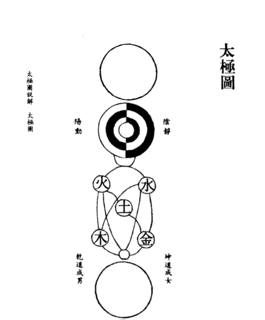
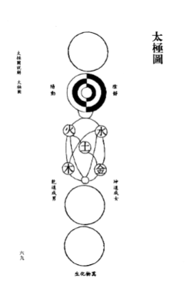

# 寻孔颜乐处

## 孔子

> 朝闻道夕死可矣

## 颜回

> 一箪食，一瓢饮，在陋巷，人不堪其忧，而不改其乐

## 曾点

子路、曾皙、冉有、公西华侍坐。子曰：「以吾一日长乎尔，毋吾以也。居则曰：「不吾知也！』如或知尔，则何以哉？」子路率尔而对曰：「千乘之国，摄乎大国之间，加之以师旅，因之以饥馑；由也为之，比及三年，可使有勇，且知方也。」夫子哂之。「求！尔何如？」对曰：「方六七十，如五六十，求也为之，比及三年，可使足民。如其礼乐，以俟君子。」「赤！尔何如？」对曰：「非曰能之，愿学焉。宗庙之事，如会同，端章甫，愿为小相焉。」「点！尔何如？」鼓瑟希，铿尔，舍瑟而作。对曰：「异乎三子者之撰。」子曰：「何伤乎？亦各言其志也。」曰：「莫**春者，春服既成。冠者五六人，童子六七人，浴乎沂，风乎舞雩，咏而归**。」夫子喟然叹曰：「吾与点也！」三子者出，曾皙后。曾皙曰：「夫三子者之言何如？」子曰：「亦各言其志也已矣。」曰：「夫子何哂由也？」曰：「为国以礼，其言不让，是故哂之。」「唯求则非邦也与？」「安见方六七十如五六十而非邦也者？」「唯赤则非邦也与？」「宗庙会同，非诸侯而何？赤也为之小，孰能为之大？」

子路、曾皙、冉有、公西华陪坐，孔子说:「不要顾及我年长,而不敢讲真话。你们经常说,没人理解你们,如果有人理解并重用你们,你们打算咋办?」子路急忙说:「较大国家,夹在大国之间,外有强敌入侵,内有饥荒肆虐,我来管理,只要三年,可使人人有勇气,个个讲道义。」孔子微笑。「冉求,你怎样?」答:「方圆几十里的地方,我来治理,只要三年,可使百姓衣食充足,至于精神文明,要等能人来教化。「公西赤,你怎样?」答:「我不敢说能干好,但愿意学习。祭祀的事,外交的事,我愿穿着礼服,做个助理。「曾点,你怎样?」曾皙弹琴正接近尾声,他铿地一声放下琴,站起来说:「我与他们三位不同。」孔子说:「说说有什么关系?只是各谈各的志向而已。」曾点说:「暮春三月,穿上春天的衣服,约上五六人,带上六七个童子,在沂水边沐浴,在高坡上吹风,一路唱着歌而回。」夫子感叹说:「我欣赏曾点的情趣。」其他三人走后,曾皙问:「他们三人的话怎样?」孔子说:「只是各谈各的志向而已。「您为何笑仲由呢?「治国要讲礼让,他的话一点也不谦虚,所以笑他。「冉求谈的是治国吗?「怎么见得治理方圆几十里的地方就不是治国呢?「公西赤谈的是治国吗?「祭祀和外交,不是国家大事是什么?如果公西赤只能当助理,谁能当总理?」

## 黄龙祖心

向内求，向自家屋里打点

叫周敦颐-寻孔颜乐处【周敦颐真的当做问题去疑虑】

## 佛印了元

周：天命之谓性，率性之谓道【率性：顺着性就是道】.佛教怎么说是无心是道？

> 顺着性：就是有 ；无心是道

佛印：到别处参？

周：如果参终究是有？

佛印：满目青山一任看，截断中流，随波逐浪

>  答非所问；函盖乾坤;让他产生疑情；好大的疑惑；

有一天：看见草长出来；“与自家意思一般”-天地生生-跟我本来面目一样；诚-太极

## 东林常总

书房兀坐万机休，日暖风和草自幽【应无所住，而生其心】。

谁道二千年远事，而今只在眼前头【踏破铁鞋无觅处】。

> 书堂兀坐万机休，日暖风和草自幽.[应无所住，而生其心]
>
> 人生有所住，是看不明白的；
>
> 生气过后，再回过头去看生气，生气已经不在了；真理不是能通过客体的观察能观察到，有很多东西，必须要去体验，要用生命去体验，当下的呈现，要明。不能把“爱”和“生气”当做客观对象进行研究。就跟开车一样，你必须要实际提体验感受【西方哲学是不管什么，不管是活的还是死的，一律摆在身边进行观察】。

无极而太极。[太极](http://baike.baidu.com/view/3914.htm)动而生阳，动极而静，静而生阴，静极复动。一动一静，互为其根。分阴分阳，[两仪](http://baike.baidu.com/view/93171.htm)立焉。阳变阴合，而生水火木金土。五气顺布，四时行焉。[五行](http://baike.baidu.com/view/4292.htm)一阴阳也，阴阳一[太极](http://baike.baidu.com/view/3914.htm)也，太极本[无极](http://baike.baidu.com/view/15957.htm)也。[五行](http://baike.baidu.com/view/4292.htm)之生也，各一其性。

[无极](http://baike.baidu.com/view/15957.htm)之真，二五之精，妙合而凝。乾道成男，[坤道](http://baike.baidu.com/view/1950188.htm)成女。二气交感，化生万物。万物生生而变化无穷焉。

唯人也得其秀而最灵。形既生矣，神发知矣。五性感动而善恶分，万事出矣。圣人定之以中正仁义而主静，立人极焉。

故圣人“与天地合其德，日月合其明，四时合其序，鬼神合其吉凶”，君子修之吉，小人悖之凶。故曰：“立天之道，曰阴与阳。立地之道，曰柔与刚。立人之道，曰仁与义。”又曰：“[原始反终](http://baike.baidu.com/view/679036.htm)，故知死生之说。”大哉易也，斯其至矣！

##  总述

1 每一层都是太极，每一层都是真东西【跟西方的观念是不一样，真东西在理念世界，而现象世界是不真的，有高低之分；上面是上帝的话，下面就不能是真东西】；中国最真的最本质最根源的东西，他就在乾道成男，[坤道](http://baike.baidu.com/view/1950188.htm)成女。二气交感，化生万物之中。

2 当下即是，道离人不远【当体即道】，他就在我们的生活中。【跟向外的求，科技的发展，制度的创新，其实他带给人的利弊是不好说】

3 无极、太极【阴阳】、五行【只有5才能彼此相生相克，少一个就构成不了相生相克的关系】、男女【因为有成男所以有成女】、万物

> 相生：水-木-火-土-金；相克：水-火-金-木-土
>
> 太极并不是宇宙论，宇宙论可以生出来的东西就不是他【但太极图的每一步都是太极】，

4 显示为历史性，但不能理解为生成论【母子是不一样的】。

5 阴阳

> 是互补对称的结构，互为其根
>
> 《华严经》-互补对称，互夺双泯。
>
> 舍-椽；你说房子他不是房子，他不过是椽的因缘聚合而成，所以他不是舍。椽就是舍。说离开了椽，就不是舍，所以椽就是舍。如果没有瓦石在这个房子中的话，椽就是木头，不是椽。