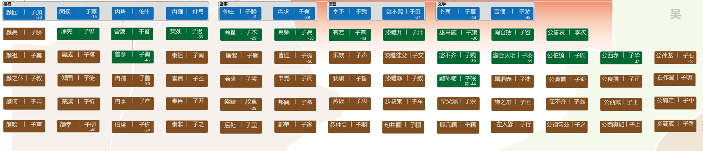

# 概述

读四书两个态度去

1  仰视
2  带着生命温度去【实践】

四书介绍

大学---框架，入道之门
论语---根（自主汲取）
孟子---大其心志
中庸---儒家最高最细微的道理

# 大学

大学之道，在明明德，在亲民，在止于至善。 

知止而后有定；定而后能静；静而后能安；安而后能虑；虑而后能得。 物有本末，事有终始。知所先后，则近道矣。

古之欲明明德于天下者，先治其国；欲治其国者，先齐其家； 欲齐其家者，先修其身；欲修其身者，先正其心；欲正其心者， 先诚其意；欲诚其意者，先致其知；致知在格物。 物格而后知至；知至而后意诚；意诚而后心正；心正而后身修；身修而后家齐；家齐而后国治；国治而后天下平。

自天子以至于庶人，壹是皆以修身为本。其本乱而末治者，否矣。其所厚者薄，而其所薄者厚，未之有也。此谓知本，此谓知之至也。

## 在明明德

明-动词，使明德光明
明德-明，形容词，光明温暖的德行
在明明德，使明德光明起来【性本善】，过度的欲望会使明德遮蔽起来。
一念之微，全在于在公在私。
不去安顿老人的人，如果你的欲望永远超过你的收入，那你的钱永远是不够的。
明明德的根本在于学道理。

## 在亲民

明德为本，亲民为末；自明明德【明德】，明明德于天下【亲民】。
明白了这个道理，给别人讲是新民。
明明德-是自新，明明德于天下-是新民
【这一点应该是杨立华老师的发挥和阐释】新--是生命力蓬勃更新的状态。生命力蓬勃饱满就是明明德。儒家的根本在于生生之理。
明德要告诉的人要生命力饱满，萎靡就是恶。

## 在止于至善

知止【在于中，不在于极端】；
撑不住就退；否极泰来；过刚则断；
中国是一个知止的文明；
止在什么地方-至善-知分安分尽分-做一个永不生锈的螺丝钉-合适的位置【恰当的位置】；
没有什么行为是无条件的善或者是恶的，而是要在什么合适的时候做合适的东西；
儒家的价值观是可普遍--儒家的价值观是分内价值观，做了该做什么，就该得什么，不该得不该得的。
知止为本，能止为末。
在该得的基础上，把生活过的饱满。

## 格物致知

间尝窃取程子之意，以补之曰：“所谓致知在格物者，言欲致吾之知，在即物而穷其理也。盖人心之灵莫不有知，而天下之物莫不有理。惟于理有未穷，故其知有不尽也。是以大学始教，必使学者即凡天下之物，莫不因其已知之理而益穷之，以求至乎其极。至于用力之久，而一旦豁然贯通焉，则众物之表里精粗无不到，而吾心之全体大用无不明矣。此谓物格，此谓知之至也。 

1 众物之表里精粗无不到：客观规律的掌握

2 而吾心之全体大用无不明矣：精神心灵的明

3 朱子之格物，即求外界客观的物质的知识，所谓“则众物表里精粗无不到，而吾心之全体大用无不明矣。此谓物格，此谓知至至也。”，也求和人相关的内心的知识，即所谓“吾心之全体大用无不明矣”

## 诚意

**所谓诚其意者，毋自欺也。如恶恶臭，如好好色，此之谓自谦。故君子必慎其独也。小人闲居为不善，无所不至，见君子而后厌然，揜其不善，而著其善。人之视己，如见其肝肺然，则何益矣。此谓诚于中形于外。故君子必慎其独也。曾子曰：“十目所视，十手所指，其严乎！”富润屋，德润身，心广体胖，故君子必诚其意。**

目标是知行合一，知行不能合一的原因是什么？

强调是非和好恶所统一，对恶“如恶恶臭”，对善“如好好色”；

慎独;几微故幽；“戒慎乎其所不睹，恐惧乎其所不闻”，

杨老师对慎独的评价：说做的太过了，要求太严了，对微小的“几”都严苛，又说到明朝亡国，崇祯不迁都的事。“慎独是不是要做的非常细，一点都不允许犯错”

## 正心

**所谓修身在正其心者，身有所忿懥，则不得其正；有所恐惧，则不得其正；有所好乐，则不得其正；有所忧患，则不得其正。心不在焉，视而不见，听而不闻，食而不知其味。此谓修身在正其心。**

正心要求这些情绪不滞留于心，不住相。

## 修身

所谓齐其家在修其身者，人，之其所亲爱而辟焉，之其所贱恶而辟焉，之其所畏敬而辟焉，之其所哀矜而辟焉，之其所敖惰而辟焉。故好而知其恶，恶而知其美者，天下鲜矣！故谚有之曰：“人莫知其子之恶，莫知其苗之硕(7)。”此谓身不修，不可以齐其家。

**故好而知其恶，恶而知其美者，天下鲜矣**

对喜欢的人要知道他的缺点，不喜欢的人要知道他的有点

## 总结

1.三纲：明明德（自明其明德），亲民（带动周围人），止于至善（知分、安分、尽分）

（我们应该成为什么样的人，我们如何成为这样的人——从不同侧面描述同一目标）

 八条目：格物，致知，诚意，正心，修身>>>明明德>>>自新

​                齐家，治国，平天下 >>>亲民>>>新民

# 论语

## 四科十哲

四科十哲 德性科，言语科，政事科，文学科

### 德性

#### **颜回-子渊**

一箪食，一瓢饮，在陋巷，人不堪其忧，回也不改其乐。

颜回好学，不迁怒，不贰过。

#### 闵损-子骞

孝哉，闵子骞！人不间于其父母昆弟[之言](https://baike.baidu.com/item/之言/55173097?fromModule=lemma_inlink)。

#### 冉耕-伯牛

#### 冉雍-仲弓

### 言语

####  **端木赐**   **子贡** 

有一言可终身行之者乎，其恕乎，己所不欲勿施于人。【子贡拜师所问】

不怨天，不尤人，下学而上达，知我者其天乎。

#### **宰予  子我**

**宰予昼寝。子曰：“朽木不可雕也，粪土之墙不可杇也，于予与何诛。”**
朽，许久反。杇，音污。与，平声，下同。昼寝，谓当昼而寐。朽，腐也。雕，刻画也。杇，镘也。言其志气昏惰，教无所施也。与，语辞。诛，责也。言不足责，乃所以深责之。 

**宰我问：“三年之丧，期已久矣。**

期，音基，下同。期，周年也。    　　

**君子三年不为礼，礼必坏；三年不为乐，乐必崩。**

恐居丧不习而崩坏也。    　　

**旧谷既没，新谷既升，钻燧改火，期可已矣。”**

钻，祖官反。没，尽也。升，登也。燧，取火之木也。改火，春取榆柳之火，夏取枣杏之火，夏季取桑柘之火，秋取柞楢之火，冬取槐檀之火，亦一年而周也。已，止也。言期年则天运一周，时物皆变，丧至此可止也。尹氏曰：“短丧之说，下愚且耻言之。宰我亲学圣人之门，而以是为问者，有所疑于心而不敢强焉尔。”    　　

**子曰：“食夫稻，衣夫锦，于女安乎？”曰：“安。”**

夫，音扶，下同。衣，去声。女，音汝，下同。礼。父母之丧：既殡，食粥、粗衰。既葬，疏食、水饮，受以成布。期而小祥，始食菜果，练冠縓缘、要绖不除，无食稻衣锦之理。夫子欲宰我反求诸心，自得其所以不忍者。故问之以此，而宰我不察也。    　　

**“女安则为之！夫君子之居丧，食旨不甘，闻乐不乐，居处不安，故不为也。今女安，则为之！”**

乐，上如字，下音洛。此夫子之言也。旨，亦甘也。初言女安则为之，绝之之辞。又发其不忍之端，以警其不察。而再言女安则为之以深责之。    　　

**宰我出。子曰：“予之不仁也！子生三年，然后免于父母之怀。夫三年之丧，天下之通丧也。予也有三年之爱于其父母乎？”**

宰我既出，夫子惧其真以为可安而遂行之，故深探其本而斥之。言由其不仁，故爱亲之薄如此也。怀，抱也。又言君子所以不忍于亲，而丧必三年之故。使之闻之，或能反求而终得其本心也。范氏曰：“丧虽止于三年，然贤者之情则无穷也。特以圣人为之中制而不敢过，故必俯而就之。非以三年之丧，为足以报其亲也。所谓三年然后免于父母之怀，特以责宰我之无恩，欲其有以跂而及之尔。”    

### 政事

#### 仲由-子路

**季康子问：“仲由可使从政也与？”子曰：“由也果，于从政乎何有？”曰：“赐也，可使从政也与？”曰：“赐也达，于从政乎何有？”曰：“求也，可使从政也与？”曰：“求也艺，于从政乎何有？”**
与，平声。从政，谓为大夫。果，有决断。达，通事理。艺，多才能。程子曰：“季康子问三子之才可以从政乎？夫子答以各有所长。非惟三子，人各有所长。能取其长，皆可用也。” 

> 何有：有何难哉？最讨厌议而不决。果达艺具备一个，就能从政。

------

**颜渊、季路侍。子曰：“盍各言尔志？”**
盍，音合。盍，何不也。 
**子路曰：“愿车马、衣轻裘，与朋友共。敝之而无憾。”**
衣，去声。衣，服之也。裘，皮服。敝，坏也。憾，恨也。 

> 愿车马和所有的东西都和朋友分享。友爱很重要。朋友的聚散是无法确定的。子路的问题还是把外在的东西作为自己追求的东西。

**颜渊曰：“愿无伐善，无施劳。”**
伐，夸也。善，谓有能。施，亦张大之意。劳，谓有功，易曰“劳而不伐”是也。或曰：“劳，劳事也。劳事非己所欲，故亦不欲施之于人。”亦通。 

> 有功劳而不自我炫耀。真正做到无伐善的人，一定是真的不觉得自己在为善。子路追求的是外在的东西，不是你努力就能实现的东西。颜回追求的是偏内在的东西。

**子路曰：“愿闻子之志。”子曰：“老者安之，朋友信之，少者怀之。”**
老者养之以安，朋友与之以信，少者怀之以恩。一说：安之，安我也；信之，信我也；怀之，怀我也。亦通。程子曰：“夫子安仁，颜渊不违仁，子路求仁。”又曰：“子路、颜渊、孔子之志，皆与物共者也，但有小大之差尔。”又曰“子路勇于义者，观其志，岂可以势利拘之哉？亚于浴沂者也。颜子不自私己，故无伐善；知同于人，故无施劳。其志可谓大矣，然未免出于有意也。至于夫子，则如天地之化工，付与万物而己不劳焉，此圣人之所为也。今夫羁靮以御马而不以制牛，人皆知羁靮之作在乎人，而不知羁靮之生由于马，圣人之化，亦犹是也。先观二子之言，后观圣人之言，分明天地气象。凡看论语，非但欲理会文字，须要识得圣贤气象。” 

> 颜回、子路侍立在孔子的身边。孔子问：“何不各自谈谈你们的志向呢？”子路说：“希望拿出自己的车马、皮衣与朋友共享，即使用坏了、穿旧了也不感到可惜。”颜回说：“希望不夸耀自己的好处，也不宣扬自己的功劳。”子路问孔子：“愿意听听先生的志向。”孔子说：“我的志向是老人得到安享，朋友得到信任，少年得到关怀。”【评析】
>
> 老者以我为安，上了年纪的人缺乏的是安全感【父亲，大舅】。朋友可以全身心的相信我，年轻人能追慕我，以我为目标。像大地一样安稳，所有人都能在他这儿找到支点，由内达诸外，是内外兼顾的。孔子是什么日子都能过得饱满。有哪样的品德和境界。是可以成为我们的依赖。假如有幸能到孔子的身边何其有幸，能以母语的方式亲近这样的伟大经典，也是何其有幸。

------

#### 冉求-子有

多才多艺，尤擅长理财，曾担任季氏宰臣

------

**季康子问：“仲由可使从政也与？”子曰：“由也果，于从政乎何有？”曰：“赐也，可使从政也与？”曰：“赐也达，于从政乎何有？”曰：“求也，可使从政也与？”曰：“求也艺，于从政乎何有？”**
与，平声。从政，谓为大夫。果，有决断。达，通事理。艺，多才能。程子曰：“季康子问三子之才可以从政乎？夫子答以各有所长。非惟三子，人各有所长。能取其长，皆可用也。” 

> 何有：有何难哉？最讨厌议而不决。果达艺具备一个，就能从政。

------

### 文学

#### 卜商-子夏

#### 言偃-子游

### 曾子和有子

曾子和有子都是晚年弟子

#### 曾子 

曾参 吾道一以贯之，惟。
参也鲁。
吾日三省吾身。

#### 有子 

礼之用，和为贵。先王之道斯为美，小大由之。有所不行。知和而和，不以礼行之，亦有所不行。

## 学而篇第一

### 章1-**学**而时习之

**学**而时习之，不亦**说**乎；有**朋**自远方来不亦**乐**乎；人不知而不愠，不亦君子乎；

-----

关键字：学，朋，说，乐

学,志与道， 据于德，依于仁，游于艺；一定要学，要有活力。到了一定的年纪，不管喜欢什么，一定要有喜欢。身体再动，脑袋在动，一定不会差。

朋,

不愠;不平，不恼怒；学习是为了自己内在精神的成长，有朋自远方来，自然很好；如果没有，也应该“乐”；跟道家的无待思想一致；外在的快乐是有条件的，也不是永恒的，人要追求就追求永恒的快乐。

### 章8-学则不固

子曰：“君子不重则不威，学则不固，主忠信，无友不如己者。过则勿惮改"

------

固：狭隘；为学：

主忠信：主，一个人到了哪个地方住在哪个地方，主 ：亲近

过则勿惮改：过则不害怕改正。有些过是不能改的，罪不能改。

"主忠信，无友不如己者。过则勿惮改",跟比你优秀的人交友，能反衬出你的问题，你要过则勿惮改。

### 章-礼之用，和为贵

有子曰：“礼之用，和为贵。先王之道斯为美，小大由之。有所不行，知和而和，不以礼节之，亦不可行也 “

------

礼：敬   ，礼以到名分
先王之道斯为美：先王之道以此为美，小事大事都以礼乐并用行之。
只知道礼之用，不知道和为贵，就会僵化。礼乐并用，中庸之道，不可以偏。

------

## 为政第二

### 章1-为政以德

子曰：“为政以德，譬如北辰，居其所而众星共之。”

------

无为而治，是中国各家政治的理想，不只是道家的专利。

德与法和刑相对，只要为政以德，北辰不动，所有的星星都围绕你转。君主无为，是国家有序运转的条件。你君主任何的有为，都会导致运行秩序的效率【上之所好，下有所好】。

注重为政者的模范带头作用。在上位的为政者能够做到正己，就可以不令而行，上行下效，使天下人都归于正道。这种为政以德、讲究修身的思想成为封建社会中人治的基础，产生了深远的影响。

### 章3-道之以德，齐之以礼
子曰：“道之以政，齐之以刑，民免而无耻；道之以德，齐之以礼，有耻且格。”

------
用政治权利来引导，用刑罚来约束，其结果是老百姓苟免于刑罚而无羞耻之心；
用德来引导，用礼来约束，其结果是老百姓既有羞耻心又能够规矩。
刑是在已然发生之后去惩罚他，礼是在发生前发生之先。
有耻且格【正】：既有羞耻之心又能够规矩

### 章4-生，事之以礼；死，葬之以礼

孟懿子问孝。子曰：“ 无违。”
> 无违礼【理】

樊迟御，子告之曰：“孟孙问孝于我，我对曰‘无违’。”

樊迟曰：“何谓也？”子曰：“生，事之以礼；死，葬之以礼，祭之以礼。”

> 樊迟不懂就问

> 孝：养，安

### 章5-学而不思则罔

子曰：“学而不思则罔，思而不学则殆。”

------

只学习不思考，就会迷路【从不熟悉的地方回不到熟悉的地方】-这就叫罔，学而不思【你就是在不熟悉的地方回不去】，其实你有多远？，其实并不远，经过思考，带回你熟悉的地方就可以了。追求大量阅读是必要的，消化也是必要的。【思学并进，得知日新】

思而不学则殆，熟悉的经验，引出不熟悉的知识，懈怠，从有限的经验出发，不打开自己就会懈怠。
学是不断的打开【学则不固】，思是消化。

## 八佾第三

### 八佾舞于庭

**孔子谓季氏：“八佾舞于庭，是可忍也，孰不可忍也？”**
佾，音逸。季氏，鲁大夫季孙氏也。佾，舞列也，天子八、诸侯六、大夫四、士二。每佾人数，如其佾数。或曰：“每佾八人。”未详孰是。季氏以大夫而僭用天子之乐，孔子言其此事尚忍为之，则何事不可忍为   。或曰：“忍，容忍也。”盖深疾之之辞。范氏曰：“乐舞之数，自上而下，降杀以两而已，故两之间，不可以毫发僭差也。孔子为政，先正礼乐，则季氏之罪不容诛矣。”谢氏曰：“君子于其所不当为不敢须臾处，不忍故也。而季氏忍此矣，则虽弑父与君，亦何所惮而不为乎？” 

> 孔子谓季氏，孔子评价季氏；如果孔子谓季氏曰，就是孔子对孔子对季氏说
>
> 忍，忍心，可以做。

### 与其媚于奥，宁媚于灶

**王孙贾问曰：“与其媚于奥，宁媚于灶，何谓也？”**
王孙贾，卫大夫。媚，亲顺也。室西南隅为奥。灶者，五祀之一，夏所祭也。凡祭五祀，皆先设主而祭于其所，然后迎尸而祭于奥，略如祭宗庙之仪。如祀灶，则设主于灶陉，祭毕，而更设馔于奥以迎尸也。故时俗之语，因以奥有常尊，而非祭之主；灶虽卑贱，而当时用事。喻自结于君，不如阿附权臣也。贾，卫之权臣，故以此讽孔子。 

**子曰：“不然，获罪于天，无所祷也。”**
天，即理也；其尊无对，非奥灶之可比也。逆理，则获罪于天矣，岂媚于奥灶所能祷而免乎？言但当顺理，非特不当媚灶，亦不可媚于奥也。谢氏曰：“圣人之言，逊而不迫。使王孙贾而知此意，不为无益；使其不知，亦非所以取祸。” 

> 媚 求 隐 待
> 待：不求也不隐

### 乐而不淫，哀而不伤

**子曰：“关雎，乐而不淫，哀而不伤。”**
乐，音洛。关雎，周南国风诗之首篇也。淫者，乐之过而失其正者也。伤者，哀之过而害于和者也。关雎之诗，言后妃之德，宜配君子。求之未得，则不能无寤寐反侧之忧；求而得之，则宜其有琴瑟钟鼓之乐。盖其忧虽深而不害于和，其乐虽盛而不失其正，故夫子称之如此。欲学者玩其辞，审其音，而有以识其性情之正也。 

> 乐的精神，对于儒家是非常重要的，一定程度上可以作为和墨家法家思想的区别。墨家和法家是实实在在的实用主义谨慎和功利主义精神，一切和实用没有关系，都认为是没有必要的。“儒以文乱法，而侠以武犯禁”儒和侠都以自己的规范和标准干涉国家的法。在韩非子眼中，只有君臣民，没有艺术家，都是蠹虫。墨家非乐篇。
人无论如何都是在情感当中的，不可能是一个完全理性的人，完全没有情绪波动的机器人。人在某种意义上就是为情感情绪活着。但是情绪波动大的人不容易幸福了【伊壁鸠鲁学派对于快乐的看法】。人总得有安顿抒发人的情感的东西，而乐的意义就在安顿抒发调节调整人的情感。所以儒家非常强调乐的社会政治意义。既然强调，所以说乐有雅正之分。所谓“乐而不淫，哀而不伤”，强调的是乐和哀都不能过度。艺术一定不是纯抽象的，艺术必有其感染方向。好的艺术作品带给人好的影响，糟糕的艺术作品带给人糟糕的影响。儒家讲乐从来都不是单纯的指的音乐，而是指生活中一切装点性的东西。所以乐可以定位为不具实用价值又不可或缺的生活内容的总和。比如房子的装修、盲道一样，都可以看成乐的部分。

### 成事不说，遂事不谏

**哀公问社于宰我。宰我对曰：“夏后氏以松，殷人以柏，周人以栗，曰使民战栗。”**

宰我，孔子弟子，名予。三代之社不同者，古者立社，各树其土之所宜木以为主也。战栗，恐惧貌。宰我又言周所以用栗之意如此。岂以古者戮人于社，故附会其说与？

**子闻之曰：“成事不说，遂事不谏，既往不咎。”**

遂事，谓事虽未成，而势不能已者。孔子以宰我所对，非立社之本意，又启时君杀伐之心，而其言已出，不可复救，故历言此以深责之，欲使谨其后也。尹氏曰：“古者各以所宜木名其社，非取义于木也。宰我不知而妄对，故夫子责之。” 
宰我特点说到做不到。想的太多了，但不去做。“子生三年，然后免于父母之怀”

> 周人以栗，曰使民战栗[宰我多说的，自己的想法]。成事不说：已经有结果的事不说。遂事不谏，谓事虽未成，而势不能已者，虽然没有发生，但一定能发生的事就不要劝阻。劝不住的事就不要劝。既往不咎，已经过去了就不再追究。
> 论语中孔子说的话，都有其具体对象。都有具体上学生人格的特点和人格的缺点。但是往往把这些话抽出来，又能作为行事的原则。“成事不说，遂事不谏，既往不咎。”这12个字，其实可以作为行事的原则。忘却的机制。要想进步，一定不能停留在某个地方。失败了不要悲，成功了不要大喜。有的时候，成功和失败包含了很多运气，往往人当成了自己的能力。最最怕到某个阶段，人的思想停留在某个地方。

### 天下之无道也久矣，天将以夫子为木铎

**仪封人请见。曰：“君子之至于斯也，吾未尝不得见也。”从者见之。出曰：“二三子，何患于丧乎？天下之无道也久矣，天将以夫子为木铎。”**

请见、见之之见，贤遍反。从、丧，皆去声。仪，卫邑。封人，掌封疆之官，盖贤而隐于下位者也。君子，谓当时贤者。至此皆得见之，自言其平日不见绝于贤者，而求以自通也。见之，谓通使得见。丧，谓失位去国，礼曰“丧欲速贫”是也。木铎，金口木舌，施政教时所振，以警众者也。言乱极当治，天必将使夫子得位设教，不久失位也。封人一见夫子而遽以是称之，其所得于观感之间者深矣。或曰：“木铎所以?于道路，言天使夫子失位，周流四方以行其教，如木铎之?于道路也。” 

> 见【音现】。君子之至于斯也，吾未尝不得见也。君子到这个地方，我都能见到。
> 从者见之,引导他。
> 对于孔子这样的人，什么样的情境过不好呢。但是为什么还一直待呢【周游列国】，归根结底，还是不忍。不忍天下百姓【苏格拉底，从天上走到人间】。
>
> 二三子，何患于丧乎？天下之无道也久矣，天将以夫子为木铎。何必害怕失位去国呢。天下之无道也久矣，天将以夫子为木铎。木铎所以?于道路，言天使夫子失位，周流四方以行其教，如木铎之?于道路也。要让父子的政教行于四方。
>
> 中国每隔一段时间，必定出伟大的思想家。但一定不为当时所用，正是因为其不为当时所用。所以能将时间用到更根本的问题的思考。为后来几百年上千年奠定基础。朱子一般都是求闲职，其他时间全部都投入到思想的思考中去。假设孔子在哪个时代得到重用，也许能把哪个时代带回东周。但是不可能为中华文明奠定三千年的基础。程颐朱熹得势，也没有后来的宋明道学。“做官夺人之志”

## 里仁第四

### 仁者安仁，知者利仁

**子曰：“不仁者不可以久处约，不可以长处乐。仁者安仁，知者利仁。”**

乐，音洛。知，去声。约，穷困也。利，犹贪也，盖深知笃好而必欲得之也。不仁之人，失其本心，久约必滥，久乐必淫。惟仁者则安其仁而无适不然，知者则利于仁而不易所守，盖虽深浅之不同，然皆非外物所能夺矣。谢氏曰：“仁者心无内外远近精粗之间，非有所存而自不亡，非有所理而自不乱，如目视而耳听，手持而足行也。知者谓之有所见则可，谓之有所得则未可。有所存斯不亡，有所理斯不乱，未能无意也。安仁则一，利仁则二。安仁者非颜闵以上，去圣人为不远，不知此味也。诸子虽有卓越之才，谓之见道不惑则可，然未免于利之也。” 

> 颜渊问仁 仁者能爱 ；以及仁者能幸福是仁最重要的两条。不仁者什么样的日子过不好。大多数人设置人生目标的时候，是有多少钱，我就可以幸福。殊不知，德性才是幸福最重要的东西。励志三十岁退休，哈哈。一天一瓶二锅头就是幸福。钱是非线性和离散的。钱在大部分跟幸福是不成正比的。幸福的根源不在于外在的物质财富，而在于精神休养。你有足够的智慧，有足够的品质，什么样的日子都过得好。“乐已在其中，不义而富且贵，与我于何浮云”一个人能否幸福，在于心灵的温度。
> 觉，麻木不仁，能不能觉到幸福。往往最高的幸福在正在其中的时候，你感受不到。
> 物理学里面重复碰见的概率有多低，有啥必要闹别扭呢。
>
> 仁者安仁，能对所知的自然的做到，就像本能一样，即“**仁者心无内外远近精粗之间，非有所存而自不亡，非有所理而自不乱，如目视而耳听，手持而足行也。**”
> 知者利仁，怎么理解利人，知者知道这么做有好处。**“知者谓之有所见则可，谓之有所得则未可。有所存斯不亡，有所理斯不乱，未能无意也”**
>
> **“或生而知之，或学而知之，或困而知之，及其知之一也；或安而行之，或利而行之，或勉强而行之，及其成功一也，”**《中庸》，不管是安，仁，勉强，虽然是深浅之不同，然皆非外物所能夺矣，只要能行之，最终达到的都是一样的境界。“
>
> **性焉安焉之谓圣，执焉复焉之谓贤-《通书》**
>
> **天命之谓性，率性之为道，修道之谓教。**[性焉安焉之谓圣的“性”联想天命之谓性，对性的理解有所加深]
>
> > 【性是天地之性（所以说是天命之谓性），是太虚zhanyi之性，而非气质之性，所以循着天地之性，循着仁义礼智的性就是道。“天命之谓性，率性之为道”和“性焉安焉”互相印证】
>
> **知止而后有定，定而后能静，静而后能安，安而后能虑，虑而后能得。**【又安联想“安而后能虑”，对虑的理解更加深】
>
> > 止的境界【在明明德，在亲民，在止于至善】
> > 定-
> > 静-无欲故静，主一之道
> > 安-是“仁者安仁，知者利仁”的安，是“或安而行之，或利而行之，或勉强而行之，及其成功一也”的安，是“性焉安焉之谓圣”的安，所以安是一种极高的境界。
> > 虑-是夫子的境界，以夫子的精神修养，什么样的生活境遇过不好，为何还要周游列国，一直有所待【不求也不隐】呢，因为有所虑，夫子虑的是天下，虑的是生民，虑的是天地无心，生民无业。所以夫子为天地立心，为生民立业。为往圣继绝学，为万世开太平。
> > 得-
>
> **儒家和道家的区别之一：**儒家和道家都求安的境界，但主要的区别是“安而后是否能虑”，“安而后能虑”是儒家的担当和责任意识，儒家在个人修养“安”的完成后，还要虑，虑的是家国天下；而道家境界的完成后，是“游”的强调。道家其实也有虑，只是认为一切人为的“伪”都是没有作用甚至起凡作用，所以道家对一切“人文”的一切“人为”的给予了最彻底的批判。

### 有能一日用其力于仁矣乎

**子曰：“我未见好仁者，恶不仁者。好仁者，无以尚之；恶不仁者，其为仁矣，不使不仁者加乎其身。**
好、恶，皆去声。夫子自言未见好仁者、恶不仁者。盖好仁者真知仁之可好，故天下之物无以加之。恶不仁者真知不仁之可恶，故其所以为仁者，必能绝去不仁之事，而不使少有及于其身。此皆成德之事，故难得而见之也。 
**有能一日用其力于仁矣乎？我未见力不足者。**
言好仁恶不仁者，虽不可见，然或有人果能一旦奋然用力于仁，则我又未见其力有不足者。盖为仁在己，欲之则是，而志之所至，气必至焉。故仁虽难能，而至之亦易也。 

> 我没有见到过好仁者和恶不仁者。好仁者，你就自然能做到。恶不仁者，其为人，他的是非和好恶是统一的。【真行的问题，真知必能行，诚意篇，好恶和善恶是不统一的】
> 致力于实现于仁，能有做不到的吗？让你做五分钟、五天的圣人，你做不到吗。 儒家的道都是日用之道，都不难。但是要长久的坚持并不容易【“执焉复焉之谓贤”】【为仁由己，而有人乎哉】【我欲仁，斯仁至矣】
> 1 仁强调的是自我的能动性。
> 2 另一方面，强调在自我的能动性上面，坚持。

### 吾道一以贯之

**子曰：“参乎！吾道一以贯之。”曾子曰：“唯。”**
参，所金反。唯，上声。参乎者，呼曾子之名而告之。贯，通也。唯者，应之速而无疑者也。圣人之心，浑然一理，而泛应曲当，用各不同。曾子于其用处，盖已随事精察而力行之，但未知其体之一尔。夫子知其真积力久，将有所得，是以呼而告之。曾子果能默契其指，即应之速而无疑也。 
【性焉安焉之谓圣】
**子出。门人问曰：“何谓也？”曾子曰：“夫子之道，忠恕而已矣。”**
尽己之谓忠，推己之谓恕。而已矣者，竭尽而无余之辞也。夫子之一理浑然而泛应曲当，譬则天地之至诚无息，而万物各得其所也。自此之外，固无余法，而亦无待于推矣。曾子有见于此而难言之，故借学者尽己、推己之目以着明之，欲人之易晓也。盖至诚无息者，道之体也，万殊之所以一本也；万物各得其所者，道之用也，一本之所以万殊也。以此观之，一以贯之之实可见矣。或曰：“中心为忠，如心为恕。”于义亦通。程子曰：“以己及物，仁也；推己及物，恕也，违道不远是也。忠恕一以贯之：忠者天道，恕者人道；忠者无妄，恕者所以行乎忠也；忠者体，恕者用，大本达道也。此与违道不远异者，动以天尔。”又曰：“‘维天之命，于穆不已’，忠也；‘干道变化，各正性命’，恕也。”又曰：“圣人教人各因其才，吾道一以贯之，惟曾子为能达此，孔子所以告之也。曾子告门人曰：‘夫子之道，忠恕而已矣’，亦犹夫子之告曾子也。中庸所谓‘忠恕违道不远’，斯乃下学上达之义。” 

> 场景 参乎，点曾参的名，说明有几个弟子在场。夫子说“吾道一以贯之”的有两个弟子，曾子和子贡，子贡是完全不理解。子贡沉默，完全不懂。子贡以灵敏著名。而参也鲁【山而非水】。子路对冉求，曾子【轴】对子夏【博】，曾子比孔子小46岁。曾子说“唯”，说懂了，肯定是懂了。
> 一以贯之,以一贯之，贯：动词，一是原则，贯是方法。就像用一根一跟的线去穿铜钱，穿的动作是贯，那根线是一；
> 子出。门人问曰。孔子在的时候，不敢问。孔子没跟你讲，说明不适合你懂。为学次第。
> 曾子曰：“夫子之道，忠恕而已矣。”. "而已矣"说明了曾子的自信与确定。忠恕，一贯，体用，源立。忠恕不是二贯。忠是原则，恕是方法，以忠道贯恕道。尽己之谓忠，推己之谓恕。通过推己及人来达到尽己的目标。替别人考虑的时候能不能做到竭心尽力。做任何事到仁至义尽。推己：己所不欲，勿施于人。有原则有方法，是夫子之道。
> 尚书“人心惟危，道心惟微，惟精惟一，允执厥中”，
> 孔子《论语》：“吾道一以贯之”， 
> 子思《中庸》“喜怒哀乐之未发，谓之中，发而皆中节，谓之和”，
> 周敦颐《通书》“大哉乾元，万物资始，诚之源也；乾道变化，各正性命，诚斯立焉”
> 程颐 “体用一源，显微无间”体用一源
> 朱熹《集注》“盖至诚无息者，道之体也，万殊之所以一本也；万物各得其所者，道之用也，一本之所以万殊也。以此观之，一以贯之之实可见矣”理一分殊。

### 君子喻于义

**子曰：“君子喻于义，小人喻于利。”**
喻，犹晓也。义者，天理之所宜。利者，人情之所欲。程子曰：“君子之于义，犹小人之于利也。唯其深喻，是以笃好。”杨氏曰：“君子有舍生而取义者，以利言之，则人之所欲无甚于生，所恶无甚于死，孰肯舍生而取义哉？其所喻者义而已，不知利之为利故也，小人反是。” 

> 君子念兹在兹的是在义，所以对义通晓。儒家义利之辨的开端就是这儿来。今天这个问题其实挺复杂，到底应该追求义还是利。什么是义什么是利呢？义的原则用不用考虑物质生活呢。你凭什么说你追求物质生活是义，别人就是不义呢。利是指的比应得的部分多出来的部分就是利。利就是占便宜。那什么是应得。好的社会应该对分内的应得很清楚。如果去追求应得的部分的多出来的东西，喻于利。义是知止的原则，清楚自己应得的，并在相应的位置停下来。
> 完全不讲义利之辨，肯定是不对的。但将义利进行完全对立也是不对的。只问耕耘，不问收获。就是义的原则。儒家的话语中，义和利是可以统一的。易转中元亨利贞的利，其实可以理解为幸福。
> <义利之辨 夫子 君子喻于义 孟子 义利之辨 陆象山 朱陆之辩中 讲义利之辨

## 公冶长第五

### 知人也自知

**子谓子贡曰：“汝与回也孰愈【1】？”对曰：“赐也何敢望【2】回！回也闻【3】一以知十，赐也闻一以知二。”**
**子曰：“弗【4】如也。吾与汝弗如也。”**

> 背景：子贡总喜欢和别人比，所以孔子对子贡说和颜回比怎么样。
> 知人又自知，可以说是知者。从某种意义上也可以说是仁者。
> 赐也闻一知二：虽不如颜回，但是也很是有自信的。

### 朽木不可雕也

**宰予昼寝。子曰：“朽木不可雕也，粪土之墙不可杇也，于予与何诛。”**
朽，许久反。杇，音污。与，平声，下同。昼寝，谓当昼而寐。朽，腐也。雕，刻画也。杇，镘也。言其志气昏惰，教无所施也。与，语辞。诛，责也。言不足责，乃所以深责之。 

> 宰予：言语科，言语是非常重要的。讲究语言的准确性。
> 白天睡觉为什么这么愤怒。正常的日出而作日入而息。晚上没有灯，白天的时光是很宝贵的。在明明德，是自新，是内在生命力的洋溢。而再与恰恰相反，这是无生命力的体现。
> 朽木不可雕，腐朽的木一雕就坏了。粪土是很松的，粪土之墙，已经朽坏松的墙就不用涂抹了。对于再与这样的人，本质已经坏了就不用再说他了。为什么会这样呢。就是懈怠。

### 始吾于人也，听其言而信其行

**子曰：“始吾于人也，听其言而信其行；今吾于人也，听其言而观其行。于予与改是。”**
行，去声。宰予能言而行不逮，故孔子自言于予之事而改此失，亦以重警之也。胡氏曰：“‘子曰’疑衍文，不然，则非一日之言也。”范氏曰：“君子之于学，惟日孜孜，毙而后已，惟恐其不及也。宰予昼寝，自弃孰甚焉，故夫子责之。”胡氏曰：“宰予不能以志帅气，居然而倦。是宴安之气胜，儆戒之志惰也。古之圣贤未尝不以懈惰荒宁为惧，勤励不息自强，此孔子所以深责宰予也。听言观行，圣人不待是而后能，亦非缘此而尽疑学者。特因此立教，以警群弟子，使谨于言而敏于行耳。” 

> 孔子开始的时候，听其言而信其行，但是经过再与后，因为再与喜欢说大话，说了不做。

### 孰谓微生高直

**子曰：“孰谓微生高直?或乞醯焉，乞诸其邻而与之。**
醯【xī】，呼西反。微生姓，高名，鲁人，素有直名者。醯，醋也。人来乞时，其家无有，故乞诸邻家以与之。夫子言此，讥其曲意殉物，掠美市恩，不得为直也。程子曰：“微生高所枉虽小，害直为大。”范氏曰“是曰是、非曰非、有谓有、无谓无，曰直。圣人观人于其一介之取予，而千驷万钟从可知焉。故以微事断之，所以教人不可不谨也。” 

> 有就有，没有就没有。别人跟你借钱，有就有，不能借就不能借。与其答应别人带来的麻烦，不如直接拒绝带来的怨。很多时候，第一时间拒绝是最好的。

### 巧言令色足恭

**子曰：“巧言、令色、足恭，左丘明耻之，丘亦耻之。匿怨而友其人，左丘明耻之，丘亦耻之。”**
足，将树反。足，过也。程子曰：“左丘明，古之闻人也。”谢氏曰：“二者之可耻，有甚于穿窬也。左丘明耻之，其所养可知矣。夫子自言‘丘亦耻之’，盖窃比老、彭之意。又以深戒学者，使察乎此而立心以直也。” 

> 孔子说：“花言巧语，容貌伪善，过分的恭敬，左丘明以为可耻，我也以为可耻。心里怨恨别人，表面上还与人做朋友，左丘明以为可耻，我也以为可耻。”
> 令 美好 足恭 过分。令色，故意做出柔婉的面色。
> 明明很讨厌对方，表面上跟他做朋友。

### 久而敬之

**子曰：“晏平仲善与人交，久而敬之。”**
晏平仲，齐大夫，名婴。程子曰：“人交久则敬衰，久而能敬，所以为善。”

> 孔子说：“晏平仲善与人交往，时间越久，别人就越尊敬他。”
> 交友的原则，朋友时间久了容易泄曼。就怕久而泄之。如果没有起码的敬重的话，友谊是维持不下去的。

### 老者安之，朋友信之，少者怀之

**颜渊、季路侍。子曰：“盍各言尔志？”**
盍，音合。盍，何不也。 
**子路曰：“愿车马、衣轻裘，与朋友共。敝之而无憾。”**
衣，去声。衣，服之也。裘，皮服。敝，坏也。憾，恨也。 

> 愿车马和所有的东西都和朋友分享。友爱很重要。朋友的聚散是无法确定的。子路的问题还是把外在的东西作为自己追求的东西。

**颜渊曰：“愿无伐善，无施劳。”**
伐，夸也。善，谓有能。施，亦张大之意。劳，谓有功，易曰“劳而不伐”是也。或曰：“劳，劳事也。劳事非己所欲，故亦不欲施之于人。”亦通。 

> 有功劳而不自我炫耀。真正做到无伐善的人，一定是真的不觉得自己在为善。子路追求的是外在的东西，不是你努力就能实现的东西。颜回追求的是偏内在的东西。

**子路曰：“愿闻子之志。”子曰：“老者安之，朋友信之，少者怀之。”**
老者养之以安，朋友与之以信，少者怀之以恩。一说：安之，安我也；信之，信我也；怀之，怀我也。亦通。程子曰：“夫子安仁，颜渊不违仁，子路求仁。”又曰：“子路、颜渊、孔子之志，皆与物共者也，但有小大之差尔。”又曰“子路勇于义者，观其志，岂可以势利拘之哉？亚于浴沂者也。颜子不自私己，故无伐善；知同于人，故无施劳。其志可谓大矣，然未免出于有意也。至于夫子，则如天地之化工，付与万物而己不劳焉，此圣人之所为也。今夫羁靮以御马而不以制牛，人皆知羁靮之作在乎人，而不知羁靮之生由于马，圣人之化，亦犹是也。先观二子之言，后观圣人之言，分明天地气象。凡看论语，非但欲理会文字，须要识得圣贤气象。” 

> 颜回、子路侍立在孔子的身边。孔子问：“何不各自谈谈你们的志向呢？”子路说：“希望拿出自己的车马、皮衣与朋友共享，即使用坏了、穿旧了也不感到可惜。”颜回说：“希望不夸耀自己的好处，也不宣扬自己的功劳。”子路问孔子：“愿意听听先生的志向。”孔子说：“我的志向是老人得到安享，朋友得到信任，少年得到关怀。”【评析】
>
> 老者以我为安，上了年纪的人缺乏的是安全感【父亲，大舅】。朋友可以全身心的相信我，年轻人能追慕我，以我为目标。像大地一样安稳，所有人都能在他这儿找到支点，由内达诸外，是内外兼顾的。孔子是什么日子都能过得饱满。有哪样的品德和境界。是可以成为我们的依赖。假如有幸能到孔子的身边何其有幸，能以母语的方式亲近这样的伟大经典，也是何其有幸。

## 庸也第六

### 君子周急不继富

**子华使于齐，冉子为其母请粟。子曰：“与之釜。”请益。曰：“与之庾。”冉子与之粟五秉。**
使、为，并去声。子华，公西赤也。使，为孔子使也。釜，六斗四升。庾，十六斗。秉，十六斛。 

> 请益：请多给点。

**子曰：“赤之适齐也，乘肥马，衣轻裘。吾闻之也，君子周急不继富。”**
衣，去声。乘肥马、衣轻裘，言其富也。急，穷迫也。周者，补不足。继者，续有余。 
**原思为之宰，与之粟九百，辞。**
原思，孔子弟子，名宪。孔子为鲁司寇时，以思为宰。粟，宰之禄也。九百不言其量，不可考。 
**子曰：“毋！以与尔邻里乡党乎！”**
毋，禁止辞。五家为邻，二十五家为里，万二千五百家为乡，五百家为党。言常禄不当辞，有余自可推之以周贫乏，盖邻、里、乡、党有相周之义。程子曰：“夫子之使子华，子华之为夫子使，义也。而冉子乃为之请，圣人宽容，不欲直拒人。故与之少，所以示不当与也。请益而与之亦少，所以示不当益也。求未达而自与之多，则己过矣，故夫子非之。盖赤苟至乏，则夫子必自周之，不待请矣。原思为宰，则有常禄。思辞其多，故又教以分诸邻里之贫者，盖亦莫非义也。”张子曰：“于斯二者，可见圣人之用财矣。” 

> 是不是给报酬，是否长职，关系是否亲近，对方家里是否有钱，通过两件事的对比。所有的地方都有道理，所有的地方都有分寸，所有的分寸都有他的道理所在，这就是人情世故。道理，义理，情理。

### 果达艺

**季康子问：“仲由可使从政也与？”子曰：“由也果，于从政乎何有？”曰：“赐也，可使从政也与？”曰：“赐也达，于从政乎何有？”曰：“求也，可使从政也与？”曰：“求也艺，于从政乎何有？”**
与，平声。从政，谓为大夫。果，有决断。达，通事理。艺，多才能。程子曰：“季康子问三子之才可以从政乎？夫子答以各有所长。非惟三子，人各有所长。能取其长，皆可用也。” 

> 何有：有何难哉？最讨厌议而不决。果达艺具备一个，就能从政。

### 颜回之乐

**子曰：“贤哉，回也！一箪食，一瓢饮，在陋巷。人不堪其忧，回也不改其乐。贤哉，回也！”**
食，音嗣。乐，音洛。箪，竹器。食，饭也。瓢，瓠也。颜子之贫如此，而处之泰然，不以害其乐，故夫子再言“贤哉回也”以深叹美之。程子曰：“颜子之乐，非乐箪瓢陋巷也，不以贫窭累其心而改其所乐也，故夫子称其贤。”又曰：“箪瓢陋巷非可乐，盖自有其乐尔。其字当玩味，自有深意。”又曰“昔受学于周茂叔，每令寻仲尼颜子乐处，所乐何事？”愚按：程子之言，引而不发，盖欲学者深思而自得之。今亦不敢妄为之说。学者但当从事于博文约礼之诲，以至于欲罢不能而竭其才，则庶乎有以得之矣。 

> 无条件的自足。反身内向的自足，这样的自足，这样的一种反身内向的自足，才能保证我们不在追逐外物的过程中迷失在物质的世界里。自足是不可动摇的乐的基础。

### 行不由径

**子游为武城宰。子曰：“女得人焉尔乎？”曰：“有澹台灭明者，行不由径。非公事，未尝至于偃之室也。”**
女，音汝。澹，徒甘反。武城，鲁下邑。澹台姓，灭明名，字子羽。径，路之小而捷者。公事，如饮射读法之类。不由径，则动必以正，而无见小欲速之意可知。非公事不见邑宰，则其有以自守，而无枉己殉人之私可见矣。杨氏曰：“为政以人才为先，故孔子以得人为问。如灭明者，观其二事之小，而其正大之情可见矣。后世有不由径者，人必以为迂；不至其室，人必以为简。非孔氏之徒，其孰能知而取之？”愚谓持身以灭明为法，则无苟贱之羞；取人以子游为法，则无邪媚之惑。 

> 你在哪儿有发现了什么人才吗。走路从不走捷径，此人不苟且，不急功近利 
> 非公事，未尝至于偃之室也    非公事不见邑宰，则其有以自守，而无枉己殉人之私可见矣
> 在我们这个急功近利的时代，要的都是急于奏效的人才，自然而然的那些沉静的，沉潜的，安静的这些人反而就沉在下面。

### 文质彬彬

**子曰：“质胜文则野，文胜质则史。文质彬彬，然后君子。”**
野，野人，言鄙略也。史，掌文书，多闻习事，而诚或不足也。彬彬，犹班班，物相杂而适均之貌。言学者当损有余，补不足，至于成德，则不期然而然矣。杨氏曰：“文质不可以相胜。然质之胜文，犹之甘可以受和，白可以受采也。文胜而至于灭质，则其本亡矣。虽有文，将安施乎？然则与其史也，宁野。”

>人是什么
质：质料，内容，生命力， 文：形式   质：生命力的体现， 文：形式，对内容的约束
1 文胜质则史，而诚或不足也，比较空洞，虚伪和迂腐。只有内容和形式恰当的结合，才是君子的表现。有时候，人的情感过分的表达，太不行。
如果找不到恰当的点，然则与其史也，宁野。真实的内容多一点好。很多人追求雅的生活【真名士自风流】
2  在当今的中国，完全可以在元气淋漓的方式上去追求适当的表达方式，但是前提是你得有元气淋漓。
3 文胜质则史，这种生活都追求过多精致，过分的精致就是等于脆弱的人生，精致不是约等于脆弱，精致等于脆弱，因为精致的东西同时意味着你要求的东西，条件太多。

## 述而第七 

### 举一反三

子曰：“不愤不启，不悱不发，举一隅不以三隅反，则不复也。”
愤，房粉反。悱，芳匪反。复，扶又反。愤者，心求通而未得之意。悱者，口欲言而未能之貌。启，谓开其意。发，谓达其辞。物之有四隅者，举一可知其三。反者，还以相证之义。复，再告也。上章已言圣人诲人不倦之意，因并记此，欲学者勉于用力，以为受教之地也。程子曰：“愤悱，诚意之见于色辞者也。待其诚至而后告之。既告之，又必待其自得，乃复告尔。”又曰：“不待愤悱而发，则知之不能坚固；待其愤悱而后发，则沛然矣。” 

> 举一反三，一般是说这个人聪明，不对是说这个人做了努力。
> 愤者，心求通而未得之意。悱者，口欲言而未能之貌.启发式教学，最重要的学习一定是根源于人的主动要求。举一隅不以三隅反。我告诉你一个角的道理，你都推不出其他三个角的道理，说明是笨呢还是没有努力呢。
>
> 礼闻来学，未闻往教。

### 子食于有丧者之侧

**子食于有丧者之侧，未尝饱也。**
临丧哀，不能甘也。 
**子于是日哭，则不歌。**
哭，谓吊哭。日之内，余哀未忘，自不能歌也。谢氏曰：“学者于此二者，可见圣人情性之正也。能识圣人之情性，然后可以学道。” 

> 孔子的感情真挚而长久，因为真挚所以长久。

**子谓颜渊曰：“用之则行，舍之则藏，唯我与尔有是夫！”**
舍，上声。夫，音扶。尹氏曰：“用舍无与于己，行藏安于所遇，命不足道也。颜子几于圣人，故亦能之。” 

**子路曰：“子行三军，则谁与？”**
万二千五百人为军，大国三军。子路见孔子独美颜渊，自负其勇，意夫子若行三军，必与己同。 
**子曰：“暴虎冯河，死而无悔者，吾不与也。必也临事而惧，好谋而成者也。”**
冯，皮冰反。好，去声。暴虎，徒搏。冯河，徒涉。惧，谓敬其事。成，谓成其谋。言此皆以抑其勇而教之，然行师之要实不外此，子路盖不知也。谢氏曰：“圣人于行藏之间，无意无必。其行非贪位，其藏非独善也。若有欲心，则不用而求行，舍之而不藏矣，是以惟颜子为可以与于此。子路虽非有欲心者，然未能无固必也，至以行三军为问，则其论益卑矣。夫子之言，盖因其失而救之。夫不谋无成，不惧必败，小事尚然，而况于行三军乎？” 

**宰我问：“三年之丧，期已久矣。**

期，音基，下同。期，周年也。    　　

**君子三年不为礼，礼必坏；三年不为乐，乐必崩。**

恐居丧不习而崩坏也。    　　

**旧谷既没，新谷既升，钻燧改火，期可已矣。”**

钻，祖官反。没，尽也。升，登也。燧，取火之木也。改火，春取榆柳之火，夏取枣杏之火，夏季取桑柘之火，秋取柞楢之火，冬取槐檀之火，亦一年而周也。已，止也。言期年则天运一周，时物皆变，丧至此可止也。尹氏曰：“短丧之说，下愚且耻言之。宰我亲学圣人之门，而以是为问者，有所疑于心而不敢强焉尔。”    　　

**子曰：“食夫稻，衣夫锦，于女安乎？”曰：“安。”**

夫，音扶，下同。衣，去声。女，音汝，下同。礼。父母之丧：既殡，食粥、粗衰。既葬，疏食、水饮，受以成布。期而小祥，始食菜果，练冠縓缘、要绖不除，无食稻衣锦之理。夫子欲宰我反求诸心，自得其所以不忍者。故问之以此，而宰我不察也。    　　

**“女安则为之！夫君子之居丧，食旨不甘，闻乐不乐，居处不安，故不为也。今女安，则为之！”**

乐，上如字，下音洛。此夫子之言也。旨，亦甘也。初言女安则为之，绝之之辞。又发其不忍之端，以警其不察。而再言女安则为之以深责之。    　　

**宰我出。子曰：“予之不仁也！子生三年，然后免于父母之怀。夫三年之丧，天下之通丧也。予也有三年之爱于其父母乎？”**

宰我既出，夫子惧其真以为可安而遂行之，故深探其本而斥之。言由其不仁，故爱亲之薄如此也。怀，抱也。又言君子所以不忍于亲，而丧必三年之故。使之闻之，或能反求而终得其本心也。范氏曰：“丧虽止于三年，然贤者之情则无穷也。特以圣人为之中制而不敢过，故必俯而就之。非以三年之丧，为足以报其亲也。所谓三年然后免于父母之怀，特以责宰我之无恩，欲其有以跂而及之尔。”    