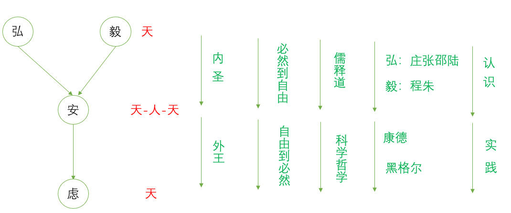

## 概述

**学-是生命的提升和进化**

技近于道，学习德语，德语是康德的语言，是黑格尔的语言，是歌德的语言【特别开心】。

**经典何为经典**

1 经久不衰的永恒价值，代表了普遍的人性

2 经过了历史的考验

3 

**论语的几点认识**

1 不是不成系统
2 不是陈旧呆板之学
3 是生命的自然流露，不可机械的度。法相本然，故当无量而说，不可肆意造作，穿凿附会。
4 性德。人自己生命中去体会。向内体验

**孔子是什么人**

父母野合【母亲为颜家之人】，不为家里所承认，父亲藏在哪儿孔丘都不知道。

吾少也贱，做什么都比较优秀。

最大的官为大司寇

1 奠定文明，万世师表
2 富贵不能淫，贫贱不能移，威武不能屈
2 教育，有教无类，不分贵贱，对比现代性。
3 孔子的伟大之处，在礼崩乐坏，价值失序的时代，提出并坚持一套仁爱的生活理想，理想价值，让生命有了价值和意义。
4 人和其他地方不同的地方。群，人群和动物之群的差别，因为人有人伦，有五伦，父子，兄弟，夫妇，君臣，朋友。。

**孔子思想**
1 克己复礼，天下归仁。
a 人最大的敌人是是人自己，人的欲望【人的生命是有限的而欲望却是无限的，这就是人最大的痛苦来源】，只有克制自己的欲望，让
b 礼崩乐坏的原因，从表面上看是名实不副造成，其根本在于人内心的私欲的遮蔽，从而忘了父子之孝，君臣之义，兄弟孝悌。
c 孔颜乐处。最大的快乐，一定是对外物

## 学

学；理想与现实，自然的人和人文的人总有差距。学是生命的成长，精神境界的提高，人格的完善，灵性的补全。

### 吾十有五而志于学

- [x] **吾十有五而志于学，三十而立，四十而不惑，五十而知天命，六十而耳顺，七十而从心所欲不逾矩 《为政》**

到七十而从心所欲不逾矩不是那么容易，需要一个很艰难的过程，需要不断努力的学。

### 好知不好学，其蔽也荡

- [x] **好仁不好学，其蔽也愚；好知不好学，其蔽也荡；好信不好学，其蔽也贼；好直不好学，其蔽也绞；好勇不好学，其蔽也乱；好刚不好学，其蔽也狂《阳货》**

归根结底，什么是仁，他始终是具体的，西方哲学是定义，有规定，儒家讲的不是定义，仁义要在具体的生活场景中要有具体的表现，抽象的谈论什么是仁什么是义，毫无意义。
小人儒将抽象的道理讲的头头是道，却不知道在自己的生命中去提现他。恨掉书袋的人。
他是实践之学，不是一种理论。讲理论讲定义孔子没有兴趣。【小人儒和乡愿般的任务】
中和，诚，君子儒和小人儒【“女为君子儒，无为小人儒。”】。【君子求诸己，小人求诸人】

君子志于道，要砥砺品行。砥砺是磨刀磨象牙，是如切如磋。因此谋道就和谋德联系在一起。

### 朝闻道，夕死可矣

- [x] **朝闻道，夕死可矣。**

【并不是不重视基本的吃食生存】
大学，不是就业的准备，而是是人格的完善和全面发展。【德国的老太太，不为学位，不为名利，为的就是对真理的追求；一个学生为上古籍所，放弃了四大的工作】。

### 颜回好学

- [x] **颜回好学，不迁怒，不贰过。**

人的本性【不想承担自己的责任】。不迁怒，不找别人的过错，而是反求诸己。不贰过，不两次犯同样的错误。只有不迁怒的人，总在找自己的问题【有足够的警惕】，才能不贰过。
  不迁怒和不贰过为什么会和学联系在一起。学首先是自我的完善，好学是真正的生命成长，不然算不得好学。
  学生命的培养和提高，是人格的完善。恰恰是在最细微的地方【时时警惕，慎独】，从最细小的地方入手，才能说是好学。

### 学而时习之

- [x] **学而时习之，不亦说乎；有朋自远方来，不亦乐乎；人不知而不愠，不亦君子乎；**

学：生命的培养和提高，是人格的完善；时：适当 习：实践，践行
有朋自远方来：1 是学的结果，吸引有朋到来 2 学的过程中，有朋是很重要的，能互相探讨，互相辩论，互相提高。 

### 好之者不如乐之者

- [x] **知之者不如好之者，好之者不如乐之者。**

学的三重境界，知之【普通的学习】，好之【喜欢，但是是抱有目的】，乐之【快乐，不因为其他，就是内在的快乐】

吕思勉，钱穆，熊十力，马一浮。真正有学问的人总在边缘，而胡适和他的学生【君子求诸己，小人求 】

名的问题，由人不知而不愠引出名的问题。要学给自己，而不是学给他人。【君子求诸己，小人求诸人】
学贵己德，不贵媚俗。

### 困而学之，又其次也

**孔子曰：“生而知之者，上也；学而知之者，次也；困而学之，又其次也；困而不学，民斯为下矣。”**

困，谓有所不通。言人之气质不同，大约有此四等。杨氏曰：“生知学知以至困学，虽其质不同，然及其知之一也。故君子惟学之为贵。困而不学，然后为下。” 

## 君子

学的目标是要成君子
君子是一种精神境界，并不仅仅只是一种道德层面的东西。小人也不指的是道德低下的人，而是不学不修养的人。

### 仁者不忧

- [x] **君子的精神境界的表现：仁者不忧，智者不惑，勇者不惧。**

不忧：君子乐天知命
命：
1 自然上的：生死，疾病。
1 能力上的不同
2 机遇，生存的偶然性不一样【想开一点，尽人事，听天命】
3 使命不同。德是通过社会角色来判断。父亲的使命，儿子的使命。君子坐在这把椅子上，该干什么要清清楚楚。朱文公。

不惑：有自己的见解，不会人云亦云。别人说好的，我也说好的。别人说差的，我也说差的。

不惧：在仁和智的基础上，坚定是什么是对的，什么是使命后，在知命的前提下，还能不惧坚定的去做。【在认识到人生的无意义感后，依然能热爱生活】

### 志于道

- [x] **成君子的途径：志于道，据于德，依于仁，游于艺。**

志于道，道：最早的时候是路的意思，后期引申为事理的总源。志于道：立志求道，要立志

**据于德**：德者得也，从心里得，人行之总名，把道化为内心的德所得。
说文解字：内得与己，外德与人，不管从自己的心和外人所得，都要进你心里。
德不离于道。 据是支撑，用拐杖撑在哪里。

**依于仁**，仁，亲也，从二，从人。仁者人也【复数的人】。人偶，配偶，也是指两个人。仁，人相亲相爱。独者无偶，偶者相亲。故其字，从人，从二。

**游于艺**， 六艺【】，沉浸其中，心无所系，天人合一，忘了所有【不考虑之外的所有东西】。游刃有余，逍遥游，庖丁解牛。
礼乐，射箭【是比德，不是比自然能力，而是比大家都有的都能够做到的】，御，书

### 兴于诗

- [x] **君子：兴于诗，立于礼，成于乐。**

兴于诗：兴，启发的意思。只要于诗中有所启发，便是好的，即使是断章。只要有新的感悟，新的理解便是好的。

兴：铺垫，起兴，人不是完全理性的动物，要有铺垫要有起兴，要有诗歌，人更是在兴中，在感性中。

诗的意境：与具体的场景，实践相联系。

风雨如晦，鸡鸣不已。
既见君子，云胡不喜。

### 大道不器

- [x] **君子不器** ；**大德不官，大道不器，大约不信，大时不齐，察于此四者，可以有志于学矣**

器，只能是一种功用，而不能变通为其他的作用。首先是一个人，不能只是一个材，只是器。不能只专一业。一些通识是必要的，是人，就应该知道这个世界的一些美好的东西。哲学，文学都需要很好的精神修养，你没有，则柏拉图的对话录不属于你，但丁不属于你。不做固陋的专家。【物物而不物与物】于物而不予与物。
器，按部就班能达到的。道，需要融会贯通，有自己的体会和见解。

大德不官，真正的大德不专于一门。
大道不器，器，只能是一种功用，而不能变通为其他的作用
大约不信，真正有信仰的，不发誓赌咒。
大时不齐，通晓时变的，不教条。夫子最痛恨教条。
王阳明、曾国藩这样的人都是大德不官，大时不齐的人。如果不是风雨寄会，可能大家都只会认为是一个普通人。
曾国藩和李鸿章，李鸿章痞子腔，就是实践理性和工具理性的局别。

### 信以成之

- [x] **君子义以为质,礼以行之,孙以出之,信以成之。**

 **君子喻于义，小人喻于利**。

喻：晓喻的意思，跟他讲。

**君子求诸己，小人求诸人。**

原因从自己身上找，而不是别人。

**敏于事而慎于言**

 多做事，对说出来的话一定要慎，不能做到的就不说，只有确定能做到才说。

**有德者，必有言，有言者，不必有德 。仁者，必有勇 ，勇者，不必有仁；**

但也并不是完全否定言。

### 如切如磋，如琢如磨

**子贡曰：“贫而无谄，富而无骄，何如？”子曰：“可也。未若贫而乐，富而好礼者也。”**

乐，音洛。好，去声。谄，卑屈也。骄，矜肆也。常人溺于贫富之中，而不知所以自守，故必有二者之病。无谄无骄，则知自守矣，而未能超乎贫富之外也。凡曰可者，仅可而有所未尽之辞也。乐则心广体胖而忘其贫，好礼则安处善，乐循理，亦不自知其富矣。子贡货殖，盖先贫后富，而尝用力于自守者，故以此为问。而夫子答之如此，盖许其所已能，而勉其所未至也。    　　

**子贡曰：“诗云：‘如切如磋，如琢如磨。’其斯之谓与？”**

磋，七多反。与，平声。诗卫风淇澳之篇，言治骨角者，既切之而复磋之；治玉石者，既琢之而复磨之；**治之已精，而益求其精也**。子贡自以无谄无骄为至矣，闻夫子之言，又知义理之无穷，虽有得焉，而未可遽自足也，故引是诗以明之。    　　

**子曰：“赐也，始可与言诗已矣！告诸往而知来者。”**

往者，其所已言者。来者，其所未言者。愚按：此章问答，其浅深高下，固不待辨说而明矣。然不切则磋无所施，不琢则磨无所措。故学者虽不可安于小成，而不求造道之极致；亦不可骛于虚远，而不察切己之实病也。   

修德的过程

德不修，比喻为玉不琢不成器。切磋和琢磨来讲德性的改变。

讲给别人听【教】，同时加深自己的理解。古人讲，只有做到了以后，才能算真正懂的。【知行的问题】
讲学对儒家来说，是很重要的。
人往往知道是对的，但往往不去做，。人不仅仅是理性当家，还有感性，欲望等，驾驭大象。

### 孔子闻过则喜

对错误的态度
小人犯错了，总想想办法掩饰。甚至把错误说成正确的。孔子闻过则喜，知过必改。闻过则喜，需要很高的境界。君子之过，如日月之食。
知耻近乎勇。认过改过。

反求诸己，【德】，要自行之。
君子深造之以道，欲其自得之也。

### 君子和而不同

**君子周而不比，小人比而不周。**
周：钟信为周，比：没有原则的抱成团

**君子矜而不争，群而不党。**
结党营私，古人认为结党必定营私，因为党就是为了私利而党。

**武人不乱，智人不诈，仁人不党。**

**君子和而不同，小人同而不和。**

**夫和实生物，同则不继。**

### 脩己以敬

**子路问君子。子曰：“脩己以敬。”曰：“如斯而已乎？”曰：“脩己以安人。”曰：“如斯而已乎？”曰：“脩己以安百姓。脩己以安百姓，尧舜其犹病诸！”**

君子的落脚点：不是独善其身，敬，除了内圣还有外王。
修己以敬人，修己是手段，敬人是目的。

**仲弓问仁。子曰：“出门如见大宾，使民如承大祭。己所不欲，勿施于人。在邦无怨，在家无怨。”仲弓曰：“雍虽不敏，请事斯语矣。”**

敬，把自己放的很低。

**子曰:“立爱自亲始,教民睦也。立敬自长始,教民顺也。教以慈睦,而民贵有亲;教以敬长,而民贵用命。孝以事亲,顺以听命,错诸天下,无所不行。”(《礼记·祭义》**

> 用之则行，舍之则藏，用舍无与于己，行藏安于所遇，命不足道也。故“孝以事亲,顺以听命,错诸天下,无所不行”，**敬**和**命**和**安**的关系。由“爱”和“敬”可以推出“安”。
>
> 命是必然的领域。
>
> 安是必然领域和自由领域的结合。一方面安是必然之“安”，必然之“安”是对自然世界必然的了解，所以要安于自然世界的法则和规律，要“畏天命，畏大人，畏圣人之言”，对自然世界的法则和规律要怀有足够的敬畏，但同时我们不仅仅是自然的存在，还是理性的自由的存在。必然之“安”，同时也是自由之“安”，当人能安于自然，敬于自然，顺于自然，能做到“用之则行，舍之则藏，用舍无与于己，行藏安于所遇，命不足道也”的时候，就达到了自由的领域，那是完全“为仁由己，而由人乎哉”的自主，是发自的内心的自足，那是最大的自由，是对必然的超越，是必然和自由的结合。所以安一方面是对自然之安的顺从，但更重要的是对自然之安的超越，所以是安是自然的领域，是命，是天，但也是自由的领域，是人，是能动性。所以安是天人合一的。
>
> 天 必然的领域  人 自由的领域 天人合一就是必然和自由结合，安是必然，安也是自由，安是天，安也是人，所以安是天人合一。

朱熹涵养需用敬

>敬不仅是一种态度，还是一种修养功夫，贯彻动静知行始终。
>
>人的理性总是有限的，对自然的认识也有限，对不能认识的部分，我们要保持谦卑，保持敬畏，所以有“君子有三畏，畏天命，畏大人，畏圣人之言”，天命即自然的规律即理，其广且博，大人和圣人之言，道理深且远，我们的智慧远远够不着，所以需要我们保持敬畏。朱熹将这种敬推广到未发之性，已发之情，贯彻到动静知性始终。在行在实践的时候，保持谨慎敬畏是可以理解。关键是在未发阶段，思虑未蒙的阶段怎么涵养敬呢。曾子说“士不可以弘毅“，弘而不毅，则无规矩而难立，不仅要弘而且要毅，要有原则，要保持对“天理”的敬畏。陆九渊说“ 涓流滴到沧溟水，拳石崇成泰华岑”，不仅要广而且要坚，不仅要博大而且要坚毅，向庄周邵庸张载学其博大，向程朱学其坚毅。
>
>> 邵庸广大【观物】，程颐坚毅【涵养需用敬】，所以邵庸给程颐说眼前路需放宽。
>
>如何涵养用敬，将天地的理内化为自己的理，并巩固这个理，这就是德，就是得。这个需要慎，不能僵化，不能教条。将道和理内化的过程，就是得的过程，得即德也。所以敬后面可以引出德。所以明清以后，说儒教以理杀人的缘由。后儒大部分都达不到先儒的境界，都只能固守伦理纲常【可以说毅而不宏】，而不能随乾道变化得其正，不能无过不及得其中。所以无敬或少敬则小人而无忌惮，敬过则道德伦理成为教条，教条纲常以理杀人。
>
>> 同样弘而不毅，则无规矩而难立，无道德无原则。无视自然之理，不敬天命，认识不到必然性，妄自尊大，肆无忌惮，自然走不远。“”弘，宽广也。毅，强忍也。非弘不能胜其重，非毅无以致其远。“ 程子曰：“弘而不毅，则无规矩而难立；毅而不弘，则隘陋而无以居之。”又曰“弘大刚毅，然后能胜重任而远到。” 
>
>> 不仅儒学是这样，马克思主义也是这样，保持敬畏是需要的，但不能成为教条。左倾教条主义就是这样。理是需要，但不能教条。道德是需要，但不能教条。
>
>敬--顺--安--乐，敬是为了顺，顺是为了安，安是为了乐。
>
>士不可以宏**毅**，
>
>随心所欲**不逾矩**，
>
>立爱自亲始,教民睦也。**立敬自长始,教民顺也**
>
>儒家的这种态度，还有的前进，人就是做为自然的一部分，人就是必然的一部分，我们要知道我们也是能改变自然的，所以大学说“知止而后能定，定而后能静，静而后能安，安而后能虑，虑而后能得”。安之后能虑，是知道了自然的必然性之后，并能安能乐之后，又充分的认识到我们作为人的能动性，作为人的自由，我们本来就是自然的一部分，我们的运动变化即是自然本身的运动变化，我们即是自然。所以孔夫子周游列国作春秋，孟夫子“正人心，息邪说，距诐行，放淫辞”，所以郑康成“述先圣之元意，思整百家之不齐”，所以韩子续道统，所以张横渠“为天地立心，为生民立命，为往圣继绝学，为万世开太平”，所以朱子“继往圣将微之绪，启前贤未发之机，辨诸儒之得失，辟异端之论谬，明天理，正人心”，所以王夫之“六经责我开生面，七尺从天乞活埋”。所以诸先圣皆内圣而外王。
>
>

敬天知命，敬天法祖

五十而知天命，六十而耳顺

乐天知命

长辈常常挂在耳边的一句话就是“都是命”

**吾十有五而志于学，三十而立，四十而不惑，五十而知天命，六十而耳顺，七十而从心所欲不逾矩 《为政》**

**子曰：“吾十有五而志于学，**

古者十五而入大学。心之所之谓之志。此所谓学，即大学之道也。志乎此，则念念在此而为之不厌矣。    　　

**三十而立，**

有以自立，则守之固而无所事志矣。    　　

**四十而不惑，**

于事物之所当然，皆无所疑，则知之明而无所事守矣。    　　

**五十而知天命，**

天命，即天道之流行而赋于物者，乃事物所以当然之故也。知此则知极其精，而不惑又不足言矣。   　　

**六十而耳顺，**

声入心通，无所违逆，知之之至，不思而得也。   　　

**七十而从心所欲，不逾矩。”**

从，如字。从，随也。矩，法度之器，所以为方者也。随其心之所欲，而自不过于法度，安而行之，不勉而中也。程子曰：“孔子生而知之也，言亦由学而至，所以勉进后人也。立，能自立于斯道也。不惑，则无所疑矣。知天命，穷理尽性也。耳顺，所闻皆通也。从心所欲，不逾矩，则不勉而中矣。”又曰：“孔子自言其进德之序如此者，圣人未必然，但为学者立法，使之盈科而后进，成章而后达耳。”胡氏曰：“圣人之教亦多术，然其要使人不失其本心而已。欲得此心者，惟志乎圣人所示之学，循其序而进焉。至于一疵不存、万理明尽之后，则其日用之间，本心莹然，随所意欲，莫非至理。盖心即体，欲即用，体即道，用即义，声为律而身为度矣。”又曰：“圣人言此，一以示学者当优游●泳，不可躐等而进；二以示学者当日就月将，不可半途而废也。”愚谓圣人生知安行，固无积累之渐，然其心未尝自谓已至此也。是其日用之间，必有独觉其进而人不及知者。故因其近似以自名，欲学者以是为则而自勉，非心实自圣而姑为是退托也。后凡言谦辞之属，意皆放此。   

**孔子曰：“君子有三畏：畏天命，畏大人，畏圣人之言。**

畏者，严惮之意也。天命者，天所赋之正理也。知其可畏，则其戒谨恐惧，自有不能已者。而付畀之重，可以不失矣。大人圣言，皆天命所当畏。知畏天命，则不得不畏之矣。 

**小人不知天命而不畏也，狎大人，侮圣人之言。”**

侮，戏玩也。不知天命，故不识义理，而无所忌惮如此。尹氏曰：“三畏者，修己之诚当然也。小人不务修身诚己，则何畏之有？” 

> 人的理性总是有限的，对自然的认识也有限，对不能认识的部分，我们要保持谦卑，保持敬畏，所以有“君子有三畏，畏天命，畏大人，畏圣人之言”，天命即自然的规律即理，其广且博，大人和圣人之言，道理深且远，我们的智慧远远够不着，所以需要我们保持敬畏。
>
> 天命：自然界的规律
>
> 圣人之言：古圣先贤之道，古圣先贤之文

### 道不远人

**道不远人，人之为道而远人，不可以为道。**

反对以知识论来理解孔子，而是要从实践上去理解体会。

在社会关怀之上来讲仁和礼.

为人处世和精神境界的混用，夫子的知天命，要人安时而处顺，哀乐不能入也。

## 礼

- [x] **周监于二代,郁郁乎文哉，吾从周。**

郁郁：形容词，细密，繁盛。

- [ ] **子曰：“夏道尊命①，事鬼敬神而远之，近人而忠焉，先禄而后威，先赏而后罚，亲而不尊；其民之敝：惷而愚，乔②而野，朴而不文。殷人尊神，率民以事神，先鬼而后礼，先罚而后赏，尊而不亲；其民之敝：荡而不静，胜而无耻。周人尊礼尚施，事鬼敬神而远之，近人而忠焉，其赏罚用爵列，亲而不尊；其民之敝：利而巧，文而不惭，贼而蔽。《礼记.表记》**

夏朝相信但不亲近 亲而不尊 赏先于罚
商 尊而不亲，罚先于赏，以鬼神立威，恐吓人民。胜而无耻，通过不择手段胜出，但无耻。
讲教化。

- [ ] **孔子曰：“六艺于治一也。《礼》以节人，《乐》以发和，《书》以道事，《诗》以达意，《易》以神化，《春秋》以义。”太史公曰：“天道恢恢，岂不大哉！谈言微中，亦可以解纷。**

周公制礼作乐，用礼乐来节规制约束人们，不是杀伐不是强制的刑。

各宅其宅，各田其田-周公

周礼的问题：尊礼尚施，敬鬼神而远之，老百姓没有怕的了，导致亲而不尊，文而不惭。
孔子并不是要机械的恢复周礼，而是要创发阐释。

孔子的学说，都是入手处，寻常的不能再寻常了。

## 仁

**依于仁**，仁，亲也，从二，从人。仁者人也【复数的人】。人偶，配偶，也是指两个人。仁，人相亲相爱。独者无偶，偶者相亲。故其字，从人，从二。

### 仁者爱人

- [x] **上对下的爱**

爱，中国古代一般不轻易用爱，都有其他的词，对神，国，帝，君都不用爱，忠君，爱国在古代没有的。
爱 上对下，主动，君爱臣。
心部曰：㤅，惠也.
爱，惠，仁，亲，互训。并不是近义词。强对弱的爱。
仁道只责君子，不责小人。

- [x] **实惠**

惠，是实惠，爱人应该给别人带来实惠，而不是空洞的抽象的。

- [x] **立爱自亲始**
- [ ] 子曰:“立爱自亲始,教民睦也。立敬自长始,教民顺也。教以慈睦,而民贵有亲;教以敬长,而民贵用命。孝以事亲,顺以听命,错诸天下,无所不行。”(《礼记·祭义》

爱有差等,立爱自亲始，推己及人，由亲及疏。从亲开始，到泛爱众。

立爱自亲始，爱的阶梯。这是道德的起点。
按照理性来说，我们都要做道德的人。但是我们生活在社会中，其实大部分时候不是靠理性行动，而是靠感性靠情感，儒家就是充分的考虑了这一点，从身边的人做起，更容易实施和推广，也更容易理解。

儒家不讲大道理，也不讲信仰，而是讲能不能从我们人的自然天性出发，然后等到你修为高了，能脱出自然的本性，能做到更好。从自亲始到泛爱众，是一条从本性开始的学的过程。道德有一个入手处，不仅仅是理性，是我们自然本性中的根据。从这个开始，推己及人，到最后泛爱众，既博爱。西方的道德哲学最后成为了一套形式，没有多少人行康德和黑格尔的道。

儒家的理不是空悬着，而是有情在撑着的。所以中国讲情理，情和理都有，才会易于被人接受。康德和黑格尔的理是很厉害了，但是情基本未见体现。中国的情还很严重，比如说人情社会，而忘了理和原则。一方面更容易实施，另一方面当情大于理的时候，就会使原则道理得不到实施。【周敦颐的文以载道说，典型的表现了儒家的文道论，而这一思想如果被片面的加以发展，就会出现以价值原则压抑、贬损文艺创作的弊端】 【中国的道德基于情理之上，一方面更符合人性，更容易实施和发展，但是如果这一思想被片面的加以发展，就会只讲人情而少讲理的人情社会。社会底层的人，天天听到的都是有没有关系，有没有熟人】

- [x] **爱有原则**
- [ ] 子贡问曰：“乡人皆好之，何如？”子曰：“未可也。"“乡人皆恶之，何如？”子曰：“未可也。不如乡人之善者好之，其不善者恶之。”
- [ ] 仁者安仁，智者利仁。
- [ ] 仁者乐山，智者乐水。

水的好处，直路走不通，绕着走，随物婉转，很灵活。山，水流山根本不动，稳重如山。郭靖似的人物。
仁者，物我一体。智者，物我两体。
爱有原则，不是无原则的爱。唯仁者能爱人。强调爱不是一件简单的事情
爱有原则，有本，不轻易动摇。但是不是死板的爱，这又是爱的中庸之道。

- [x] **忠恕之道**

  

  恕 如心，就是将心比心，站在别人的角度想一想，共情。

- [x] **君子成人之美，而不成人以恶。**

爱人以德，不是随便的无原则的爱。

善性，以礼防失。

- [x] **博学以文，约之以礼**

博学以文，在历史中获取经验。
约【节】之以礼，怎么做，节，对我们做很多事情有约束。

- [x] **颜渊问仁。子曰：“克己复礼为仁。一日克己复礼，天下归仁焉。为仁由己，而由人乎哉？”**

- [x] **颜渊曰：“请问其目。”子曰：“非礼勿视，非礼勿听，非礼勿言，非礼勿动。”颜渊曰：“回虽不敏，请事斯语矣。”**

- [x] **恭宽信惠敏**

- [ ] 子张问仁于孔子。孔子曰：“能行五者于天下，为仁矣。”请问之。曰：“恭、宽、信、敏、惠。恭则不侮，宽则得众，信则人任焉，敏则有功，惠则足以使人。”

君子五德。问五件事，恭宽信惠敏。恭敬，宽容，信用，做事周全，给人实惠，这五件事都是人之间的关系和德性。主体间性

### 内圣外王

#### 微管仲，吾其被发左衽矣

**从大节看**

**子路曰：“桓公杀公子纠，召忽死之，管仲不死。”曰：“未仁乎？”**

纠，居黝反。召，音邵。按春秋传，齐襄公无道，鲍叔牙奉公子小白奔莒。及无知弑襄公，管夷吾召忽奉公子纠奔鲁。鲁人纳之，未克，而小白入，是为桓公。使鲁杀子纠而请管召，召忽死之，管仲请囚。鲍叔牙言于桓公以为相。子路疑管仲忘君事雠，忍心害理，不得为仁也。    　　

**子曰：“桓公九合诸侯，不以兵车，管仲之力也。如其仁！如其仁！”**

九，春秋传作“纠”，督也，古字通用。不以兵车，言不假威力也。如其仁，言谁如其仁者，又再言以深许之。盖管仲虽未得为仁人，而其利泽及人，则有仁之功矣。    　　  　　

**子贡曰：“管仲非仁者与？桓公杀公子纠，不能死，又相之。”**

与，平声。相，去声。○子贡意不死犹可，相之则已甚矣    　　

**子曰：“管仲相桓公，霸诸侯，一匡天下，民到于今受其赐。微管仲，吾其被发左衽矣。**

被，皮寄反。衽，而审反。霸，与伯同，长也。匡，正也。尊周室，攘夷狄，皆所以正天下也。微，无也。衽，衣衿也。被发左衽，夷狄之俗也。    　　

**岂若匹夫匹妇之为谅也，自经于沟渎而莫之知也。”**

谅，小信也。经，缢也。莫之知，人不知也。后汉书引此文，莫字上有人字。程子曰：“桓公，兄也。子纠，弟也。仲私于所事，辅之以争国，非义也。桓公杀之虽过，而纠之死实当。仲始与之同谋，遂与之同死，可也；知辅之争为不义，将自免以图后功亦可也。故圣人不责其死而称其功。若使桓弟而纠兄，管仲所辅者正，桓夺其国而杀之，则管仲之与桓，不可同世之雠也。若计其后功而与其事桓，圣人之言，无乃害义之甚，启万世反覆不忠之乱乎？如唐之王珪魏征，不死建成之难，而从太宗，可谓害于义矣。后虽有功，何足赎哉？”愚谓管仲有功而无罪，故圣人独称其功；王魏先有罪而后有功，则不以相掩可也。   

#### 忠矣清矣

**子张问曰：“令尹子文三仕为令尹，无喜色；三已之，无愠色。旧令尹之政，必以告新令尹。何如？”子曰：“忠矣。”曰：“仁矣乎？”曰：“未知，焉得仁？”**

**“崔子弑齐君，陈文子有马十乘，弃而违之。至于他邦，则曰：‘犹吾大夫崔子也。’违之。之一邦，则又曰：‘犹吾大夫崔子也。’违之。何如？”子曰：“清矣。”曰：“仁矣乎？”曰：“未知。焉得仁？”**

通过管仲和子文与陈文子的对比，看人从大处看从大节看。仁不是个人私德的人。夫子权衡于大小之间，以天下为兴。内圣外王。

> **旭：**在分内去看责任和义务，当他是一个君主的时候，安邦定国就是他的主要责任和义务，私德次之。当他是一个百姓的时候，百姓的身份就是他的责任和义务，私德也更加看重。

**君臣**

#### 故君为社稷死，则死之

**君死，安归？**
**君民者，岂以陵民？社稷是主。**
**臣君者，岂为其口实？社稷是养。**
**故君为社稷死，则死之；为社稷亡，则亡之。**
**若为己死，而为己亡，非其私昵，谁敢任之？**
**且人有君而弑之，吾焉得死之？而焉得亡之？将庸何归？”**

“君主死了回哪呢？君主是民众的君主，难道是凌驾于民众之上的君主？君主的职责要主掌国家。君主的臣子，岂是为了俸禄？臣子的职责要保护国家。因此君主为国家社稷死就该随他死，为国家社稷逃亡就该随他逃亡。如果是为他自己死为他自己逃亡，不是他的私密昵友，谁去担这份责啊？况且他人立了君主却要将他杀死，我怎么能随他去死，随他去逃亡呢？
我将回什么地方啊？”

先秦儒家，不讲死忠。君臣关系。君臣相处是有原则的。

人民是目的，统治者是手段。但是有的时候，这个手段很重要，他还要维护这个手段。

#### 危邦不入，乱邦不居

**子曰：“笃信好学，守死善道，危邦不入，乱邦不居。天下有道则见，无道则隐。邦有道，贫且贱焉，耻也；邦无道，富且贵焉，耻也。”**

#### 君君臣臣

**君君臣臣，父父子子**

君要有君的样子，臣要有臣的样子。君臣关系，父子关系是相互，是双向的，既有责任也有义务。

**君不君，则臣不臣。父不父，则子不子。上失其位，则下踰其节。上下不和，令乃不行。衣冠不正，则宾者不肃；进退无仪，则政令不行。且怀且威，则君道备矣。莫乐之，则莫哀之。莫生之，则莫死之。往者不至，来者不极。**

儒家对君主的批判性，儒家并不是君主的统治工具
如果和统治者同流合污，那就吃香喝辣的。而朱熹，王阳明，曾国藩其实都是战战兢兢的。
历代儒者都是监督和批判统治者。为什么对君有这么强的监督和批判。为什么要有君，为什么后面演化为绝对君主了。

#### 归而往之，是为王矣

**故不仁爱则不能群，不能群则不胜物，不胜物则养不足。群而不足，争心将作，上圣卓然先行敬让博爱之德者，众心说而从之。从之成群，是为君矣；归而往之，是为王矣。 《汉书》班固** 

君是有德之人，是能群能团结众人之人。

#### 君使臣以礼，臣事君以忠

**定公问：“君使臣，臣事君，如之何？”孔子对曰：“君使臣以礼，臣事君以忠。”。**

不仅仅是情感关系。君使唤他，也要有礼，有制度有规范。

## 礼

首先礼不是上对下的束缚。是一种规范，是一种制度，更是一种教化的手段。目的是使个人有德性，使社会有秩序，使社会文明。 礼不是上层阶级压迫下层阶级的工具，不是将人划分为三六九等，或者说不仅仅是，以三六九等是不能完全的理解中国的礼的。

文明社会的人的等级的分法，一个是社会地位，血统，德性，财产。

礼，首先是约束君主，约束在上者的。

**天子: 子曰：“爱亲者，不敢恶于人；敬亲者，不敢慢于人。爱敬尽于事亲，而德教加于百姓，刑于四海。盖天子之孝也。《甫刑》云：‘一人有庆，兆民赖之。’”**

**诸侯: 在上不骄，高而不危；制节谨度，满而不溢。高而不危，所以长守贵也。满而不溢，所以长守富也。富贵不离其身，然后能保其社稷，而和其民人。盖诸侯之孝也。《诗》云：“战战兢兢，如临深渊，如履薄冰。”** 

周公吐哺天下归心的典故

###  **礼法**

- [ ] 道之以政，齐之以刑，民免而无耻。道之以德，齐之以礼，有耻且格。

礼与法【刑】，文治与武功。

社会好坏与否主要看教化。

### 礼节

**礼节情，节欲**

**人函天地阴阳之气，有喜怒哀乐之情。天禀其性而不能节也，圣人能为之节而不能绝也，故象天地而制礼乐，所以通神明，立人伦，正情性，节万事者也。**

**故礼之于人也，犹酒之有蘖也，君子以厚，小人以薄。故圣王修义之柄、礼之序，以治人情。故人情者，圣王之田也。修礼以耕之，陈义以种之，讲学以耨之，本仁以聚之，播乐以安之。故礼也者，义之实也。协诸义而协，则礼虽先王未之有，可以义起也。义者艺之分、仁之节也，协于艺，讲于仁，得之者强。仁者，义之本也，顺之体也，得之者尊   礼记-礼运。** 

所以，礼对于人来说，好比是酿酒要用的曲，君子德厚，酿成的酒也便醇厚，小人德薄，酿成的酒也便寡味。所以圣王牢持礼、义这两件工具，用来治理人情。打比方来讲，人情好比田地，圣王好比田主，圣王用礼来耕耘，用陈说义理当作下种，用讲解教导当作除草，用施行仁爱当作收获，用备乐置酒当作农夫的搞劳。可以这样说，礼是义的制度化。有些礼的条文，拿义的标准去衡量无一不合，但先王并无明文规定，这也不妨因时制宜而自我作古。

一方面在规训你的自然人性【修礼以耕之，陈义以种之，讲学以耨之，本仁以聚之】，另一方面也在开发你的人性【播乐以安之】，使你成长丰富。

**礼的制定是以情感的需要为基础-抒发和节制**

礼和法。礼的制定是以情感的需要为基础的，是符合人的情感的。比如丧礼，为什么要制定丧礼来安葬亲人。是因为一个前提，失去了亲人，我们会痛苦。如果一直称斤在悲伤中，所以要有恰当的表达形式。既能表达我们的哀痛之情，又能让我们的情感有所节制。这就需要指定一套礼仪。再比如我们人与人相处，应该互相尊重，和谐共处，人有不同的身份的差异，那么在不同的场合有不同的需要，儒家所以讲在不同的场合遵守恰当的礼节，按照自己的本分。这样可以让我们的人际关系更加和谐。所以礼看起来好像是一些规则，但实际上是从我们内心的情感出发而指定。先有仁爱之心才有礼，不然就会是虚假的。所以孔子讲人而不仁，如礼何。人而不仁，如乐何。
【礼必以忠信以为质，犹如绘事必以粉素为先】子夏不是停留在解释翻译句子，而是能举一反三，加以运用。有自己的体会。

### **礼敬**

中正无邪，礼之质也;庄敬恭顺，礼之制也。

- [ ] 仲弓问仁。子曰：“出门如见大宾，使民如承大祭。己所不欲，勿施于人。在邦无怨，在家无怨。”仲弓曰：“雍虽不敏，请事斯语矣。”

- [ ] 富贵而知好礼，则不骄不淫；贫贱而知好礼，则志不慑。

  

礼敬。宇宙中一定有一些东西值得敬畏。近代的自然法和以前自然法的区别，把哪个圣神的东西否定了。比如现在的丧礼文化，是火葬还是土葬，火葬给人的感觉就是把人作为一个工业品，可以批量的处理。而土葬，更多的看到的是礼和敬

### **礼和**

**礼之用，和为贵。先王之道，斯为美。小大由之，有所不行；知和而和，不以礼节之，亦不可行也。**

礼在运用时，能用和才是可贵的。先王的大道，这是最美的地方。小事大事都遵循礼，但是也有行不通的；只知道为了和而和，不用礼来节制的话，也是行不通的。
钱穆曰：本章大义，言和必和顺于人心，当使人由之而皆安，既非情所不堪，亦非力所难勉，斯为可贵。若强立一礼，终不能和，又何得行？故礼非严束以强人，必于礼得和。此最孔门言礼之精义，学者不可不深求。

援人情，礼顺人情。

- [ ] 刑不上大夫，礼不下庶人。

礼是防范在上者。戒免大夫，要控制自己的行为，不要受刑罚。礼对上层是限制和约束，对下层是拔高。

中国的礼为什么如此繁复如此复杂，因为他针对不同的人群。不同的人群适用的礼不同，效果也不同。

### **礼仁**

**人而不仁，如礼何；人而不仁，如乐何；**

礼和仁，和而不同，仁引入礼解释礼。礼体现出义理。道德仁义是个观念，观念需要一个平台是实行。否则只是一个观念。通过礼，仁义就外在化和客观化了。通过仁来解释阐发礼，贵族的这个身份就变成了道德责任，因为你这个身份，所以你要实行什么样的道德，一个身份，成了你道德的约束和规定。

礼再好也没用，需要仁德忍心。人而不仁，如礼何，人而不仁，如乐和。如果没有仁德，礼就成了繁文缛节。

**礼云礼云，玉帛云乎哉。乐云乐云，钟鼓云乎哉。**

**子夏问曰：“‘巧笑倩兮，美目盼兮，素以为绚兮。’何谓也？”**
**子曰：“绘事后素。”**
**曰：“礼后乎？”子曰：“起予者商也！始可与言诗已矣。”**

朱熹：礼必以忠信为质，犹绘事必以粉素为先、

钱穆：子夏因此悟人有忠信之质，必有礼以成之。所谓忠信之人可以学礼，礼乃后起而加之以文饰，然必加于忠信之美质，犹以素色间于五采而益增五采之鲜明。

**大哉问！礼，与其奢也，宁俭；丧，与其易也，宁戚。”**

丧礼为什么厚。报本反始。

西方也有礼，即基督教文化，西方的骑士精神。

### **礼让**

**让，礼之主也。世之治也，君子尚能而让其下，小人农力以事其上，是以上下有礼，而谗慝（tè）黜（chù）远，由不争也，谓之“懿德”。**

**《春秋 · 左传 · 昭公二年》:"忠信，礼之器也；卑让，礼之宗也。"**

文革期间。古代的仆人，当做自己人。现在的上下级，没有感情。现在只有资本关系，没有其他的关系。

**让和义**

《晏子春秋·内篇杂下》 “廉者，政之本也，让者，德之主也。廉之谓公正，让之谓保德，**凡有血气者，皆有争心，怨利生孽，维义可以为长存**。且分争者不胜其祸，辞让者不失其福”

**让和竞争**

资本主义讲竞争。在一定范围之内，讲竞争可能是对的。

礼是引导人向善的方向，并不是单纯的禁锢人。

> 让德，古代禅让和通三统都是让的体现。中国的政治从来都不是你死我活

让不仅仅是私德，还应站在国家和人类进行审视。泰伯和周文王的典故

孔子维护天子的权威。

## 正名

### 名不正，则言不顺

- [ ] 名不正，则言不顺; 言不顺，则事不成;事不成，则礼乐不兴;礼乐不兴，则刑罚不中;刑罚不中，则民无所措于足。

循名责实，通过名去规定这个名该尽的义务。

君位要有合法性，不在于你已经占了这个职位，而在于名副其实，君要符合君这个名分的规范意义，要符合君的礼而行。

## 德政

### 为政以德

**为政以德，譬如北辰，居其所而众星共之。**

### 政者正也

**季康子问政于孔子，孔子对曰：“政者，正也。子帅以正，孰敢不正？”。**

政者正也，正其不正。

儒家讲的德政，教化是一个核心要素。毛泽东是伟大的教员。

注重为政者的模范带头作用。在上位的为政者能够做到正己，就可以不令而行，上行下效，使天下人都归于正道。这种为政以德、讲究修身的思想成为封建社会中人治的基础，产生了深远的影响。

**古之欲明明德于天下者，先治其国。欲先治其国者，必先齐其家。**

**大学之道，在明明德，在亲民，在止于至善**

### 公者，天下平

- [ ] 公者，天下平。昔先圣王之治天下也，必先公。**公则天下平矣**。平得於公。尝试观於上志，有得天下者众矣，其得之以公，其失之必以偏。凡主之立也，生於公。故《鸿范》曰：“无偏无党，王道荡荡。无偏无颇，遵王之义。无或作好，遵王之道。无或作恶，遵王之路。”　——秦·吕不韦《吕氏春秋》

### 阴阳之和，不长一类;

- [ ] **天下非一人之天下，天下之天下也。阴阳之和，不长一类;甘露时雨，不私一物;万民之王，不阿【偏袒】一人**。

因为大，所以公，所以能平，能齐。

