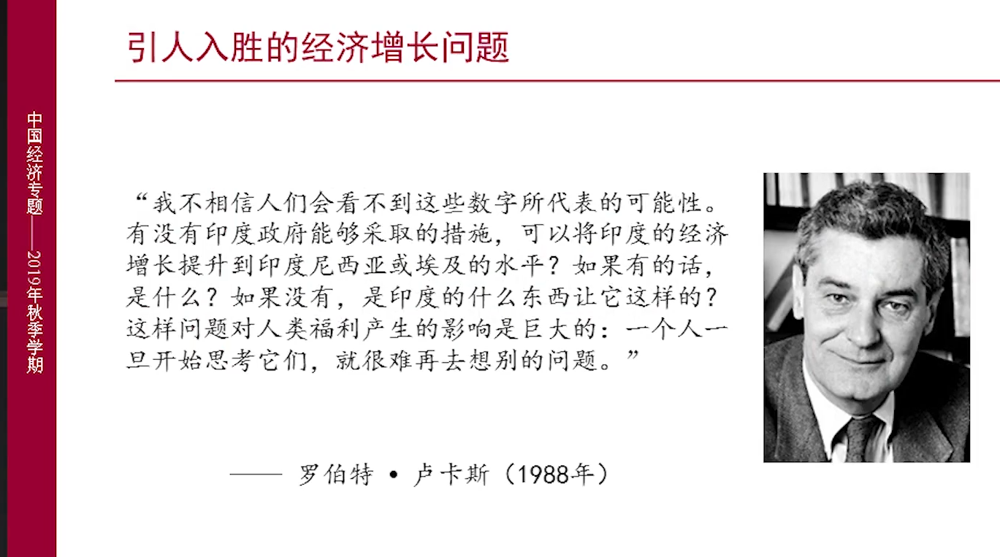
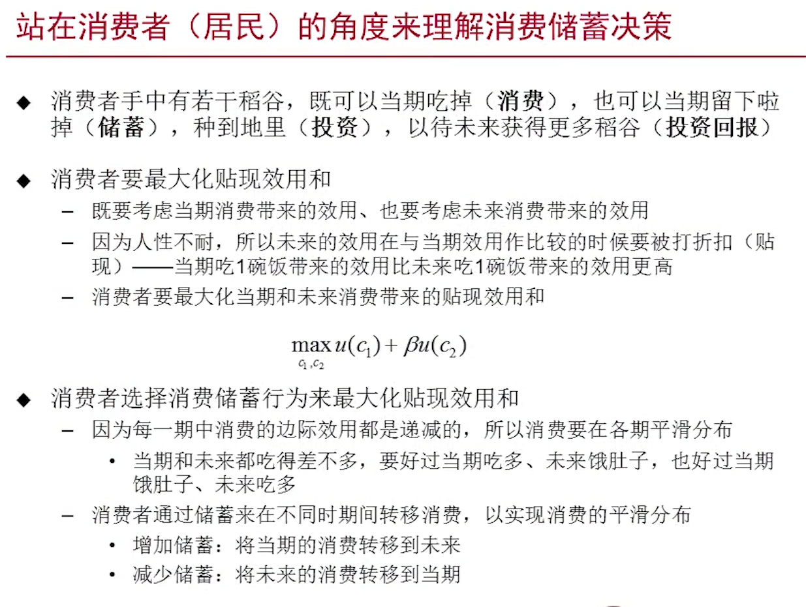
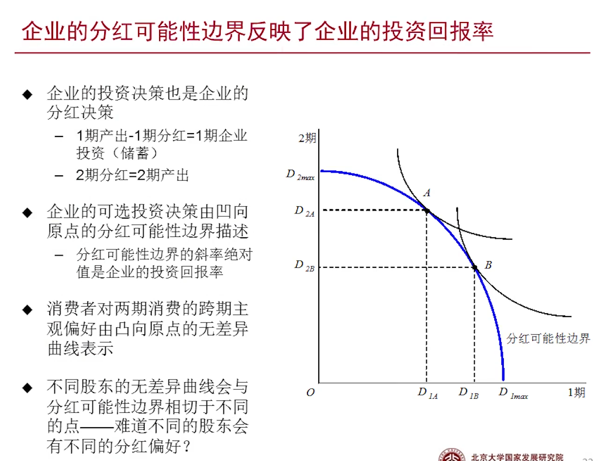
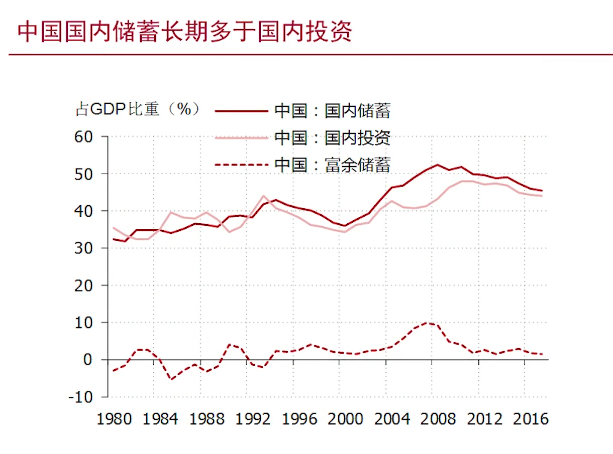
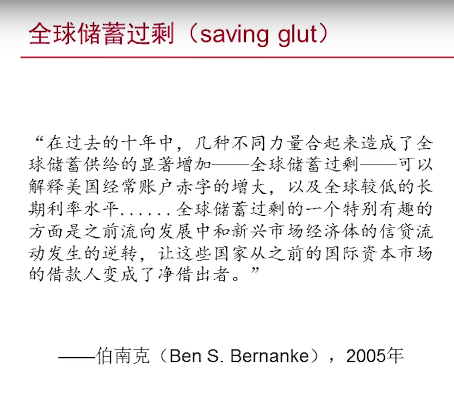
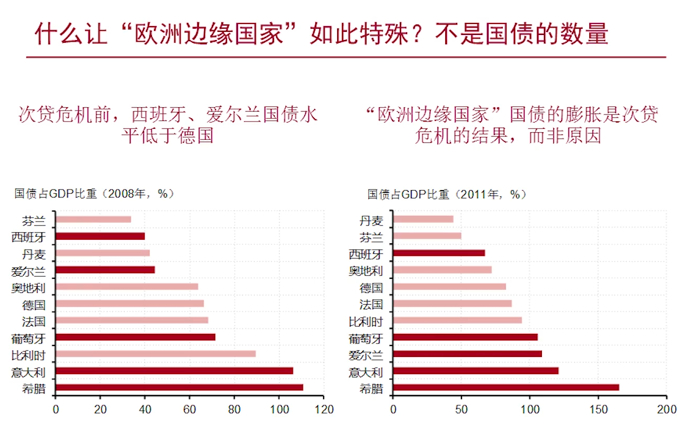
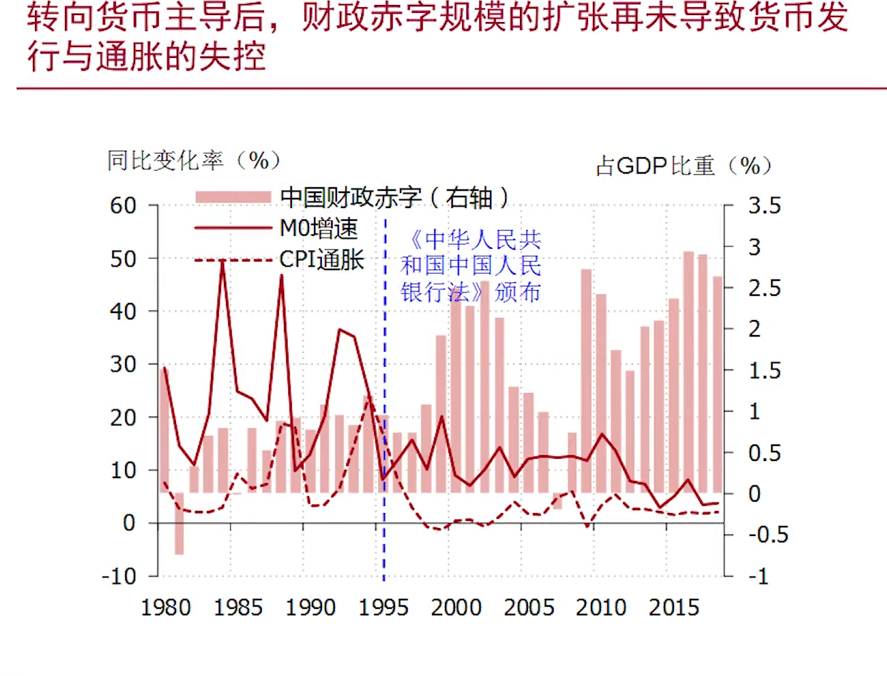

# 中国经济专题

bili 北京大学 徐高

# 中国经济介绍

关心经济的总量(增长和波动问题)、结构(消费占比)

## 增长问题

当你思考经济增长的时候，你的思想就很难转移到别的问题上去了。因为对这些问题的回答所带来的结果是巨大的。

- 为什么人还是那些人、资源还是那些资源，中国经济增长的绩效在改革开放前后如此截然不同？
- 中国经济增长的源泉在哪里，障碍在哪里？
- 中国经济还能高速增长多久？
- 中国会落入“中等收入陷阱”吗？
- 为了尽可能长地延续高增长，应该采用什么样的政策？

## 波动问题

经济为什么会波动？

经济波动会摧毁经济吗？

什么样的政策可以平滑经济波动？

我们应该试图平滑经济的波动吗？真实商业周期学派认为，经济波动就是经济对各种外部冲击的最优反映，不要人为地平滑经济波动。经济波动类似于人类的感冒、发烧，它们是人体在与外来的病毒作斗争时的自然反映，如果强行使用退烧药，症状可能在体内累积、埋下隐患，最终造成大爆发。

中国经济的波动为什么在次贷危机之后加大？

我们应该用政策来托底经济增长吗？还是应该放任经济增速的下滑？国内有些人认为稳增长是没必要的，因为当经济衰落、市场出清时，它会自动反弹回来。

怎样预测经济波动？作为实践者、分析者，还应知道如何预测经济波动。然后，利用更好的宏观政策来有预见性地应对经济波动所带来的的种种问题。或者，更微观地讲，通过预测经济波动来预测各类资产价格的变化，可以获得更好的投资回报率

## 结构问题

### 消费

### 储蓄

### 结构关键问题

## 政策问题-债务问题

为什么要关心债务问题。很多宏观政策都是建立在债务增长的基础之上的。比如通过财政政策去刺激经济增长，财政（收税、借债），刺激性的财政政策必然会导致债务规模扩大。

## 政策问题-M2

m2导致高通胀

## 政策问题-基建

地方政府-国企

6%的负债，2%的收益

庞氏骗局？？？借新还旧、根本还不了钱

## 金融问题

## 真正问题

## 经济学分析方法

由s=d，

需求端变化，价量同比变化。

供给端，价量反向变化。

### 房地产市场-需求端

房地产市场，典型的需求端决定的。房价减少，成交量减少。房价增加，成交量增加。

土地制度决定了土地的供给是受限的。所以波动只能来自需求。即价涨量涨。

政府的目的：房价不涨，量涨。但是在供给受限的情况下，不可能达到这种目标。所以只能在控制房价，和依赖房地产投资稳增长找平衡。

### 猪肉市场---供给端

典型的供给端决定。

即价涨量少，价格跌量多。

### 通货膨胀

注意(cpi消费物价指数，ppi生产物价指数)

生猪供给高，价格低。

生猪供给低，价格高。

猪价上涨(导致cpi上涨)，是由供给量减少的原因。

通货紧缩（调控需求），不能导致猪的供给量变多，价格下降。

猪价通胀，是货币政策无能无力的。

# 供给面分析

## 国民财富

GDP不代表幸福，但是GDP越高，国民福利越高。

问题：

价格----不能在市场交易的东西不能衡量、家务劳动

不同国家的价格-----市场汇率对吗，购买力平价相对合力些？？？？

## GDP定义

为什么生产---感觉稀缺---生产了就降低了资源稀缺性（摄入资源）

六个元素：市场价格、区域、常住单位(半年，即使不是中国人)、一定时期（流量）、生产活动、最终成果（剔除重复计算，例如矿泉水的瓶子只算一次）

产出会变成某些人的收入，（人）收入消费---需求

有了需求就需要生产

农民种田---收入

需要吃穿住行 收入---需求（对汽车、食物的需求）

生产汽车和食物

三个视角：产出、需求、收入

## 计算方法

### 生产法

三产业：第一：农业----土地产出     第二：工业+建筑业 第三：服务业

农业----到第二第三   城市化的进程

工业很大部分决定了这个时期GDP的增长（一三变化缓慢）

### 支出法

消费：城镇+农村+政府   居民消费（）

投资：固定+存货

净出口：（外需）

次贷危机---外需不行----拉动内需（投资和消费）---四万亿（投资干出来的）---大幅度提高了投资对GDP的拉动-----基建和房地产高度对政策敏感-----经济增长对政策变敏感

在次贷危

机前，外需旺盛，生产产能不足，各个行业投资扩展。投资很大依赖于外需。

次贷危机后，外需减弱，增大投资（高度敏感），导致产能过剩。

收入法用的少

经济好的时候，劳动报酬占比小。

经济差的时候，劳动报酬占比大。

为什么？？

经济好的时候，是经济最不平衡（劳动报酬低，消费占比低）的时候----效率？？---经济再平衡是个好政策吗--公平和效率

不平衡的高速增长，平衡的慢速增长。

## 数据质量

98年----保八----没稳住。统计局做了个7.8

测体温---水银体温柱、酒精。绝对的长度是没有意义的、相对的变化是有意义的。所以系统性的误差并不影响

人民币升值---人们想把国外的钱搞到国内来---而中国有强的跨境资本管制----高报出口的货值---把两元保成十元----多出八元的人民币

## 供给面分析

高速动荡----低速稳定哪个好

中经济为什么会增长的这么快？从供给面进行分析。

劳动、资本、技术

一个企业的增长：员工、机器设备、技术

劳动（人口增长、人口结构、受教育程度）

资本：投资来自于储蓄(我能投资多少，取决于我能牺牲当前的多少的消费来做储蓄)

技术：技术水平（手工生产、机器生产）、生产组织水平（小工厂、股份制企业。政府制度、社会制度）

资本的积累很重要

如果想持续的增加资本去维持经济的增长是不可能的。资本要折旧，资本的折旧是对于资本的规模成正比的。带来的产出越来越小，但是折旧越来越大，最后必然入不敷出。

索洛模型

经济的长期增长不能靠资本来实现。---劳动力的扩展和技术的提升。而考虑人均GDP的增长，只能靠技术的升级。

劳动力红利的故事，存在但不是主要原因。

改革开放后，资本、劳动力、技术都增加了。

而次贷危机后，技术贡献技术下降，才是导致经济减缓的主要原因。

结论： 资本是持续的加速积累，劳动在近二十年的贡献有所减弱（但减弱量级少，人口结构带来的）。

技术贡献的评估是一个残差-----GDP-劳动-资本=技术=索罗剩余=无知的度量

# 发展战略和经济绩效

## 技术进步

劳动力红利来解释经济增长放缓是站不住脚

人口老龄化是个单向的变化，不能解释经济周期的波动。

三年自然灾害

生产技术、管理技术、

越高越好：生产组织、

未必越高越好：资本密集度  扫地(扫把、扫地机器人---两百人、10000元---劳动密集型，五个人、钱随意买机器人-----资本密集型) 如果五个人、钱随意如果要用劳动密集型的生产技术那么就不是一个好的选择

钱多人少---资本密集型

钱少人多---劳动密集型

在资本和劳动的要素是可以替代

A点禀赋：高资本低劳动力---适用于资本密集型

B点禀赋：低资本高劳动力----适用于劳动密集型

多样化锥上（劳动、资本差不多），应该两种技术都用

资本的积累是远远快于劳动的

根据不同时期禀赋的不同，选择不同资本密集度的技术，以获得最优的经济发展。怎么做呢----交给市场

## 改革开放前

成立初期

在建国初期，就是落后的工业国（资本相对稀缺的国家）。-----此时选择应该选择劳动密集型的技术。但由于形势，选择了钢铁、大炮、水泥这些东西，而不是劳动密集型的东西（服装、鞋帽） 

赶超战略于当时的禀赋是不符合的

实现了政治层面的目标，但是经济层面受损。

高劳动低资本，选择劳动密集型的技术，每增加一点资本，回报巨大，按照市场机制，资本会自然的流经劳动密集型的行业中去。

但是为了发展重工业，只能扭曲宏观经济环境。最后导致总的经济福利增长缓慢--------改革开放前后经济发展不同的原因。

计划经济的体制是内生的，是有他的逻辑的。

1 计划经济体制的残余（水和石头中石头，不能容易的被改革掉）

2 经济政策与资源禀赋之间的矛盾存在-----政策与禀赋之间的矛盾

3 不能只看到经济效益不尽如人意（同时要看到取得的成就，两弹一星，仅仅靠市场是不能达到的）从总体上达到中国复兴来看，改革开放前是做的可圈可点的。

# 消费与储蓄的决定-需求端

GDP=消费+投资（储蓄）  ----封闭型

GDP缩减指数：比cpi、ppi更大的物价指数

供需分析-----价量变化

开放前增长的波动----主要来自供给-----瓶颈在供给

开放后增长的波动----主要来自需求-----瓶颈在需求

由短缺经济走向过剩经济（93年，小平南巡后的变化,增大了投资）

菲利普斯曲线消失？？

## 消费与储蓄

封闭经济中，储蓄=投资

企业没有消费，企业储蓄=企业收入=未分红利润

为什么？？？儒家文化

消费明显低于其他国家

## 消费储蓄决策

储蓄是消费不同时点的转移

跨期的主观偏好和客观的回报率达成了一个平衡

市场利率反应了消费者们的平均跨期主观偏好。

市场利率是由消费者定出来的。

在一期分D1，在二期分D2,投资回报率为P的切线。

企业的投资回报率=市场利率时，效用最大。

利率是消费者定出来的，

投资的边际递减作用，投资过多，回报率太低，资源(资本)向消费者流动，导致回报率上升。投资过少，回报较高，资源向企业部门流动转化为投资，回报率降低。

什么时候，消费/储蓄最优。不知道消费占比是多少。市场知道。储蓄过高，会导致投资过多，回报率太低，资源向消费者流动，导致回报率上升。储蓄太少，投资过少，回报较高，资源向企业部门流动转化为投资，回报率降低。不知道消费占比应该是多少。

居民拥有企业的所有权，居民对企业的的运营有话语权，企业的投资行为才会根据居民的跨时间偏好进行调整。

# 中国的消费不足

中国消费不足的论证

中国国企改革思路

1 为什么消费/储蓄要由消费者（居民）来判断？

目的是：最大化居民(消费者)的福利

2 跨期主观偏好？时间偏好？什么因素的影响？

现在的消费和未来的消费的比较（现在的消费和现在的储蓄的恒量）---真正关心是对居民的效用

耐心程度、现在的消费数量（已经吃了很多东西，对现在的边际效用很低，更愿意在未来消费 ）

3 为什么储蓄率不是越高越好？

未来的消费越高，未来的边际效用会越低。

 投资边际递减

4 相等。均衡

5 调整自己的消费和储蓄决定，然后做交易。

6 相等。企业回报率《市场利率，消费者会将企业的资源撤回，企业回报率》市场利率，消费者将储蓄投资给企业，导致回报率下降

7 最大化企业的股票价值。股票价值-----居民的财富

企业的股票价值是在资本市场上确定下来的。反应的是资本市场对企业的评价（居民、消费）。只有投资回报率=市场利率=时间偏好的时候，才会有最大的股票价值

8 潜在的经营者会进来买入股票，做出正常的经营，然后卖出股票，获得超额利润。

9 不能让其他的股东

## 市场机制体现案例

受到约束。如果投资回报率低于市场回报率，股东会要求将现金分红或者卖出股票

董明珠VS市场上的投资者 谁的决策最好？

钱是股东的。不能由其他人做决策。（不能说谁说的对）企业的所有权在居民。

姚振华---宝能

站的立场----居民福利

人民需要让企业的投资行为与自己的时间偏好一致，从而达到居民福利最大化。

宝能的敌意的收购是保证这种决策的一种市场机制。认为股票被低估了，运营出了问题，收购后有利可图。

机制调节资源在企业与居民之间，消费与储蓄的配比，最终实现最优的结构配比。

## 刺穿企业帷幕

企业储蓄=收入-0=分红后企业利润

如果满足完全的市场竞争机制，总储蓄动态平衡。那居民储蓄与企业储蓄负相关

当企业是居民所拥有的时候，收入在企业与居民之间的分配是不重要的，不影响消费和储蓄。(因为企业完全是居民所拥有)

在中国，居民储蓄和企业储蓄并不一致。

原因是巨大的国企比例（居民并不是企业的拥有者，国企就不能体现出居民的时间偏好）。

## 中国国企

国企考核：规模、

消费与储蓄处在一个恰当的水平，有一个前提，是需要一个市场机制，让居民的时间偏好传递到企业哪里，并且对企业的行为构成约束。

中国储蓄肯定很高，没有这种市场调节机制，中国的储蓄行为，并没有受到约束，投资是刚性的，不会给你分红。中国的储蓄一定是偏高的，消费偏低。

国企收入增加了，但是居民的股票价值并没有增加，也不会增加自己的消费（疑问：增加政府消费）

经济生产投入：劳动和资本 收入 ：工资和财产收入（资本收入）

国企分红：？？？？向国资委分红很少，并且通过各种补贴又回到了国企中去

广大居民的时间偏好在企业中得不到体现。

在中国，资本的所有者，大部分不是居民，而是国家。

## 萨伊定律

鲁滨逊、

一个社会总的投资过多，投资回报率很低，表现出很低的储蓄回报率，从而抑制储蓄，增加消费。

一个社会总的投资过低，投资回报率很高，表现出很高的储蓄回报率，从而增加储蓄，抑制消费。

但是把市场机制抽离，投资已经过多了，投资回报率很低，还会出现储蓄者（例如国家）。就会出现储蓄过剩，消费不足的情况。

新兴古典主流经济学。

但在中国萨伊定律是不满足。

储蓄过剩，消费不足，这是中国的最大的一块石头。

股权集中的私营企业，民营企业。

西方的资本主义的早期、中期（寡头垄断并不受到居民偏好的约束）

## 国企改革

并不能简单分给所有人。

1 内部人控制问题--名义上是大家的，实际是国企内部员工拥有很大的控制权（信息优势）。油田----实际上10000称1000，外界的人就不会感觉有如此大的价值。低价攫取国有资产

2 政策性负担-----就业、    

3 打造伟大企业------确实有的时候市场、居民是短视的，以短期民众的福利的损失为代价达到国家的述求

4 过去：劳动+资本   以后人工智能到来(技术)，只有资本？？？社会上绝对不稳定。资本家与工人陷入绝对对立。可以向资本家征税-----还不如直接国有。

在当今社会的大趋势是技术变革，劳动力越来越不重要。

国资委怎么知道国企怎么投资和分红。

企业最重要的是决策收入里面的多少拿来作为再投资。

企业在不同的行业、不同的周期中应该有不同的分红占比决策。

只有市场才能知道分红比例的信息。

有政策负担的国企不能参与到市场竞争中去。

市场对企业有支配力，如果要让市场在资源配置中发挥绝对的决定性作用，其他资源就不能发挥决定性的作用。如果其他的资源要在资源配置中发挥绝对性的作用，市场就不能再资源配置中发挥绝对性的作用。把东西交给市场的时候，意味着其他力量话语权的下降。这是国企改革中很深层次的矛盾。

国企改革、户籍改革、资本账户改革、政治制度改革。

如果国企交给市场了，其产业格局不符合政府的期望了，怎么办（市场会按照比较优势去选择产业）

# 从内部失衡到外部失衡

流量

1 经常账户：比我们的进出口涵盖更广的一个指标。

2 资本账户：中国很小。资本的交易。买房子、把钱转移到国外。中国资本账户是管制的。

3 金融账户

​	非储备（直接、间接）

​	储备资产（外汇储备、黄金、IMF、）

4 净误差与遗漏：一般观察资本外逃的一个指标

别觉得负债多，我们还有很多外债。

资产中大部分是储备资产（大部分是美国国债）。

一个企业（国家）、除了看净资产，还有看资产的流动性（资产--流动性很强的国债，负债---流动性很差的直接投资--特斯拉的建厂）。 中国对美的一项武器----抛售国债

中国对外的资产情况很健康。

S:储蓄

储蓄是拿来支撑投资的（1 省多少稻谷，种多少  2  省多少稻谷，借给别人-资源的输出）。

净储蓄----贸易顺差（资源输出借给别人）-----表明国内的富余储蓄借给别的国家

近二十年中国

资源换回一堆美钞（纸）

为什么美国能长期搞逆差？这是美国的宿命，也是美国的责任。

其他国家把剩余储蓄借给美国

中国的富余储蓄向美国输出，美国拿这些富余输出，去借钱加杠杆去了，债务增加，支撑起了美国国内旺盛的需求，支撑起了美国对国际商品和服务的旺盛的需求。

次贷危机前美国在加速加杠杆。

中国在通过廉价的出口产品以及廉价的资本供给（低利息的资本供给）我们通过幸苦的劳务换回了美国的绿纸。

中国拿自己的钱借给美国，让他买我们的产品（外汇增加）。--不平衡

发展中国家的资本回报率显然高于发达国家的美国（资本少），资本的流动应该从美国流向中国。

反而发展中国家（中国）在向发达国家（美国）进行补贴？？。

次贷危机后，对美国的补贴减少后，经济还更差了？？？。

发展中国家的资本流向美国。资本过多（供给），自然利率低，美国居民自然愿意借钱。

次贷危机前，在市场机制下，储蓄在根据储蓄率的变化在做调整。

次贷危机后，？？投资收益率很低，反而储蓄处在高位？为什么失灵。

为什么长期补贴美国？国内经济的市场机制出现了问题。出现了过剩的储蓄。借给美国很正常。如果美国吸收不了，储蓄就会留在国内，中国的经济就会面临很大的压力。

**中国经济很畸形，养分很多，需要把循环系统接到体外去（需要养分的地方），美国作为一个循环外接器，必然雁过拔毛。**

石油输出国组织也要给美国补贴，石油输出国经济也失衡。国王---相当于中国政府，居民偏好得不到体现。

经济越不平衡，就越依靠外国。

次贷危机，中国死皮白脸的借钱给美国（利率低），美国债务就越来越高，进而引发次贷危机（？？）。

中国储蓄的产生不受储蓄率的调整，但美国受到储蓄率的调整，看到储蓄率低，就不储蓄不投资。微观层面，中国使劲搞投资，但挣不到钱。美国的工厂倒闭了（中国的储蓄、投资、工厂，挤出了美国的储蓄、投资、工厂）。

中国只要生产什么，别国都不能生产，都被挤死了。

# 外部失衡与经济危机

中国实际上对美国进行补贴（商品和资本），但美国压缩贸易赤字，想和中国进行经济上的脱钩？？

站在美国的角度上（逆差国）

## 国际收支危机

1 内需如果不能将生产的产品消耗完，剩余的产能将会输出到别国。

2 富余储蓄输出到别国。

Y-C=S

如果CA<0，从别国借入资源和储蓄。经常账户的逆差。外债的增加。

就像居民借钱太多，无法偿还外债（外债过多）

1 突然终止，不能再借钱了，没有现金流了，还欠着债务，债务资金断裂。

2 本币贬值？？？？，自生调节机制，以获得出口市场的竞争力，进而从逆差国转化为顺差国。

3 国内投资大幅萎缩，经济增长下滑，靠着借钱过的日子不再。

4 美国除外。

逆差国享受到了顺差国对他的补贴，但是这种补贴不是真正意义上的补贴，因为顺差国早晚要找你还的。你在享受顺差国对你提供的富余储蓄，其实实在累计对顺差国的债务。债务累计到一定程度，一定会碰到墙壁，那就是国际收支危机。逆差国能享受到短暂的经济的繁荣，但最终会国际危机。

### 亚洲金融危机

美元走强，意味着美元的吸引力上升，全球资本（东南亚）向美国流入。

央行维持汇率稳定。居民用泰铢换美元（卖出泰铢买美元），央行必然要以汇率去收泰铢卖美元，央行如果不去买泰铢，则必然泰铢供求过剩，以致泰铢贬值，美元开始走强，居民大量卖出泰铢，央行必然必须买泰铢卖美元（但是没有足够的美元外汇），没法再以固定汇率卖美元，任其买卖，汇率上涨，泰铢贬值。

#### 亚洲金融危机原因

危机前，储蓄<投资，经常账户逆差，外债累计（美国人拿10000美元换成250000泰铢，外国人持有泰铢，如果投资收益率变低，换回美元去，泰国央行是不能应付），几十年的外资流入，然后再短时间的换汇需求是泰国央行不能应对的。（长时间的借钱，短期内要还钱）--只有降低投资（储蓄不变），增加富余储蓄（从逆差变为顺差）。

危机前的高投资率是虚的，靠借入了大量的外债。如果外债抽走，投资率降低。

投资率急剧下降，社会动乱，储蓄率也下降。

货币贬值是经济体对金融危机的自发调整，货币贬值，出口货物便宜了，出口增加，进口货物价格变高，进口减少，净出口增加。从逆差变为顺差。偿还逆差的外债。

如果中国也跟着贬值，那么中国的货物也变便宜了，形成竞争性贬值，其他国家的贬值就没有多大的竞争性了。

为什么中国货币没有贬值？

1 已经贬值过了。汇率改革

2 之前有大量的顺差。没有找外国借钱。外国也没有办法抽走。

索罗斯为什么要攻击香港（因为香港也有大量的逆差），但因为中国大陆有大量的美元外汇支持

危机前，东南亚国家发展蒸蒸日上，但是建立在大量的借债情况下（虚的），不可持续的。

### 中等收入陷阱

不会。巴西、阿根廷会出现经常账户逆差。

经济增长

对于巴西和阿根廷：储蓄率差不多，投资高的时候，储蓄不够，从国外借入储蓄（逆差），大量欠债，还债，投资下降（顺差）----表明国内储蓄率所带来的约束。

对于中国：投资越大、净出口越大？？？储蓄不是恒定不变，投资越多，储蓄越多，没有碰到储蓄率约束。

### 欧债危机

欧猪五国国债收益率飙升（面临违约风险----高风险高收益-没有风险国家不会提高国债的价格），

欧洲整体逆差很小，但是内部差异很大。

原因

欧元区成立前，汇率可以平衡工资之间的差异。德国人勤劳，边缘区爱生活（德国竞争力），会使德国马克升值，削弱德国商品的竞争力。

欧元区成立后，都是欧元，边缘区的商品没法和德国竞争。为了维持高消费，只能去借钱（欧元成立后，借钱便宜），借的钱不是用来去生产，而是拿去高消费，工厂没法竞争。

德国之于欧洲，中国之于世界。

只能去借钱，体现为经常账户的逆差（1国际出口市场的竞争力的下降2 借贷环境的改善，更好借钱），随之而来的大量外债。

次贷危机后，德国不再借钱给边缘国家，这些国家就支持不住了。于是只能大量发行国债。但是国债需要央行这个印钞机作为后盾的（印钞去还债）。

边缘国家失去了央行印钞机后盾（欧元区成立后各国不再具有货币发行权），国债不再是无风险资产（表现为国债危机的国际收支危机）。

最后表现为国债面临违约风险，国债资金链出现问题。

表现为债务危机，实际上为国际收支危机。

面临这种不平衡怎么办？

1 紧缩经济（德国提供融资，条件是按照德国要求紧缩经济） 边缘地区人民不高兴（福利少了），德国人也不高兴（辛辛苦苦挣的钱拿去支援别人去了）

2 欧央行出手

央行的一个重要作用，交易支付结算。通过清算系统做财政支付

欧元区问题：缺乏财政联盟的货币联盟，货币上收，使得欧洲国家的差异不能通过货币政策调节差异差异（以前可以通过汇率进行调节）。只能通过财政政策（德国向边缘国转移支付）。但是不是同一个国家。欧元区是做不到的。除非欧元区成立欧洲国，否则定然存在分崩离析的风险。

不像中国。

德国通过target2将盈余转给边缘国家。

## 次贷危机

长时间外债累计，要还，而美国用本币借外债（储备货币、支付工具），而其他国家都是用美元借外债，所以不存在还不起外债的。带来特权---用美元借外债（印钞机的一堆纸，换来了大量的商品和服务，找全球收铸币权）

*美国过度投资，储蓄不足，没有经济机制去调整他的。*

只有美国能做长时间的逆差。

从微观层面，有些居民、企业借到了钱，支撑起了他的商品和服务的需求，借钱必须要有由头（借钱买房，而金融机构把钱借给了许多信用差的人，房地产市场泡沫，次级债务资产违约）。

次贷危机不是国际收支危机，而是私人部门的债务危机，并引发金融危机，并传到实体部门

因为美国是所有顺差国的逆方，美国的逆差大幅度减少，中国的顺差也大幅度减少。

外需下降（净出口），增加内需（投资和消费---四万亿刺激，主要投资明显扩张（消费没有））

国内富余的储蓄输送到美国，次贷危机后，美国对富余的储蓄消化能力下降，就只有把多的储蓄留在国内

CA=Y-(C+I)

CA=S-I

在过去是外需带动（净出口，投资派生于外需），次贷危机后，国内政策（尤其是投资政策）更加具有影响力。

美国角度：用纸换来了商品和服务（全世界的补贴，表现为外债的增加，微观上经济主体（居民、企业、政府）外债的增加），后果是国内的债务不断的膨胀，债务累计会爆发债务危机（美国不会发生债务违约，但是经济主体会发生债务违约）。部分美国经济学家将次贷危机部分归咎于顺差国的商品、资本，压低了美国的利率，使美国疯狂借钱。

当通过印钞票就能换来大量的商品和服务时，事实上美国的印钞机是美国最大的出口商，而必须通过金融行业出口，有躺着赚钱的行业肯定不愿意站着赚钱，其他行业肯定做不起来。美国的这种模式，必然使得美国的产业的空心化，对应企业的倒闭，工人失业。川普压缩贸易赤字---空心化的产业工人的诉求---主要铁锈带、五大湖区。

为什么印美元有人收，其他国家货币没人收。强大的军事实力（支撑了美元的信用）。如果产业空心化，又怎么保证强大的军事实力。川普的借口---国家安全----没有钢铁、怎么保证军事、保证美元信用、保证美元的出口输出、保证其他国家的补贴（低廉的商品和服务）。

西班牙的就是这样倒下的，产业空心化。

美国是个市场经济的国家，不像中国对经济有较大的控制力，当居民看见廉价的供给，把储蓄率压得低的时候，自然的反应就是多消费少储蓄，多吃喝少投资。

而中国完全相反，在储蓄率大量下降的时候，中国仍在做大量的储蓄。

### 贸易战晚了

中国国内失衡，通过全球失衡传递到美国，美国的国际地位渐渐被削弱，美国的霸权要拱手让人的。打贸易战是有道理的，但现在已经晚了，要是在中国加入wto前，抑制还可以，中国没有外接循环器，中国经济就发展不起来，一直很孱弱，就不会构成威胁。

晚的两个层面。

1 已经接了20年 ，中国变的很强大了。而且美国大部分是服务业，比较虚。

2 联系很紧密了（血管连在一起了）。美国那样的制度，民众都看短期的，让他承受短期的痛苦来维持美国的霸权，对于美国民众是不可能的。

以后抒写历史，怎么超过美国的，这种超越方式都没有存在过。以前老大和老二都是要打仗的。现在我们不给你打仗，我们补贴你----------hahaha哈

消费占GDP的变化

最近几年，消费增加。

# 财政政策与货币政策

财政政策

货币政策

结合

## 财政政策

产出、收入、需求

政府在产出、收入、需求中的角色，产出：公共品：铁路、电力   收入：收入分配（税收），需求：重要的产品和服务的需求方。

政府与居民和企业不同的是：有调控能力

调控的前提：有资源有收入

1 改革开放前---基本稳定

2--1994 .到分税制改革。降低。由计划经济到市场经济的变化。主要是地方减税招商引资

3--1994----

中央明显上升，地方明显下降。

只收了收入，没有收支出。财权上收，事权没有上收。

收入赶不上支出，以后中央政府税收返还和转移支付来补贴地方政府。地方政府没钱只有卖地、地方融资本台融资。

所得税：个人和企业直接掏出出来的

流转税：增值税（交易环节）

美国主要的是所得税。

几十万亿的国有资本只带来几千亿的收入。回报率很低的。

政府所有的收入占中国的百分之三十多，所以中国政府对经济的掌控力度非常强。

经济好的时候，财政是比较好的。

发挥逆周期调节的作用（经济越差的时候，财政花钱就比较多）。

经济好的时候，财政收入比较多。盈余比较多。

经济差的时候，事业的人多，花钱比较多。

财政支出乘数，财政花一元钱能带来全社会总产出、总需求、总收入的n元钱。比如政府花钱修桥，给失业工人带来收入，然后消费，然后带来更多工人的收入。

税收乘数：减税一元钱有可能会带来超过一元的总需求。

挖坑理论：挖坑填坑

全社会需要创造需求，需求是不是挣钱是不重要的。

收入《支出，发债。收入》支出，把之前的债务还掉。

各期的支出和=各期的收入和。

政府修桥--修桥的资源是从民众哪儿来的---政府多花十个亿民间就少花十个亿，财政乘数为0（新古典思路）。

凯恩斯vs李嘉图？？

他们都可能是对的，处在什么状态下。

经济学破窗理论----窗子被砸了，对教室里面的不好，对补窗户的人是好的（他就有了工作，有了收入），前提：这个补窗子的人之前没有工作。如果这个人有工作，并且很忙，他补这个窗户，是失去了补另外窗户的机会。差别：这个人是否有工作。

凯恩斯理论的基本前提：社会中存在许多非自愿的失业者。

当经济中存在大量的失业者，砸窗户是个好事（劳动供给过剩或者资本过剩），凯恩斯的创造需求理论是有意义的。

当经济中供需平衡的时候，财政支出会挤出民间支出。

凯恩斯与新古典经济学派vs--他们对经济的状态都是在长期经济处在产能充分应用的状态。

凯恩斯-----站在短期的情况下，解决需求不足的问题。

新型古典综合----短期运用财政政策，长期不能使用。

对于中国，长期处于产能过剩，需求不足的问题，就可以采用凯恩斯的财政政策。

## 货币政策

中国的M2占比靠前。

名义指标--就是一个简单的价格

真实指标--相对价格()

印钞票为什么会影响实体经济

## 财政与货币政策的配合

为什么95年前后货币和通胀的差别这么大？

引入货币后，加上铸币税贴现和。

财政主导：央行没有货币发行的权力，需要听从财政的，财政却多少，叫央行发多少。财政部亏空很大，发的货币就比较多，通胀就比较厉害。

意味着财政约束里面，没有铸币税。

政府债权：成立中投公司，央行向农行向政府购买的1.5万亿/

政府存款：国库资金存在央行。

收入随税率的上升，先上升后下降

当税率过大的时候，没有税基，收入降低。

通货膨胀把中产阶级都洗劫了

财政（独立）与货币（独立）是协调同步的。

95钱，货币政策是从属于财政政策的。