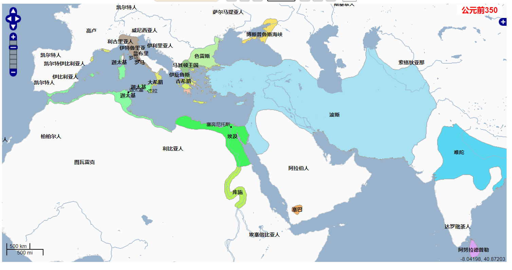
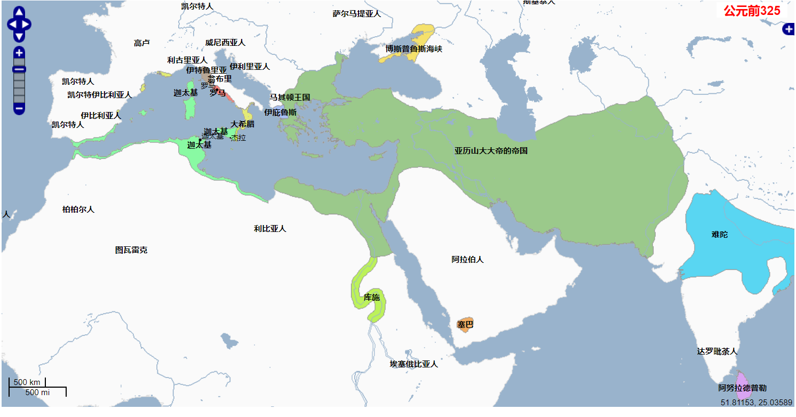
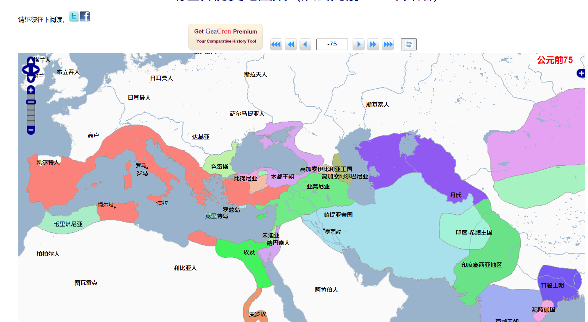
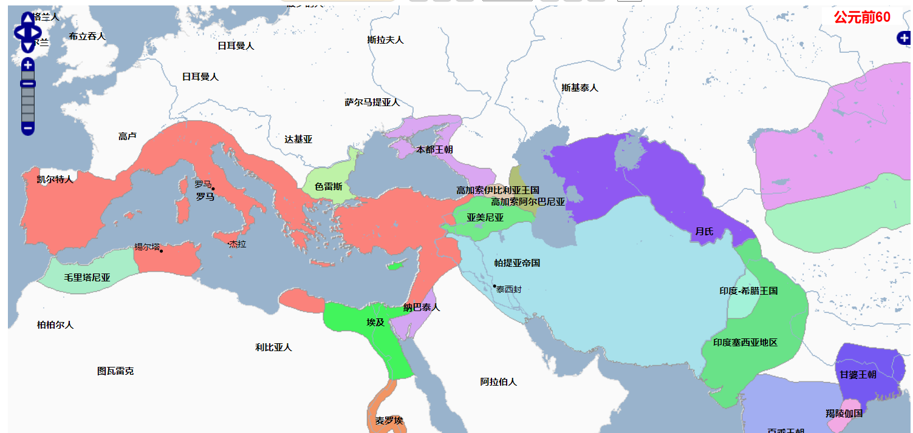

# 历史定义

# 历史的作用

历史的作用

提供是的智慧和洞察力。

预测接近于真实的未来（但正确性并不高）

要理解现实世界？需要一些历史

历史

现实是这样的：逻辑的考虑现状，历史的考虑现状

对生活要有所理解：要知道历史

地球绕太阳转有什么用？

人生的悲剧本质和无奈

知道有些东西

巴赫作品：	

鬼都看不懂，有些历史作品是给历史学家，但是是雅俗共赏的。

读出点不同的东西。

学历史是一种修养，是一种看现实的方式。

​		

结果变成原因：中国文化的保守，最先是因为环境，

# 历史学者和著作

## 学者

布罗代尔、

汤因比

弗朗西斯·福山、

塞缪尔·菲利普·亨廷顿、

杨奎松：党史

周鼎、张鸣

沈志华：中苏关系史

高华（红太阳）、周孝正、贺卫方、秦晖

茅海建：鸦片战争、戊戌变法  --《天朝的崩溃》

## 著作

世界文明史（翻译不太流畅）、剑桥中国史、剑桥世界近代史

# 世界史

上古史 东北师范 

中古史 耶鲁 中世纪早期史（【中古篇 】北京师范大学候树栋）

近代史 东北师范

现代史 华东师范大学郑寅达

当代篇  

# 地图史

## 总览

见泰晤士地图集
[互动世界历史地图集](http://geacron.com/home-zh-hans/?lang=zh-hans)

### 2019

### 地形

伊比利亚半岛、亚平宁半岛（意大利半岛）、巴尔干半岛、小亚细亚半岛（西亚美尼亚）、两河流域（幼发拉底河、底格里斯河）

### 中东

### 五海

### 苏伊士运河

西方到东方的最短航线：的地中海-苏伊士运河-红海-阿拉伯海-印度

### 中国历史线

### 希腊

### 罗马

### 时间线对比

## -3000

## -2500

## -2000

## -1800

## -1600

## -1500

## -1400

## -1300

## -1100

## -1000

## -900

## -800

## -700

## -600

## -500

-499年 -449年 希波战争

-431年- 404年  伯罗奔尼撒战争  雅典为首的提洛同盟 vs 斯巴达的伯罗奔尼撒同盟

## -400

## -350

马其顿崛起 

## -325

亚历山大帝国

## -300

亚历山大帝国分裂为马其顿王国、塞琉古帝国、托勒密埃及三大帝国

罗马崛起

## -280

## -270

罗马与迦太基争霸-布匿战争（西太平洋战争） 公元前264～前146年

## -221

秦朝统一全中国

## -200

## -100

## -75

BC75年  庞培  收回西班牙（塞多留）
BC67年 剿灭地中海海盗、东方战争（击败本都王朝，米特拉达特斯国王；兼并塞琉古王室） 
与拍提亚帝国订立契约 以幼发拉底河为界
公元前75 年   斯巴达克斯起义  克拉苏镇压

## -60

罗马、帕提亚帝国、中华帝国（西汉）

## 1

## 100

## 200

## 230

## 260

高卢帝国

三家归晋

## 290

## 350

## 400

罗马帝国分裂

## 450

中世纪

## 500

## 550

隋朝建立

## 600

## 650

## 700

## 750

## 800

## 1259

## 1300

## 1350

## 1400

## 1450

## 1470

## 1500

## 1550

## 1600

## 1650

## 1700

## 1750

## 1800

## 1850

## 1900

## 1912

## 1920

## 1930

## 1940

## 1950

## 1960

## 1970

## 1980

## 2000

