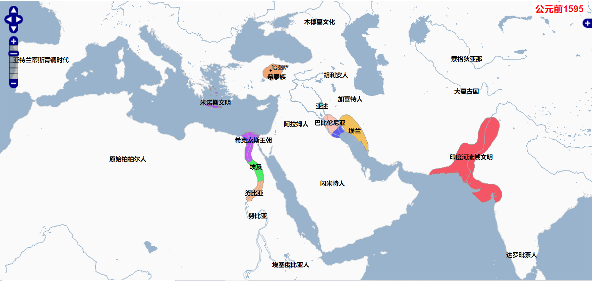

概述

东北师范大学  周巩固    王邵励

[爱课程](https://www.icourses.cn/sCourse/course_3867.html)

### 历史的作用

提到的三个人：汤因比《历史的研究》、威尔杜兰《文明的故事》、海登.怀特《元史学》

1 借鉴作用

2  历史的无力感，历史学非常艰难

> 一切历史都是当代史
>
> 历史即文学，客观历史并不存在-海登.怀特
>
> 无物存在；即使有某物存在，也无人知道。即使有人知道，也无法把他的认识告诉其他人-高尔吉亚
>
> 套用在历史上，没有客观存在的历史；即使有，也没人知道；即使有人知道，也无法传达给别人。

3 人类的经验大部分都是间接经验，而历史就是间接经验的总和。

> 尽管对历史有种种非难，但是人类想认识自己，除了认识自己，没有其他的途径。
>
> 历史是一面镜子，让人类反思。
>
> 学历史，让自己更聪明，让我们更有智慧。智慧从经验来，人类一生中直接经验有多少呢？但是我们短暂的生命中穷其一生，直接经验有多少。你能去过多少空间。
>
> 人类的经验，不是直接经验，是间接经验（历史集结了人类的一切间接经验，从这些间接经验当中，人类可以看到形形色色的历史人物）。
>
> 伟大的人物，渺小的人物；高尚的人，卑微的人。智者，愚者。成功者，失败者。什么样的形形色色，我们都能遇见。只要我们愿意，经过我们的选择，我们可以和历史上的任务人物进行对话。研究他的思想，你跟他对话跟他进行交流（读史使人明智）。
>
> 可以让一个人，让一个民族少走免走弯路（读史让青年人更老成）
>
> 学历史，至少能让你看懂许多电影。

海跟.怀特没有客观历史的观点进行讨论？

> 中国有大量的纪实史实。
>
> 历史是求真的学问，文学是求美的学问，哲学是求善的学问（求至善）。

### 方法

>历史史实VS学习方法vs重点规律

1 怎么快速掌握一个概念

```
1 农业革命的定义：
2 人类的定义：人是有理性的动物  【1 人是动物】 【2 有理性：区别于其他动物的性质】
```


### 宏观框架


## 人类的家园

```
人类是可怜的动物，既不知道自己从哪里来，也不知道从那里去。但是我们人类是有理性的，我们知道自己的有限性，我们尝试用自己的智力去探究自己的起源和自己的归宿，从这一方面来说，这是我们人类伟大的地方。
```

1 地球是宇宙中的微粒。

2 地球的幸运条件（太阳、大气、水）

3 神奇的生物（微生物--植物-动物-大型动物-哺乳动物-灵长类-人类）

人和自然的关系：亲子关系

## 人类的起源和进化

人类的起源？

人类种族的起源？

什么是文明，我们为什么要走向文明

### 人类的起源

起源假说

> 1  猿进化到人（从什么时候进化成人的？什么时候基因突变）直立人  智人
>
> 2  上帝说
>
> 3  外星人说（外星创造）
>
> 4  劳动创造人类说（类人猿）--恩格斯
>
> a 解放双手、直立（没什么根据，其实四肢着地更合适，恩格斯既不是人类学家也不是生物学家）

起源时间

>  三百万左右的南方古猿（都源自于非洲）

### 人类的定义

生物学的三大伟大转折

> 1 从无机物中产生的生命现象
>
> 2 晚期智人（人类不再是让自己的遗传因子被动地适应环境），而是改变自然环境来适应自己的遗传因子
>
> 3 人类在改造环境的同时，改造自己的遗传因子。

人和动物最本质的区别

>1 人会制造工具？人会制造高级工具，猴子也会制造低级工具
>
>2 人会笑？
>
>3 人会自我编织意义的动物？
>
>4 人是有理性的动物？理性是一种高级思维和筹划能力。对于此时此地现实中所不存在的事物和观念，只有人类才能做出想象、推测，只有人类才会渴望宇宙及其起源，渴望自己在宇宙中的地位和将来的处境，正是由于人类栖居于大地上，地球这颗行星才在浩渺的宇宙中变得非凡，即使某个时日，地球轰然和某个巨星相撞，栖居于地球上的人类在瞬间化为碎片灰烬，但人类依然比他的毁灭者高贵，因为只有人类才会预见并理解人类的悲剧【人类的高贵之处】。
>
>创造人的至高无上的上帝赋予了人当然的卓越的地位，因为人是如此众多的各种生命中唯一获得一种理性的思维的能力。

### 人类的分布和种族起源

 起源于非洲，在迁徙中，才产生种族的差异（为什么产生种族的差异？是仅仅因为环境的原因）。

> 1 环境说（但是很难让人信服，令人疑惑重重）

主要种族和分布：高加索人，黑人、蒙古利亚人()、澳大利亚人、布须曼人、俾格米人（详细信息，可查资料）

为什么只有三大种族？农业革命的影响，没有跟上农业革命的步伐


## 旧石器时代

以狩猎和采集经济为主

为什么要走向旧石器时代，又为什么从旧石器时代走向新石器时代。

周巩固完【历史的作用、人类的家园、人类的起源和进化、旧石器时代】

## 新石器时代的农业

王邵励老师

### 时代的飞跃

磨制石器--打造出我们想要的形状、提高征服自然和生活质量的能力

> 陶器

复合工具（剑）

>弓箭的使用

火的使用

> 利用自然现象提高生活质量的改变

自然环境的改变

> 大型动物转为小型动物，狩猎对象发生了改变，人们的的生存条件进一步得到提高
>
> 人们有意识的利用山河湖海

以上的种种特点，使人类的数量大大增加

>实际上人类社会的发展总是应当出于一个平衡的状态，生产力的发展导致人口的增多，实际上来要求工具的改善、生产力的再次发展、要求人类征服自然利用自然能力的提高，在这个时候上，单靠单纯的采集和渔猎已经不能满足人类的生活需要（人口膨胀）。这个时候就发生了农业革命


### 农业革命

#### 背景

以上的种种特点，使人类的数量得到增加

>实际上人类社会的发展总是应当出于一个平衡的状态，生产力的发展导致人口的增多，实际上要求工具的改善、生产力的再次发展、要求人类征服自然利用自然能力的提高，在这个时候上，单靠单纯的采集和渔猎已经不能满足人类的生活需要（人口膨胀）。这个时候就发生了农业革命

#### 定义

> 农业革命、工业革命、信息革命-托夫勒


> 新石器时代的一次重大的社会变革(总括)，由被动的采集和渔猎经济(极其依赖自然环境)，变为主动培植农作物和饲养家畜的农业于畜牧经济。
>
> 核心：进一步降低了对自然环境的依赖。

#### 影响


> 史实and方法。怎么迅速把握概念

#### 为什么产生

农业革命是如何产生的？为什么23百万前为什么没有发生？

```
汤因比-《历史的研究》-挑战与应战理论
文明为什么会起源？首先得有挑战，没有挑战，就没有应对的动力和创造力。已经有吃的，何必要种地呢。
如果挑战太厉害了，文明也不会发生。（如果都是沙漠，那么生存都是问题，就不要谈发展和进化）
个人的发展也是这样的，定的目标不要太高。要垫一垫脚刚好能够得住。
```

>这里面的原因可以初步归纳为两点：其一，缺乏动力。狩猎社会能在供求平衡的状态下，走过千年而不殆，因而难以形成要求变革的动力。其二，当时可以栽培的植物和可以驯养的动物很少，对人类的生活方式不能发生重大的影响。

##### 两种假说：


> 绿洲假说：干旱中人类、植物、动物都去了绿洲,一起碰撞，然后产生了农业。

> 边缘地带：由于新石器时代，人口不断的膨胀，有限地方不能承受太多的人，选择一部分人迁移、其他地方。把原来的植物的种子、幼崽带到新的地方。这样不断的积累经验，学会了种植和畜牧。

#### 影响


>不是说写进教材就是真理，历史的研究在不断的发展在不断的纠错，

```
第一，农业的产生,使人类从食物的采集者转变为食物的生产者。这一获得食物方式的转变，改变了人与自然的关系。人类经历了从依赖和适应自然到利用和改造自然的历史性转折。
第二，它促进了人类对自然界的认识。农业的产生，使人们开始对日月星辰、水土、气候等自然现象产生浓厚的兴趣，通过长期的观察和经验总结，形成了天文、地理和数学等方面的初步知识。（原来没有农业的时候，不需要人类去观察天文、地理、数学，而想种植好农作物，就得去思考天时、地理【春种秋收，看似简单，其实要懂得的东西很多】）
第三，农业生产的周期性劳动，要求人们较长时间地居住在一个地方。这样，人类从旧石器时代的迁徙生活逐渐变为定居生活。
第四，农业革命结束了长达数千年的种族平衡，形成了一直持续到今天的种族格局。【定居生活的形成，容易相对形成相对稳定的群体即人类种群】。游牧部落和农耕世界。游牧世界的蛮族和农耕文明的矛盾冲撞在农业革命的时候就确定了。
黄河流域-华夏文明 两河流域-古代西亚文明 尼罗河-埃及文明 印度河-恒河-古印度文明 希腊罗马文明
第五，农业的出现，使人类能够获得，比较丰富和稳定的食物来源。这大大促进了人口的增长，并使一部分人从事维持生存以外的活动成为可能，从而产生了新的社会分工和物品交换，也使某些人有可能集聚财富。农业革命促进了人类文明的产生。【财富的增长的是一个自然现象，但是对财富的分配是极其复杂的现象，于是就出现了财富的剩余，就开始出现了一部分人对大量财富的相对占有，出现了贫富，就出现了阶级，出现了社会分工，出现了私有制，一部分开始利用权力机构维护集团和个人的专制，国家产生，文明产生】
农业革命别看只是生产领域的变革，他对社会关系，对世界历史的影响，十分巨大。
农业革命--生产力决定生产关系
```

《上帝也疯狂》

**消极的影响**

> 环境史去看，农业革命是人类利用自然开发自然的开端，资源不够，人类增加，打仗、战争、人类自取灭亡

推荐两本书：《寂静的春天》 《大崩坏》


### 文明的概念


文明：在物质生产、精神文化、制度建设有了显著的成就

文明和文化：文明是比较先进的文化先进的文化,精致的生活状态

标志：1 国家和阶级分化的出现  2 大规模的城市中心  3 文字的使用   4 艺术和科学

> 国家的产生

上述几个标准只是一般的标准，但并不绝对（历史学的研究，其实是排斥绝对的认识，排斥一种非此即彼的认识，很多历史现象是很复杂的，很多历史现象其实是不同色度的灰色， 是黑白的混合，我们只要把那个灰度描述出来就行了）。

国家的产生(社会组织怎么进化为国家)

### 社会组织的演化-国家的来源


#### 血缘家族

> 1 血缘家族      班辈婚    原始民主

由血缘关系和氏族公社过度到农村公社和地域部落（从血缘关系转移到地域关系，血缘关系变得不那么重要）

#### 农村公社


#### 地域部落


最后军事首长渐渐权利增大（在战争时期），逐渐专权。

《家庭、私有制和国家的起源》--重要


婚姻关系的发展和社会模式（社会生产）


> 物质越不发展，就越会受血缘关系的支部。
>
> 物质越发展，财产关系的支配力量就越强。
>
> 剩余产品越多，财产关系取代血缘关系。
>
> 血缘关系和财产关系的博弈矛盾


[家族血缘关系在中国文化中的作用](https://wenku.baidu.com/view/bc616575f5335a8102d22064.html)


**重要注意点：**

1 原始社会的组织的理论：大部分是假说（他应当不断接受实践的检验,大家应当带着批判的角度）

2 概念只是帮助理解，绝对不可以绝对化，真实世界，可能氏族公社、农村公社、地域部落混合。

3 史实和规律。学习：一方面要了解课本里总体线索，有重点知识点，不要面面俱到。应该通过重点突破整个知识点。


## 古埃及（-3500-31）

古埃及（-3500到--31年）--罗马统治（埃及艳后）--拜占庭帝国-阿拉伯帝国。

印象：金字塔、尼罗河、法老（神权合一）、玻璃、和犹太教的纠缠、永恒的宗教、


大部分是沙漠，有尼罗河绿色带。古埃及是尼罗河的赠予。

古埃及的文明无法识读，所以显得比较神秘。

罗塞达石碑：三种文字（古埃及-贵族文字、平民文字、希腊文字）、拿破仑远征

新石器时代文化


有文字：前3100

可能：古代西亚苏美尔文化可能略早于埃及（大多数人的观点）


国王、神（神权合一） 人的最高国王 神的代表

==采取近亲结婚（为了保持血统的纯正）。但是没有发现后代有问题（没有找到明显问题） 不解之谜==

东方专职政府的代表


生殖崇拜:人口资源匮乏


### 古王国

(金字塔时代)  胡夫金字塔


和平、安宁、不失去侵略

### 第一中间期。

变化的原因，前2100年，人民负担加重，地方贵族势力增强


奴隶起义


### 中王国


封建:与西欧的封建的区别。诸侯割据、地方势力强大。法老大全旁落


王权和平民联合对付地方诸侯（跟中世纪晚期的历史相同）

> 法国绝对君主制，君主联合资产阶级抵抗大贵族；大贵族被消灭后，君主和资产阶级的矛盾成为主要矛盾，就是后来的资产阶级革命。

### 第二中间期


### 新王朝

国内团结反抗喜克索斯人，建立18王朝。新王朝


汤因比文明生成的挑战迎战理论。

> 1 环境特别优越的地方，不可能滋生出人类的文明（环境太优越，就缺少动力）。
>
> 2 人类文明的发展源自下一次挑战（比如埃及人在反抗希克索斯人的斗争中，建立了庞大的军队，尚武精神，获得新的文化-之前是没有多少军队的）


跟抗日战争后的形势差不多（民族主义得到张扬，地方主义被削弱，中央权威得到加强）


#### 埃赫那吞宗教改革


提出了一神教崇拜、意味着国家从分散到统一。多神教崇拜大多意味着原始崇拜，一神教意味着进步。

#### 埃及赫梯争霸


埃及、赫梯帝国、卡迭石战役（第一个国际合约）


签订了协议文件


### 埃及的衰落

变化的原因：过多的征伐和统治者的骄奢淫逸（兴于尚武也衰于尚武精神）


希腊化的历史


### 经济


有部分的自由经济（个体农业和个体手工业）


和中国颇为相似

中国：万里长城

埃及：金字塔 法老陵墓

中央集权的强化（东方专制主义的象征）

### 社会


阳山碑材：怎么运输

政治上高度集中，神人合一的政治体制。

两极分化、奴隶制

五大社会形态**（原始社会、资本主义社会、**封建、奴隶社会、共产主义）

奴隶社会核心:奴隶的孩子还是奴隶

两次大规模奴隶社会：希腊罗马-奴隶   近代资本主义-黑非洲


家庭：一夫一妻制 法老也是


女人拥有继承财产的权利


工商业

工业：玻璃制造、玻璃着色 、美容（染发）


### 宗教


拉神-阿蒙神、奥西里斯神(阎罗王、地狱、天堂)


伴随帝国的统一，一神教


一神教更接近于科学的宗教


耶稣可以视为阿吞神的再生


### 科学

数学、医疗、埃及发明了纸（草纸）---对于知识的传播无可替代、金字塔


象形文字

古埃及的遗产：宗教（一神教的起源）、玻璃、纸

-

## 西亚文明


苏美尔城邦林立时期


阿卡德时期


乌尔第三王朝时期


古巴比伦时期、亚述渐渐步入文明(早亚述)、


古巴比伦亡于赫梯帝国手中，巴比伦尼亚地区进入加喜特人时期


巴比伦尼亚加喜特人时期，亚述壮大（亚述和埃兰两强争霸）


亚述继续扩大，赫梯帝国(希泰)和埃及新王国争霸叙利亚和巴勒斯坦）


亚述攻灭埃兰（亚述一家独大）


米底王国扩张


亚述帝国（亚美尼亚高原）被灭------新巴比伦（两河流域）、米底王国（波斯高原）


巴比伦向西亚裂谷地区扩张、同埃及发生战争、并发生巴比伦之囚


米底攻灭乌拉图（扩张到亚美尼亚高原）


米底王国被波斯取代。波斯、吕底亚、巴比伦尼亚三足鼎立。


波斯灭吕底亚（扩张到安纳托利亚高原）


新巴比伦被波斯灭亡


扩张至埃及地区


波斯   米底王国--波斯高原

​           乌拉图---亚美尼亚高原

​           新巴比伦-两河流域

​           吕底亚---安纳托利亚高原

吕底亚-----弗里几亚       

### 一 两河流域（伊拉克）

苏美尔、西亚、巴比伦文明

两河流域：伊拉克


两河流域河水泛滥没有规律（尼罗河的河水泛滥是有规律的）

最早的农业文明发源地（中国、中南美洲）

最早的农业在亚述（北部山区）


#### 欧蓓德文化


所谓的民族性不是天生的，也不是一成不变。

幼发拉底、底格里斯河、美索不达米亚（两河之间的）

北部：亚述

南部：苏美尔

两河：不规律不定期的泛滥、农业生产的不稳定

地理位置：埃及相对比较闭塞、

两河:四通八达 、开放的、充满的不稳定、中东自古就乱、中东的乱不是因为伊斯兰教

#### 乌鲁克文化

早期舞台:


#### 苏美尔文明(2800-2371)

文明舞台:苏美尔人

文明的雏形


==原始民主制的传统和遗风。原始的民主、血缘影响着早期国家的民主传统。比如中国的秦汉之前的王权并没有那么强大。==

==什么时候需要专制:社会矛盾越尖锐，越容易产生专制==。

神庙是地标性建筑。

==早期国家：民主性、宗教性==

==不要认为君主制不好，在历史的某一阶段，共和制是最不好的。君主制最大的好处：有利于稳定。权利归属很明确。有利于长治久安，世袭的原因，有利于皇帝的主人公意识。==

==国家的发展：大致走向:民主-专制-民主 ，一切都不是静止的，运动的。==

#### 阿卡德王国(2371-2191)


国王：萨尔贡

#### 乌尔第三王朝(2113-2006)


苏美尔人的后代、

《乌尔纳姆法典》--最早的成文法典

乌尔第三王朝的灭亡标志着苏美尔退出历史舞台。印欧人和闪米特人登上历史舞台。


#### 古巴比伦（1894-1595）


汉谟拉比的文治武功：古巴比伦因为因为汉谟拉比而强盛，汉谟拉比死亡后古巴比伦衰亡

> 第一次统一两河流域（巴比伦尼亚和亚述，亚述臣服）

两河流域良好的法律的传统（自苏美尔到古巴比伦）。

>汉谟拉比法典
>
>1 以牙还牙
>
>2  尊重产业的私有权
>
>3  偷窃未破案城市会
>
>4 其他

经济（土地制度）

> 王室地产（国有、不流通），私有地产（私有，流通）。私有地产（大地产、小地产）。==地产制度在最早期是最重要的财产所有制制度。==

社会制度（ 社会结构）

> 臣民（三个等级）前两个阶层是自由人，第三个阶层是奴隶。每个阶层法律地位不同。
>
> 上古、中古、西方、东方、中世纪西欧、中国的士农工商、印度的种姓制度。犯上作乱（有上下之分）
>
> 等级和阶级：等级是社会、法律概念（不同的社会地位）、阶级是经济概念（经济地位）。区别和联系。等级是传统文明的特有概念。

宗教

>
>
>

现在的土耳其是突厥血统和突厥语系。

被赫梯人所灭


#### 加喜特人时期（----1160年）

加息特人时期，是巴比伦倒退的500年,唯一的贡献是加喜特人为两河流域带来了马匹。

> 马5000年前开始为人类服务


#### 亚述统治时期（----626）


##### 早期亚述 3000-1500

早期亚述 3000-1500

存在了1500年

城邦

前1500年，米坦尼被赫梯帝国，进入中亚述


##### 中亚述 1400-1078

君主专制、常备军

```
前1400-1078年，相当于埃及的新王国时期和赫梯帝国时期。两河流域南部此时处于混乱状态，主要政治势力是来自扎格罗斯山区的加喜特人，加喜特人的语言和种族归属尚不清楚。政治生活从城邦向王国过渡，君主政治逐渐形成。
```


##### 亚述帝国 935-612

```
前935- 612年。
铁器时代（先进的铁器兵器，亚述人有铁，赫梯帝国有铁，都来源于米坦尼，大部分人研究来自于米坦尼国）。
扩张：叙利亚、乌拉尔图、巴比伦尼亚、埃兰、埃及。
统治两大文明发源地。
提格拉特·帕拉沙尔三世（把常备军分成战车兵、骑兵、重装步兵、工程兵、辎重兵、工兵等，战斗力极强，帕拉沙尔三世之前，被征服民族都被赶尽杀绝，帕拉沙尔三世上位才改变注意保存人力、恐怖民族、武士民族）
庞大的军事国家
血腥恐怖政策（杀光、烧光、抢光、血腥、残忍）
强制移民政策。
亚述穷兵黩武的悲剧：最后消失了
```


#### 新巴比伦王国（626-539）


巴比伦之囚

空中花园（传言为取悦米底王国王后）

和米底王国争霸

最终被波斯人所灭，迦勒底人的事业结束（闪米特人退出两河流域历史舞台）

萨达姆--想效仿汉谟拉比和尼布甲尼撒，恢复古巴比伦的荣耀。


#### 亚述（2500-621）

古巴比伦：伊拉克人的南部

亚述：伊拉克北部


略晚于古巴比伦和古埃及。

具有商人色彩


城邦到帝国的中间地带


亚述帝国时代。扩张。被新巴比伦和米底王国灭亡

#### 文化

最主要的是苏美尔文化，后面几个王国主要是继承了苏美尔的文化


宗教

宗教和人类一样漫长，史前时代就有宗教。

特点：多神性、女人性。神人同性。比较类似于希腊神话。

埃及：注重来世   苏美尔：注重今世

不太注意墓葬。

物质生产可以起哄，精神生产别起哄。

文学（早、丰富）

《洪水的故事》-和圣经的故事相同


阿拉伯人-闪米特人-塞姆语系


苏美尔

改革

法律

> 1 以牙还牙
>
> 2 半私人性
>
> 3 法律面前人人不平等（东方法典、汉谟拉比法典、秦汉法典的特性）

宗教

> 没有永恒的观念，所以不重视尸体--对比埃及的宗教观念。
>
> 生活态度比较消极【洪水泛滥不规律】，认为人类就是为诸神奉献祭品的（建造庙宇）

文化

> 楔形文字（最早）

艺术


阿卡德王国

萨尔贡--园丁收养--厨师+园丁--

主要继承苏美尔的文化

### 二 波斯文明（伊朗）

#### 早期历史


波斯的历史主要是波斯帝国时期

##### 埃兰（2700-639）


埃兰长期和两河流域战争，最终被亚述所灭（亚述屠城）。

战争史两个文明交流最常用的方式（马其顿王国东征、十字军东征）

##### 米底（700-550）


联合迦勒底新巴比伦攻灭亚述(612)、


亡于波斯居鲁士大帝（米底王国的外孙）


#### 阿黑门尼德王朝（-546-334）


灭米底（550年）、三国争霸（波斯、吕底亚、新巴比伦）


居鲁士灭吕底亚，居鲁士灭新巴比伦（539）


征服埃及。扩展到印度河流域。辖下三大文明地


五世纪、希波战争、打个平手


亡于亚历山大帝国（334）-亚历山大东征

	


波斯：希腊人取的名字

##### 居鲁士大帝


居鲁士死于中亚游牧部落手里面

##### 冈比西斯

居鲁士大帝的儿子


##### 大流士

持矛武士大流士，篡权夺位，平定全国各地的叛乱()


三大文明（尼罗河、两河、印度河）

##### 大流士改革


背景：需要改革

> 新兴文明和野蛮秩序的矛盾()，旨在克服氏族部落制度的残余势力，强化君主政治（参考元朝和清朝）
>
> 克服野蛮的秩序（血缘、部落）
>
> 兼具国家属性、部族属性

政治改革

>行省（区域），不再从属于部落
>
>行政权力和军事权力的分离，中央权力集中。地方权力和中央权力的矛盾
>
>帝国统治的一种模式—行省制  亚历山大帝国、罗马帝国、奥斯曼、元朝都copy了行省制

经济改革：货币

> 统一的金币

驿政制

> 加强沟通、加强中央集权

宗教

> 琐罗亚斯德教、马自达、二元论

很多早期国家都兼具部落性和国民性

现代的利比亚（部落性、国民性）


##### 希波战争

薛西斯：希波战争


宗教


遗产：政治制度、琐罗亚斯德教

#### 安息王朝（帕提亚帝国）-247-226


亚历山大帝国分裂


反抗塞琉古王朝，争夺两河流域


与罗马人长期作战、争夺两河流域


被萨珊王朝所灭


亲缘关系、地缘关系


#### 萨珊王朝（226-651）


与拜占庭帝国长期作战


阿拉伯帝国崛起


被阿拉伯帝国所灭


宗教：三世纪以前罗马帝国迫害基督徒，萨珊王朝支持基督徒、三世纪以后，正好相反

祆教（拜火教）、景教（基督教聂斯脱里派）。摩尼教都和波斯有关（二元：物质世界和精神世界）

基督教的禁欲主义：反映的下层社会不满的反抗 得到不到现实世界，就不要现实世界


被阿拉伯帝国所灭，波斯帝国寿终正寝。


遗产：政治体制和宗教

上古文明:西方 罗马帝国 东方 波斯帝国 是除中国最辉煌的两大文明


### 三 地中海东岸文明


古巴比伦王国时期，早期亚述，米诺斯文明


约1650年赫梯帝国建立



攻占古巴比伦


赫梯帝国扩张、埃及新王朝建立并扩张到地中海东岸地区


米坦尼强大、埃及强大


米坦尼衰弱、中亚述建立并增强、埃及新王朝强盛、巴比伦尼亚还是加喜特人时期


古埃及新王朝和赫梯帝国争霸、卡迭石战役


赫梯帝国衰弱灭亡（后赫梯帝国时期）、埃及衰弱、亚述还未强盛


以色列建国


亚述强大起来


亚述统一两河流域、统一巴勒斯坦和叙利亚地区

#### 赫梯文明-小亚细亚

赫梯文明史遗忘的文明


高原霸国-安托利亚高原-小亚细亚半岛
1 冶铁技术(最早使用冶铁技术的民族，宁一说为米坦尼王国)【米坦尼为14世纪时期与赫梯帝国争霸的国家】
2 法律(继承了苏美尔古巴比伦法律)
3 链接两河流域、巴勒斯坦、叙利亚、埃及、希腊的中转战
4 埃及赫梯帝国争霸、卡迭石战役、签订第一个国际契约
5 灭亡古巴比伦王国（月1550年）
6 衰弱灭亡原因未知，衰弱后诸多小王国，弗里几亚、吕底亚可以视为赫梯文明的继承者


#### 腓尼基人


腓尼基：紫色

著名城邦：推罗、西顿、迦太基(后世)

遗产：迦太基（罗马史书中记载）

腓尼基文字

商业民族、


最大的贡献是腓尼基文字

最著名的人物：汉尼拔

最著名的战争：布匿战争


#### 巴勒斯坦


士师时代

第一圣殿时期

第二神殿时期


所罗门：建第一圣殿


失踪的以色列十部落

大流士时期，将囚禁于巴比伦希伯来人释放，回到巴勒斯坦修建第二神殿。

公元2世纪，罗马人将犹太人赶出了巴勒斯坦，犹太人开始了流浪生活。

将耶路撒冷改名

从哪个时候开始，希伯来人开始了流亡生活。

文明的冲突：

阿以冲突：犹太人的天敌是阿拉伯人（伊斯兰教）？？？并不是，并不能因为同一种信仰、同一血缘就不会发生冲突和矛盾，那就太幼稚了。


亚伯拉罕-犹太民族的始祖-闪的后代

摩西---解放者---在摩西的率领下，率领希伯来人走出埃及《出埃及记》《十戒》

巴勒斯坦- 迦南地

希伯来人-以色列人

> 1 摩西出埃及，信仰耶和华
>
> 2 进入迦南地，和迦南人打打和和
>
> 3 抵御腓力斯丁人。犹太民族产生
>
> 4 扫罗称王。大卫称王（所罗门）

一神崇拜体系（埃及-犹太教-基督教-伊斯兰教） 古兰经 崇拜的神 犹太教、基督教、伊斯兰教是同一个神

上帝的选民：优等民族 。高高在上。阻碍了了发展。

无神、有神（一神、多神）

从时间上来看：

原始宗教：群体的崇拜（某某部落崇拜某神）

文明时代宗教：个人的崇拜

正教：顺应历史发展顺利

邪教：相反 。基督教最初被看成邪教，伊斯兰教在穆罕默德的初期也被看成邪教


小结：西亚地区四通八达、印欧语系、塞姆语系各个支系在这你方唱罢我登场。领土疆域【印欧人和闪米特人的角逐场】

总结：乱。

所以中东的乱象并不是伊斯兰教所造成的原因？

成也萧何败萧何-石油


## 古印度文明


印度原始民族达罗毗荼人建立的文明


雅利安人入侵，军事民主制，原始部落后期（吠陀时代）


公元前600年左右，开始形成诸多的小国


难陀王朝统一诸国，为孔雀王朝打下基础


亚历山大东征


孔雀王朝建立


南亚、东亚都处于相对孤立，东亚和其他文明沟通的渠道（西域）

南亚相对独立单元，相对的单一、

古代中东的文明（游牧和定居的两种生活性）

东亚、南亚（游牧相对比较单一）

### 一、自然环境


交流：开博尔山口和博朗山口

差异：南北差异

闭塞性和差异性

### 二、印度河流域的早期文明-哈拉巴文明

#### 哈拉巴文明-3300-1300

3300-1300（维基百科 印度河流域文明发源晚于[两河流域文明](https://zh.wikipedia.org/wiki/两河流域文明)、[尼罗河流域文明](https://zh.wikipedia.org/wiki/尼罗河流域文明)，但早于[商朝](https://zh.wikipedia.org/wiki/商朝)）


1 砖房，排水设备(阴沟)，中国在上个世纪670年代排水设备都没这么好

2 苏美尔文字和哈拉巴文字都未能解读


1 达罗毗荼人（da-luo-pi-tu-ren）？

> 四种性都不配，现在处境很惨，贱民
>
> 达罗毗荼人哪儿来，人类起源说？1 一元说（南方古猿）和多元说（中国古猿、印度古猿）

2 苏美尔人？

> 在苏美尔发现过哈拉巴文字

3 神秘的消失

>但是有几种假说：
>
>1 外族入侵、
>
>2 地震、气候变化导致的干旱或是人为的生态灾难，
>
>这些假说都可能解释一部分导致其经济和文明秩序崩溃的原因。

4 为什么哈拉巴文明很少人被提起？

>印度人不注重历史（婆罗教、佛教、印度教传统，四大皆空，零的发明【其他文明都没有发明零这个数字，唯有印度人发明了这个文字】，印度人都没有历史系。

1 印度从古至今宗教氛围隆重（印度教、伊斯兰教、佛教）

2  当代印度的民主--自由、无序、混乱

#### 被入侵


### 三、雅利安人国家的兴起


见古代印欧人的迁徙


#### 吠陀时代-1400-600


吠陀（feituo，原意为知识）-婆罗门教的称呼


从西北山口领域逐渐印度河领域

南亚是一个农业地带，因环境，从游牧转为农业

文明性质

>同哈拉巴相比 进步：铜器-铁器  倒退：文明阶段（国家存在）-野蛮社会末期（军事民主制）,后期：分布向东扩展，国家的萌生

#### 列国时代-600-400


1 类似于春秋战国时代（接近于春秋晚期）。

2  思想勃发，佛教产生，乔达摩悉达多诞生，印度轴心时代。

### 四、孔雀王朝与贵霜帝国

#### 难陀王朝

#### 孔雀王朝


孔雀王朝是佛教最鼎盛的时期

佛教最鼎盛时期-阿育王

第三次结集大会（佛教在南亚辉煌的起点）

#### 贵霜帝国


统治民族：大月氏人   曾经在中国的河西走廊生活

首都：富楼沙

实际上是外族建立的帝国

### 五、种姓制度-吠陀时代


为什么会有种姓制度？（对比中国的宗法制）

> 1 起源于征服，被征服民族被视作下等人（对比元蒙，满清）
>
> 2 婆罗门教意识加深
>
> 口  婆罗门  僧侣祭祀阶层，垄断知识，精神生活的统治者  
>
> 双手  刹帝利   保护婆罗门  武士阶级  国王一般属于刹帝利 掌握军队
>
> feishe   农民、手工业、商人
>
> 首陀罗  不能参加宗教礼仪，非再生族
>
> 注意刹帝利和婆罗门的矛盾（神权贵族、世俗贵族的矛盾）

发展

> 早期：两种 雅利安人 有色民族（达萨）
>
> 后期：雅利安人分化为三个等级。神权贵族、世俗种族,达萨

论不平等的起源

> 当代社会平等。
>
> 不平等的起源？
>
> 1 剩余的产生，经济上的分化，再是政治上的分化
>
> 2 然后上层的人寻找精神上的支持。婆罗门教于种姓制度，董仲舒的阴阳学说于宗法制（三纲五常）。都是企图用后天的不平等升华到先天的不平等。
>
> 种姓制度：经济利益、政治权利、宗教生活不平等

影响

> 种姓制度的观念，依然沉淀在印度的文化当中，存在于他们的生活当中，阻碍着 社会的进步和发展

孔雀王朝：亚种   婚姻（sheti） 职业

​                   种姓之下：贱民


种族差异：雅利安人和有色种族

经济地位

宗教生活：前三个种姓有权利参加婆罗门教的活动

法律：奴隶主很难确定，都是自由人（包含贱民）


意识形态：婆罗门教和佛教

### 六、婆罗门教-吠陀时代


 强调轮回转世


1 梵天造辩才天女（亚当造夏娃）

2 湿婆

3 毗湿奴


婆罗门教在意识形态上维持着种姓制度的地位


婆罗门教和种姓制度互相影响

1 印度从古至今宗教氛围隆重（印度教、伊斯兰教、佛教），都是起源于婆罗门教。

2 业力轮回学说，因果报应（安于）

### 七、佛教-列国时代

轴心时代之印度文明

> 轴心时代特征
>
> 1 伟大的思想产生
>
> 2 宗教反思？
>
> 3 人本主义的萌芽

为什么诸子争鸣发生在列国时代？为什么中国百家争鸣发生在春秋战国时代?

>没有强大的统一的中央集权管控（政治上不统一；大一统很难有百家争鸣），人们的思想相对自由

宗教是麻醉人民的鸦片-马克思（鸦片是良药，缓解人民的痛苦）


为什么一个王子出去苦行（儿子刚满周岁）？

>印度传统，去追求生命的意义，生活的真理
>
>生活的道路(车夫指着老人、病人、尸体问乔达摩，这是生活的道路)

背景

> 列国时代，政治不统一，诸多思想兴起
>
> 世俗贵族（刹帝利）、经商（吠舍）的兴起，有新的需求（地位的提高），想打破婆罗门种姓的特权

诸子争鸣

>顺势教派：唯物主义教派，激烈的反对种姓制度，发对婆罗门神权贵族。人无高低贵贱之分（对比墨家，后来被儒家罢黜百家）
>
>耆那教：不伤害生命、不说谎、不偷盗、不奸淫、禁止从事农业(务农会伤害生命)
>
>佛教：四谛八正道，追求涅槃（不生不死），达到puda的境界（承认婆罗门教的轮回观念，人生多苦、众生平等）。
>
>四谛：苦集灭道 
>
>苦谛：人生有生老病死、求不得、怨憎会【特别恨的人，偏偏在一起】、爱别离、身心[人的五种感觉 视觉 听觉、嗅觉、味觉、触觉 滋生五种欲望 目好美色，耳好美音，闻到芬芳的气味，吃好吃的，肉体的欲望，吃了还想吃好吃，看了还想看，一旦达不到就]等八苦
>
>集谛：形成苦的原因。避免从客观条件出发，而专从主观方面探寻。
>
>灭谛：说明佛教的目的是消灭苦，消灭苦的关键是消除欲望。
>
>道谛：怎么消灭苦的途径和道路
>
>
>
>八正道：正见 正思惟 正语 正业 正命 正精进 正念 正定。主要是领悟佛陀所宣扬的教义。
>
>十二因缘：无明 行 识 名色 六入 触 受 爱 取 有 生 老死
>
>佛教的本质演绎解读人生痛苦的根源（伊壁鸠鲁学派、基督教等），并拜托痛苦，
>
>观点：无我同自私相比更为现实，无我能使人满足。

犬儒学派【伊壁鸠鲁学派】-自行培养对其感到满足的能力

> 人的痛苦来自于欲望，人应该自行培养对其需要感到满足的一种能力。对生活感到满意是一种心态和能力。对你的需要感到满足是一种能力。
>
> 杯中有半瓶水：乐观主义者 还有半瓶水   悲观主义者 只有半瓶水 
>
> 有个老太太，有两个儿子，大儿子卖雨伞，小儿子卖草鞋，这个老太太晴天的时候，担心大儿子的雨伞卖不出去，阴天的时候，担心小儿子的草鞋卖不出去。每天都愁。一个智者告诉她：你应该高兴才对啊！晴天的时候，小儿子的草鞋好卖，阴天的时候，大儿子的雨伞好卖，永远都有一个儿子，生意好，这不是好事吗？老太太听后顿时感觉心情舒畅了

宗教为什么能广泛传播？

>1 对个体来说能让人灵魂安宁，给人以精神力量，提供了最终归宿问题。
>
>2 科学的局限性。科学给人们带来了许多便利，但在精神上不能提供更多的东西。并且还带来了更多伤害（战争）
>
>3 对于不同国家和民族来说，提供了普世价值【人道、正义】。能让国家与国家坐下来一起商量（科学不能让两个不同文化、不同宗教信仰，不同语言、不同习俗的国家彼此相爱的，能够让两个民族两个国家相爱的，可能就是宗教了）
>
>4 文化创造力（德国人的音乐）


世界宗教（超越民族、地域 佛教、基督教、伊斯兰教） 佛教人数少于印度教


佛教是作为反对婆罗门出现：

> 不同：众生平等（神与众生，只要觉悟，都能达到puda的境界）
>
> 相同：轮回观


佛教为什么在印度衰落？

>孔雀王朝衰落后，婆罗门教势力的兴起（婆罗门教的种姓观念在印度根深蒂固）。
>
>

### 八、古代印度文化


现代印度是个民族大熔炉（雅利安人 白人  达罗毗荼人 黑皮肤  蒙古人）


## 希腊文明

### 总述


多山，不利于种植作物。橄榄、葡萄较为出名。橄榄油、葡萄酒。橄榄油-灯，

>多山
>
>橄榄、葡萄
>
>大理石
>
>


hella（不发音）


古代居民


不是希腊的主要民族


南部：

中部：

北部：


上古希腊史的资料：

希罗多德：希波战争  历史之父  波斯的扩张史 

修昔底德：伯罗奔尼撒战争史

色诺芬：希腊史

柏拉图、亚里士多德

特点：这些历史作品主要表现为战争


### 爱琴文明（克里特、迈锡尼文明）


在相当长的时间段不知道爱琴文明


谢里曼挖掘、尹文斯挖掘

克里特文明

克里特为什么叫文明


### 荷马时代

伊利亚特史诗

特洛伊战争：特洛伊和希腊的战争

特洛伊

阿咖美弄

讲述的神与人。神不是至高无上的，最后胜利的计划不是来自神而是来自人

反映的是军事民主制的社会

### 古风时代(8-5)

特点:希腊国家的形成期


>
>
>


这三个地方都是生产粮食的东西

```
1、出现殖民的原因
最主要的是生产力不够发达的缘故。具体的原因因各城邦条件不同也各不相同。
有的是贫富分化过程中欠债失地的农民外流；
有的是城邦政治斗争中失败一方的外迁；
也有的是由于自然灾害迫使一部分居民外移；
也有的是到外面去寻求原料。
航海和造船业的发展又使海外移民成为可能。
```


#### 斯巴达

斯巴达因为征服而出现的国家

**国家是从氏族从发展过来的，是阶级矛盾不可调和的产物。**

##### **形成过程**

```
最初进入拉哥尼亚的多利亚人主要分为三个部落， 还处于原始社会的末期 。他们在公元前十至九世纪，逐渐组成地域关系的农村公社（“奥巴”）。五个“奥巴”代替了原来的三个部落，联成一个政治中心，这就是多利亚人的斯巴达城。它名之为城，实际上既没有城墙，也没有象样的街道。先征服拉哥尼亚，后征服美塞尼亚 （公元前740-720年），公元前八世纪末进入国家。

1 在征服的过程中，形成了征服与被征服的关系，剥削与被剥削的关系（阶级矛盾），剥削的关系(逐渐形成了国家) ---斯巴达人与其他人的矛盾关系
2 斯巴达人内部矛盾---不是斯巴达人的孩子，意大利殖民城邦他林敦
正是在内部矛盾和外部矛盾之下产生了斯巴达国家（国家是暴力统治机器）
```

##### **阶级关系**

```
斯巴达国家的居民分为三个集团，即斯巴达人、皮里阿西人和希洛人。
斯巴达人是征服者 ，其成年男人享有公民权。公元前五世纪左右斯巴达的公民约为九千人，包括其家属在内约为四万人。他们集体占有被征服地区的土地，这些土地按斯巴达人的家庭数目划分为均等的份地（每份约二十公顷），分给各家。斯巴达人不得将份地买卖、分割或转让，只能传给后代。份地由希洛人耕种，斯巴达人则坐享其成。--公民集团 平等人公社 公餐现象
皮里阿西人散布在山区和沿海地区的村镇里，约三万人。他们没有公民权，也不能与斯巴达人通婚，但保持人身自由，有权占有土地和动产，从事农业、手工业和商业，并须向斯巴达国家纳税和服兵役。 --自由民，没有公民权
希洛人是在被征服后留在原来土地上被奴役的奴隶，约二十万人。他们每七家附着于斯巴达人的一块份地上，耕种土地，向份地领有者斯巴达人每年交纳八十二麦斗大麦和一定数量的油和酒，约为收获物的一半，另一半用以维持七家希洛人的生活。希洛人是斯巴达人集体所有的奴隶 ，斯巴达人对他们不能任意买卖 ，但可以加以杀害。当战争发生时，希洛人必须随斯巴达人出征、服役，从事运输以及修筑工事等苦役。
类似对希洛人的这些剥削制度，在希腊的克里特等地也有，这种剥削制度总称为希洛制。 它是由于征服而产生的一种奴隶制。
```

##### **政治制度**

```
斯巴达是贵族专政的国家。它的国家机构由国王、公民大会、长老会议和监察官组成。    
国王有二人，分别由两个家族世袭，平时，主持国家祭祀和处理与家族有关的案件，战时一个国王在国内坐镇，一个外出领兵作战，权力较大。 
公民大会实际作用不大，凡年满三十岁以上的斯巴达人男子皆有权参加。公民大会对长老会议的提议无讨论权，只有表决权，表决时以呼喊声的高低来决定，声音高表示通过。长老会议成员和监察官 由公民大会选出， 选举方式也是以呼喊声的高低来对候选 人表示意见。
长老会议是最高权力机关，成员共三十人，除去两个国王外，其余二十八人都是年逾六十的贵族，任职终身，如有缺额，仍须从年逾六十的贵族中补选。一切国家大事先由长老会议讨论决定，然后交高司法机关，一切民法案件，刑事案件和国事案件都由它来审理。
监察官共有五人，由公民大会一年一选，全由贵族充任。他们的任务是监督国王，审理国王不法行为，监察公民生活和镇压希洛人反抗。从公元前七世纪后半期起，他们的 权力不断加大，代替国王取得了主持长老会议和公民大会的权力，原归长老会议审理民法案件的权力也落到了他们手中。 
```


##### 伯罗奔尼撒同盟

```
斯巴达在形成国家以后，凭借其强大的军事实力，不断向外扩展。自从公元前六世纪前半叶以来，它迫使几乎整个伯罗奔尼撒半岛上的各邦接受它的领导，组成伯罗奔尼撒同盟。这个同盟被希腊人称为“斯巴达人及其盟友 
同盟规定斯巴达有权召集会议，其决议必须经大多数入盟国同意后始能生效，但实际上全由斯巴达操纵一切。同盟还规定对外作战时，各邦必须提供一定的兵力和军费 ，由斯巴达指挥。伯罗奔尼撒同盟是斯巴达控制加盟城邦的一种形式，凭借这个同盟，斯巴达常常干预希腊各邦的内政。同盟成了其对外扩张的工具。
【为什么是同盟政策而不是消灭政策？】
```


#### 雅典

##### 提修斯改革

提修斯改革和雅典国家的萌芽

```
国家是从氏族社会发展来的。所以要知道国家的出现，就必须首先知道荷马时代雅典氏族和部落的情况
在荷马时代，阿提卡有4个部落，每个部落有3个胞族，每个胞族有30个氏族。各部落都有自己的管理机构，互相独立。甚至相互作战。这说明在荷马时代的阿提卡还没有一个统一的中心，多利亚人南下，有一部分居民逃往阿提卡，他们成为氏族组织以外的居民。
同时,由于社会有了农业和手工业的分工，出现了一些氏族成员迁往别区居住的情况，这样就使阿提卡半岛的居民杂居起来。居民杂居的结果是：一方面促使氏族的血缘关系遭到破坏；另一方面，又扰乱了氏族的正常活动 ，以致急需要一些措施来加以补救。【杂居，削弱了氏族力量，需要新的组织力量出现】
```

【雅典和阿提卡半岛】


提修斯改革

```
第一，废除阿提卡各城镇的议事会和行政机构，设立了以雅典城为中心的中央议事会和行政机构。这一措施开始把阿提卡各个氏族部落融合成一个民族。于是就产生了凌驾于各个部落之上的雅典民族法。只要雅典的公民，即使在非自己部落的地区，也取得了确定的权利和新的法律保护【公共权力出现】。
第二，把阿提卡的公民分为贵族、农民和手工业者三个等级，规定只有贵族才能担任官职。这表明在当时的雅典，农业和手工业者之间的分工已经相当牢固；而规定只有贵族才能担任官职，这表明原先由一定家庭的成员担任氏族公职的习惯，已经变为这些家庭担任公职的权利，特权者和非特权者之间的对立开始出现【特权者和非特权者】。 
```

提秀斯改革以后的政治体制

```
执政官是最重要的行政长官 。公元前8世纪左右，雅典的“王”已经被执政官（archon）代替，执政官最初是终身职，后改为10年一任。约在公元前683年，改为一年一任。初一人，后变为9人。执政官从贵族中选举出来，卸任后进入贵族会议。【贵族的权利还是很大，相当的重要】 贵族制能不能解决当时的雅典的问题？如果能解决，就不需要变
```

##### 梭伦改革

```
1)梭伦改革的背景
第一，土地兼并和债务奴役严重。雅典国家初步形成以后，掌握政权的氏族贵族残酷地剥削和压迫农民和手工业者。在氏族贵族高利贷的盘剥下，农民处境不断恶化。欠债的农民若不能还债，其份地便作为抵押被插上债碑，而债务人及其家属则沦为债主的 “六一汉”【必须向债主交5/6收成】，向债主交纳 六分之五的收成。如果债务没有抵押保证，或六一汉交不起地租，则债务人或其家属，不得不用人身抵押，变为债务奴隶 ，甚至被卖到国外【贵族制度不适宜】。
第二，工商业奴隶主势力发展迅速 。根据考古发掘的材料，到公元前7世纪末叶，雅典已经成为一个巨大的手工业中心。陶器市场分布很广。在黑海沿岸、埃及、埃特鲁里亚等地都有市场。工商业的发展就使得工商业奴隶主力量扩大，希望有更多的政治权力，希望从氏族贵族中得到更多的领导权【想更多的政治权利】。
【原来以农业为主的雅典出现了一只新的政治力量】
第三，阶级斗争激化。改革以前，雅典的各个阶级根据自身的利益结成或参加不同的派别：
平原派，主要是在平原上占有肥沃土地的贵族，主张维护寡头政治 ，维护贵族的原有利益。
山地派，主要是住在山地的小农、手工业者以及遭受债务奴役的人民，他们主张进行社会改革。
海岸派，他们主张温和的改革，希望向海外发展。
这些派别为了自身的利益而奋斗。公元前632年，雅典发生基伦暴动，不久，氏族贵族授权德拉古制定法律 ，史称“德拉古立法”（公元前621年），制定成文法对于贵族任意解释习惯法有所限制，但其本质上是维护贵族利益的。德拉古法承认私有财产不可侵犯 ，对于偷窃水果、蔬菜 者皆判处死刑。矛盾没有解决。【成文法也不能解决这些问题，因为其本质上是维护贵族利益的】


公元前594年， 梭伦担任首席执政官，进行改革。内容如下：
第一，拔除债碑，取消“六一汉”制，取消以土地为抵押的债务，并禁止以自由民人身作债务抵押，从而废除了债务奴役制。甚至把先前被贵族卖往国外的债奴也赎买回来。【废除了债务奴役制，极大的影响了债主的权益，阻力很大】

第二，按财产多少划分等级按财产标准划分等级,把全体居民分成四个等级,规定他们的权利和义务
【以前是血缘关系和门第作为标准，现在是财产关系，以前的血缘贵族的利益受到很大的影响】
【1234等级可以参加公民大会，4等级可以不可以当官，但可以做陪审法庭。】
【财产是开放的，今天很可能一贫如洗，明天很可能就发大财，你只要去创造财富，你就可以改变身份地位，阶级的流动性，不会因为出身就限制住了阶级】
【对比中国的科举制度，科举的学位不是开放的，数量一定，并且资源都忘考试上面去靠了】
【财富就很重要，对后世西方资本主义的产生是不是起了推动作用？】

第三、对政治机构进行改革，提高公民大会的作用。四百人会议，陪审法庭。

第四、发展工商业

意义和局限：
【打击了贵族的力量，改变了原来所有权形式】
【经济上较为富裕的阶级，可以获得政治的权利的可能】
【让第四等级参加公民大会，扩大了公民大会的人数，为雅典走向民主制度奠定了基础】
局限：
1 对贵族的打击有限，没有废除氏族贵族原先侵占的私有地；
2 失地农民对土地的要求末得到满足【他们的愿望是获取土地，但没有得到满足】；
3 四百人会议通过的决议，贵族会议有权否决；
4 四百会议的人员从四个部落中选举出来的； 
5 获利最多的是工商业奴隶主。
什么叫改革？
就是权利的调整和重新调整，就是经济力量的分配和重新分配。
```

什么叫改革？
就是权利的调整和重新调整，就是经济力量的分配和重新分配。


##### 庇西特拉图僭主政治

```
3、庇西特拉图的僭主政治（ 公元前541—前527年）公元前559年，公元前552年和公元前541年。 执行一些有利于工商业发展的政策。【联合贫民的力量上台，也要指定优惠贫民的政策】
第一、对农民实现低利息的国家贷款，把土地税定为收获量的十分之一或二十分之一。
第二、设立农村巡回法庭，便于就地处理农民诉讼。
第三、积极发展雅典的工商业，建造大批商船，在黑海建立殖民地。打击氏族贵族势力，促进工商业发展，给贫苦农民带来一定的利益。
```

##### 克里斯提尼改革

```
4、克里斯提尼改革和雅典国家的最后形成
公元前509-508年，克里斯提尼当选为首席执政官，进行改革，内容如下：
第一，打破四个血缘部落，新建十个地区部落【血缘部落到行政区】。
第二，建立五百人会议以代替四百人会议。为公民大会准备决议，并执行公民大会的决议。
【四百人会议是建立在四个学院部落上的，500人会议是建立在十个地区部落上的】
第三，建立十将军委员会，制定陶片放逐法。
克里斯提尼改革肃清了氏族残余，结束了雅典平民与贵族的斗争，确立了雅典民主政治，最后完成了雅典由氏族向国家的过渡。 
【防止僭主制】
```

氏族和国家的区别

### 古典时代(5-323)

#### 希波战争

```
希波战争是希腊走向繁荣的转折点，是世界古代史一次著名的战争 。战争进行了43年，最后，以波斯的彻底失败，并承认希腊和小亚一带希腊城邦的独立而告终。
```

##### 原因

```
原因分根本原因和直接原因。这次战争主要是由于波斯向外扩张以及对希腊的侵略而引起的。居鲁士公元前550年灭亡米底  居鲁士；
公元前546年灭小亚细亚 居鲁士；
公元前538年征服新巴比伦 居鲁士；
公元前513年大流士进攻斯提亚人，占领色雷斯，希腊人面临直接、间接的威胁。【控制希腊的主要粮食地】
直接原因是公元前500年的米利都暴动【发生屠杀】。
```

##### 经过

```
分二个阶段：公元前492年-公元前480年，波斯进攻阶段；公元前479-公元前449年，希腊进攻阶段。
第一阶段：
【波斯海陆并进】
公元前490年，马拉松之战，雅典指挥：米太亚德。胜利后，佩里庇底斯报信。【希腊的战术非常漂亮】
公元前480年，薛西斯指挥温泉关大战，李奥尼达300壮士。
德米斯托克里斯指挥萨拉米斯之战。此后，希腊进入反攻阶段。

第二阶段：公元前479年解放全部希腊大陆；与此同时，海上也取得米卡尔海战的胜利。公元前478年，雅典与爱琴海上各岛及小亚希腊各城邦，为了对付波斯，结成同盟，由雅典领导，史称雅典海上同盟，因同盟会议和金库曾设在提洛岛上，故又称提洛同盟。同盟各国最初是独立的，同盟还有代表大会，公元前467年以后，金库迁至雅典。公元前449年，雅典在塞普路斯打败波斯军，随后双方签订和约。内容：波斯放弃对爱琴海的霸权，承认小亚西海岸希腊城市独立。希波战争正式结束。

提洛同盟最初是反抗波斯军队的，后期变为雅典的霸权工具。
```

战争是个灾难，也是个机会。雅典抓住这个机会往海洋方向发展。


#### 雅典民主制度

##### 内容

```
二、雅典民主政治
1、内容：
第一、国家官职，原则上对年满20岁以上的公民开放，公民集体行使管理国家的职能。由全体成年男子组成的公民大会是国家最高权力机关。公民大会每十天召开一次，国家的一切重大事务，例如：决定战争与和平、缔结和约、制定法律、选举和罢免国家公职人员，确定财政收支等都由公民大会讨论决定。选举产生的五百人会议是公民大会的常设机构，负责处理公民大会闭幕期间的日常事务。具体的行政事务由每年选举产生的行政人员负责【公民大会】。
十将军委员会是雅典最重要的行政和军事机构，可以连选连任。【行政机构、执行机构】
日常司法机关是公民陪审法庭，陪审员由30岁以上的公民中选举产生。【司法机关】
第二、重视法制，用法律保证民主政治的实行。雅典经常把法律勒石于碑，向公众公布，使人民有所遵循，有所约束。雅典人首先提出了“每个人在法律面前人人平等”这一重要原则。   “在我们的私人生活中，我们是自由的、宽恕的；但在公家事务中，我们遵守法律。”这种
限自由于法律许可范围内的思想是相当可贵的。 而陪审法庭更是雅典人重视法律的象征。
第三、实行公职津贴和观剧津贴。陪审官每日2奥波尔 ，执政官4奥波尔 ，五百人会议议员5奥波尔 。观剧津贴每人2奥波尔，相当于一天的生活费 。这些措施对于防止富人专权有非常重要的意义。
第四、言论自由，官民平等。容许有不同意见，许多重大问题都通过认真的讨论。
```

##### 作用

```
第一、在大多数情况下能够保证正确的国策。民主政治对于维护国家的独立，促进国家的强盛起了重要作用。
第二、民主政治激发了广大公民的热情和关心祖国的热情。
第三、民主政治对雅典经济繁荣起了重要的促进作用，使雅典后来居上，成为地中海东部重要的手工业和商业中心。
第四、促进雅典文化的繁荣【苏格拉底 470-399、柏拉图 427-347、亚里士多德384-322 】。

【协商和妥协，自由、活跃的工商业，公民的权利】

第一、从政治上来说：雅典奴隶主所标榜的民主和平等，本身就是建立在不民主和不平等的基础上的。民主政治的实质实际上就是奴隶主专政。
第二、从人数上而言，奴隶主经济所标榜的民主，也只是少数人的民主而已。公元前431年，雅典的全部居民人数为40万，其中雅典人本身16万8千人，异邦人在雅典定居的有3万人，不定居的有2千人（计3万2千人），奴隶20万，平均每一自由民一个奴隶。
第三、在经济上说， 雅典民主政治是建立在剥削奴隶和提洛同盟的基础上的。津贴、建设费 用的主要来源：劳里昂银矿；提洛同盟的贡金（能养活2万人）。
```


#### 伯罗奔尼撒战争

##### 原因

```
伯罗奔尼撒战争交战的双方竟是希波战争中的盟友--斯巴达和雅典。希波战争结束后，斯巴达在希腊传统的霸主地位面临着来自雅典的挑战。作为提洛同盟盟主的雅典，依仗战后强大的海军和雄厚的财力，自然要充当希腊世界的领袖。斯巴达的自然农业经济与雅典的商品经济、斯巴达的贵族寡头政体与雅典的民主政体导致了双方的彼此敌视。
然而“使战争不可避免的真正原因是雅典势力的增长和因而引起的斯巴达的恐惧。”历史学家修昔底德一语道破了战争的原因。
公元前443年，雅典在南部意大利建立图利伊殖民地；
公元前437年，伯利克里率军队侵入黑海地区，远达克里木；
公元前436年，雅典在色雷斯建立了安菲波里斯城。
公元前447-432年，雅典美丽的卫城建成。雅典的迅速发展确实对斯巴达形成了威胁
【雅典势力发展迅速崛起】
```

##### 过程

```
2、过程：战争从前431年至前404年，可分为两个阶段。
第一阶段（431-421）双方虽互有胜负，【将阿提卡的居民迁到雅典城中】但雅典出现的瘟疫夺去了1/4雅典城内居民的生命，伯利克里亦死于其中（前429年）。公元前421年，双方缔结和约休战。
战争的第二阶段（前421-415年休战阶段，前415-413年西西里远征阶段）。【优秀将领叛逃到斯巴达】
战争的第二阶段（前413-前404年）雅典惨败。公元前404年的和约规定：解散提洛同盟；雅典只能保留12艘防务用的舰只，并拆除卫城等防御工事。
```

##### 雅典失败

```
雅典惨败的原因是多方面的。如果说在希波战争中，雅典的民主政治是雅典将士取得马拉松战役胜利的关健因素，那么在伯罗奔尼撒战争中，雅典沦落为暴民政治的所谓民主制度也同样是雅典失败的主要原因。
伯利克里死后，雅典的政治处于无序的混乱状态 ，不负责任的政客利用轮流担当公民大会主席和陪审员的机会，随意处死将军，或召回正在前线作战的将领接受诉讼和审判，搞得人人自危，无所适从。自诩“全希腊学校”的雅典最终被斯巴达打败，并沦为听命于斯巴达的二等城邦。
雅典失败还有其它原因。如：对于同盟剥削太重，压迫太深；雅典军种分配不合理，长于海军，而短于陆军。决策失误与外交失利都对雅典的失败有重大的影响。
```


##### 影响

```
1 战争使大量的自由民破产，奴隶数量大增。奴隶制的发展破坏了以小农和手工业者为主体的城邦经济基础。希腊的城邦时代就此终结。
2 战争导致了希腊各城邦中阶级矛盾的尖锐化。无数破产的自由民，大量的无业游民和奴隶构成了新的社会反抗力量。斯巴达、科林斯、阿哥斯等城邦都出现了起义和暴动。穷人与富人的敌视达到了顶点，演说家伊索克拉底叹息道："富人肯把钱投入海中，也不愿救济穷人；而最穷的人则不以分享富人财产为满足，必欲抢尽其财而后快---这种不通过互相谅解以求共享太平的心态，已达到如此不共戴天的地步，真令人可悲。"
3 伯罗奔尼撒战争引发了希腊城邦间的混战。斯巴达在战后未坐稳霸主地位，雅典、科林斯、底比斯等城邦就起而反对斯巴达。波斯乘机插手希腊事务，鼓动围攻斯巴达。斯巴达竟以牺牲小亚细亚希腊城邦的独立求得与波斯的和解。公元前371年，底比斯崛起，其军队由伊帕密南达率领，在留克特拉大败斯巴达军【斯巴达的陆军失败令人惊讶，伊帕密南达是个极其优秀的将领】。雅典唯恐底比斯强大，又联合斯巴达对付底比斯，公元前362年，曼丁尼亚战役，底比斯取胜，但丧失了统帅伊帕密南达，霸业遂告终结。
【斯巴达势力在战争中受损严重】
4 希腊城邦间的混战耗尽了希腊各邦的力量，并且毁灭了整个希腊世界的自由。那些往日赖以繁荣的条件，包括稳定而有秩序的政治，充满活力的商品经济 ，以及文化上的探索和创造  力都消失了。希腊古典文明已走到了尽头，原有的和谐被打破，新的秩序开始出现。而新秩序的建立者不是在希腊内部，而是北部的马其顿人。
```

#### 思考

>什么成就古希腊的古典时代的灿烂辉煌？
>
>政治：古希腊的直接民主制(当然有着各种弊端，但开创了民主的先河)、城邦、
>
>军事：希波战争的胜利(蕞尔小邦打败了世界上最强大的帝国)
>
>经济：
>
>思想文化: 自由的环境，苏格拉底、柏拉图、亚里士多德、悲剧、数学、戏剧等等
>
>精神和民族性格：冒险、求知、协商、自由、开拓的一些精神性格的锻造
>
>影响：是现代西方文化的起源，是现代民主政治、自由主义的出发点

### 希腊化时代(323-30)

#### 改革

```
腓力进行了巩固王权、富国强兵的改革：
加强王权，限制贵族议会的权力；
经济上实行有利于贸易发展的币制改革；【金银互换】
军事上，设立由国王直接指挥的常备军，并在底比斯军队阵形的基础上，创立了以长矛盾牌为主兵器、攻防兼备的马其顿方阵。
```

#### 马其顿扩张（希腊化时代）

```
内部整顿完毕，腓力二世开始了对希腊的征服 。公元前340年， 雅典、麦加拉、科林斯等城邦组成了反马其顿同盟。公元前338年，马其顿大军与希腊同盟军会战于中希腊，即著名的喀罗尼亚战，结果希腊同盟失败。马其顿大军主力南下伯罗奔尼撒，使斯巴达完全孤立，基本实现了对希腊的征服。【科洛尼亚会战】
公元前337年，腓力在科林斯召开全希腊会议（仅斯巴达缺席 ），会议约定成立马其顿--希腊的永久性同盟，盟主当然是马其顿。会议决定维持现存法律及秩序，并决定东征波斯。 喀罗尼亚战役决定性的惨败、科林斯会议专制性的条款，使希腊完全失去了以前的自由。科林斯会议标志着希腊城邦时代的结束。
```

#### 亚历山大远征

```
亚历山大远征的直接结果，就是在欧亚非3洲辽阔的土地上，建立了一个前所未有的庞大帝国，其范围西起希腊、马其顿，东至印度河流域，南临尼罗河第一瀑布，北界多瑙河与药杀水。
亚历山大的远征，在历史上第一次把东西方部分世界联为一体。为实现东西方的融合，亚历山大一方面以埃及法老和波斯国王的合法继承人自居，另一方面以联姻的方式强化东西方统治阶级的联合。
```

#### 希腊化时代文明的影响

```
1、在政治方面，东方的君主专制政治与西方的城邦体制出现了一种结合。在希腊马其顿地区，君主政治代替了城邦政治。在埃及、叙利亚、两河流域以及小亚细亚、中亚等原属东方文明的地区，在承袭东方原有体系的同时，也增添了一些希腊的因素，主要代表就是希腊人在东方建立的自治城市【埃及的亚历山大里亚、图书馆】。
据说亚历山大在东方建立的、以自己名字命名的城市就有70多座，已核实的近40座，分布在从地中海到阿富汗、印度的广大地区。这些新建的希腊自治城市把希腊民主传统和商品经济引入东方，产生了重大影响。
2、在经济方面，通过远征而形成的希腊化世界，对沟通希腊和埃及、西亚、中亚以至印度的商业贸易，具有非常积极的意义。希腊化各国的君主改变了以往东方宫廷和国库贮藏巨额金银的习惯，将大量金银铸成货币以利流通，形成了一种融和东西方特色的新型经济。 
不过，在希腊化时代的经济繁荣中，有一点却是原来高呼"把财富带回希腊"的西方人未曾想到的，那就是随着亚历山大对东方生活方式的迷恋，新的经济中心已悄悄在东方建立，马其顿希腊人虽夺得了财富，西方却没有繁荣起来，东方始终是希腊化世界的中心，亚历山大里亚更是希腊化世界的经济、文化中心。
3 文化方面，亚历山大的征服使东西方文化在历史上出现了第一次大规模的冲撞和交融，这使得富于理性和逻辑的西方哲学与古代埃及、西亚丰富的数学、天文学知识相结合，使希腊化时代的自然科学发生了突破性的飞跃发展， 著名的科学家欧几里德和阿基米德都产生于这个时代。东西方的艺术形式和艺术风格也相互影响，希腊雕像的艺术风格甚至通过印度传到了中国。
4、在思想方面，亚历山大帝国开阔了人们的视野和胸怀，希腊人从此走出了狭小的城邦界限，不再认为只有自己是“文明人”。人们开始以一种全新的、平和的目光看待世界和别人，那种强调人生而平等，充满世界主义精神的斯多亚哲学在这个时期诞生了。
```


### -------

东北师范大学


### 自然环境


哲学的故事，瘦骨嶙峋的手伸进爱琴海。自然地理环境很重要，对历史的很重要。


橄榄和葡萄酒

思考：怎么推导自然环境和古希腊的社会特征


自然环境和人的关系

> 自然地理环境只是给人以机会或者不给你机会，他只是起到这样一个作用，至于决定不决定，这个要做具体的分析


对自然环境的强调作用(但是太绝对了)


> 希腊的地理环境，对古希腊的政治、经济文化有帮助作用，但是不起决定的作用（马克思的评论就相对中性）

### 历史分期


爱琴海文明（克里特文明-海洋文明、迈锡尼文明-陆地文明）

历史分期，是有自然的分段吗？

> 只是为了人类研究历史的方便，人为的分期

希腊人在古风时代并不清楚上古的具体情况，只能根据荷马史诗的传说去猜测。近现代人的发掘才证实了爱琴文明的存在。


### 爱琴海文明

#### 克里特文明（20-15）

欧罗巴传说：

> 宙斯变成神牛勾引腓尼基的公主欧罗巴的故事，生下米诺斯，已经有克里特的身影
>
> 说明东方文明(腓尼基)和西方文明的交流

克里特：

> 米诺斯神牛   进贡童男童女
>
> 雅典： 国王爱琴       国王的孩子提秀斯  去
>
> 克里特公主：看中提修斯，给了他宝剑，线团
>
> 迷宫：用线团走出迷宫，用宝剑斩杀神牛
>
> 阿德利诺线团（典故）：隐喻解决事物的重要线索

国王爱琴跳海自杀 ，海命名爱琴海。

> 以为提修斯已经死了，就跳海死了。


对米诺斯文明的态度转变：

> 1 古希腊人相信（荷马史诗）
>
> 2 文艺复兴后怀疑
>
> 3 经过伊文斯考古后再次相信

伊文斯考古：克诺索斯王宫


伊文斯挖掘神话中米诺斯（荷马）


克里特文明的特征

> 1 王权（克诺索斯王宫大（仅靠个人修建不起来，肯定有强大的组织力量））
>
> 2 海上霸权
>
> 3 线形文字A	

衰亡的原因

> 众说纷纭
>
> a 灭亡于火山爆发
>
> b 外族入侵

#### 迈锡尼文明（16-12）

**文明特色**

1 本土特色

2 尚武

3 线形文字B


**衰落原因**

1 特洛伊战争	

> 虽然迈锡尼获胜，但消耗了较大的国力。

2 多利亚人入侵

多利安人（希腊人）   多利安人的后代---斯巴达---农耕文明


### 黑暗时代（荷马）12-8

分为两部，上部伊利亚特、下部奥德赛

#### 伊利亚特：

内容

> 讲述的是希腊联军和特洛伊之间的战争（因为美女海伦）

原因[金苹果事件](https://baike.baidu.com/item/%E9%87%91%E8%8B%B9%E6%9E%9C%E4%BA%8B%E4%BB%B6/6238786?fr=aladdin)

>  金苹果、最美丽的女神（雅典娜、爱与美之神、赫拉）、请特洛伊王子帕里斯评判

希腊联军英雄

> 阿伽门农统帅、阿克琉斯将领、智多星（木马牛之策）奥德修斯

特洛伊：阿基里斯：致命之伤


#### 奥德赛：

奥德修斯战争之后回家的传奇之旅。


#### 问题和评价

问题：河马是不是确有其人 ？是个集体创造的过程 

评价：文学性很高，一直影响希腊人和西方文化

黑暗时代是指和爱琴文明和之后的古风文明的一个对比。


#### 特点

##### 1 铁器的使用

> 赫梯帝国16世纪开始使用铁，后逐渐开始传入到希腊世界。

##### 2 军事民主制-社会制度


年长者、有经验的人说话的比重大

军事民主制在为古风时代的民主制进行了铺垫


黑暗时代的作用，所谓的黑暗时代也是希腊历史发展重要的一环，并不意味着不孕育进步。

### 古风时代8-5

城邦时代(古风时代、古典时代)

#### 城邦特征

城邦体制


城邦时代（古风时代、古典时代）


雅典


辖地不过百里、民不过百万


独立自治，彼此认同

像漫天星斗样支撑，多元竞争


希罗多德：希腊之所以称为希腊人，是因为我们拥有共同的血缘，彼此的语言、神殿都一致。

把不说希腊语的人称为（蛮族：最初没有贬义，不说希腊语的人）

自治和认同（一体多元的特色）


商品经济应该持谨慎怀疑的态度


#### 大殖民运动

希腊城邦的自我复制的能力


到结束的时候有百多个城邦


##### 原因

1 寻求耕地

2 拓展贸易,开拓市场

3  解决政治纠纷

> 阶级斗争中，总有得事，总有失事，失败者去殖民

##### 影响

1  强调了城邦世界一体多元化的格局

>辩证的看待希腊一体多元化的格局，一方面他使希腊彼此竞争互相进步，另一方面在伯罗奔尼撒战争及之后互相内耗，走向衰落

2 性格的锻造

> 扩张、冒险、开拓

3 地中海商贸圈的形成

4 东方文明成果的引进

> 同各个地方的交流，接触了东方文明（比如铁、草纸）。

#### 僭主政治

僭主：

>古风时代初期希腊城邦中以非法途径取得独裁统治的人，可以传与儿孙。

“僭主”最初源于小亚细亚、东方。

非法：

> 未曾通过公民大会的选举

形式

> 僭主通过公民的力量当选

背景

> 贫民的力量增加，给了一些人联合贫民获取独裁的可能性。

途径

> 实力派人物通过贫民来反对贵族（借用了平民的力量）。一般需要维护贫民的权利

代表人物

> 雅典 皮希特拉图 (-560) ,科林斯
>
> 科林斯三代僭主 
>
> 第一代：柜中儿（通过贫民推翻了贵族） 
>
> 第二代：修建科林斯夜道 
>
> 第三代:   骄奢淫逸被推翻 （古风时代，总体来说，民主的力量增强，如果逆风而行，必然不会有好的结果僭，主不能像东方君主那样长久的统治（希腊民主力量的增加））

僭主的实质

> 贵族专权到民主政治的过渡；以独裁形式实现民主的推进。僭主政治充分体现了希腊民主政治发展的复杂性。

古风时代的潮流

> 民主发展的趋势，商品经济的发展.某些违反民主的僭主最后不会有好结果

### 古典时代5世纪--323


classical：古典的，最好的


#### 希波战争

希罗多德-希波战争

修昔底德-伯罗奔尼撒战争

##### 背景：波斯的扩张


公元前6世纪：波斯帝国 大流士 向西扩张


##### 过程


波斯：薛西斯率领50万

斯巴达：三百勇士   


雅典扬长避短，寻求海战，在萨拉米海战战胜波斯

##### 结果


1 成功抵御波斯的侵略，保持了希腊的独立


##### 影响


1 代表的东方文明和西方文明第一次大的冲突

如果波斯胜利的话，欧洲的文明之光就毁灭了。就没有了后面的种种发展	

2  雅典领导了这次战争，提洛同盟-雅典帝国成立（雅典帝国主义）

​    斯巴达-军事地位受到了挑战


#### 雅典

雅典古典希腊的代言城邦

##### 民主制度


雅典的民主不是一天形成的

##### 经历过程


四个血缘部落，建立中央机构


缺陷：只有贵族才能当官（区分了贵族和奴隶）


背景：工商业发展，工商业者想获得更大的话语权。

梭伦：七贤之一

一碗水端平，改革并不激烈


按照财产划分等级，并不是所有的公民都能担任公职（第四等级不能当官）


1 地域选区代替血缘部落

2 陶片放逐法

> 应对僭主：认为谁有野心，就把名字写在陶片上，票数多的，放逐


整体规律

> 逐步取消血缘部落，建立地域，打破贵族专制的过程。民主并不是一蹴而就的.


##### 民主制度评价

1 开世界民主政治之先河，为西方现代民主建设的启发和影响（不同于现代的代议制民主）

2 公民对非公民的专权

> 任何民主都是对一部分人的民主，对一部分人民主，对另一部的排斥和专制。

3  开放程度有限

> 首席将军需要自费担当，不是一般人能担当

4 形式简单，沦为暴民政治

> 简单抽签，太具有随机性【你想不同修养的人，具有不同民主政治觉悟的人，却享有相同的民主政治的权利，这本身就是一种不公正】

雅典成也民主，败也民主。	


##### 社会生活


凡是和公共活动相关的都叫政治，不等于今天的政务活动。人是政治的动物（社会的动物、城邦的动物）


#### 斯巴达

环境：肥沃的平原，农业比较发达

##### 贵族寡头政治

> 1  双王制
>
> 2 贵族议事会（约束国王，掌管司法，操作公民大会【为公民大会拟定草案】）
>
> 3 公民大会（权力小、用欢呼表决）
>
> 4 检察官

特点：

> 贵族议事会权利大，公民权利小。

和雅典的相同点和区别

> 1 国王的权利小，普通人有一定的权利

所有阶级都在公共食堂就事，只有在征战等活动才有特殊财力

斯巴达自称是平等人公社（平等人关系），平等是在另一部分的专制之上（西洛人-国有奴隶，被迫穿上特殊的衣服，从事生产活动）。

自由人是最自由的人，奴隶是最彻底的奴隶。

斯巴达的一生，就是城邦战士的一生。尚武的风尚

仅有武力的炫耀，在思想和文化没有什么建树。

斯巴达有肥沃的土地，可他培养不出来想雅典那样温文尔雅的哲学家和艺术家，那只能培养出来勇士。

#### 伯罗奔尼撒战争


军事同盟


名义上为抵抗波斯组建的提洛同盟

反斯巴达


全军覆灭


洋河海战雅典惨败于斯巴达


你方唱罢，我方登场


### 希腊化时代（323-30）


罗马崛起


马其顿崛起

波斯被征服（古埃及）

亚历山大帝国分裂（继业者之争）

罗马崛起


##### 标志

马其顿：前期蛮族，后期融入希腊文明中。


希腊同盟惨败


确定君主制，城邦时代结束


帝都：巴比伦

建立地跨三洲的大帝国


亚历山大死亡，分裂化

亚历山大帝国分裂：托勒密埃及、塞琉古王朝、马其顿帝国


这是个东方文化和西方文化充分交融的时代

##### 意义


古代世界一次的总结


此时罗马正在崛起，罗马壮大。

神话（具有人性的神话，突出神性和人性）

## 罗马文明


参考PPT

[古罗马](http://www.icourses.cn/web/sword/portal/shareDetails?cId=3706#/course/chapter)


罗马：制度、建筑、道路、法律


重大的问题：


两条线索：内部矛盾，向外扩张


台伯河

亚平宁山脉

气候宜人，适合农牧业发展。


罗马崛起的三只主要敌人

伊达拉里亚人（非印欧语系）

萨宾人

希腊人


伊达拉里亚人


希腊人	

大殖民运动、殖民地建立在沿海


他林顿战争


### 罗马城的建立

神话传说、史料、考古

罗马母狼育婴（双胞胎建立罗马城）


特洛伊人的英雄后代

罗马人的祖先：从游牧部落到定居，罗马人建城（公元前八世纪 -753）


### 王政时代

七位国王只有两位是拉丁人、其他大部分是伊达拉里亚人和萨丁人

##### 重要问题:人口繁衍


最早的婚姻是抢婚制


萨宾人服从罗马


##### 重要问题:血缘氏族为纽带

以血缘氏族为纽带

前期：军事民主制   

后期：军事首领逐渐成为王


##### 塞尔维乌斯改革


按照财产而不是血缘


100人队一票

等级越高，义务就越高，武器装备自己提供。


意义：氏族制到国家的过渡。


灭亡：


### 共和国

#### 政治体制


执政官、元老院、公民大会

执政官（双位）-一年一任

特点：双头 、短任期、彼此牵制

元老院：贵族担任

公民大会：公民组成

危机时期：权利集中 推举独裁官（6个月）

实质：贵族专制


#### 早期矛盾

##### 平民与贵族的斗争（）


公元前5世纪

权利的解放：

斗争的手段：撤离运动（相当于罢工运动）

成果：保民官  具有一票否决权（凡是和平民相关）

罗马的平民是主要的兵员，贵族逐渐退让，具有不可伤害权

平民保民官的设立

成文法的设定：十二铜表法


限制了贵族任意解释法律的权利（以前是习惯法）

矛盾：政治权利、债务问题、土地权利（没有解决）

罗马官员没有工资


公元前4-3世纪：

土地的使用和债务

使用公共地

成果：各种方案 取消利息  土地：有公有土地的权利	

官职：两个执政官 其中一个

 


结果


##### 罗马人的扩张


-2000年，进入意大利半岛。

青铜文化

铁器文化

bc8-6

北部：伊达拉里亚

南部与西西里岛：希腊人    海外殖民

中部：意大利人（罗马人、拉丁人）

虽然意大利的文明，但不是意大利人的文明

5-4

###### 意大利的统一

目标：北部：伊达拉里亚人  南部和西西里岛：希腊人

三场战争：

北部：伊达拉里亚战争（维爱战争：地点：维爱） 三次

中部：萨莫奈战争：萨莫奈是意大利人 ，带有游牧色彩

南部：希腊战争 

结果: 完成了意大利的统一


###### 地中海的统一


布匿战争：布匿人 腓尼基人 迦南人三位一体

布匿战争（264-146）

西西里：第一个行省 西西里行省

非洲行省

征服西地中海


马其顿战争

东地中海地区

背景：矛盾的缓解


意大利半岛：分而治之

二  部分公民权：在政治上不享有

四 提供兵役、缴纳赋税

五 罗马人的财产

避免了被征服地区联合的情况


行省制度

行省：被征服的地区

掠夺的对象

包税制：直接征税很困难 包个别人

竭泽而渔

###### 获胜的原因


十一抽杀律


共和传统-共和精神-为了祖国的利益


#### 后期社会矛盾

##### 奴隶和奴隶主

社会矛盾导致政治危机，政治危机体现社会矛盾，社会矛盾又和经济状况、财产占有情况相联系


奴隶物美价廉，奴隶制广泛发展，奴隶主与奴隶的矛盾越发尖锐。奴隶起义：西西里起义（两次）、斯巴达克起义（罗马本土） 前137-132 104-01

奴隶起义的爆发：说明了深层的社会矛盾

影响：1 使用不同族的奴隶、分散耕作

2 威胁了奴隶主的根本利益，促使自由人之间缓解矛盾，走向了联合的道路。

##### 小农和大地产主


小农破产，大地产的膨胀

小农经济的脆弱

频繁的战争加剧了小农的破产，奴隶制经济的竞争

表现：格拉古的改革

1 133年、罗马人占有国家土地（公地）的最高限额（封顶）、私人并不做限制

2 123年、粮食法、规定向失去土地的人低价购买粮食。行省法、扩大统治力量（骑士）


公民-战士-小私有者

政治-军事-经济、经济是基础。小农破产，经济不能自食其力，不能承受兵役、当兵的人。

公民兵制-募兵制（专业）  无偿变为有偿，兵源不仅是罗马人。


##### 罗马人和非罗马人


罗马人：有罗马公民权的人    非罗马人：没有罗马公民权的人，有自由权。一般是意大利人

不满-矛盾-爆发战争（同盟战争）

意义：扩大了罗马公民权的授予的范围（整个意大利人）。


### 过渡时期


#### 苏拉的独裁


民主派：平民和骑士-马略

贵族派：贵族、元老院-苏拉

苏拉率领军队打胜


清洗政敌（元老院、民主派）、马略逃出意大利


建立军事独裁制，颠覆了共和制。


奴隶大起义（斯巴达克起义）


#### 前三头同盟


军功-庞培  

剿海盗、东方战争、老兵土地、反元老院


才能-凯撒  


高卢战记


克拉苏-富有

镇压斯巴达克起义


为什么结同盟？

为了和元老院的抗衡


克拉苏被杀，庞培和凯撒争霸

凯撒 高卢 9年 赢得了政治资本

#### 凯撒独裁


凯撒改革

凯撒军事独裁


凯撒被刺（共和国的卫士）


#### 后三头同盟


凯撒的宠将：安东尼 犹如庞培

雷必达：骑将

奥古斯都：养子


解除雷必达的军权


安东尼和埃及艳后（克拉帕特拉）

先委身于凯撒、保留了埃及的独立

安东尼在东方任职

屋大维的姐姐嫁与安东尼

安东尼和艳后结婚，遗嘱


屋大维击败了安东尼。安东尼和艳后双双自杀

#### 屋大维独裁


开始元首政治


#### 瓦解的原因：


### 帝国

#### 屋大维的元首政治


长年的征服战争和几十年的内部战争。

雅努斯神殿：以前开战的都得去，以前总是开着


将消减下的军队去建军队


保障地方同中央的纽带


政治上：中央同地方的链接

经济上：交流、贸易


#### 早期帝国

到284年（早期帝国）

元首制度的特点：

实质是不世袭的皇帝制度（借鉴凯撒的教训、不称帝）

茱莉亚王朝-最后一个皇帝-尼禄


#### 三世纪危机

政治斗争频发	


出现了隶农制（农奴的前身）


#### 基督教的兴起

犹太教的异端

巴比伦之囚

弥赛亚思想（救世思想）

公元1世纪，犹太民族被残酷迫害。

相比犹太教，更具有包容性，摈弃了犹太教的排他性。即博爱	


犹太教的圣书：旧约

基督教的圣书：新约


#### 罗马帝国后期


确定了君主专制


拜占庭：希腊人在黑海口的城邦

原因：经济在东部复苏、西部经济衰落


##### 西罗马帝国的衰亡


信仰寄托在上帝，丝毫不关注现世。	


战争征服的民族，埋下了许多的矛盾


引狼入室


#### 罗马的文化

法律、建筑、制度

法律的演化

历史


科学


普林尼 涵盖了各种方面的科学知识


### -----

古代的居民

```
特拉马拉文化  青铜器   特点  在湖的旁边
威兰诺瓦文化  铁器  
公元前1000年   拉丁人   埃特鲁斯坎人  希腊人 

埃特鲁斯坎人  城市12个  
希腊人   叙拉古 他林敦
```

罗马历史分期

```
王政时期（军事民主制向国家过渡阶段）
王政时期（公元前753-公元前509年）
共和时期（公元前509-公元前27年）
帝国时期（公元前27-公元476年）
早期帝国（公元前27-284年）
晚期帝国（284-476年）
```

罗马史的史料和史学

```
萨罗斯特：《朱古达战争》  《喀提林阴谋》
凯撒：《高卢战记》  《内战记》 -- 宣传稿，让元老院放心
李维：《建城以来》  《罗马史》 -- 
塔西佗：《编年史》  《历史》   --帝国早期

吉本：《罗马帝国衰亡史》  类似资治通鉴
尼布尔：《罗马史》
孟森： 《罗马史》
奥古斯都自传
```


### 王政时代

#### 罗马城的建立

```
罗慕路斯在七山
```


#### 政治制度

```
勒克斯是军事首长、最高祭司和最高审判官。自公元前8世纪中叶到公元前509年这250年间，传统认为罗马共有七个王，他们分别是罗慕路斯、努玛、图努斯、安库斯、老塔文、塞尔维乌斯和小塔克文。勒克斯可能由选举产生，任终身职，但不世袭。
长老议事会是王政时期罗马的另一重要机构。根据传统，罗慕路斯任命了最初的100名长老，后第三王图努斯又任命了100名，最后，老塔克文又加了100名， 把长老的数目增加到300人。它的主要职责是审查库里亚大会批准的国王提案，并享有否决权。因为长老议事会的成员都来自氏族显贵，所以它在罗马享有很高的威望和声誉。
库里亚大会是由全体氏族成年男子参加的民众会议 。库里亚大会有权选举高级公职人员（包括勒克斯）、决定战争或议和、通过或否决新规则、对氏族成员的死刑案作出最后判决等 ，但无权提出议案，无权提议改变勒克斯和元老院的决定。在表决时，30个库里亚各有一票，过半数决议就告通过。
```

#### 罗马国家的产生

--塞尔维乌斯改革

```
在塞尔维乌斯担任勒克斯的时候，他对罗马的军事和政治制度进行了一系列的改革，以适应当  时已经变化了的形势
第一，塞尔维乌斯首先举行的是人口与财产的普查，并在此基础上制定政策，按财产的多少划分居民的等级，规定他们的权利和义务。按照塞尔维乌斯改革的规则：
第二，在百人队的基础上，建立新的国家机构--百人队大会，或称森都里亚大会。这是专门为服兵役的士兵设置的大会。随着这个新机构的建立，原本属于库里亚大会的一些重要职权也都转入了百人队大会，这些职权包括：宣布战争、选举高级官吏、审判重大案件等。此后，库里亚大会虽还存在，但在政治上已经失去了重要地位。在森都里亚大会表决时，每个百人队只有一票，所以控制权还是掌握在第一等级手里。
第三，在罗马人管辖的地区设立地区部落，以代替原先的3个血缘部落。其中罗马城内有4个，城郊农村有15或16个。凡在地域部落中登记入册的自由民都成了罗马公民，居民权与公民权开始走向一致。
塞尔维乌斯改革既是一次军事改革，也是一次政治改革。通过这次改革，过去由库里亚全体平均分担的出兵、出钱任务完全转移到了富有阶级身上，而这些富有阶层本身也因此获得了罗马的政治控制权。塞尔维乌斯所创立的制度实际上是富有阶级统治而由一切有产者参政的制度。无产者或财力微薄者被剥夺了参政权。因此这次改革具有明显的阶级性，它是罗马国家最后形成的重要标志。
```


```

```


### 共和国


#### 共和制

废除了国王

```
1、罗马早期的共和政制共和国（Res Publica）一词拉丁文为“公共事务” 之意。
共和国的最高行政官吏不是国王，而是两个权力相等的执政官，他们由百人队大会选举产生，任期一年。他们的主要职责是负责召集和主持元老院会议和公民大会，并执行这两个机构的决议。执政官既是国家的首脑 ，也是罗马军队的统帅，拥有最高的行政权和军事权。除了执政官以外，还有其它的一些官职，如行政长官 、财务官等。公元前443年，罗马又设立了两位监察官负责  公民人口和财产的普查【监督社会风气】。在罗马所有高级官职都无薪俸，他们都由清一色的贵族出任【都没有工资？怎么去激励大家参政的】。
2 在所有共和国早期的国家结构中，元老院占有十分重要的地位。元老院从王政时期的长老议事会 发展而来，成员为300人，经常由卸任的执政官补充。名义上，元老院仅是执政官的咨询 机构，其讨论 和决定的议题仅限于执政官提出的问题，决议只是建议性的，没有法律效力。然而，早期共和国的客观形势却保证了元老院在处理国家事务中的核心地位。
```

“共和”:   共同的参与，共同的目标，共同的分享胜利的成果。

共同的参与：包括政策的参与决策同时很可能包括把生命献出

中华人民共和国的共和就来自这里


为什么元老院处于核心地位？
【 1 执政官的任期很短，只能干很少的事，
  2 并且有两个执政官
  3 没有执行的官僚机构
  4 元老院任期长、经验足，管理国家的人才库】

```
a 首先，执政官任期太短，只有一年，且又是权力相等的两人，只有意见一致时才能行使职权 ，因而实际上只有依靠元老院才能实行统治。
b 其次，执政官手下没有一支执行其决定的强有力的官僚队伍。
c 元老院成员具有任期长，政治经验丰富等特点，是管理罗马国家的人才库。在元老院众多的  职权中，最重要的一项是可以在国家处于紧急状态时任命独裁官，称狄克提多。
独裁官到任后，所有高级官员都应停止工作，服从他的领导。独裁官拥有绝对生杀予夺大权，但任期很短，一般不超过六个月。
```


贵族共和国

```
罗马早期共和国显然是贵族共和国。平民虽然能够按财产资格参加百人队大会，但政权完 全垄断在贵族手里。 政府的公职、神职和共和国的决策机构 元老 院都由贵族充任。执政官 经常在几个特别显赫的氏族里产生。贵族在政治、宗教 、司法、 土地分 配、战利品的分 配、债务、诉讼等方面都 握有绝对的权利，至于平民则完全处于政治上无权的地位。
```


#### 贵族和贫民矛盾

```
公民间的等级斗争罗马公民间的等级斗争主要包括平民和贵族之间的斗争。斗争可以分为两个阶段：
第一 阶段大约从公元前494年至公元前367年，平民以保护自身的切身利益作为斗争的主要  目标；
第二阶段从公元前367年至公元前287年， 则主要涉及到平民对政治权利争取。
```

##### **保民官的设立**

```
公民间的等级斗争最先发生在公元前494年，当时平民因不堪忍受债务奴役举行集体撤离，他们来到离罗马不远的“圣山”，并准备在那里另建国家。罗马因平民离去而实力锐减，大有被邻国吞并的危险。迫于形势的压力，贵族只得作出让步，答应减轻平民的债务负担，并允许平民选出自己的保民官和营造官，以保护平民的利益。保民官初为两名，后发展到十人。他们有权否决执政官与元老院提出的对平民不利的任何决议。保民官的设立是平民反对贵族斗争中的一件大事.
```

【保民官一票否决权】


##### **《十二表法》的制定-习惯法**

```
共和之初，罗马使用的是概念含糊的习惯法， 解释权和司法权完全操纵在贵族和祭司手里。因此，平民们强烈要求政府编纂成文的非宗教性法律。在平民的积极努力下，罗马政府被迫于公元前450--前449年颁布了罗马历史上非常著名的成文法典--《十二表法》。《十二表法》的制定既是平民反对贵族斗争的一大胜利，也是罗马法发展史上的一个里程碑。《十二表法》是最古的罗马法文献，从留下来的材料看，此法条文众多，内容广泛。主要包括：诉讼程序、所有权和债权、家长权和继承权、宗教法、刑法和民法等。虽然它的大多数条款是对古代习惯的因袭，甚至还有“以牙还牙”等原始残余。但它毕竟第一次用成文的形式规定了公民的权利和义务，对于避免和限制贵族的专横和滥用权力有一定的作用。
```

##### **坎努利乌斯法-通婚**

```
公元前445年，罗马通过了坎努利乌斯法，正式废除《十二表 法》中规定的平民不能同贵族通婚的有关条款，这实际上也就消除了贵族和平民之间的血缘差别，承认了二者在社会关系上的平等地位，从而为罗马平民和贵族之间的进一步融合创造了条件。次年，罗马停选执政官，设立贵族和平民皆可当选的军事执政官一职，行使执政官权力。在新当选的三位军事执政官中，其中有一位来自平民。这是平民进入罗马最高决策机构的开始。
```

##### **李锡尼和绥克斯都法-债务、行政权**

```
公元前376年，李锡尼和绥克斯都当选为保民官。在位期间，他们提出了涉及土地、债务和政权三个问题的新法案。贵族对此反对强烈。平民也始终没有让步之意。双方经过10年的抗争，最后终于使这一法案变成了法律。法律规定：
1)全体公民都可以占有和使用公有土地，但占有的最高数额不得超过五百犹格；【以前没有关于公有土地的法律，致使部分人大量占有公有土地；对已经侵占大量的土地贵族来说，非常反抗】
2)平民所欠债款一律停止付息，已付的利息应在本金中扣除，剩余的差额分三年还清；【之前利息太高，减轻了贫民的负担】
3)取消军事执政官，恢复执政官职。在两名执政官中，必须有一名来自平民。该法案的通过是平民反对贵族斗争胜利的一个转折点。
其他高级官职也陆续对平民开放。
前356年，平民获得担任独裁官的权利;前351年，平民取得担任监察官的权利;前337年，平民获得担任行政长官的权利。
```

##### **波提利乌斯法-债务奴役**

```
公元前326年，罗马通过波提利乌斯法案，规定：债务人应以物品而不以人身作为借款的抵押品 。这实际上也就废除了债务奴役制。对于罗马平民来说，债务奴役制的废除比他们所获取的任何成就都要重要，因为这是他们走向自由的开端。
```

##### **霍腾西乌斯法-立法权**

```
公元前287年，平民出身的独裁官霍腾西乌斯提出法案，要求：平民大会所通过的决议具有法 律效力，并对全体公民起约束作用。法案很快得到了通过。霍腾西乌斯法的通过标志着平民与贵族在法律上平等地位的确立。罗马共和国早期平民反对贵族的斗争至此结束。
【平民和贵族在立法权平等】
```

##### 结果

```
平民与贵族的斗争是早期共和国时期最重要的政治事件。经过两个世纪的斗争，平民的政治、经济、法律和社会地位有了明显的提高，他们有权担任国家各种公职，行使管理国家的权力，在法理上成了共和国的主人。罗马的国家机构日趋完整。
随着平民地位的提高，特别是国家高级官职对平民的开放，平民上层与贵族之间的关系越来越密切。大约在公元前4世纪下半叶和公元前3世纪初，在罗马终于出现了由平民有产者上层和贵族组成的有别于旧贵族的新的统治阶级，史称新贵.
新贵作为罗马共和国一个非常重要的统治集团，它既是平民反对贵族斗争的产物，更是统治集 团内部力量补充、更新以及政治权力重新分配的结果。新贵取代旧贵族的统治是罗马历史进步的表现，是罗马人在国家、民族生死存亡的威胁下作出的理智选择，是罗马人政治智慧的反映，同时它也是罗马在公民内部实践以妥协求生存、以妥协求发展的最好例证。
```

【统治集团是开放的，新贵是统治集团内部力量补充、更新以及政治权力重新分配的结果】

【妥协求生存、以妥协求发展的最好例证。】

【搞政治，非常重要的是，不同意见，不同利益集团怎么办？简单的方式，战争，党争，妥协立法。人类在进化的过程中，许多部族没有采取消除意见。妥协是非常高的政治智慧，是解决问题的重要方法之一。历史上有许多事件，是妥协】

#### 罗马人的扩张-外部矛盾

##### 意大利统一

维爱战争

北部意大利   伊特鲁斯坎人  三次维爱战争

```
共和国建立初期，罗马还不过是意大利中部第伯河畔的一个小国，处境相当艰难，随时有被邻国灭亡的危险。当时，在它的北边有实力强大的埃特鲁里亚人，在它的南边和东边则有强悍好战的厄魁人和伏尔西人。此外，拉丁人内部的矛盾和斗争也很复杂、激烈。罗马花费了整整两个世纪的时间与这些强邻作战，并最后通过维爱等战争，征服了他们，从而使波河以南、第伯河以北的广大地区都成了罗马领土的一部分。
```

中部意大利   萨莫奈人  三次 萨莫奈战争

```
大约从公元前4世纪40年代开始，罗马人又进入了下一轮扩张期。其矛头直指 意大利中部的萨莫奈人。萨莫奈人居住于亚平宁中部山区，拥有两倍于罗马的领土和人口。公元前343-前341年，罗马人与萨莫奈人之间爆发了第一次战争 ，结果以萨莫奈人的 失败而告结束 ，罗马人因此占领了坎佩尼亚的大部分地区。公元前340年，罗马与拉丁同盟间的矛盾激化，终于爆发了拉丁战争 。战争断断续续 打了3年，罗马取胜，拉丁同盟遭解 散。
公元前327年，罗马人与萨莫奈人再次开战。这是一次残酷而持久的战争。公元前321年，罗 军孤军深入，在考狄昂峡谷遭萨莫奈人伏击，被萨莫奈人打败[投降]。但考狄昂之战并没有使罗马人放弃战争，相反更加坚定了罗马人战胜萨莫奈人的决心。公元前316年，罗马人在经过严密的准备之后，重新启动战争，并终于赢得了胜利.
前298-290年，萨莫奈人又联合埃特鲁里亚人、 翁布里亚人和高卢人，共同组成联军，抗击罗马。史称“第三次萨莫奈战争”。前296年，萨莫奈联军被罗马打败 。此后，萨莫奈地区陆续落入罗马手中。罗马实际上也就控制了意大利中部地区。
```

南部意大利    大希腊地区

```
罗马开始把战争的矛头指向南部意大利，干预当地的行政事务。公元前282年，罗马舰队开进他林敦湾，与希腊殖民城邦他林敦发生冲突。为抵御罗马人的进攻，他林敦被迫向希腊的伊庇鲁斯国王皮洛士求援(皮洛士是亚历山大的远房亲戚)。
公元前280年早春，皮洛士率领2万5千名士兵和20头战象在意大利登陆。在他林敦以南的赫拉克里亚附近和奥斯库伦战役中皮洛士接连两次击败罗马军队。但这些胜利也使他自己付出了惨重的代价，其中有7500名战士惨死疆场。人们把这种得不偿失的战争称作“皮洛士式的战争”。公元前275年，在贝尼温敦附近的决战中，皮洛士被罗军打败，被迫退回希腊。公元前272年，他林敦投降。此后，意大利南部的其它城市也陆续被罗马人征服。罗马终于成了波河流域以南意大利广大地区的主人。
```

##### 西地中海

【三次布匿战争  】

```

```

##### 东地中海

