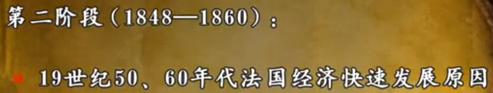

# 其他

## 莫卧儿帝国（印度）

## 萨菲波斯（伊朗）

## 七年战争（1754-1763）

主要人物-----普鲁士---弗里德里希大帝    英国-普鲁士   -----法国---奥地利---俄罗斯

# 西班牙的兴衰

16世纪的暴发户，17世纪的乞丐

## 哈布斯堡王朝

查理五世通过贿选，当选为神圣罗马帝国皇帝.在南方同奥斯曼土耳其打仗、在神圣罗马帝国内同新教徒作战。退休后，将帝国分为两部分（弟弟、儿子） 西部西班牙、尼德兰---哈布斯堡王朝西支。   东部神圣罗马帝国----哈布斯堡王朝东支(奥地利)。西班牙人有狂热的宗教分为。

菲利普二世（1556-1598）。继承了，合并葡萄牙王国，获得西班牙的全部殖民地。---上帝是西班牙人

由盛到衰。当时西班牙人处于强烈的宗教氛围。

原因：狂热的宗教皇帝（天主教）、广泛参与国际事务（主要帮助天主教进行战争）

英西战争

无敌舰队失败、英国战胜

# 尼德兰革命（1568-1648）

又称----八十年战争

hollland---森林   和南、阿南

1 手工业、商业、造船业发达

2 西班牙殖民地（勃艮第公爵---外孙--西班牙国王）。

和西班牙的矛盾

政治上：直接统治（总督）

经济上：加强税收

宗教上：宗教矛盾（西班牙天主教、尼德兰加尔文教）

# 迈向现代工业文明

科学革命、思想革命、政治革命、工业革命

## 科学革命

前者提出了许多问题，需要人去解决

文艺复兴的结果

东方知识

阿拉伯人的自然科学

古代希腊罗马的知识

提供理论武器（打破亚里士多德---哲学，托勒密---地理学，盖伦---医学家）

方法论上的创新---培根和笛卡尔

知识就是力量，力量就是知识。----归纳法  ---创造了试验

培根的生平----三一学院求学（牛顿也是） 三位一体学说   本来是培养神学

对詹姆士一世的效忠（掌玺大臣）-----同资产阶级的矛盾（议会）---发现受贿----不犯罪（收了钱不办事），犯罪（收了钱办事）

开始专注于学问---天才

死亡----研究雪，肺炎，放学

我思故我存（对所有的怀疑）

内容

托勒密----哥白尼  、、、伽利略用天文望远镜进一步证明

牛顿经典物理学-----对于技术的进步产生

化学

分析化学和元素----打破中世纪的四元素说（亚里士多德）

西医西药的思想----盖仑

游医-----不了解人的身体----经常将人弄死----神学不允许解剖

-----人体构造----不了解血液

《基督教的复兴》-------小循环理论                   反对盖伦的学说

判决-----文火处刑

大循环理论

人体构造弄清楚了。

技术的进步

科学着重于发现概念理论，技术致力于新的技术。两者相互促进

17世纪末   蒸汽机-瓦特     提升机

科学社团的兴起---英国皇家学会（民间团体）--私人、法国科学院---国家政策决定

影响：1 发展注入了动力   

# 理性的光芒

法国的启蒙运动

概说、前提、内容

## 概说

### 兴起

思潮--意识形态---批判封建社会

14---16世纪--文艺复兴

18世纪----启蒙运动

启蒙---启导蒙昧、 追求民主---专制   科学、知识--愚昧

用光明对抗黑暗

在法国启蒙运动规模最大（持续18世纪）

## 前提

### 17世纪荷兰、英国的启蒙思想

格劳秀斯--荷兰的法学家

法学思想很重要-----只有了法学思想，才会去建立法律、修改法律、完善法律。

大哲学家----祖先是犹太人、犹太教

放弃犹太教、选择其他教派、逐渐成为无神论者

托马斯霍布斯----无宗教信仰

在哲学是开放的，在政治上是保守的。

在英国革命中，是维护君主制。

约翰弥尔顿。

政论很强有力的

约翰洛克

1640-1688  1689 1701  

为英国革命做理论依据

《政府论》

### 总结

1 理性，人通过自己的判断，去处理事情。（在中世纪，教会说了算，王权说了算。人只能依从）

否定封建统治者的王权，教会的神权。你说的东西不一定是对的。

2 自然法的理论

中世纪的法----神的法、国王的法。上帝的意志是真正的法，上帝的法神圣的。

启蒙家否定神的法，真正的法是自然的法，是在人类社会之前就存在的法。不是神造的，是自然的。是为了和平安宁、自由。自由、生命、财产是不可剥夺的。

3 人的自然权利

人有与生俱来的权利。----生存权、思想自由权、行为守法权。活着必须守法

后来---言论自由、信仰自由、婚姻自由（因为没有自由）

主权在民---洛克。政府是受 人民的委托帮人民办事的。

4 社会契约

人权是受到制约。人通过锲约组成共同体，为了安全更好的生活。社会锲约限制人的活动。

第二个前提

### 近代自然科学（培根、牛顿）

一般介绍

启蒙世纪（18世纪）

孟德斯鸠、伏尔泰

笛卡尔--启蒙运动的先驱

我思故我在----因为我想了，所以有我这个人。

思----怀疑   不要以为教会说了什么就相信什么、怀疑什么    是对教会和王权的怀疑

不对的东西就要去除的

 笛卡尔的追随者

## 内容

三位空想社会主义

具有空想社会主义的思想

# 市场经济体制

推书

布罗代尔----《菲利普二世时代的地中海和地中海世界》

《剑桥欧洲经济史》

### 概念

自然经济：个人或单位（庄园）自给自足的经济。目的：不是为了交换、是社会生产力低下、社会分工不发达的产物。在原始社会、奴隶社会、封建社会占主导地位。

商品经济：生产、分配、交换、消费都必须借助商品货币关系来进行。

商品经济资本主义的商品经济和社会主义的商品经济

市场经济：是通过市场来进行交换的经济行为。是由价值规律自发调节的一种商品经济。由市场供求关系和价格调节。----占主导地位

计划经济：在生产资料公有制的基础上，国家统一管理计划

### 市场的发展

初级市场：一定的频率进行市场买卖（做成买卖，需要碰运气，在大街上碰运气）

专业性集市：商场、专卖店  

交易会和批发市场

商品集散地和贸易中心

13、14世纪：地中海为中心：意大利佛罗伦萨、威尼斯

15、16世纪：阿姆斯特丹、安特卫普

商路的改变：

重商主义

重视商业

保护关税

对外贸易进行垄断

是零和游戏

（商品交易所、黄金交易所、期货交易）

汇票制度

保险贸易

### 生产组织形式的发展

租地农场（圈地运动）

公司

无限责任公司

### 新理念

**产权观念**

所有权和经营权分离

私有的观念更强

**复式簿记法**

复式的记账法（过去式单一的记账法）

多本账

不仅能看出收入支出情况、损益情况、资本情况

**面向市场**

**垄断与投机**

荷兰的郁金香

# 英国资产阶级革命

手工业---纺织业

农业---圈地运动

工商业阶级、新贵族兴起

1640年，长期议会的召开---标志着开始

英国内战---克伦威尔---新模范军         查理一世---断头台

斯图亚特王朝复辟-----

光荣革命---权利法案--议会至上，王权限制

封建王朝---资产阶级共和国（克伦威尔护国政府）---复辟王朝----君主立宪

议会传统

乡绅                     上升派 （）        下降派（）

国家建构   收税    国王---建构国家   议会----抗议                       

早期斯图亚特王朝的矛盾

法律传统：普通法：王在法下

强大的议会

缺少常备军

------导致对英国王权的限制，通过合作而非强制，通过税负而非暴力征税

在伊丽莎白时代就潜藏着两个问题

两个问题：财政问题、宗教问题

# 法国的绝对君主制

## 绝对主义浅析

专制主义、绝对主义

共同点：中央集权

绝对主义不等于专制主义，国王并不能专断，必须遵守神法、基本法、普通法。

19世纪前：批判

19世纪70：肯定

20世纪：后修正

20世纪70年代前：绝对权力、绝对强大。压制反抗力量

20世纪70年代后（修正学派）：

1绝对君主并不绝对，在实际实践中存在种种约束。虽然没有中央的三级会议。但有各种组织（高等法院、省级的三级会议、其他的地方组织）进行约束。

2 **国王与精英阶层是妥协和合作的关系（社会合作）。并不是专制主义的暴君，而是王国的最高总裁身份。最主要的目的：维持各种利益团体的和谐。“绝对主义正是贵族和精英阶层共同服从的结果”**

20世纪70年代后（后修正学派）：对前两点的质疑

15、16世纪  ---王权构建的第一阶段

打断：宗教战争（30多年）

## 宗教战争（1559-1594）

由称胡格诺战争

### 原因

**宗教原因**

加尔文教在法国传播。

1561年  法国1600万   有200万新教徒   

早期对新教徒宽松，1540开始镇压

**王权式微**

16世纪中叶。吉斯公爵---天主教      

美第奇王后权大。执政

**外国势力**

英国（新教支持）、西班牙（天主教支持）的插手

**宗教战争是以宗教为名的权利之争**

### 过程

序幕，吉斯公爵屠杀新教徒

1572、婚礼。新教海军上将被刺失败。害怕新教徒闹事，王后决定对胡格诺教徒进行屠杀。约三万人被杀

事后，新教徒发布反王公告。

纳瓦尔国王----波旁王朝

## 重建（1598---1715）

### 亨利四世

怀念和平

亨利四世---原本新教教徒   重新信仰天主教

宣布新教的合法权利

重视工商业的政策----重商主义的早期思想

### 黎塞留和马扎然

路易十三（小孩）即位，王后执政，黎塞留任首相

非常有才华

黎塞留 ---评价褒贬不一

始终将法国的利益放在最高等。王权大于神权

1新教城市（南特敕令后的异常）割据、 最终解散了新教的军队。 

2 国家文化宣传的控制 

3 扩张海陆军 

4增强国际地位

路易十四时代

路易十四（5岁）

安娜摄政、马扎然继承黎塞留

不能满足军费开支，借费用，福隆德运动。-----逃亡

国家无序------人民对秩序的渴望

### 路易十四时代

富凯---首相的野心

取消首相制度

“国王独掌大权”

“朕即国家”

强化王权

宗教：1 加冕   2  提高了高卢教会的独立性  3 强迫新教徒改宗

科尔伯----重商主义的经济政策

军队：7万人---40万人

长期战争、债台高筑

路易十四时代是法国绝对君主制的鼎盛时期，也是由盛转衰的时期。

# 普鲁士和奥地利的崛起

## 三十年战争（1618-1648）

**宗教原因**

1 四个天主教 ，三个新教。“教随国定”-----在谁的邦信谁的教。

信仰的转变，涉及到教产的利益。

帕拉其拉特----选侯--加尔文教

新教联盟、天主教联盟的矛盾

**政治斗争**

内部

双方实际上打着宗教的口号，实际上的利益冲突。

诸侯想维持皇帝有名无实的状态

哈布斯堡长期占有皇帝职位--------增加皇帝的权利

**国际政治**

处在欧洲的中央地带、又没有地理阻碍

西班牙（奥地利哈布斯堡家族）与荷兰（北欧新教国家瑞典）

哈布斯堡家族与法国的冲突（哈布斯堡通过联姻对法国的突围）

波西米亚----首都--布拉格

将皇帝的两名使者掷出窗外

废除皇帝任命的国王，奥地利对波西米亚（新教）发动战争

**丹麦时期**

结束:《吕贝克合约》 神圣罗马帝国胜利

**瑞典时期**

神圣罗马帝国胜利

**瑞典—法国时期**

政治上被肢解

领土上缩小

德意志300个邦（外交、签合约）

现代意义上的主权国家出现（主权意识的兴起）、近代国际法的源头（主权原则、自由原则）、其他（使馆、通过会议解决争端）、德意志遭受打击（经济受到损害，人口减少）

## 奥地利的崛起

## 普鲁士的崛起

弗里德里希大帝、开明君主制的典型、启蒙运动、伏尔泰

# 俄罗斯的西化

彼得大帝

叶卡捷琳娜大帝

# 科学革命

一种认识世界的理念、方法

## 17世纪之前的科学

蒙田-----"我知道什么呢"                 我什么都不知道    

迷信（1450-1650）------罗马天主教不能提供思想、信念的指导 （对于受教育程度不高的人的影响）                       白巫、黑巫

黑巫-----巫术恐惧（对未知的恐惧中）-----进而产生巫术迫害

1450-1750  10万起巫术审判

巫术迫害为什么不在中世纪、而在近代早期呢？？

地理因素----发生在山区、边缘地区、王权管不到的地方

气候因素-----小冰川时期、农业欠收

宗教------------宗教改革与巫术迫害的相关性（是否有因果性）、

政治----------上层精英文化试图同化下层

社会经济-----变革导致社会的紧张关系（老太太还属于依附的思想，但新的一代人）

在1617世纪还存在许多迷茫

## 天文学

## 其他科学

## 原因

1 大学的建立、

2 古典学说（各种原理上的矛盾）

海外探险：经度的测量、其他的要求

方法论：从理论或者说哲学角度上去---科学

经验、试验的研究

科学方法：归纳法和演绎法、建立在观察和试验的方法之上的

## 意义

1 宇宙是一架巨大的机器，人对宇宙是可以理解并且可以驾驭的。

2 科学得以流行并予以尊重（基督神学被削弱）

无论是在变好还是变坏，欧洲的气氛正在从超现实主义变为现实主义。

数学---弹道---军事科技

# 关于人类和社会的新知识

## 怀疑论思潮

1 欧洲的风俗习惯并不是唯一的（也不是天然的和必然的）。进而对自己的风俗习惯的反思。社会的风俗习惯并不是固定的。

2 宗教是相对的（之前宗教的偏执）。宗教因为因为土地、人各方面而不同的。人类信仰的多变性。进而产生宗教宽容

对于传统的打破是很有力的，但还需要建立起新的证据和思考事物

## 新的证据观

1 先取证，后相信。（实验）

## 自然法学派

政治学：关注应该是什么？什么是对的？重建人类的是非标准（自然公理）---自然法的黄金时代

人类共有的权利和正义，是不成文的的公认的。

斯多葛学派----提出自然法自然权利

宇宙中应该有一套明辨是非的法则，有的权利是天赋的，是来自自然的。不是传统、风俗、法律决定的。不是成文法，是凌驾于所有之上的。

人能凭借理性可以认识和了解自然权利

对于人来说，就是由人的基本性质决定了不可避免的要产生的准则的集合。（和平共处、信守承偌，平等、自由、遵守婚姻）

格劳秀斯---国际事务----世界大同----《战争和和平》

普芬道夫

一切国家都应该服从良知和正义

自然法原则被应用到政治上

马基雅维利将政治从神学和宗教独立出来

当时欧洲的政治理论：绝对主义思潮------君权神授  ；  宪政主义思潮

政府的权利既不是上帝授予的，也不是因袭传统，而是基于个人与政府的合理的锲约之上的。（契约论）

霍布斯---锲约论---为绝对王权辩护

洛克----锲约论----为宪政主义辩护

国教徒--认为只有一个绝对权利的王朝才能维持稳定和和平。

可以说第一个将理性应用到政治学的。

人性的看法：在自然的状态下，人没有自控能力的，残忍的、邪恶的、缺乏远见、经常厮杀、处于一切人反对一切人的战争中。

人不过是偶然才有理性，人实在是感情动物。特别是在追求权力的时候，仅仅是将理性作为欲望的工具。

每个人送出他们的权利和力量与一个人，这样使人群结合在一人之下的共同体（这个人是元首）。元首的权利来源于个人而不是神授（将上帝和神学从政治学中驱逐出去，解掉了笼罩在国家权利之上的神秘和迷信的色彩，将政治学的分析建立在理性分析上）。

一个君主，必须拥有绝对的权利，如果没有绝对的权利，将不能保证个人和团体的和平。反抗君主，就是反抗所有人接受保护的锲约。如果权利分散、将会产生冲突、战争。（缺点---怎么保证君主不侵犯人民的权利？？）

与马基雅维利的区别--霍布斯--绝对权利只是一种促进个人福利的权宜之计（必要的手段）   不同于集权主义，起源于合乎权利的契约

霍布斯处在伊丽莎白一世、亨利四世、黎塞留时期。

缺点--如果政府有问题，应该同意去制衡这个政府和推翻这个政府的权利（怎么防止利维坦不作恶）

限制王权、权利分散的自由主义哲学所取代。支持议会

1 两篇政府论---论证光荣革命的合理性

2 人性的看法：比霍布斯更加温和。处于自然状态的人的是通情达理，心怀好意的，自由平等。享有天赋的权利，是不可让渡的。（重视财产权）

2 锲约不是无条件的。而是有相互义务的（个体通情达理，政府毁坏了锲约，人民没有听从政府的义务）。

3 政府的权利不是专断（也不能是专断的）。分权学说---立法权、行政权、司法权---建立混合制度（君主-寡头--民主）。

影响----为光荣革命正名（合理性）---（理性、自然权利、人性）---论证了

使得立宪政治的传统成为世界政治最主要的主题之一。

# 启蒙运动

17世纪 科学革命的世纪（理性认识自然科学）

18世纪 启蒙时代（理性认识社会）

## 基本特点

虽然各自的观点不尽相同，但有以下的相同点。

启蒙----让光明照明人类思想的黑暗，用批判性的理性和科学方法驱散无知和迷信。

**崇尚理性**

在17世纪，思想上的顿悟。18世纪，与迷信和蒙昧相对应的理性之光。

康德-----人类脱离自己所驾驭自己不成熟的状态（人本身是具有理性，在成长中，习惯有服从于惯有的习惯，不能再使用理性进行思考）  要敢于运用自己的理性

人崇尚理性意味着人不再通过信仰去思考事物，而是通过理性、批判的科学对事物的认识。

**批判精神**

康德-----我们的世纪是批判的世纪，一切都必须经过批判，以神圣为借口的教会，以法律为借口的君权往往想逃脱批评。但正是他们激起了正当的质疑。

最突出的载体-----和字典文化紧密联系在一起（象征性工具）。狄德罗的百科全书。 字典的主编之中，兼收并蓄，主要体现在，对每个领域的知识进行质疑，然后对经过思考的知识纳入字典中

**崇尚进步**

人文主义者----是一个再生的时代，并不一定能超过古人。

在1718世纪，古代人和现代人的争论。（古代人---并不能超过希腊罗马，现代人----成就是超过古人的）

1700年左右，现代人的观点在欧洲逐渐占据了主导。

18世纪，欧洲经济增长、社会进步，思想家更加确信有创造更好社会的肯定。随着时间的推移，人类的社会生活会越来越好。

启蒙运动在文艺复兴和宗教改革后的世俗化运动。

1715年，路易14去世，虽然科学革命对欧洲产生了巨大影响。但是基督教在欧洲还是维系着最古老的的传统的信仰。到1775年，大部分欧洲的精英接受了比较新的思想。启蒙思想主要对精英阶层产生影响

## 启蒙三杰

启蒙哲人---新知识新观点的一种宣传和普及，承担社会改良和人性改良的责任。

### 孟德斯鸠（1689-1755）

继承法院院长的职位，后又埋掉职位，开始游学生涯。

《论法的精神》----启蒙运动的奠基之作

从自然和理性前提下出发，反对君权、教会。

一个好的法，1必须尊重一个国家的历史。2还必须和自然坏境相适应（地理环境绝对论的奠基人）。 3 

两个思想-----政体（君主（by law）、共和（民主和贵族）和专制） 君主和专制的区别（by law）

分权----为了保证人民的政治自由

法兰西思想之风

比较富裕、庄园、著作等身、在18世纪非常受欢迎（易读）。

关注思想之上的自由

言论自由、出版自由。“我不同意你说的每一个字，但我誓死捍卫你说话的权利”

抨击教会权威---擅长使用 悲剧和短诗

让卡拉（新教）  儿子吊死（被强迫改信）

不仅是思想家，也是斗士。

用世俗的观点撰写世界历史。

伏尔泰----拥护开明君主制

外国人、出身寒微，

反文明、反社会、反理性

人天性是善良的，是社会让他变坏（自私、贪婪是文明带来的）。

自然、直觉、本能的东西。（自然之子）-----强调非理性、潜意识的东西。

教育是让儿童自然、本能地发展，而不是被社会、文明同化。

娶的老婆很丑---一年生的五个孩子----都送进了孤儿院

在忏悔录中承认自己的过错-----寻根是社会的原因-----得到安慰

民主思想-----出身低微----更多关注的是平等的思想

提出了主权在民的思想

放弃掉个人的部分权利、所有的人组合成共同体。政府、政府官员不过是人民的代表。

《独立宣言》----人生来平等

《人权宣言》-----   生来且始终平等

只关注共同体，而不关注政体，被后世的野心家打着旗帜而走向集权主义

人道主义思想：要尊重平民、

## 原因

识字率： 提高对于思想的普及

出版业的兴盛：1731--400都500多种   1789 1000-1200种

思想交流和传播渠道：沙龙（尤为重要，许多贵妇、名媛都召开自己的沙龙）、学院（一种普遍的重要的途径）、大学

启蒙运动的研究：传统都是对经典哲人的研究，---到从上之下的研究

**-达恩顿的研究**

《启蒙运动的深意》《旧制度下的》---达恩顿

不是以对哲人的关注，关注的是穷困潦倒的文人、出版商、禁书。拉进了与普通大众的距离。----高层启蒙运动

三个阶段--------

18世纪780年代：伟大的哲人去世，大多出生在有闲阶级

第二代：

第三代：在旧制度得不到重视的文人（怀揣文学梦想）。诋毁教会、宫廷、沙龙、学院等。毁谤文学。

#### 政治影响:开明君主制

伏尔泰鼓吹开明君主制

代表人物：弗里德里希大帝、叶卡捷琳娜大帝

弗里德里希大帝（被伏尔泰誉为最开明的君主）

叶卡捷琳娜大帝（资助百科全书的修订）

1 世俗的

2 宗教宽容

偏执的耶稣会被驱逐

3  明事理，兴改革

# 美国革命

由于葡萄牙被合并、殖民地也归属于西班牙

西班牙最早在佛罗里达建立殖民地

尼德兰、法兰西、英国开始殖民

1664年，新阿姆斯特丹之战荷兰失去新尼德兰（新阿姆斯特丹）

七年战争法国失败、殖民地失去

大西洋革命

早期、近代、现代（1776美国的建立，美西战争）

## 印第安传统

1 开发农业的奠基者，玉米、烟草、土豆

2 指路人

3 文化影响

表面：（地名很多来自印第安语）

深层：

毛皮贸易、毁灭性的灾难（流行病）、

一般看法：美国的早期历史是对印第安人的剥夺、驱赶、杀戮

## 殖民地的建立

16世纪 西班牙、法国、尼德兰、英国建立殖民地

弗吉尼亚殖民地（纪年英国女王）----处女地

五月花号----马塞诸塞州

西班牙主要是建立军事据点

英国殖民地后来居上的原因-英国开始殖民

业主殖民地：业主发现，英王批准

各殖民地和英国国王垂直管理，彼此没有联系

是菱形结构（中间大、两边小）

契约奴：欧洲的穷人移民到美洲，锲约5-7年为主人工作

1 民主成分（议会）

2 没有封建成分（没有等级观念），一开始就带有资本主义生产关系

3 地方自治（北方村镇自治）

1 新英格兰地区：土地贫瘠、无法适应农作物的发展。造船业、

2 适合农作物种植。农场。18世纪中叶：费城（23000）  纽约（15000）

1702 27 万人

1770 220万人

3 南部：土地肥沃、空气湿润。种植园

奴隶制庄园不同于古代（面向商品经济）

共同点：生产、交换很发达。越过中世纪的封建关系，直接发展资本主义的生产关系和生产方式。

## 美利坚民族的形成

1  差异性、商品交换、经济交流

2  文化交流

1共同的地域（大西洋沿岸）

2共同的语言（词源、来自中下层人民）

3 共同的经济生活（北部：工商业经济 中部：农业  南部：热带的种植园经济） 差异性、互补、商业的发展（互通有无）

4共同的文化（以英国的文化为主）洲际性的大学的建立（以哈佛大学为代表、耶鲁大学、哥伦比亚大学）

麻塞诸塞  议会 决议 建立大学（Cambridge-坎布里奇）

富翁（哈佛）---捐献给大学（779英镑）  改名哈佛大学

### 北美人文化素质

五月花号公约（1620年）

此时英国还没有发生光荣革命

102名   新教徒

为了殖民地的公众利益，我们将根据这项锲约颁布我们应当忠实遵守的公正平等的法律、法令和命令，并视需要而任命我们应当服从的行政官员。

《五月花号公约》、《独立宣言》、《1787年宪法》美国历史上比较重要的文件

克雷夫科尔-----移民的命运，取决于他们的斗争的命运和切断家乡联系的意志以及在陌生人中间、陌生的土地上艰苦生活的能力。

在这里，不问你父母是谁，过去是干什么，是问你现在干什么的。

追求自由、平等。

### 独立战争爆发的原因的争论：

1 英国为了压制美国的自由

2 英国与北美殖民地交流的过程中的两种倾向（中央加强控制，殖民地自由）

3 经济矛盾是主要的

4 是有些人宣传鼓动的结果（富兰克林）

关键词：压制、发压制

## 压制与反压制

1 打压殖民地的竞争、产业的发展。

但效果并不好（1756-1763年七年战争，为了动员参加战争，放松了管制）

在1763年后，政策的改变

政策的改变（主要是为了捞钱----英国因为战争---财政危机---加强了征税）

土地问题：英国没有兑现西部土地的承诺

驻军问题：要求北美殖民地给军队提供各种物资

7年战争，因为战争财政拮据。之前，殖民地是不征税的。

食糖法：对输入北美的糖类课重税

印花税：跟纸相关的都要交税

颁布税法，没有经过殖民地的同意和参与（英国传统无代表，不纳税） 殖民地涉及到人民的根本（自由和权利）

税法激怒了当时北美人民。

由经济问题逐渐升级为政治问题。

背景：东印度公司积压了大量的茶叶、英国政府为了拯救东印度公司，允许其向北美倾销茶叶（东印度公司危机）。

买贵（韩寇克）不卖便宜的（东印度倾销）-----争取自由、民族

反对茶叶船靠岸

为了报复北美人民的做法，颁布了多项高压法案。

在反对英国的压制过程中：

提出口号：无代表不纳税（没有议会代表，不纳税）

在费城召开第一届大陆会议

任然表示效忠国王，没有表示独立。但国王对于人民的弹压

## 独立战争的进程

第一枪

决定武装反抗

**1 大道理、真理**

 天赋人权、契约论

政府侵犯了权利，人民就有权利反抗，建立新政府

**2 列举英国国王在美洲的罪行**

**3 宣布独立**

1 第一次以国家的权利宣布人民的权利是神圣不可侵犯的（以前在启蒙运动只是少数人的看法）

2 将资产阶级的需求以法律的形式固定了下来

人人平等（是有限制、不包活黑人、妇女等人）

### 萨拉托加战役

之前，美军处于劣势（纽约、费城被攻占）。

在萨拉托加战役战胜（鼓舞了美国的信心，促进了法国对美国的信心）

78年2月，公开支持美国。

西班牙、荷兰加入对英国的战争。

1781年，英军将领对法美投降。

**1783年，巴黎和约**

--承认独立

--将法国原来的殖民地划归美国所有。

促进了---法国大革命、英国宪政改革、拉丁美洲的独立革命

### **胜利原因**

从力量来说，美国的力量是远远弱于英国

1 通行协力，反抗英国军队（黑人、百人，妇女，不同文化层次的人）

2 行之有效的战略战术（游击战）

3 成功的外交活动（法国，拉法耶特）

1 把英国的国旗

2 州越来越多

## 联邦制的建立

邦联制度：中央权力有限。

小洲怕大洲欺压，南方怕北方欺压。

邦联制的弊端：1 战争期间的国债无法兑现  2 没有统一的关税，不能促进国内的贸易  3 英国还构成美国的威胁（没有统一的军队）

1786年，缺点在谢斯起义中暴露无疑。

有人认为谢斯起义是1787年宪法制定的催化剂。在镇压起义过程中，早期没有军队。（强有力的政府是必要的）

召开制宪会议，确定了宪法

第一部成文宪法

需要一个强有力的宪法

1 国会 参议两院    众议院（两年一次）  参议院（每个州两名，任期六年）。

2 行政权力  总统掌握 四年  ；各个州选选举人，然后选举人团选举总统

3 司法权力 最高法院 最高法官。大法官(9人)-终身制

4 各州的权限

5 州和联邦政府的关系

差异

1 中央集权（）；1权力分散到各个州（立法、司法、行政）

 

## 独立战争的意义

1 历史上第一次大规模的殖民地争取民族独立的战争。推翻了 美国在美国的统治、建立了美利坚合众国，为美国的资本主义的发展创造了条件。

2 打开了大英帝国的殖民体系的缺口。为其他地区的殖民地民族解放运动树立了榜样。

3   加快了美国的民主化的进程，实施了一些保护美国民众。

4 给欧洲资产阶级革命有影响。影响了法国革命；给拉丁美洲反对西班牙和葡萄牙以巨大推动。

缺点：

1 美国的土地问题没有解决（阿巴拉起亚山脉以西的土地） 2 平等的权利（黑人、印第安人、妇女） 3 民主还谈不上（争议非常大，斗争，民主派获胜，1791年，宪法修正案，民众享有哪些权利（宗教信仰自由、私有财产））。

三权分立，相互制衡。

## 主要人物

华盛顿  大陆军总司令  主持大陆会议  1787年，当选为华盛顿。

1799年，急性咽喉炎，放血疗法，去世。

华盛顿纪念碑 1833 1855。埃及方尖碑、空的

华盛顿的评价  由人到神，由神到人。

客观评价：

军事家（不是杰出的军事家）

著名的政治家（缺少创造性的创见）

**华盛顿的影响**

1  团结(内战) 2 中立思想

# 法国大革命

路易十四、十五、十六

## 三级会议和革命爆发

大革命以前：旧制度（制度、文化、习俗所有的一切    18世纪初到1789年）

17世纪后半期   路易十四时代后，由盛转衰。到1715年，留下了一个烂摊子（外强中干）。

1 旧制度阻碍着资本主义的发展（报税制度、国债制度），王朝向大资产阶级敲诈勒索

2 阻碍着工商业的发展（早期，严格的工业法规是好的。到工商业持续发展，这些法规就不合时宜了）

3 税收加重（1715-1786年 增加十倍）

4 频繁的对外战争（税收、财政） 1756-1763年7年战争

面对种种危机，波旁王朝也经过了种种改革。

1774年  路易十六登基。

杜二阁 重农主义  改革   得罪了特权等级   1776被迫辞职

莱克（银行家） 改革 王室开销太大 下台

.......

### 三级会议

路易十六 ------三级会议

三级（教士、贵族（宫廷、穿袍贵族--花钱买来的、乡居贵族）、其他人（农民、工商业者、城市平民、资本家））

三级会议：1302年----1614      1614---1789（没有开，说明王权的加强）

1789年的三级会议，第三等级对于三级会议有新的主张。资本家（资产、文化、启蒙思想）。资本家渴望改革（将启蒙思想的理论付诸实践）。城市平民渴望减税。农民要求摆脱领主的压榨。不再是1302年了。要求废除以前三级会议的形式。

300-300-300，要求300-300-600.

第三等级（律师、资产者、法官、有几个贵族和教士---自由派贵族）

三级会议召开

路易十六，讲话，拿钱解决政府财政危机。改革是不太可能。（拿钱、不改革）

第三等级、和王权发生矛盾。

脱离出来，成立国民议会。--不承认三级会议。

《论特权，什么是第三等级》----表达了第三等级要当国家主宰的政治主张。

### 网球场宣誓

国民议会会场被封闭。到网球场开会

需要法治社会、需要宪法、无论在什么情况都不解散（直到制定宪法后）。----没说要推翻国王、宪法、君主立宪

资产阶级政治纲领形成的标志

贵族、教士中部分开明人士站到了国民议会这边（拉法耶特）

### 攻占巴士底狱

国王反对这一切

改名国民制宪议会（包括了三级会议的所有人员）

波旁王朝开始调兵、准备镇压。

莱克被免职-----示威游行-----起义-----扩大、全面爆发---接管了巴黎市政府----建立常设委员会、国民自卫军

帽徽--蓝白红----巴黎人民的蓝红和波旁王朝的白结合

听闻政府军要镇压---攻占巴士底狱（封建制度的堡垒）

法国革命的标志事件。

**影响**

1 巴黎以外的城市效仿巴黎

2 农民暴动

3 国王认可新政权

​         接受了蓝白徽的徽章

君主立宪大致实现

## 君主立宪派统治时期（1789年7月-1792年8月）

主导派系：君主立宪派

做出了卓越贡献

**八月法令（反封建）**

部分贵族提出自愿放弃自己的封建特权（赎买）

提出废除政府弊端、废除贵族特权（残余农奴制、司法特权）-----实现条件赎买

**《人权宣言》**

自然的、不可剥夺、神圣的人权（天赋人权）  在权利上是人人平等    

法律不是上帝意志的体现、国王意志的体现、而是人民意志的体现。在法律面前人人平等、

财产是神圣不可侵犯的权利。

路易十六批准了八月法令，但拒绝了人权宣言。

调来了军队，准备镇压革命。

经济受到影响（物价通货膨胀）

妇女群众冲向凡尔赛宫、革命自卫军。国王迁回巴黎

### 革命社团

布列塔尼俱乐部、雅各宾俱乐部（宪法之友） 吸收非制宪会议的人  拉法耶特（两个半球的英雄）

89年俱乐部 拉法耶特

制宪会议立法

该组旧政权（83个省、市、县）、地方官员由选举政权。

司法独立。

1 中央有立法议会、地方官员选组、司法独立

2 消灭等级制度、改造特权阶级

**教士**

没收教会财产

以财产发布指券

教士世俗化、国家化

**贵族**

废除贵族制度

制宪会议---立法会议

3 下令废除了各种阻碍资本主义发展的制度和规定

4 建立秩序的法令

### 瓦伦事件

国王逃跑（妻子是奥地利公主）---瓦伦事件

第一次民主共和运动。

制宪会议-------双刃剑

君主立宪派（不费路易十六，维持稳定，不得罪欧洲封建势力）、民主共和派（激进）

马尔斯校场事件（资产阶级镇压民众事件）

群众集会、戒严法---警告、

共和运动平息了

**君主立宪派主要人物**

巴纳夫、米拉波、拉法耶特（两个半球的英雄）.塔列朗

### **1791年宪法**

政体----君主立宪

权利分配----立法-立法议会，行政权--国王（不可以逾越宪法），司法权--司法

立宪制的君主不同于封建制的君主。

宪法对选举制度作出的规定是，年满 25 岁的男子为公民， 年缴纳直接税达 3 个工作日工资者享有选举权，称 “积极公民”；不纳税者或纳税低于这一数额者无选举权，称“消极公民”。这就使总数 700多万的公民中有大约 280 万人被划为“消极公民”。（对于性别、年龄、工资有限制）。

制宪会议的人自己宣布解散。立法议会取代制宪会议（立宪派--温和派，激进派--共和派 大商人 大船主 ，极端民主派-----越来越接近下层民众）

### 内外交困

革命后，内外交困。经济难免受到影响。奥迪地、普鲁士反对革命政权。

君主立宪派（要求不打仗，维持现状，保卫革命成果）

吉伦特派（主站）

罗伯斯皮尔（主张不打仗）

最终奥地利、普鲁士军队逼近，宣战。

第二次民主共和运动（祖国陷入危机的根源，就是国王本身）---废除了君主制

==法国大革命------最终拿破仑独裁==

==俄国革命--------最终斯大林独裁==

==中国革命---------毛主席的个人崇拜==

## 吉文特派掌权时期

国民公会-----立法议会

废除君主政体，成立共和国（吉伦特派、雅各宾派）

斗争---怎么处理国王---（吉伦特派袒护、雅各宾派处死） 吉伦特派因为袒护国王，权威扫地。

==在内外交困的情况下，在野党、少数派更容易获得支持，从而执政。==

==法国大革命第一阶段-----君主立宪派-----内外交困，吉伦特派做大。==

==吉伦特派做大-----内外交困----雅各宾派做大==

中国

**及温特派主要人物**

布里索

## 热月党人和督政府

### 热月党人的统治

热月政变（温和派、大资产阶级、部分保王党份子组成）

镇压芽月和牧月暴动（雅各宾派和无裤套汉）

基贝隆战役表明，热月党人决不让旧制度复辟（保王党份子）

共和三年宪法、镇压葡月暴动

### 督政府时代

巴贝夫和平等派密谋

果月 18 日和花月 22 日政变（镇压左派，又镇压右派）

雾月政变

法国大革命：革命、政治、军事、英雄、悲剧、理性、追求、左右派

中国革命：

俄国革命：

# 拿破仑时代

## 影响

### 普鲁士改革

1807年，施泰因、哈登堡改革

1 十月敕令，废除农奴制（打击了部分了封建义务特权）  

2 军事改革（以前军国主义，容克贵族当官，没有积极性）

3 促进工商业、废除行会制度

4 政治改革

5 教育改革（设立教育部，洪堡-柏林大学，洪堡大学）

## 维也纳会议

封建势力暂时压倒了资本力量

奥地利、俄国、普鲁士、奥地利、法国

大国交易、幕后交易

实质：恢复封建秩序，表面上是恢复和平。

俄国----希望做欧洲霸主，建立控制波兰王国、德意志的分裂化、不不建议过分的削弱法国

英国-----希望欧洲保持均势，削弱法国，不使俄国强大，从而能保持仲裁地位，增强奥地利、普鲁士

奥地利------削弱普鲁士、俄罗斯

普鲁士--------盐城法国

法国-----------利用胜利者的斗争。提出正统主义原则，，补偿原则

波兰和萨克森问题

-----在普鲁士属---华沙大公国、-----从萨克森公国补偿

俄国获得大陆利益最多、英国获得海洋利益

最后议定书

1 恢复欧洲的封建秩序

2 

3 建立德意志邦联（奥地利担任主席）。普鲁士和德意志争夺

4 对法国的处置

一直持续到1848年

大的国际会议

1 威斯特法尼亚会议

2 维也纳会议

3 巴黎和会

神圣同盟-----反动实力的大本营、俄国担任盟主。

# 拉丁美洲的独立运动

在美国独立战争、法国大革命的影响下

西班牙、葡萄牙的封建势力的衰落

## 1 海地革命

部分参加了美国的独立战争、在法国大革命的平等、自由的鼓舞下，鼓舞了海地人民。

宣告独立。

## 2 西殖民地的独立斗争

克里奥尔人----土生白人（有别于西班牙的本国人）----主要领导人

三个中心：墨西哥、南美洲北部、南美洲南部

### 2.1墨西哥和中美洲

1820年、西班牙的资产阶级革命

21 君主立宪

24 共和国

### 2.2南美洲北部

委内瑞拉

建立大哥伦比亚共和国

### 2.3南美洲南部

阿根廷独立

智利独立

秘鲁独立

## 葡萄牙巴西独立

王室逃亡巴西

反抗、君主立宪（君主是葡萄牙的王子）--自上而下

没有资产阶级革命和起义（保留很多旧的东西）

60年的对抗后，建立了共和国。

## 意义

1 国家独立

2 宣扬了自由、独立、平等的观念

3 废除奴隶贸易和奴隶制

军事独裁、黑人地位低下

# 英国工业革命

参考书目：工业革命（）、剑桥经济欧洲史（第六卷）、被遗忘的苦难、十八世纪产业革命、现代资本主义：三次工业革命中的成功者；英国工人阶级状况

## 1工业革命研究

**工业革命与产业革命的区别**

产业：一二三产业（农业、工业、服务业（包含商业））

从含义范围来说（产业大于工业）

产业革命（广义）：国民经济各个部门使用新技术，由此引起的经济发展和产业结构的根本变革。

狭义（狭义）：18世纪中叶到19世纪中叶

工业革命：从手工生产到机器生产；从农业文明过渡到工业文明；从农业社会过渡到工业社会；

**人类所经历的产业革命**

两种说法：四次、六次

18世纪中叶-19世纪中叶   蒸汽机

19世纪末---20世纪上半叶 电气时代

20世纪中叶----780：电子和原子能技术的电子时代

90年代后：计算机为核心的信息时代

六次：农业革命、商业革命、工业革命、电力革命、信息革命、生物革命

**产业革命与技术革命**

认识和改造自然手段和方法的革命（生产工具、工艺、流程、方法）

**工业革命史的研究**

汤因比 1884年  资本主义竞争替代中世纪的陈旧行会

忙图

我国  1957年  英国工业革命史   林泽岱

工业化的研究（现代化的重要部分）

## 2为什么最早在英国

前提和条件

前提：资产阶级的统治（指定政策更加考虑工商业）

必要条件： 雄厚的资本（殖民地，黑奴贸易，自身的原始积累）；充足的劳动力（圈地运动）；充足的自然资源（煤矿、铁）；现实的需求（人口增多、粮食增加、巨大的消费需求）；发达的手工工场（毛纺织业，规模和分工）和科学技术（以牛顿为代表的科学家）；出现了新的经济学理论（古典经济学---倡导自由竞争） ；

## 3进程

1 棉纺织业开始（1733年，发明飞梭，引起织布行业的革新）；织布的速度快了，材料不够（纱荒）；----珍妮纺纱机（纺织速度---为限）

水力纺纱机（以水为动力---经线，水源，办厂）

发明裸机；

水力织布机；

从手工生产到机械生产

穿衣问题

2 乔舒亚·韦奇伍德---制陶

陶瓷生产商

陶轮----陶瓷工厂------骨瓷

机器生产

3 蒸汽机的改良

瓦特改良蒸汽机

17世纪末----

-------------

最初------热能转化效率低

3 交通运输

轮船、火车机车

4 冶金业

焦炭取代木炭（温度更高）

生铁（2%）---熟铁（2-0.05）-----(钢<0.05)（含碳量区分）

## 4 影响

生产力的巨大提升，促进了经济的发展。

社会结果（工业资产阶级-----工人阶级）

改变了工业布局和生活面貌（现代工厂制度（系统化、产品的批量生产、产品的规格化生产））

环境和健康问题的不断恶化（后期开始工厂立法和福利问题）

# 欧美工业社会的诞生和民族国家的建立

时间：19世纪后半段（大致在1850后）

一个主题：工业革命的扩张和民族国家

工业文明相对于农业文明一个新的形态。

工业文明---扩展-----

**双元革命**

文明形态的转换（物质上的、经济上的转化，是异变的；政治文明上的）----双元革命（工业革命、法国大革命）

双园革命奠定了资本主义的经济、文化、政治问题。双元革命后，资本主义的发展只是时间问题。

工业革命（生产、生活、对资源的利用是巨大的变化）

法国大革命（革命不是造反，革命史一种哲学） 不仅仅是造反，暴动。按照一种蓝图去改造社会（法国大革命的蓝图是卢梭、孟德斯鸠、伏尔泰）。学法国大革命不应该只看到巴士底狱、人头滚滚。应该看到政府组织、法律、人权的变化。

启蒙运动设计了蓝图光说不做不行。

西方民主：三权分离、两院制衡、民主代议制、普遍的选举制度、公民权利、地方自治

政治某种理念的改变：以前政治是贵族的，老百姓不能玩。政治是神秘的--君权神授。   现在是大众精英政治，普遍的参与。

马克思-----经济基础、上层建筑去看历史。

**民族国家的成熟**

现代国家的形态（是和资本主义联系在一起）

民族国家前：人民、土地、国王比较混乱。要澄清法国人

nation（血缘关系、地缘关系、生活方式、宗教信仰、语言）

state（领土、主权、人民、政府）---政治

nation---state

# 法国

## 法国进入工业社会

法国的工业革命

比英国差不多晚30多年

### 条件

1 法国大革命（瓦解了封建土地制度，农民的解放：劳动力流动自由，土地买卖自由，投资经营的自由）     和劳役制庄园、农奴废除有啥区别

土地资料---生产要素

2 废除了旧 的工商业制度（行会制度、商业专卖制度）

行会制度、商业专卖制度----和封建特权（之前大大商人、资本家都和社会上层息息相关，不利于中小商人）

而资本主义强调自由竞争

3 第一帝国社会环境比较稳定

拿破仑时代不同于波旁皇朝：法治社会、资产阶级掌权

4 拿破仑战争

关系非常复杂（有促进作用、也有负面作用）

拿破仑战争-----大陆封锁-----英国实行反封锁：对外贸易打击很大，但是保护了本国工业？？？

资本积累（对外经济掠夺）

刺激了法国的国内市场

### 过程

#### 起步和发展

**第一帝国时期（-1815年）**

工业资本迅速增加、新开办的手工工厂、工业产量（70%）、纺织业开始了机械化

**复辟王朝时期**

政治上的反动,经济上普遍增长

1825年英国解禁（技术、设备、人才出口）

**七月王朝**

资本继续增加、工厂制、炼铁、机械、铁路热

**特点**

起步晚于英国，起点高于英国（后发优势），整个进程缓慢（主要原因：外来因素干扰 政治更迭 七月王朝----大金融阶级，不利于工业资本阶级）。

#### 完成

**发展的原因**

外部因素：560年代现代资本主义经济发展第一个黄金时代

自身因素：革命因素（1848年---可以看成法国大革命的延续）；

第二帝国时期，20年相对稳定的时间。

产业:机械制造业和重工业的

致命：殖民扩张进入第二个时期（从暴力过渡到商品竞争，原料的产地，商品的销售地）

政策：发展经济（自由贸易政策、奖励科学发明、奖励科学创造）

### 成果

1 重工业和交通运输业有了大的发展

2 金融业的发展

3 外贸的增长

4 城市化的发展和民众的生活水平的提高

## 法国政治（1815-1870）

复杂多变（政治斗争）

波旁王朝、法兰西第二共和国、第二帝国、第三共和国（第二次大战 1940）、法兰西第四共和国（议会制）、法兰西第五共和国

### 复辟王朝（1815-1830）

16年、路易十八、查理十世（和路易十八、路易十六是兄弟）、

路易十八-----英国撑腰    查理十世-----本土保皇派

两次复辟

基础：两块（旧贵族和大资产阶级暂时的联合）---实行妥协政策----法国大革命和旧制度的妥协-----有理智的妥协

1814年宪章----既有浓厚的旧制度的色彩，也有大革命色彩。

钦此宪章------君主立宪（君权神授）

国王至高无上、一切权利属于国王（内政、外交、军事）

民权----出版自由（不能滥用）、信仰自由（天主教为国教）---信仰不平等、议会选举制度（年龄和财产的资格限制，30岁，纳税300珐琅---符合条件不足十万人；被选举权（1000珐琅，不到两万人））   

承认自由、平等原则

确认大革命造成的财产变动（稳定社会的重要措施）

主张宽容（不算账）

前政府授予军衔、职位、债务一律承认。

司法制度-----继承（拿破仑法典）

革命是哲学，复辟是艺术。

维护复辟统治（维持议会的平衡，极端君主派，立宪派）

无双议会（保皇派：民主派  7:1）

保皇派：极端君主派极端右派

铁杆的支持者不多（黎世留）

解散了无双议会、重新选举（极端君主派失势，立宪派）

到1820年从极右派逐渐过渡到中左派（共和派）

贝里公爵被刺（查理十世），给极端派给了接口，法国政局右转。---双重选举法（转折点）

430个席位（258席位----选区选民团，剩下的由纳税最高的1/4郡再投票）  金钱--权利  代表了大的有产者的力量  

为极端君主派的崛起铺平了道路

1824年，查理十世，国家部门被右派掌握。	政治平衡被打破了，离倒台就不远了。

颁布了一系列法令（赔偿流亡者10亿法郎；亵渎圣物制罪法；出版重税）

1826-1830年，农业危机，引起了工商业危机，失业人口，社会矛盾激化。

政治危机加深（1828，极端议会选举失事，但查理十世依然任命保守内阁），查理解散议会。

七月革命---八万人起义

推翻了复辟王朝

意义：1 阻止旧制度的全面复辟，再次建立资产阶级。

2 冲击了维也纳会议，打击了神圣同盟。引导了欧洲的革命

### 七月王朝（1830---1848）

阶级王朝（金融资产阶级的政权）

奥尔良王朝

国王：路易.菲利普

从正统派别来看不是正统国王

参加过法国大革命（路易平等上了断头台，路易逃亡）

路易跟大银行家比较熟	

路易（世俗化、热衷于挣钱）

可以看做事复辟王朝的延续（君主立宪制度、王统）

1 纯粹的资产阶级的君主立宪（两个权利中心：国王、议会）

2 确立了人民主权的原则（相对于君权神授）

3 废除了百合花的图案（王室的族徽）

4 扩大了选择权和被选举权的范围

早期具有进步的特点

缺点：注重扶持金融业，优待银行家，倚重资产阶级的最上层。议会中政局不稳定反对派（右派：正统派 波旁家族 左派：资产阶级共和派）

支持派（君主立宪派 ：运动派（实行渐进的社会改革）、抵抗派（即抵抗复辟，也抵抗前进））

内阁：基佐

矛盾错综复杂（niang起义）

1848年革命，七月王朝覆灭。

原因：1 经济政策偏差（优厚偏袒银行、金融，工业、农业、商业发展不足）  2 王朝后期的保守（行政过于求稳，稳定、秩序，外交保守）   3 官场腐败  4 1846-1847年 经济危机

宴会运动（政治危机）

在二月革命被推翻

### 第二共和国（1848-1852）

废除奴隶制

男性公民的普选权（第一次  ？？？ 1793年？？？）

路易.波拿巴---法国王权派的波拿巴派

共和国选总统选出个皇帝

为什么能当选？？？

1 资产阶级共和派丧失人心（临时政府解散了国家工厂（工人）-六月歧义---出动军队镇压起义）

2 经济困难，加税。

3 拿破仑一世在农村中的影响（得到土地）

4 路易.波拿巴经多见广狡猾，竞选经费（竞选策略合适）

独立候选人

将拿破仑一世作为自己的包装（法兰西民族英雄）

许诺（给工人阶级、资本阶级、农民许诺）

12月2日，雾月政变

全民公决（让人民承认政变，支持修宪）

称帝全民公决（大多人承认）

反映：1 不是资产阶级力量的产物，不是民主政治的成熟的产物。而是各种政治力量妥协的产物       2 法国的经济的发展（资产阶级力量还不够，资本主义经济不够发达）  3 民主共和观念有问题（模糊，自由、平等、博爱是政治精英和知识精英的理念，停在半空中的东西）

### 第二帝国

