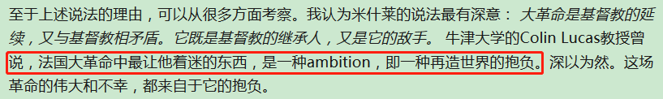
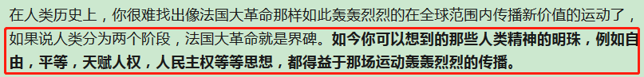
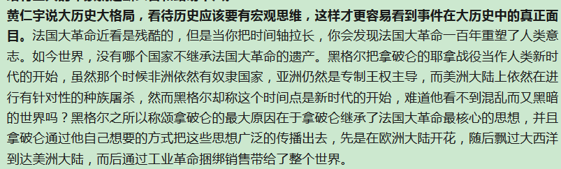
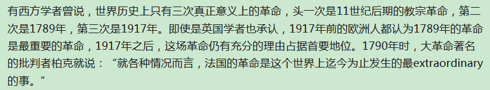
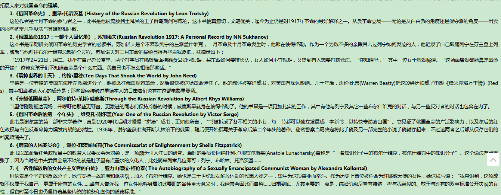
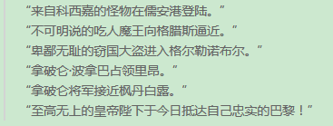
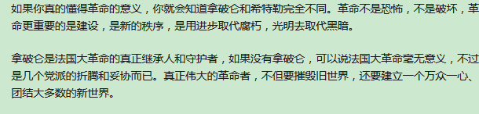
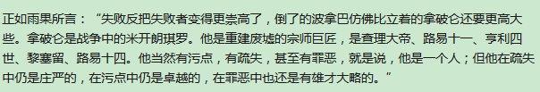

# 1 概述

## 1.1迷人之处

法国大革命充斥着各种迷人的元素（革命、改革、政治、军事、经济、英雄、普通人的挣扎、理想、人性都在这儿汇聚奏响人类历史最伟大之处）



法国大革命中最让他着迷的东西，是一种ambitition，即一种再造世界的抱负。

------



------




## 其他

### 三次革命



**十月革命**




# 法国大革命


路易十四、十五、十六

## 三级会议和革命爆发

大革命以前：旧制度（制度、文化、习俗所有的一切    18世纪初到1789年）


17世纪后半期   路易十四时代后，由盛转衰。到1715年，留下了一个烂摊子（外强中干）。

1 旧制度阻碍着资本主义的发展（包税制度、国债制度），王朝向大资产阶级敲诈勒索

2 阻碍着工商业的发展（早期，严格的工业法规是好的。到工商业持续发展，这些法规就不合时宜了）

3 税收加重（1715-1786年 增加十倍）

4 频繁的对外战争（税收、财政） 1756-1763年7年战争


面对种种危机，波旁王朝也经过了种种改革。

1774年  路易十六登基。

杜二阁 重农主义  改革   得罪了特权等级   1776被迫辞职

莱克（银行家） 改革 王室开销太大 下台

.......


### 三级会议

路易十六 ------三级会议

三级（教士、贵族（宫廷、穿袍贵族--花钱买来的、乡居贵族）、其他人（农民、工商业者、城市平民、资本家））

三级会议：1302年----1614      1614---1789（没有开，说明王权的加强）

1789年的三级会议，第三等级对于三级会议有新的主张。资本家（资产、文化、启蒙思想）。资本家渴望改革（将启蒙思想的理论付诸实践）。城市平民渴望减税。农民要求摆脱领主的压榨。不再是1302年了。要求废除以前三级会议的形式。

300-300-300，要求300-300-600.

第三等级（律师、资产者、法官、有几个贵族和教士---自由派贵族）


三级会议召开

路易十六，讲话，拿钱解决政府财政危机。改革是不太可能。（拿钱、不改革）

第三等级、和王权发生矛盾。

脱离出来，成立国民议会。--不承认三级会议。

《论特权，什么是第三等级》----表达了第三等级要当国家主宰的政治主张。


### 网球场宣誓

国民议会会场被封闭。到网球场开会


需要法治社会、需要宪法、无论在什么情况都不解散（直到制定宪法后）。----没说要推翻国王、宪法、君主立宪

资产阶级政治纲领形成的标志

贵族、教士中部分开明人士站到了国民议会这边（拉法耶特）

### 攻占巴士底狱

国王反对这一切

改名国民制宪议会（包括了三级会议的所有人员）

波旁王朝开始调兵、准备镇压。

莱克被免职-----示威游行-----起义-----扩大、全面爆发---接管了巴黎市政府----建立常设委员会、国民自卫军

帽徽--蓝白红----巴黎人民的蓝红和波旁王朝的白结合

听闻政府军要镇压---攻占巴士底狱（封建制度的堡垒）

法国革命的标志事件。

**影响**

1 巴黎以外的城市效仿巴黎

2 农民暴动

3 国王认可新政权

​         接受了蓝白徽的徽章

君主立宪大致实现


## 君主立宪派统治时期（1789年7月-1792年8月）

主导派系：君主立宪派

做出了卓越贡献

**八月法令（反封建）**

部分贵族提出自愿放弃自己的封建特权（赎买）

提出废除政府弊端、废除贵族特权（残余农奴制、司法特权）-----实现条件赎买

**《人权宣言》**

自然的、不可剥夺、神圣的人权（天赋人权）  在权利上是人人平等    

法律不是上帝意志的体现、国王意志的体现、而是人民意志的体现。在法律面前人人平等、

财产是神圣不可侵犯的权利。


路易十六批准了八月法令，但拒绝了人权宣言。

调来了军队，准备镇压革命。

经济受到影响（物价通货膨胀）

妇女群众冲向凡尔赛宫、革命自卫军。国王迁回巴黎


### 革命社团

布列塔尼俱乐部、雅各宾俱乐部（宪法之友） 吸收非制宪会议的人  拉法耶特（两个半球的英雄）

89年俱乐部 拉法耶特


制宪会议立法

该组旧政权（83个省、市、县）、地方官员由选举政权。

司法独立。

1 中央有立法议会、地方官员选组、司法独立

2 消灭等级制度、改造特权阶级

**教士**

没收教会财产

以财产发布指券

教士世俗化、国家化

**贵族**

废除贵族制度

制宪会议---立法会议

3 下令废除了各种阻碍资本主义发展的制度和规定

4 建立秩序的法令


### 瓦伦事件

国王逃跑（妻子是奥地利公主）---瓦伦事件

第一次民主共和运动。


制宪会议-------双刃剑

君主立宪派（不费路易十六，维持稳定，不得罪欧洲封建势力）、民主共和派（激进）

马尔斯校场事件（资产阶级镇压民众事件）

群众集会、戒严法---警告、

共和运动平息了


**君主立宪派主要人物**

巴纳夫、米拉波、拉法耶特（两个半球的英雄）.塔列朗

### **1791年宪法**


政体----君主立宪

权利分配----立法-立法议会，行政权--国王（不可以逾越宪法），司法权--司法

立宪制的君主不同于封建制的君主。

宪法对选举制度作出的规定是，年满 25 岁的男子为公民， 年缴纳直接税达 3 个工作日工资者享有选举权，称 “积极公民”；不纳税者或纳税低于这一数额者无选举权，称“消极公民”。这就使总数 700多万的公民中有大约 280 万人被划为“消极公民”。（对于性别、年龄、工资有限制）。

制宪会议的人自己宣布解散。立法议会取代制宪会议（立宪派--温和派，激进派--共和派 大商人 大船主 ，极端民主派-----越来越接近下层民众）


### 内外交困

革命后，内外交困。经济难免受到影响。奥迪地、普鲁士反对革命政权。

君主立宪派（要求不打仗，维持现状，保卫革命成果）

吉伦特派（主站）

罗伯斯皮尔（主张不打仗）

最终奥地利、普鲁士军队逼近，宣战。

第二次民主共和运动（祖国陷入危机的根源，就是国王本身）---废除了君主制


==法国大革命------最终拿破仑独裁==

==俄国革命--------最终斯大林独裁==

==中国革命---------毛主席的个人崇拜==


## 吉文特派掌权时期

国民公会-----立法议会

废除君主政体，成立共和国（吉伦特派、雅各宾派）

斗争---怎么处理国王---（吉伦特派袒护、雅各宾派处死） 吉伦特派因为袒护国王，权威扫地。

==在内外交困的情况下，在野党、少数派更容易获得支持，从而执政。==

==法国大革命第一阶段-----君主立宪派-----内外交困，吉伦特派做大。==

==吉伦特派做大-----内外交困----雅各宾派做大==

中国

**吉文特派主要人物**

布里索


## 雅各宾恐怖统治

## 热月党人和督政府

### 热月党人的统治

热月政变（温和派、大资产阶级、部分保王党份子组成）

镇压芽月和牧月暴动（雅各宾派和无裤套汉）

基贝隆战役表明，热月党人决不让旧制度复辟（保王党份子）

共和三年宪法、镇压葡月暴动

### 督政府时代

巴贝夫和平等派密谋

果月 18 日和花月 22 日政变（镇压左派，又镇压右派）

雾月政变


法国大革命：革命、政治、军事、英雄、悲剧、理性、追求、左右派

中国革命：

俄国革命：

# 执政府和第一帝国


## 影响

### 普鲁士改革

1807年，施泰因、哈登堡改革

1 十月敕令，废除农奴制（打击了部分了封建义务特权）  

2 军事改革（以前军国主义，容克贵族当官，没有积极性）

3 促进工商业、废除行会制度

4 政治改革

5 教育改革（设立教育部，洪堡-柏林大学，洪堡大学）


## 维也纳会议

封建势力暂时压倒了资本力量

奥地利、俄国、普鲁士、奥地利、法国

大国交易、幕后交易

实质：恢复封建秩序，表面上是恢复和平。

俄国----希望做欧洲霸主，建立控制波兰王国、德意志的分裂化、不不建议过分的削弱法国

英国-----希望欧洲保持均势，削弱法国，不使俄国强大，从而能保持仲裁地位，增强奥地利、普鲁士

奥地利------削弱普鲁士、俄罗斯

普鲁士--------盐城法国

法国-----------利用胜利者的斗争。提出正统主义原则，，补偿原则

波兰和萨克森问题

-----在普鲁士属---华沙大公国、-----从萨克森公国补偿


俄国获得大陆利益最多、英国获得海洋利益

最后议定书

1 恢复欧洲的封建秩序

2 

3 建立德意志邦联（奥地利担任主席）。普鲁士和德意志争夺

4 对法国的处置

一直持续到1848年


大的国际会议

1 威斯特法尼亚会议

2 维也纳会议

3 巴黎和会

神圣同盟-----反动实力的大本营、俄国担任盟主。


# 评价


## 拿破仑.波拿巴

拿破仑重新崛起的笑话：






```
如果你真的懂得革命的意义，你就会知道拿破仑和希特勒完全不同。革命不是恐怖，不是破坏，革命更重要的是建设，是新的秩序，是用进步取代腐朽，光明去取代黑暗。
```




```
正如雨果所言：“失败反把失败者变得崇高了，倒了的波拿巴仿佛比立着的拿破仑还要更高大些。拿破仑是战争中的米开朗琪罗。他是重建废墟的宗师巨匠，是查理大帝、路易十一、亨利四世、黎塞留、路易十四。他当然有污点、有疏失，甚至有罪恶，就是说，他是一个人；但他在疏失中扔是庄严的，在污点中扔是卓越的，在罪恶中也还是雄才大略的。
```

