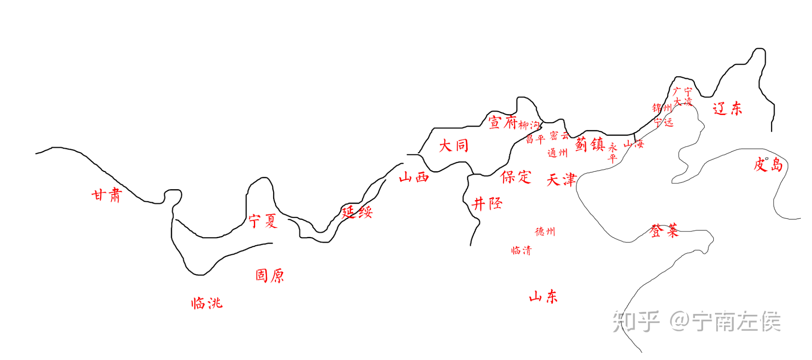
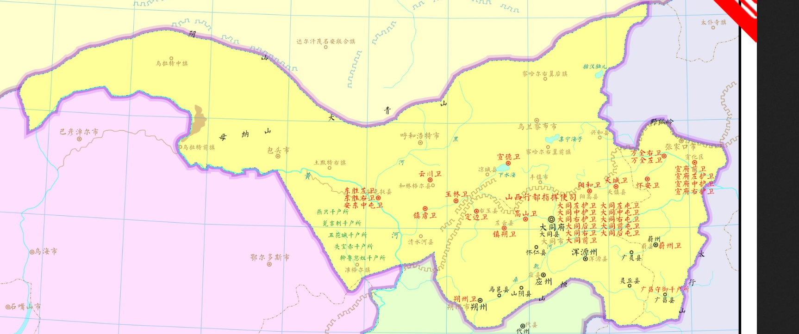
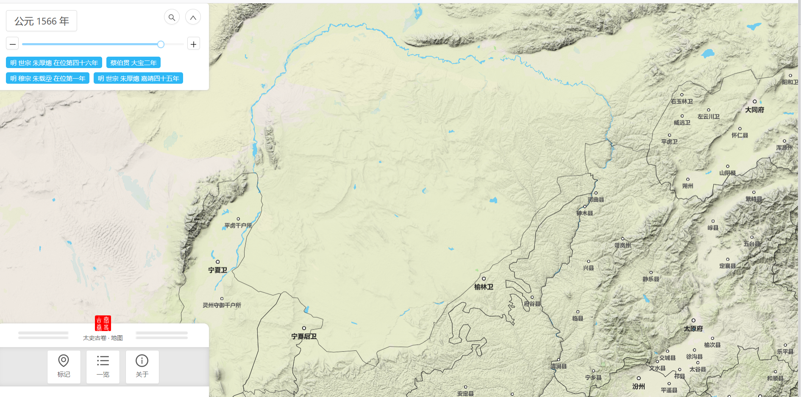
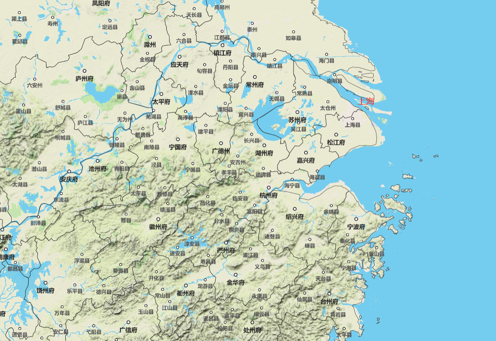

# 明

## 九边

辽东、蓟镇、宣府、大同、山西、延绥、宁夏、固原、甘肃

## 东南

## 总督

三边总督：曾铣

宣大总督：

蓟辽总督：洪承畴

总督：总兵

明代设置了漕运总督（总督漕运兼提督军务巡抚凤阳等处兼管河道）、蓟辽总督（总督蓟辽、保定等处军务兼理粮饷）、宣大总督（总督宣大、山西等处军务兼理粮饷）、三边总督（总督陕西三边军务）、两广总督（总督两广军务兼理粮饷带管盐法兼巡抚广东地方）、川陕河湖广总督（总督四川、陕西、河南、湖广等处军务）、浙闽总督（总督浙江、福建、江南兼制江西军务），外加上崇祯时期的川陕山西河湖广总督（总督陕西、山西、河南、湖广、四川五省军务）、凤阳总督（总督凤阳地方兼制河南、湖广军务）、保定总督（总督保定地方军务）、河南湖广总督（总督河南、湖广军务兼巡抚河南）、九江总督（总督九江地方兼制江西、湖广军务）

