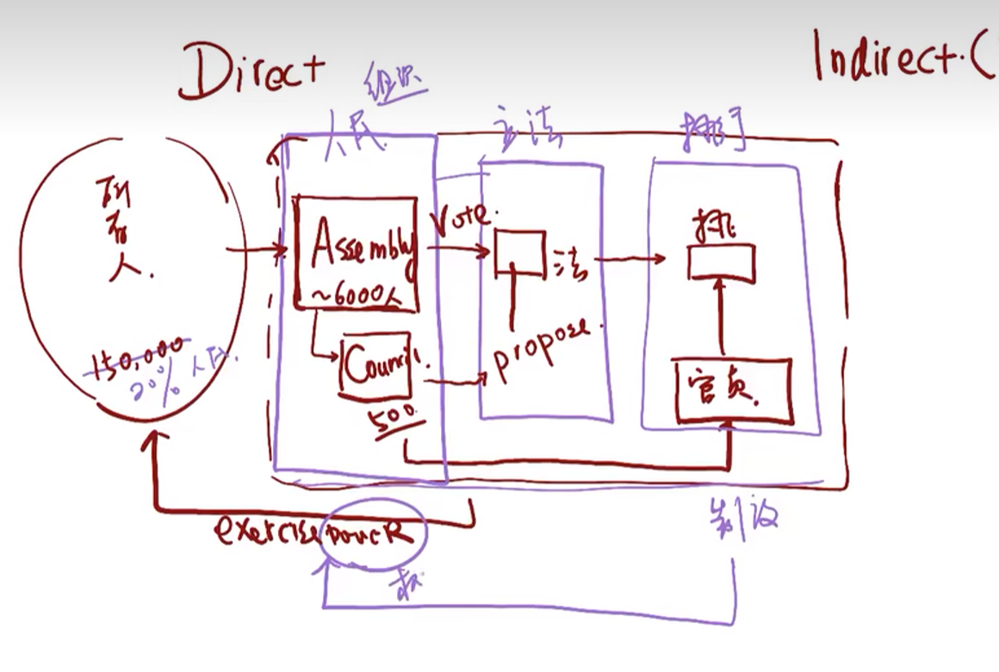
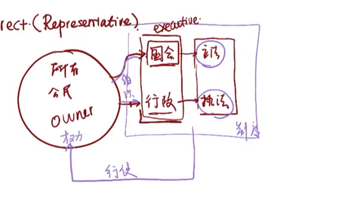

## 希腊民主

关键概念：

power:own,rule,execute,govern

>权利：own  你拥有权利，你rule你统治
>
>​            execute 执行全系，你govern管，管辖

LAW:

>LAW=rule
>
>定规则的意义是在什么发力
>
>在最开始的没有明文法（不代表没有法律、规矩、习惯法）
>
>法律的本质就是权利行使的细则跟大家要说清楚（用权利的依据）

institution-制度

> 权利(power)-权利使用规范(law)--how（institution）
>
> 制度是用来干什么呢？是使权利的使用成为可能的。

```
political institution organizes people to make/enfore the law to exercise power
political institution：政治制度
make the law:立法
enfore the law:执行法律
雅典的政治制度  怎么organizes公民 直接
```





