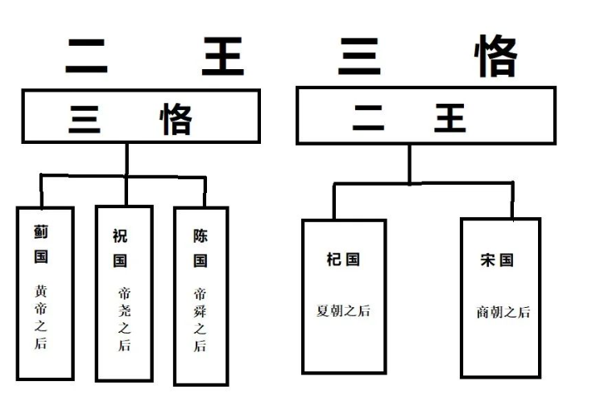
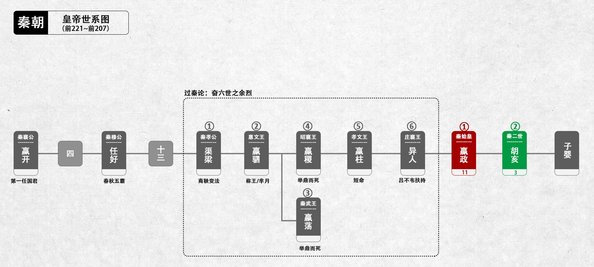

## 十二本纪

### 五帝本纪

#### 黄帝

**黄帝者，少典之子**，姓公孙，名曰轩辕。生而神灵，弱而能言，幼而徇齐，长而敦敏，成而聪明

**轩辕之时，神农氏世衰**。诸侯相侵伐，暴虐百姓，而神农氏弗能征。于是轩辕乃习用干戈，以征不享，诸侯咸来宾从。**而蚩尤最为暴，莫能伐**。炎帝欲侵陵诸侯，诸侯咸归轩辕。

轩辕乃修德振兵，治五气，蓺五种，抚万民，度四方，教熊罴貔貅貙虎，**以与炎帝战于阪泉之野**。三战，然后得其志。蚩尤作乱，不用帝命。于是黄帝乃征师诸侯，**与蚩尤战于涿鹿之野，遂禽杀蚩尤**。

**而诸侯咸尊轩辕为天子，代神农氏，是为黄帝**。天下有不顺者，黄帝从而征之，平者去之，披山通道，未尝宁居。

东至于海，登丸山，及岱宗。西至于空桐，登鸡头。南至于江，登熊、湘。北逐荤粥，合符釜山，而邑于涿鹿之阿。迁徙往来无常处，以师兵为营卫。官名皆以云命，为云师。

置左右大监，监于万国。万国和，而鬼神山川封禅与为多焉。获宝鼎，迎日推策。举风后、力牧、常先、大鸿以治民。顺天地之纪，幽明之占，死生之说，存亡之难。

时播百谷草木，淳化鸟兽虫蛾，旁罗日月星辰水波土石金玉，劳勤心力耳目，节用水火材物。**有土德之瑞，故号黄帝**。

------

**黄帝者，少典之子**，姓公孙，名曰轩辕。生而神灵，弱而能言，幼而徇齐，长而敦敏，成而聪明

> 主要讲黄帝生而神灵，并不主要像后面帝喾，尧舜禹一样讲德。

**轩辕之时，神农氏世衰**。诸侯相侵伐，暴虐百姓，而神农氏弗能征。于是轩辕乃习用干戈，以征不享，诸侯咸来宾从。**而蚩尤最为暴，莫能伐**。炎帝欲侵陵诸侯，诸侯咸归轩辕。

轩辕乃修德振兵，治五气，蓺五种，抚万民，度四方，教熊罴貔貅貙虎，**以与炎帝战于阪泉之野**。三战，然后得其志。蚩尤作乱，不用帝命。于是黄帝乃征师诸侯，**与蚩尤战于涿鹿之野，遂禽杀蚩尤**。

**而诸侯咸尊轩辕为天子，代神农氏，是为黄帝**。天下有不顺者，黄帝从而征之，平者去之，披山通道，未尝宁居。

>  讲皇帝的武功，不是讲德治

东至于海，登丸山，及岱宗。西至于空桐，登鸡头。南至于江，登熊、湘。北逐荤粥，合符釜山，而邑于涿鹿之阿。迁徙往来无常处，以师兵为营卫。官名皆以云命，为云师。

> 主要说疆域

置左右大监，监于万国。万国和，而鬼神山川封禅与为多焉。获宝鼎，迎日推策。举风后、力牧、常先、大鸿以治民。顺天地之纪，幽明之占【故】，死生之说，存亡之难。

> 置左右大监，监于万国. 基本的规范。
>
> 万国和，而鬼神山川封禅与为多焉。祭祀
>
> 获宝鼎，迎日推策。历法
>
> 顺天地之纪，幽明之占，死生之说，存亡之难。顺天地之纪，幽明之占，自然的变化，死生之说，存亡之难。人的变化。天地有四时的变化，而人也有生死存亡的变化。

时播百谷草木，淳化鸟兽虫蛾，旁罗日月星辰水波土石金玉，劳勤心力耳目，节用水火材物。**有土德之瑞，故号黄帝**。

> 时播百谷草木，淳化鸟兽虫蛾,驯化百谷草木和淳化鸟兽虫蛾
>
> 劳勤心力耳目，节用水火材物，讲节用。

#### 颛顼

**黄帝二十五子，其得姓者十四人。**

黄帝居轩辕之丘，**而娶于西陵之女，是为嫘祖**。嫘祖为黄帝正妃，生二子，其后皆有天下：其一曰玄嚣，是为青阳，青阳降居江水；其二曰昌意，降居若水。

昌意娶蜀山氏女，曰昌仆，生高阳，高阳有圣德焉。黄帝崩，葬桥山。**其孙昌意之子高阳立，是为帝颛顼也**。

帝颛顼高阳者，黄帝之孙而昌意之子也。静渊以有谋，疏通而知事；养材以任地，载时以象天，依鬼神以制义，治气以教化，絜诚以祭祀。

> 养材以任地，载时以象天， 天时
>
> 依鬼神以制义，制作规范
>
> 治气以教化，教化，根据自然的规律去做教化
>
> 絜诚以祭祀。出现了一定的礼仪去做祭祀

北至于幽陵，南至于交趾，西至于流沙，东至于蟠木。动静之物，大小之神，日月所照，莫不砥属。

#### 帝喾

帝颛顼生子曰穷蝉。颛顼崩，**而玄嚣之孙高辛立，是为帝喾**。

帝喾高辛者，黄帝之曾孙也。高辛父曰蟜极，蟜极父曰玄嚣，玄嚣父曰黄帝。自玄嚣与蟜极皆不得在位，至高辛即帝位。高辛于颛顼为族子。

**高辛生而神灵，自言其名**。普施利物，不于其身。聪以知远，明以察微。顺天之义，知民之急。仁而威，惠而信，修身而天下服。取地之财而节用之，抚教万民而利诲之，历日月而迎送之，明鬼神而敬事之。其色郁郁，其德嶷嶷。其动也时，其服也士。帝喾溉执中而遍天下，日月所照，风雨所至，莫不从服。

> 仁而威，惠而信，修身而天下服。开始讲德治了。不同于黄帝和颛顼。
>
> 取地之财而节用之，节用
>
> 抚教万民而利诲之，以德教化，不同于黄帝和颛顼，黄帝是“天下有不顺者，黄帝从而征之，平者去之，披山通道，未尝宁居”，而颛顼帝是“依鬼神以制义，治气以教化”，而帝喾是“仁而威，惠而信，修身而天下服”，是“抚教万民而利诲之”。从中可以其中德治的思想，从中可以看出对“为政以德”的强调
>
> 历日月而迎送之，历法
>
> 明鬼神而敬事之，祭祀
>
> 帝喾溉执中而遍天下，日月所照，风雨所至，莫不从服；执中,允执厥中，中庸之道。这是一个很重要的思想。

#### 帝尧

帝尧者，放勋。其仁如天，其知如神。就之如日，望之如云。富而不骄，贵而不舒。黄收纯衣，彤车乘白马。能明驯德，以亲九族。九族既睦，便章百姓。百姓昭明，合和万国。

> 其仁如天，其知如神。就之如日，望之如云。 其仁如天，其知如神,分别从德和能力方面形容尧。
>
> 富而不骄，贵而不舒。还是形容品德。黄收纯衣，彤车乘白马。节俭
>
> 能明驯【明】德，以亲九族。九族既睦，便章百姓。百姓昭明，合和万国。修身治家齐国平天下的帝尧版本。

乃命**羲、和，敬顺昊天**，数法日月星辰，敬授民时。

分命羲仲，居郁夷，曰旸谷。敬道日出，便程东作。日中，星鸟，以殷中春。其民析，鸟兽字微。

申命羲叔，居南交。便程南为，敬致。日永，星火，以正中夏。其民因，鸟兽希革。

申命和仲，居西土，曰昧谷。敬道日入，便程西成。夜中，星虚，以正中秋。其民夷易，鸟兽毛毨。

申命和叔；居北方，曰幽都。便在伏物。日短，星昴，以正中冬。其民燠，鸟兽氄毛。岁三百六十六日，以闰月正四时。信饬百官，众功皆兴。

> 对天时进一步应用。春分，夏至，秋分，冬至的应用。

尧曰：“谁可顺此事？”放齐曰：“嗣子丹朱开明。”尧曰：“**吁！顽凶，不用**。”尧又曰：“谁可者？”讙兜曰：“共工旁聚布功，可用。”尧曰：“共工善言，其用僻，似恭漫天，不可。”

尧又曰：“嗟，四岳，汤汤洪水滔天，浩浩怀山襄陵，下民其忧，有能使治者？”皆曰鲧可。尧曰：“**鲧负命毁族，不可**。”岳曰：“**异哉，试不可用而已**。”尧于是听岳用鲧。**九岁，功用不成**。

> 鲧[滚]负命毁族，不可，不听命令伤害族人

尧曰：“嗟！四岳：**朕在位七十载**，汝能庸命，践朕位？”岳应曰：“鄙德忝帝位。”尧曰：“悉举贵戚及疏远隐匿者。”众皆言于尧曰：“有矜在民间，曰虞舜。”

尧曰：“然，朕闻之。其何如？”岳曰：“**盲者子。父顽，母嚚，弟傲，能和以孝，烝烝治，不至奸**。”尧曰：“吾其试哉。”**于是尧妻之二女，观其德于二女**。

> 盲者子。父顽，母嚚，弟傲，能和以孝，烝烝治，不至奸;烝烝治，不至奸,慢慢使他们改变，不至于到奸邪的地步。
>
> 于是尧妻之二女，观其德于二女。舜有品德，有能力。尧还想考察舜齐家，处理家庭关系的能力。有了儿媳，家庭里面就多了许多关系。婆媳，妯娌关系等等。不是嫁了一个女儿，而是两个女儿。

舜饬下二女于妫汭，如妇礼。尧善之，乃使舜慎和五典，五典能从。乃遍入百官，百官时序。宾于四门，四门穆穆，诸侯远方宾客皆敬。尧使舜入山林川泽，暴风雷雨，舜行不迷。

> 尧善之，乃使舜慎和五典，五典能从.  五典:五伦的关系，讲教化。
>
> 乃遍入百官，百官时序。 管理百官。
>
> 宾于四门，四门穆穆，诸侯远方宾客皆敬。外交
>
> 尧使舜入山林川泽，暴风雷雨，舜行不迷。有能力【不迷】能吃苦【山林川泽，暴风雷雨】

尧以为圣，召舜曰：“女谋事至而言可绩，三年矣。女登帝位。”舜让于德不怿。正月上日，**舜受终于文祖。文祖者，尧大祖也**。

于是帝尧老，命舜摄行天子之政，以观天命。舜乃在璿玑玉衡，以齐七政。遂类于上帝，禋于六宗，望于山川，辩于群神。揖五瑞，择吉月日，见四岳诸牧，班瑞。

> 舜乃在璿玑玉衡，以齐七政. 天文
>
> 遂类于上帝，禋于六宗，望于山川，辩于群神。 祭祀
>
> 揖五瑞，择吉月日，见四岳诸牧，班瑞。指定规范和礼仪

岁二月，东巡狩，至于岱宗，祡，望秩于山川。遂见东方君长，合时月正日，同律度量衡，修五礼五玉三帛二生一死为挚，如五器，卒乃复。五月，南巡狩；八月，西巡狩；十一月，北巡狩：皆如初。

归，至于祖祢庙，用特牛礼。五岁一巡狩，群后四朝。遍告以言，明试以功，车服以庸。肇十有二州，决川。象以典刑，流宥五刑，鞭作官刑，扑作教刑，金作赎刑。眚灾过，赦；怙终贼，刑。钦哉，钦哉，惟刑之静哉！

> 五岁一巡狩，群后四朝。帝五年一次巡狩，后四年诸侯朝拜。
>
> 象以典刑，流宥五刑，鞭作官刑，扑作教刑，金作赎刑。制定改善刑罚
>
> 眚灾过，赦；怙终贼，刑。是否有意犯罪。  怙恶不悛：指坚持作恶，不肯悔改
>
> 钦哉，钦哉，惟刑之静哉。慎用刑罚

讙兜进言共工，尧曰不可而试之工师，共工果淫辟。四岳举鲧治鸿水，尧以为不可，岳彊请试之，试之而无功，故百姓不便。**三苗在江淮、荆州数为乱**。**于是舜归而言于帝，请流共工于幽陵，以变北狄；放驩[huān]兜于崇山，以变南蛮；迁三苗于三危，以变西戎；殛鲧于羽山，以变东夷：四罪而天下咸服。**

> 流：流放是刑罚
>
> 以变北狄：改变教化北狄。

尧立七十年得舜，二十年而老，令舜摄行天子之政，荐之于天。**尧辟位(离位)凡二十八年而崩。**百姓悲哀，如丧父母。三年，四方莫举乐，以思尧。尧之子丹朱之不肖，不足授天下，于是乃权授舜。

授舜，则天下得其利而丹朱病；授丹朱，则天下病而丹朱得其利。尧曰“终不以天下之病而利一人”，而卒授舜以天下。尧崩，三年之丧毕，**舜让辟丹朱于南河之南**。

诸侯朝觐者不之丹朱而之舜，狱讼者不之丹朱而之舜，讴歌者不讴歌丹朱而讴歌舜。**舜曰“天也”，夫而后之中国践天子位焉，是为帝舜**。

> 天命 ：有德便有命，只有敬天保民才有命

#### 虞舜

虞舜者，名曰重华。重华父曰瞽**[gǔ]**叟，瞽叟父曰桥牛，桥牛父曰句望，句望父曰敬康，敬康父曰穷蝉，穷蝉父曰帝颛顼，颛顼父曰昌意：以至舜七世矣。**自从穷蝉以至帝舜，皆微为庶人**。

舜父瞽叟盲，而舜母死，瞽叟更娶妻而生象，象傲。瞽叟爱后妻子，常欲杀舜，舜避逃；及有小过，则受罪。舜事父及后母与弟，日以笃谨，匪有解。　

舜，冀州之人也。舜耕历山，渔雷泽，陶河滨，作什器于寿丘，就时于负夏。**舜父瞽叟顽，母嚚，弟象傲，皆欲杀舜**。舜顺适不失子道，兄弟孝慈。欲杀，不可得；即求，尝在侧。　

**舜年二十以孝闻。三十而帝尧问可用者**，四岳咸荐虞舜，曰可。于**是尧乃以二女妻舜以观其内，使九男与处以观其外**。舜居妫汭，内行弥谨。尧二女不敢以贵骄事舜亲戚，甚有妇道。

尧九男皆益笃。舜耕历山，历山之人皆让畔；渔雷泽，雷泽上人皆让居；陶河滨，河滨器皆不苦窳。**一年而所居成聚，二年成邑，三年成都**。尧乃赐舜絺衣，与琴，为筑仓廪，予牛羊。

瞽叟尚复欲杀之，使舜上涂廪，瞽叟从下纵火焚廪。舜乃以两笠自扞而下，去，得不死。后瞽叟又使舜穿井，舜穿井为匿空旁出。舜既入深，瞽叟与象共下土实井，舜从匿空出，去。

瞽叟、象喜，以舜为已死。象曰“本谋者象。”象与其父母分，于是曰：“舜妻尧二女，与琴，象取之。牛羊仓廪予父母。”象乃止舜宫居，鼓其琴。舜往见之。

象鄂不怿，曰：“我思舜正郁陶！”舜曰：“然，尔其庶矣！”舜复事瞽叟爱弟弥谨。于是尧乃试舜五典百官，皆治。

**昔高阳氏有才子八人，世得其利，谓之“八恺”。高辛氏有才子八人，世谓之“八元”。**此十六族者，世济其美，不陨其名。至于尧，尧未能举。

舜举八恺，使主后土，以揆百事，莫不时序。举八元，使布五教于四方，父义，母慈，兄友，弟恭，子孝，内平外成。

昔**帝鸿氏**有不才子，掩义隐贼，好行凶慝，天下谓之浑沌。**少暤氏**有不才子，毁信恶忠，崇饰恶言，天下谓之穷奇。**颛顼氏**有不才子，不可教训，不知话言，天下谓之檮杌。

此三族世忧之。至于尧，尧未能去。**缙云氏**有不才子，贪于饮食，冒于货贿，天下谓之饕餮。天下恶之，比之三凶。**舜宾于四门，乃流四凶族，迁于四裔，以御螭魅，于是四门辟，言毋凶人也**。

舜入于大麓，烈风雷雨不迷，尧乃知舜之足授天下。**尧老，使舜摄行天子政，巡狩。舜得举用事二十年，而尧使摄政。摄政八年而尧崩(尧总共在位了98年)**。

三年丧毕，让丹朱，天下归舜。

而禹、皋陶、契、后稷、伯夷、夔、龙、倕、益、彭祖自尧时而皆举用，未有分职。于是舜乃至于文祖，谋于四岳，辟四门，明通四方耳目，命十二牧论帝德，行厚德，远佞人，则蛮夷率服。

舜谓四岳曰：“有能奋庸美尧之事者，使居官相事？”皆曰：“伯禹为司空，可美帝功。”

舜曰：“嗟，然！禹，汝平水土，维是勉哉。”禹拜稽首，让于稷、契与皋陶。舜曰：“然，往矣。”

舜曰：“弃，黎民始饥，汝后稷播时百谷。”

舜曰：“契，百姓不亲，五品不驯，汝为司徒，而敬敷五教，在宽。”

舜曰：“皋陶，蛮夷猾夏，寇贼奸轨，汝作士，五刑有服，五服三就；五流有度，五度三居：维明能信。”

舜曰：“谁能驯予工？”皆曰垂可。于是以垂为共工。

舜曰：“谁能驯予上下草木鸟兽？”皆曰益可。于是以益为朕虞。益拜稽首，让于诸臣朱虎、熊罴。舜曰：“往矣，汝谐。”遂以朱虎、熊罴为佐。

舜曰：“嗟！四岳，有能典朕三礼？”皆曰伯夷可。舜曰：“嗟！伯夷，以汝为秩宗，夙夜维敬，直哉维静絜。”伯夷让夔、龙。

舜曰：“然。以夔为典乐，教稺子，直而温，宽而栗，刚而毋虐，简而毋傲；诗言意，歌长言，声依永，律和声，八音能谐，毋相夺伦，神人以和。”夔曰：“于！予击石拊石，百兽率舞。”

舜曰：“龙，朕畏忌谗说殄伪，振惊朕众，命汝为纳言，夙夜出入朕命，惟信。”

舜曰：“嗟！女二十有二人，敬哉，惟时相天事。”三岁一考功，三考绌陟，远近众功咸兴。分北三苗。

**此二十二人咸成厥功：**

皋陶为大理，平，民各伏得其实；

伯夷主礼，上下咸让；

垂主工师，百工致功；

益主虞，山泽辟；

弃主稷，百谷时茂；

契主司徒，百姓亲和；

龙主宾客，远人至；十二牧行而九州莫敢辟违；

唯禹之功为大，披九山，通九泽，决九河，定九州，各以其职来贡，不失厥宜。方五千里，至于荒服。南抚交趾、北发，西戎、析枝、渠廋、氐、羌，

北山戎、发、息慎，东长、鸟夷，四海之内咸戴帝舜之功。于是禹乃兴九招之乐，致异物，凤皇来翔。天下明德皆自虞帝始。　

**舜年二十以孝闻，年三十尧举之，年五十摄行天子事，年五十八尧崩**，**年六十一代尧践帝位。践帝位三十九年(此时100岁)**，南巡狩，崩于苍梧之野。

葬于江南九疑，是为零陵。舜之践帝位，载天子旗，往朝父瞽叟，夔夔唯谨，如子道。**封弟象为诸侯。舜子商均亦不肖，舜乃豫荐禹于天**。

十七年而崩(117岁)。三年丧毕，禹亦乃让舜子，如舜让尧子。诸侯归之，然后禹践天子位。**尧子丹朱，舜子商均，皆有疆土，以奉先祀。**服其服，礼乐如之。以客见天子，天子弗臣，示不敢专也。

> 当时，帝舜封帝尧之子丹朱为虞宾，即帝舜以“宾客之礼”对待丹朱，可无需行君臣之礼，以显尊荣。
>
> 后来，又有夏禹封丹朱于唐（今山西省太原市），封帝舜之子商均于虞（今河南省商丘市虞城县）.

自黄帝至舜、禹，**皆同姓而异其国号，以章明德**。故黄帝为有熊，帝颛顼为高阳，帝喾为高辛，帝尧为陶唐，帝舜为有虞。帝禹为夏后。而别氏，姓姒氏。契为商，姓子氏。弃为周，姓姬氏。

> 姓氏名字
>
> 帝尧            帝尧之后于祝       
>
> 虞舜              陈文公 [妫姓](https://baike.baidu.com/item/妫姓/9578662?fromModule=lemma_inlink)，名圉
>
> 帝禹【商】   东楼公[杞]   姒姓  云衢
>
> > 杞东楼公者，夏后禹之後苗裔也。殷时或封或绝。周武王克殷纣，求禹之後，得东楼公，封之於杞，以奉夏后氏祀。
> >
> > 改[姒姓](https://baike.baidu.com/item/姒姓?fromModule=lemma_inlink)为娄，名云衢，号东楼
>
> 宋文公【商】，子姓宋氏，名鲍
>
> 比如秦始皇 ，嬴姓赵氏   名政   
>
> > 太史公曰：秦之先为嬴姓。其後分封，以国为姓，有徐氏、郯氏、莒氏、终黎氏、运奄氏、菟裘氏、将梁氏、黄氏、江氏、脩鱼氏、白冥氏、蜚廉氏、秦氏。然秦以其先造父封赵城，为赵氏。
>
> 楚庄王 熊旅  芈姓熊氏，名旅. 
>
> > 姓”是从居住的村落，或者所属的部族名称而来，“氏”是从君主所封的地、所赐的爵位、所任的官职，姓是不变的，而氏则不断变化。
> >
> > 楚部落通姓芈，随着部落日益繁衍生息，生出许多分支，也是就分出许多氏，其中比较大的氏有熊氏、昭氏、屈氏、景氏等。
>
> 晋献公  姬姓晋氏，名诡诸
>
> > 姬姓诸侯，封于晋
>
> 鲁庄公，姬姓鲁式，名同
>
> 夫差，姬姓吴式，夫差
>
> > 及下车而封黄帝之后于蓟，封帝尧之后于祝，封帝舜之后于陈。下车而封夏后氏之后于杞，投殷之后于宋。
>
> > 舜之後，周武王封之陈，至楚惠王灭之，有世家言。
> >
> > 禹之後，周武王封之杞，楚惠王灭之，有世家言。
> >
> > 契之後为殷，殷有本纪言。殷破，周封其後於宋，齐湣王灭之，有世家言。
> >
> > 后稷之後为周，秦昭王灭之，有本纪言。
> >
> > 皋陶之後，或封英、六，楚穆王灭之，无谱。
> >
> > 伯夷之後，至周武王复封於齐，曰太公望，陈氏灭之，有世家言。
> >
> > 伯翳之後，至周平王时封为秦，项羽灭之，有本纪言。
> >
> > 垂、益、夔、龙，其後不知所封，不见也。
> >
> > 右十一人者，皆唐虞之际名有功德臣也；其五人之後皆至帝王，馀乃为显诸侯。
> >
> > **滕、薛、驺，夏、殷、周之间封也，小，不足齿列，弗论也。**
> >
> > 周武王时，侯伯尚千馀人。及幽、厉之後，诸侯力攻相并。**江、黄、胡、沈之属，不可胜数，故弗采著于传**。

### 夏本纪

#### 夏禹

夏禹，名曰文命。禹之父曰鲧，鲧之父曰帝颛顼，颛顼之父曰昌意，昌意之父曰黄帝。禹者，黄帝之玄孙而帝颛顼之孙也。禹之**曾大父昌意及父鲧皆不得在帝位，为人臣。**

当帝尧之时，鸿水滔天，浩浩怀山襄陵，下民其忧。尧求能治水者，群臣四岳皆曰鲧可。尧曰：“鲧为人负命毁族，不可。”四岳曰：“等之未有贤于鲧者，愿帝试之。”

于是尧听四岳，用鲧治水。九年而水不息，功用不成。于是帝尧乃求人，更得舜。舜登用，摄行天子之政，巡狩。行视鲧之治水无状，**乃殛鲧于羽山以死**。

天下皆以舜之诛为是。于是舜举鲧子禹，而使续鲧之业。

尧崩，帝舜问四岳曰：“有能成美尧之事者使居官？”皆曰：“伯禹为司空，可成美尧之功。”舜曰：“嗟，然！”命禹：“女平水土，维是勉之。”

禹拜稽首，让于契、后稷、皋陶。舜曰：“女其往视尔事矣。”

禹为人敏给克勤，其德不违，其仁可亲，其言可信：声为律，身为度，称以出；亶亶穆穆，为纲为纪。

**禹乃遂与益、后稷奉帝命**，命诸侯百姓兴人徒以傅土，行山表木，定高山大川。**禹伤先人父鲧功之不成受诛，乃劳身焦思，居外十三年，过家门不敢入。**薄衣食，致孝于鬼神。

卑宫室，致费于沟淢。  陆行乘车，水行乘船，泥行乘橇，山行乘檋。左准绳，右规矩，载四时，以开九州，通九道，陂九泽，度九山。令益予众庶稻，可种卑湿。

命后稷予众庶难得之食。食少，调有余相给，以均诸侯。禹乃行相地宜所有以贡，及山川之便利。　　

禹行自冀州始。

冀州：既载壶口，治梁及岐。既修太原，至于岳阳。覃怀致功，致于衡漳。其土白壤。赋上上错，田中中。常、卫既从，大陆既为。鸟夷皮服。夹右碣石，入于海。

济、河维沇州：九河既道，雷夏既泽，雍、沮会同，桑土既蚕，于是民得下丘居土。其土黑坟，草繇木条。田中下，赋贞，作十有三年乃同。其贡漆、丝，其篚织文。浮于济、漯，通于河。

海岱维青州：堣夷既略，潍、淄其道。其土白坟，海滨广潟，厥田斥卤。田上下，赋中上。厥贡盐絺，海物维错，岱畎丝、枲、铅、松、怪石，莱夷为牧，其篚酓丝。浮于汶，通于济。

海岱及淮维徐州：淮、沂其治，蒙、羽其艺。大野既都，东原厎平。其土赤埴坟，草木渐包。其田上中，赋中中。

贡维土五色，羽畎夏狄，峄阳孤桐，泗滨浮磬，淮夷蠙珠臮鱼，其篚玄纤缟。浮于淮、泗，通于河。

淮海维扬州：彭蠡既都，阳鸟所居。三江既入，震泽致定。竹箭既布。其草惟夭，其木惟乔，其土涂泥。田下下，赋下上上杂。

贡金三品，瑶、琨、竹箭，齿、革、羽、旄，岛夷卉服，其篚织贝，其包橘、柚锡贡。均江海，通淮、泗。

荆及衡阳维荆州：江、汉朝宗于海。九江甚中，沱、涔已道，云土、梦为治。其土涂泥。田下中，赋上下。贡羽、旄、齿、革，金三品，杶、榦、栝、柏，砺、砥、砮、丹，

维箘簬、楛，三国致贡其名，包匦菁茅，其篚玄纁玑组，九江入赐大龟。浮于江、沱、涔、（于）汉，逾于雒，至于南河。

荆、河惟豫州：伊、雒、瀍、涧既入于河，荥播既都，道荷泽，被明都。其土壤，下土坟垆。田中上，赋杂上中。贡漆、丝、絺、纻，其篚纤絮，锡贡磬错。浮于雒，达于河。

华阳黑水惟梁州：汶、嶓既艺，沱、涔既道，蔡、蒙旅平，和夷厎绩。其土青骊。田下上，赋下中三错。

贡璆、铁、银、镂、砮、磬，熊、罴、狐、貍。织皮西倾因桓是来，浮于潜，逾于沔，入于渭，乱于河。

黑水西河惟雍州：弱水既西，泾属渭汭。  漆、沮既从，沣水所同。荆、岐已旅，终南、敦物至于鸟鼠。原隰厎绩，至于都野。三危既度，三苗大序。其土黄壤。田上上，赋中下。

贡璆、琳、琅玕。 浮于积石，至于龙门西河，会于渭汭。 织皮昆仑、析支、渠搜，西戎即序。

道九山：汧及岐至荆山，逾于河；壶口、雷首至于太岳；砥柱、析城至于王屋；太行、常山至于碣石，入于海；西倾、朱圉、鸟鼠至于太华；

熊耳、外方、桐柏至于负尾；道嶓冢，至于荆山；内方至于大别；汶山之阳至衡山，过九江，至于敷浅原。

道九川：弱水至于合黎，余波入于流沙。道黑水，至于三危，入于南海。道河积石，至于龙门，南至华阴，东至砥柱，又东至于盟津，东过雒汭，至于大邳，北过降水，至于大陆，

北播为九河，同为逆河，入于海。嶓冢道漾，东流为汉，又东为苍浪之水，过三澨，入于大别，南入于江，东汇泽为彭蠡，东为北江，入于海。汶山道江，东别为沱，又东至于醴，

过九江，至于东陵，东迆北会于汇，东为中江，入于海。道沇水，东为济，入于河，泆为荥，东出陶丘北，又东至于荷，又东北会于汶，又东北入于海。

道淮自桐柏，东会于泗、沂，东入于海。道渭自鸟鼠同穴，东会于沣，又东北至于泾，东过漆、沮，入于河。道雒自熊耳，东北会于涧、瀍，又东会于伊，东北入于河。

于是九州攸同，四奥既居，九山刊旅，九川涤原，九泽既陂，四海会同。六府甚，众土交正，致慎财赋，咸则三壤成赋。中国赐土姓：“祗台德先，不距朕行。”

今天子之国以外五百里甸服：百里赋纳总，二百里纳铚，三百里纳秸服，四百里粟，五百里米。

甸服外五百里侯服：百里采，二百里任国，三百里诸侯。

侯服外五百里绥服：三百里揆文教，二百里奋武卫。

绥服外五百里要服：三百里夷，二百里蔡。

要服外五百里荒服：三百里蛮，二百里流。

东渐于海，西被于流沙，朔、南暨：声教讫于四海。于是帝锡禹玄圭，以告成功于天下。天下于是太平治。

皋陶作士以理民。帝舜朝，禹、伯夷、皋陶相与语帝前。皋陶述其谋曰：“信其道德，谋明辅和。”禹曰：“然，如何？”

皋陶曰：“於！慎其身修，思长，敦序九族，众明高翼，近可远在已。”禹拜美言，曰：“然。”皋陶曰：“於！在知人，在安民。”

禹曰：“吁！皆若是，惟帝其难之。知人则智，能官人；能安民则惠，黎民怀之。能知能惠，何忧乎驩兜，何迁乎有苗，何畏乎巧言善色佞人？”

皋陶曰：“然，於！亦行有九德，亦言其有德。”乃言曰：

“始事事，宽而栗，柔而立，愿而共，治而敬，扰而毅，直而温，简而谦，刚而实，强而义，章其有常吉哉。日宣三德，蚤夜翊明有家。日严振敬六德，亮采有国。

翕受普施，九德咸事，俊乂在官，百吏肃谨。毋教邪淫奇谋。非其人居其官，是谓乱天事。天讨有罪，五刑五用哉。吾言厎可行乎？”

禹曰：“女言致可绩行。”皋陶曰：“余未有知，思赞道哉。”

帝舜谓禹曰：“女亦昌言。”禹拜曰：“於，予何言！予思日孳孳。”皋陶难禹曰：“何谓孳孳？”禹曰：

“鸿水滔天，浩浩怀山襄陵，下民皆服于水。予陆行乘车，水行乘舟，泥行乘橇，山行乘檋，行山刊木。与益予众庶稻鲜食。以决九川致四海，浚畎浍致之川。

与稷予众庶难得之食。食少，调有余补不足，徙居。众民乃定，万国为治。”

皋陶曰：“然，此而美也。”

禹曰：“於，帝！慎乃在位，安尔止。辅德，天下大应。清意以昭待上帝命，天其重命用休。”帝曰：

“吁，臣哉，臣哉！臣作朕股肱耳目。予欲左右有民，女辅之。余欲观古人之象，日月星辰，作文绣服色，女明之。予欲闻六律五声八音，来始滑，以出入五言，女听。

予即辟，女匡拂予。女无面谀，退而谤予。敬四辅臣。诸众谗嬖臣，君德诚施皆清矣。”

禹曰：“然。帝即不时，布同善恶则毋功。”

帝曰：“毋若丹朱傲，维慢游是好，毋水行舟，朋淫于家，用绝其世。予不能顺是。”

禹曰：“予娶涂山，[ 辛壬]  癸甲，生启予不子，以故能成水土功。辅成五服，至于五千里，州十二师，外薄四海，咸建五长，各道有功，苗顽不即功，帝其念哉。”

帝曰：“道吾德，乃女功序之也。”

**皋陶于是敬禹之德，令民皆则禹**。不如言，刑从之。舜德大明。

于是夔行乐，祖考至，群后相让，鸟兽翔舞，《箫韶》九成，凤凰来仪，百兽率舞，百官信谐。帝用此作歌曰：“陟天之命，维时维几。”

乃歌曰：“股肱喜哉，元首起哉，百工熙哉！”皋陶拜手稽首扬言曰：“念哉，率为兴事，慎乃宪，敬哉！”乃更为歌曰：“元首明哉，股肱良哉，庶事康哉！”

（舜）又歌曰：“元首丛脞哉，股肱惰哉，万事堕哉！”帝拜曰：“然，往钦哉！”于是天下皆宗禹之明度数声乐，为山川神主。

**帝舜荐禹于天，为嗣。十七年而帝舜崩。**三年丧毕，禹辞辟舜之子商均于阳城。天下诸侯皆去商均而朝禹。禹于是遂即天子位，南面朝天下，**国号曰夏后，姓姒氏**。

**帝禹立而举皋陶荐之，且授政焉，而皋陶卒。**封皋陶之后于英、六，或在许。而后举益，任之政。

**十年，帝禹东巡狩，至于会稽而崩。以天下授益**。三年之丧毕，益让帝禹之子启，而辟居箕山之阳。禹子启贤，天下属意焉。及禹崩，虽授益，益之佐禹日浅，天下未洽。

故诸侯皆去益而朝启，曰“吾君帝禹之子也。”**于是启遂即天子之位，是为夏后帝启**。

#### 帝启

夏后帝①启崩，子帝②太康立。**帝太康失国**，昆弟五人，须于洛汭，作《五子之歌》。

太康崩，弟③中康立，是为帝中康。帝中康时，羲、和湎淫，废时乱日。胤往征之，作《胤征》。

中康崩，子帝④相立。帝相崩，子帝⑤少康立。帝少康崩，子帝⑥予立。帝予崩，子帝⑦槐立。帝槐崩，子帝⑧芒立。帝芒崩，子帝⑨泄立。帝泄崩，子帝⑩不降立。

帝不降崩，弟帝⑪扃立。帝扃崩，子帝⑫廑立。帝廑崩，立帝不降之子⑬孔甲，是为帝孔甲。

**帝孔甲立，好方鬼神，事淫乱。夏后氏德衰，诸侯畔之**。天降龙二，有雌雄，孔甲不能食，未得豢龙氏。陶唐既衰，其后有刘累，学扰龙于豢龙氏，以事孔甲。

孔甲赐之姓曰御龙氏，受豕韦之后。龙一雌死，以食夏后。夏后使求，惧而迁去。

孔甲崩，子帝⑭皋立。帝皋崩，子帝⑮发立。帝发崩，**子帝⑯履癸立，是为桀**。

帝桀之时，自孔甲以来而诸侯多畔夏，桀不务德而武伤百姓，百姓弗堪。乃召汤而囚之夏台，已而释之。汤修德，诸侯皆归汤，汤遂率兵伐夏桀。

**桀走鸣条，遂放而死**。桀谓人曰：“吾悔不遂杀汤于夏台，使至此。”汤乃践天子位，代夏朝天下。**汤封夏之后，至周封于杞也**。　

太史公曰：**禹为姒姓，其后分封，用国为姓**，

故有夏后氏、有扈氏、有男氏、斟寻氏、彤城氏、褒氏、费氏、杞氏、缯氏、辛氏、冥氏、斟（氏）、戈氏。孔子正夏时，学者多传《夏小正》云。

自虞、夏时，贡赋备矣。**或言禹会诸侯江南，计功而崩，固葬焉，命曰会稽。会稽者，会计也**。

### 秦本纪

**秦之先，帝颛顼之苗裔孙曰女脩**。**女脩织，玄鸟陨卵，女脩吞之，生子大业**。**大业取少典(部落)之子，曰女华**。

女华生大费，与禹平水土。已成，帝锡玄圭。禹受曰：“非予能成，亦大费为辅。”帝舜曰：“咨尔费，赞禹功，其赐尔皂游。尔后嗣将大出。”乃妻之姚姓之玉女。

大费拜受，佐舜调驯鸟兽，鸟兽多驯服，是为柏翳。**舜赐姓嬴氏**。

大费生子二人：一曰大廉，实鸟俗氏；二曰若木，实费氏。其玄孙曰费昌，子孙或在中国，或在夷狄。费昌当夏桀之时，去夏归商，为汤御，以败桀于鸣条。

大廉玄孙曰孟戏、中衍，鸟身人言。帝太戊闻而卜之使御，吉，遂致使御而妻之。**自太戊以下，中衍之后，遂世有功，以佐殷国，故嬴姓多显，遂为诸侯。**

其玄孙曰中潏(yù)，在西戎，保西垂。生蜚廉。蜚廉生恶来。**恶来有力，蜚廉善走，父子俱以材力事殷纣。周武王之伐纣，并杀恶来。**

是时蜚廉为纣石北方，还，无所报，为坛霍太山而报，得石棺，铭曰“帝令处父不与殷乱，赐尔石棺以华氏”。死，遂葬于霍太山。

蜚廉复有子曰季胜。季胜生孟增。孟增幸于周成王，是为宅皋狼。皋狼生衡父，衡父生造父。造父以善御幸于周缪王，得骥、温骊、骅骝、騄耳之驷，西巡狩，乐而忘归。

徐偃王作乱，造父为缪王御，长驱归周，一日千里以救乱。**缪王以赵城封造父，造父族由此为赵氏。**

自蜚廉生季胜已下五世至造父，别居赵。赵衰其后也。

恶来革者，蜚廉子也，蚤死。有子曰女防。女防生旁皋，旁皋生太几，太几生大骆，**大骆生非子。以造父之宠，皆蒙赵城，姓赵氏**。

非子居犬丘，好马及畜，善养息之。犬丘人言之周孝王，**孝王召使主马于汧渭**qiān  wèi**之闲，马大蕃息**。孝王欲以为大骆适嗣。申侯之女为大骆妻，生子成为适。

申侯乃言孝王曰：“昔我先郦山之女，为戎胥轩妻，生中潏，以亲故归周，保西垂，西垂以其故和睦。今我复与大骆妻，生适子成。申骆重婚，西戎皆服，所以为王。王其图之。”

于是孝王曰：“**昔伯翳为舜主畜，畜多息，故有土，赐姓嬴**。今其后世亦为朕息马，朕其分土为附庸。”**邑之秦，使复续嬴氏祀，号曰秦嬴**。

亦不废申侯之女子为骆适者，以和西戎。

　　

秦嬴生秦侯。秦侯立十年，卒。生公伯。公伯立三年，卒。生秦仲。

　　

秦仲立三年，周厉王无道，诸侯或叛之。**西戎反王室，灭犬丘大骆之族**。周宣王即位，乃以秦仲为大夫，诛西戎。**西戎杀秦仲**。秦仲立二十三年，死于戎。有子五人，其长者曰庄公。

周宣王乃召庄公昆弟五人，与兵七千人，使伐西戎，破之。于是复予秦仲后，**及其先大骆地犬丘并有之，为西垂大夫**。

庄公居其故西犬丘，生子三人，**其长男世父**。世父曰：“戎杀我大父仲，我非杀戎王则不敢入邑。”遂将击戎，让其弟襄公。襄公为太子。庄公立四十四年，卒，太子襄公代立。

 

------

 

**襄公**元年(777)，**以女弟缪嬴为丰王(戎人)妻**。

襄公二年(776)，戎围犬丘，世父击之，为戎人所虏。岁余，复归世父。

 

七年(771)春，周幽王用褒姒废太子，立褒姒子为适，数欺诸侯，诸侯叛之。

西戎犬戎与申侯伐周，杀幽王郦山下。而秦襄公将兵救周，战甚力，有功。周避犬戎难，东徙雒邑，**襄公以兵送周平王**。平王封襄公为诸侯，**赐之岐以西之地**。

曰：“**戎无道，侵夺我岐、丰之地，秦能攻逐戎，即有其地**。”与誓，封爵之。襄公于是始国，与诸侯通使聘享之礼，乃用骝驹、黄牛、羝羊各三，祠上帝西畤。

 

十二年(766)，伐戎而至岐，卒。生文公。

　 

------

　

**文公**元年(765)，居西垂宫。

三年(763)，文公以兵七百人东猎。

四年(762)，**至汧渭之会**。曰：“**昔周邑我先秦嬴于此，后卒获为诸侯**。”乃卜居之，占曰吉，即营邑之。

十年(756)，初为鄜畤，用三牢。

十三年(753)，初有史以纪事，民多化者。

十六年(750)，文公以兵伐戎，戎败走。于是文公遂收周余民有之，**地至岐，岐以东献之周**。

十九年(747)，得陈宝。

二十年(746)，**法初有三族之罪**。

二十七年(739)，伐南山大梓，丰大特。

四十八年(718)，文公太子卒，赐谥为竫公。竫公之长子为太子，是文公孙也。

五十年(716)，文公卒，葬西山。竫公子立，是为宁公。

 

------

 

**宁公**二年(714)，**公徙居平阳**。遣兵伐荡社。

三年(713)，与亳战，亳王奔戎，遂灭荡社。

四年(712)，鲁公子翚弑其君隐公。

十二年(704)，伐荡氏，取之。宁公生十岁立，立十二年卒，葬西山。

生子三人，长男武公为太子。武公弟德公，同母鲁姬子。生出子。宁公卒，大庶长弗忌、威垒、三父废太子而立出子为君。

 

**出子**六年(698)，三父等复共令人贼杀出子。

出子生五岁立，立六年卒。三父等乃复立故太子武公。

　　

**武公**元年(697)，伐彭戏氏，至于华山下，居平阳封宫。

三年(695)，诛三父等而夷三族，以其杀出子也。郑高渠眯杀其君昭公。

十年(688)，伐邽、冀戎，初县之。

十一年(687)，初县杜、郑。**灭小虢。**

十三年(685)，齐人管至父、连称等杀其君襄公而立公孙无知。晋灭霍、魏、耿。齐雍廪杀无知、管至父等而立齐桓公。齐、晋为强国。

十九年(679)，晋曲沃始为晋侯。齐桓公伯于鄄。

二十年(678)，武公卒，葬雍平阳。**初以人从死，从死者六十六人**。有子一人，名曰白，白不立，封平阳。立其弟德公。

　　 

------

 

**德公**元年(677)，**初居雍城**大郑宫。以牺三百牢祠鄜畤。卜居雍。后子孙饮马于河。**梁伯、芮伯来朝**。

二年(676)，初伏，**以狗御蛊**。德公生三十三岁而立，立二年卒。

生子三人：长子宣公，中子成公，少子穆公。长子宣公立。

　　 

------

 

**宣公**元年(675)，卫、燕伐周，出惠王，立王子穨。

三年(673)，郑伯、虢叔杀子穨而入惠王。

四年(672)，作密畤。**与晋战河阳，胜之**。

十二年(664)，宣公卒。生子九人，莫立，立其弟成公。

 

**成公**元年(663)，梁伯、芮伯来朝。齐桓公伐山戎，次于孤竹。

成公立四年(660)卒。子七人，莫立，立其弟缪公。

 

------

#### 秦穆公

 

**缪公**(秦穆公)任好元年(659)，自将伐茅津，胜之。

四年(656)，**迎妇于晋，晋太子申生姊**也。其岁，齐桓公伐楚，至**邵陵**。

五年(655)，晋献公灭虞、虢，虏虞君与其大夫百里傒，以璧马赂于虞故也。既虏百里傒，以为秦缪公夫人媵于秦。百里傒亡秦走宛，楚鄙人执之。缪公闻百里傒贤，欲重赎之，

恐楚人不与，乃使人谓楚曰：“吾媵臣百里傒在焉，请以五羖羊皮赎之。”。楚人遂许与之。当是时，百里傒年已七十余。缪公释其囚，与语国事。

谢曰：“臣亡国之臣，何足问！”缪公曰：“虞君不用子，故亡，非子罪也。”固问，语三日，缪公大说，授之国政，号**曰五羖**[gǔ]**大夫**。

百里傒让曰：“臣不及臣友蹇叔，蹇叔贤而世莫知。臣常游困于齐而乞食铚人，蹇叔收臣。臣因而欲事齐君无知，蹇叔止臣，臣得脱齐难，遂之周。周王子穨好牛，臣以养牛干之。

及穨欲用臣，蹇叔止臣，臣去，得不诛。事虞君，蹇叔止臣。臣知虞君不用臣，臣诚私利禄爵，且留。再用其言，得脱，一不用，及虞君难：是以知其贤。”于是缪公使人厚币迎蹇叔，以为上大夫。

秋，缪公自将伐晋，战于河曲。晋骊姬作乱，太子申生死新城，重耳、夷吾出奔。

九年(651)，齐桓公会诸侯于葵丘。晋献公卒。立骊姬子奚齐，其臣里克杀奚齐。荀息立卓子，克又杀卓子及荀息。夷吾使人请秦，求入晋。于是缪公许之，**使百里傒将兵送夷吾**。

夷吾谓曰：“**诚得立，请割晋之河西八城与秦**。”及至，已立，而使丕郑谢秦，背约不与河西城，而杀里克。

丕郑闻之，恐，因与缪公谋曰：“晋人不欲夷吾，实欲重耳。今背秦约而杀里克，皆吕甥、郄芮之计也。愿君以利急召吕、郄，吕、郄至，则更入重耳便。”

缪公许之，使人与丕郑归，召吕、郄。吕、郄等疑丕郑有间，乃言夷吾杀丕郑。丕郑子丕豹奔秦，说缪公曰：“晋君无道，百姓不亲，可伐也。”

缪公曰：“百姓苟不便，何故能诛其大臣？能诛其大臣，此其调也。”不听，而阴用豹。

 

十二年(648,这里和齐世家有出入,那里是645年)，齐管仲、隰朋死。

 

晋旱，来请粟。丕豹说缪公勿与，因其饥而伐之。缪公问公孙支，支曰：“饥穰更事耳，不可不与。”问百里傒，傒曰：“夷吾得罪于君，其百姓何罪？”

于是用百里傒、公孙支言，卒与之粟。以船漕车转，自雍相望至绛。

 

十四年(646)，秦饥，请粟于晋。晋君谋之群臣。虢射曰：“因其饥伐之，可有大功。”晋君从之。

 

十五年(645)，兴兵将攻秦。缪公发兵，使丕豹将，自往击之。

九月壬戌，与晋惠公夷吾合战于韩地。晋君弃其军，与秦争利，还而马騺。缪公与麾下驰追之，不能得晋君，反为晋军所围。晋击缪公，缪公伤。

于是岐下食善马者三百人驰冒晋军，晋军解围，遂脱缪公而反生得晋君。初，缪公亡善马，岐下野人共得而食之者三百余人，吏逐得，欲法之。

缪公曰：“君子不以畜产害人。吾闻食善马肉不饮酒，伤人。”乃皆赐酒而赦之。三百人者闻秦击晋，皆求从，从而见缪公窘，亦皆推锋争死，以报食马之德。

于是缪公虏晋君以归，令于国，齐宿，**吾将以晋君祠上帝**。周天子闻之，曰“晋我同姓”，为请晋君。**夷吾姊亦为缪公夫人**，夫人闻之，乃衰绖跣，

曰：“妾兄弟不能相救，以辱君命。”

缪公曰：“我得晋君以为功，今天子为请，夫人是忧。”乃与晋君盟，许归之，更舍上舍，而馈之七牢。

**十一月，归晋君夷吾，夷吾献其河西地，使太子圉为质于秦**。秦妻子圉以宗女。**是时秦地东至河**。

　　

十八年(642，齐世家是643)，齐桓公卒。

二十年(640，左传是641)，秦灭梁、芮。

 

二十二年(638)，晋公子圉闻晋君病，曰：“梁，我母家也，而秦灭之。我兄弟多，即君百岁后，秦必留我，而晋轻，亦更立他子。”子圉乃亡归晋。

二十三年(637)，晋惠公卒，子圉立为君。秦怨圉亡去，乃迎晋公子重耳于楚，而妻以故子圉妻。重耳初谢，后乃受。缪公益礼厚遇之。

 

二十四年(636)春，秦使人告晋大臣，欲入重耳。

晋许之，于是使人送重耳。二月，重耳立为晋君，是为文公。文公使人杀子圉。子圉是为怀公。　

其秋，周襄王弟带以翟伐王，王出居郑。

 

二十五年(635)，周王使人告难于晋、秦。**秦缪公将兵助晋文公入襄王，杀王弟带**。

二十八年(632)，晋文公败楚于城濮。

三十年(630)，缪公助晋文公围郑。郑使人言缪公曰：“亡郑厚晋，于晋而得矣，而秦未有利。晋之强，秦之忧也。”缪公乃罢兵归。晋亦罢。

三十二年(628)冬，晋文公卒。

郑人有卖郑于秦曰：“我主其城门，郑可袭也。”缪公问蹇叔、百里傒，

对曰：“径数国千里而袭人，希有得利者。且人卖郑，庸知我国人不有以我情告郑者乎？不可。”

缪公曰：“子不知也，吾已决矣。”

遂发兵，**使百里傒子孟明视**，**蹇叔子西乞术及白乙丙将兵**。行日，百里傒、蹇叔二人哭之。

缪公闻，怒曰：“孤发兵而子沮哭吾军，何也？”

二老曰：“臣非敢沮君军。军行，臣子与往；臣老，迟还恐不相见，故哭耳。”二老退，谓其子曰：“汝军即败，必于肴阨矣。”

三十三年(627)春，秦兵遂东，更晋地，过周北门。周王孙满曰：“秦师无礼，不败何待！”

兵至滑，郑贩卖贾人**弦高**，持十二牛将卖之周，见秦兵，**恐死虏，**因献其牛，曰：“闻大国将诛郑，郑君谨修守御备，使臣以牛十二劳军士。”

秦三将军相谓曰：“将袭郑，郑今已觉之，往无及已。”**灭滑。滑，晋之边邑也**。

当是时，晋文公丧尚未葬。太子襄公怒曰：“**秦侮我孤，因丧破我滑**。”  遂墨衰绖，**发兵遮秦兵于肴，击之，大破秦军，无一人得脱者**。

虏秦三将以归。文公夫人，秦女(怀赢或者辰赢)也，为秦三囚将请曰：“缪公之怨此三人入于骨髓，愿令此三人归，令我君得自快烹之。”**晋君许之，归秦三将**。

三将至，缪公素服郊迎，向三人哭曰：“孤以不用百里傒、蹇叔言以辱三子，三子何罪乎？子其悉心雪耻，毋怠。”遂复三人官秩如故，愈益厚之。

三十四年(626)，楚太子商臣弑其父成王代立。

缪公于是复使孟明视等将兵伐晋，战于彭衙。秦不利，引兵归。　

戎王使由余于秦。**由余**，其先晋人也，亡入戎，能晋言。闻缪公贤，故使由余观秦。秦缪公示以宫室、积聚。

由余曰：“使鬼为之，则劳神矣。使人为之，亦苦民矣。”

缪公怪之，问曰：“中国以诗书礼乐法度为政，然尚时乱，今戎夷无此，何以为治，不亦难乎？”

由余笑曰：

“此乃中国所以乱也。夫自上圣黄帝作为礼乐法度，身以先之，仅以小治。及其后世，日以骄淫。阻法度之威，以责督于下，下罢极则以仁义怨望于上，上下交争怨而相篡弑，

至于灭宗，皆以此类也。夫戎夷不然。上含淳德以遇其下，下怀忠信以事其上，一国之政犹一身之治，不知所以治，此真圣人之治也。”

于是缪公退而问内史廖曰：“孤闻邻国有圣人，敌国之忧也。今由余贤，寡人之害，将奈之何？”

内史廖曰：“戎王处辟匿，未闻中国之声。君试遗其女乐，以夺其志；为由余请，以疏其间；留而莫遣，以失其期。戎王怪之，必疑由余。君臣有间，乃可虏也。且戎王好乐，必怠于政。”

缪公曰：“善。”

因与由余曲席而坐，传器而食，问其地形与其兵势尽察，而后令内史廖以女乐二八遗戎王。戎王受而说之，终年不还。于是秦乃归由余。

由余数谏不听，缪公又数使人间要由余，由余遂去降秦。**缪公以客礼礼之，问伐戎之形**。

三十六年(624)，缪公复益厚孟明等，使将兵伐晋，渡河焚船，大败晋人，取王官及鄗，以报肴之役。晋人皆城守不敢出。

于是缪公乃自茅津渡河，封肴中尸，为发丧，哭之三日。乃誓于军曰：“嗟士卒！听无哗，余誓告汝。古之人谋黄髪番番，则无所过。”

以申思不用蹇叔、百里傒之谋，故作此誓，令后世以记余过。君子闻之，皆为垂涕，曰：“嗟乎！秦缪公之与人周也，卒得孟明之庆。”

三十七年(623)，秦用由余谋伐戎王，益国十二，开地千里，遂霸西戎。天子使召公过贺缪公以金鼓。

三十九年(621)，缪公卒，葬雍。**从死者百七十七人**，秦之良臣子舆氏三人名曰奄息、仲行、针虎，亦在从死之中。秦人哀之，为作歌黄鸟之诗。

君子曰：“秦缪公广地益国，东服强晋，西霸戎夷，然不为诸侯盟主，亦宜哉。死而弃民，收其良臣而从死。且先王崩，尚犹遗德垂法，况夺之善人良臣百姓所哀者乎？是以知秦不能复东征也。”

**缪公子四十人，其太子嵤代立，是为康公。**　　 

------

**康公**元年(620)。往岁缪公之卒，晋襄公亦卒；**襄公之弟名雍**，秦出也，在秦。晋赵盾欲立之，使随会来迎雍，秦以兵送至**令狐**。晋立襄公子而反击秦师，秦师败，随会来奔。

二年(619)，秦伐晋，取武城，报令狐之役。

四年(617)，晋伐秦，取少梁。

六年(615)，秦伐晋，取羁马。战于河曲，大败晋军(左传里不算大败)。晋人患随会在秦为乱，乃使魏雠馀详反，合谋会，诈而得会，会遂归晋。

康公立十二年(609)卒，子共公立。

------

**共公**二年(607)，晋赵穿弑其君灵公。三年(606)，楚庄王强，北兵至雒，问周鼎。共公立五年(605，立5年而不是纪年5年，参考左传)卒，子桓公立。

------

**桓公**三年(602)，晋败我一将。

十年(595)，楚庄王服郑，北败晋兵于河上。当是之时，楚霸，为会盟合诸侯。

二十四年(581)，晋厉公初立，与秦桓公夹河而盟。归而秦倍盟，与翟合谋击晋。

二十六年(579)，晋率诸侯伐秦，秦军败走，追至泾而还。桓公立二十七年卒(左传的说法是577，也就是二十八年去世)，子景公立。

------

**景公**四年(573)，晋栾书弑其君厉公。

十五年(562)，救郑，败晋兵于栎。是时晋悼公为盟主。

十八年(559)，晋悼公强，数会诸侯，率以伐秦，败秦军。秦军走，晋兵追之，遂渡泾，至棫林而还。

二十七年(550)，景公如晋，与平公盟，已而背之。

三十六年(541)，楚公子围弑其君而自立，是为灵王。景公母弟后子针有宠，景公母弟富，或谮之，恐诛，乃奔晋，车重千乘。

晋平公曰：“后子富如此，何以自亡？”对曰：“秦公无道，畏诛，欲待其后世乃归。” 

三十九(538)年，楚灵王强，会诸侯于申，为盟主，杀齐庆封。

景公立四十年卒(537)，子哀公立。后子复来归秦。

------

**哀公**八年(529)，楚公子弃疾弑灵王而自立，是为平王。

十一年(526)，楚平王来求秦女为太子建妻。至国，女好而自娶之。

十五年(522)，楚平王欲诛建，建亡；伍子胥奔吴。晋公室卑而六卿强，欲内相攻，是以久秦晋不相攻。

三十一年(506)，吴王阖闾与伍子胥伐楚，楚王亡奔随，吴遂入郢。楚大夫**申包胥**来告急，七日不食，日夜哭泣。于是秦乃发五百乘救楚，败吴师。吴师归，楚昭王乃得复入郢。

哀公立三十六年(501)卒。太子夷公，夷公蚤死，不得立，立夷公子，是为惠公。

------

**惠公**元年(500)，孔子行鲁相事。五年(496)，晋卿中行、范氏反晋，晋使智氏、赵简子攻之，范、中行氏亡奔齐。惠公立十年(491)卒，子悼公立。　 

------

**悼公**二年(489)，齐臣田乞弑其君孺子，立其兄阳生，是为悼公。

六年(485)，吴败齐师。齐人弑悼公，立其子简公。

九年(482)，晋定公与吴王夫差盟，争长于黄池，卒先吴。吴强，陵中国。

十二年(479)，齐田常弑简公，立其弟平公，常相之。

十三年(478)，楚灭陈。

秦悼公立十四年(应该是在位15年，也就是477年去世)卒，子厉共公立。孔子以悼公十二年卒。

------

**厉共公**二年(475)，蜀人来赂。

十六年(461)，堑河旁。**以兵二万伐大荔**，取其王城。

二十一年(456)，初县频阳。晋取武成。

二十四年(453)，晋乱，杀智伯，分其国与赵、韩、魏。

二十五年（452），智开与邑人来奔。

三十三年(444)，**伐义渠，虏其王**。

三十四年(443)，日食。厉共公卒，子**躁公**立。

躁公二年(441)，南郑反。

十三年(430)，义渠来伐，至渭南。

十四年(429)，躁公卒，立其弟怀公。

**怀公**四年(425)，**庶长晁与大臣围怀公**，**怀公自杀**。怀公太子曰昭子，蚤死，大臣乃立太子昭子之子，是为灵公(424)。灵公，怀公孙也。

------

**灵公**六年(419)，晋城少梁，秦击之。

十三年(据说是十一年，也就是415年)，城籍姑。灵公卒，子献公不得立，立灵公季父悼子，是为**简公**。简公(415,因为非正常，按这一年为元年算)，昭子之弟而怀公子也。

简公六年(410)，令吏初带剑。堑洛。城重泉。

十六年(400)卒，子**惠公**立(399)。惠公十二年(388)，子出子生。

十三年(387)，伐蜀，取南郑。惠公卒，出子立。

**出子**二年(386)，庶长改迎灵公之子献公于河西而立之。**杀出子及其母**，沈之渊旁。秦以往者数易君，君臣乖乱，故晋复强，夺秦河西地。

------

**献公**元年(385)，**止从死**。

二年(384)，**城栎阳**。

四年(382)正月庚寅，孝公生。

十一年(375)，周太史儋见献公曰：“周故与秦国合而别，别五百岁复合，合十七岁而霸王出。”

十六年(370)，桃冬花。

十八年(368)，雨金栎阳。

二十一年(365)，**与晋战于石门，斩首六万**，天子贺以黼黻。

二十三年(363)，**与魏晋战少梁**，虏其将公孙痤。

二十四年(362)，献公卒，子孝公立，年已二十一岁矣。

------

#### 秦孝公

**孝公**元年(361)，河山以东强国六，与齐威、楚宣、魏惠、燕悼、韩哀、赵成侯并。淮泗之间小国十余。楚、魏与秦接界。魏筑长城，自郑滨洛以北，有上郡。

楚自汉中，南有巴、黔中。周室微，诸侯力政，争相并。秦僻在雍州，不与中国诸侯之会盟，夷翟遇之。孝公于是布惠，振孤寡，招战士，明功赏。

下令国中曰：

“昔我缪公自岐雍之间，修德行武，东平晋乱，以河为界，西霸戎翟，广地千里，天子致伯，诸侯毕贺，为后世开业，甚光美。会往者厉、躁、简公、出子之不宁，国家内忧，

未遑外事，三晋攻夺我先君河西地，诸侯卑秦、丑莫大焉。献公即位，镇抚边境，徙治栎阳，且欲东伐，复缪公之故地，修缪公之政令。寡人思念先君之意，常痛于心。

宾客群臣有能出奇计强秦者，吾且尊官，与之分土。”

于是乃出兵东围陕城，西斩戎之獂王。

卫鞅闻是令下，西入秦，因景监求见孝公。

二年(360)，天子致胙。

三年(359)，卫鞅说孝公变法修刑，内务耕稼，外劝战死之赏罚，孝公善之。甘龙、杜挚等弗然，相与争之。**卒用鞅法，百姓苦之；居三年，百姓便之**。乃拜鞅为左庶长。其事在商君语中。

七年(355)，与魏惠王会杜平。

八年(354)，与魏战元里，有功。

十年(352)，卫鞅为大良造，将兵围魏安邑，降之。

**十二年(350)，作为咸阳，筑冀阙，秦徙都之**。并诸小乡聚，集为大县，县一令，四十一县。为田开阡陌。东地渡洛。

十四年(348)，初为赋。

十九年(343)，天子致伯。

二十年(342)，诸侯毕贺。秦使公子少官率师会诸侯逢泽，朝天子。

二十一年(341)，齐败魏马陵。

二十二年(340)，卫鞅击魏，虏魏公子昂。**封鞅为列侯，号商君**。

二十四年(338)，与晋战雁门，虏其将魏错。**孝公卒，子惠文君立。是岁，诛卫鞅**。鞅之初为秦施法，法不行，太子犯禁。鞅曰：“法之不行，自于贵戚。君必欲行法，先于太子。太子不可黥，黥其傅师。”

于是法大用，秦人治。及孝公卒，太子立，宗室多怨鞅，鞅亡，因以为反，**而卒车裂以徇秦国**。

------

#### 惠文王

**惠文**君元年(337)，楚、韩、赵、蜀人来朝。

二年(336)，天子贺。

三年(335)，**王冠**。

四年(334)，天子致文武胙。齐、魏为王。

五年(333)，阴晋人犀首为大良造。

六年(332)，魏纳阴晋，阴晋更名宁秦。

七年(331)，公子昂与魏战，虏其将龙贾，斩首八万。

八年(330)，魏纳河西地。

九年(329)，渡河，取汾阴、皮氏。与魏王会应。围焦，降之。

十年(328)，张仪相秦。魏纳上郡十五县。

十一年(327)，县义渠。归魏焦、曲沃。义渠君为臣。更名少梁曰夏阳。

十二年(326)，初腊。

十三年(325)四月戊午，**魏君为王，韩亦为王**。使张仪伐取陕，出其人与魏。

十四年，更为元年(324,称王改元)。

二年(323)，张仪与齐、楚大臣会啮桑。

三年(322)，韩、魏太子来朝。张仪相魏。

五年(320)，王游至北河。

七年(318)，乐池相秦。**韩、赵、魏、燕、齐帅匈奴共攻秦**。秦使庶长疾与战修鱼，虏其将申差，败赵公子渴、韩太子奂，**斩首八万二千**。

八年(317)，张仪复相秦。

九年(316)，**司马错伐蜀，灭之**。伐取赵中都、西阳。

十年(315)，韩太子苍来质。伐取韩石章。伐败赵将泥。伐取义渠二十五城。

十一年(314)，樗里疾攻魏焦，降之。败韩岸门，斩首万，其将犀首走。公子通封于蜀。**燕君让其臣子之**。

十二年(313)，王与梁王会临晋。庶长疾攻赵，虏赵将庄。张仪相楚。

十三年(312)，**庶长章击楚于丹阳，虏其将屈丐，斩首八万**；**又攻楚汉中，取地六百里，置汉中郡**。楚围雍氏，秦使庶长疾助韩而东攻齐，到满助魏攻燕。

> 丹阳蓝田之战

十四年(311)，伐楚，取召陵。丹、犁臣，蜀相壮杀蜀侯来降。**惠王卒**，子武王立。韩、魏、齐、楚、越皆宾从。

------

#### 秦武王

**武王**元年(310)，与魏襄王会临晋。诛蜀相壮。张仪、魏章皆东出之魏。伐义渠、丹、犁。

二年(309)，**初置丞相，樗里疾、甘茂为左右丞相。张仪死于魏**。

三年(308)，与韩襄王会临晋外。南公揭卒，樗里疾相韩。武王谓甘茂曰：“寡人欲容车通三川，窥周室，死不恨矣。”其秋，使甘茂、庶长封伐宜阳。

四年(307)，**拔宜阳，斩首六万**。涉河，城武遂。魏太子来朝。

武王有力好戏，**力士任鄙、乌获、孟说皆至大官**。王与孟说举鼎，**绝膑**。八月，武王死。族孟说。武王取魏女为后，无子。立异母弟，是为昭襄王。

------

#### 秦昭襄王

**昭襄**母楚人，**姓芈氏，号宣太后**。武王死时，**昭襄王为质于燕，燕人送归，得立**。

昭襄王元年(306)，严君疾(樗里疾)为相。甘茂出之魏。

二年(305)，彗星见。庶长壮与大臣、诸侯、公子为逆，皆诛，及惠文后皆不得良死。悼武王后出归魏。

三年(304)，王冠。与楚王会黄棘，与楚上庸。

四年(303)，取蒲阪。彗星见。

五年(302)，魏王来朝应亭，复与魏蒲阪。

六年(301)，蜀侯煇反，**司马错定蜀**。庶长奂伐楚，斩首二万。泾阳君质于齐。日食，昼晦。

七年(300)，拔新城。摢里子卒。

八年(299)，使将军芊戎攻楚，取新市。齐使章子，魏使公孙喜，韩使暴鸢共攻楚方城，取唐眛。**赵破中山，其君亡，竟死齐**。魏公子劲、韩公子长为诸侯。

九年(298)，孟尝君薛文来相秦。奂攻楚，取八城，杀其将景快。

十年(297)，楚怀王入朝秦，秦留之。薛文(孟尝君)以金受免。楼缓为丞相。

十一年(296)，**齐、韩、魏、赵、宋、中山五国共攻秦，至盐氏而还**。秦与韩、魏河北及封陵以和。彗星见。**楚怀王走之赵(逃跑)，赵不受，还之秦，即死，归葬**。

十二年(295)，楼缓免，穰侯魏冉为相。予楚粟五万石。　

十三年(294)，向寿伐韩，取武始。左更白起攻新城。五大夫礼出亡奔魏。任鄙为汉中守。

十四年(293)，**左更白起攻韩、魏于伊阙，斩首二十四万，虏公孙喜(犀武)**，拔五城。

十五年(292)，大良造白起攻魏，取垣，复予之。攻楚，取宛。

十六年(291)，左更错取轵及邓。冉免，封公子市宛，公子悝邓，魏冉陶，为诸侯。

十七年(290)，城阳君入朝，及东周君来朝。秦以垣为蒲阪、皮氏。王之宜阳。

十八年(289)，错攻垣、河雍，决桥取之。

十九年(288)，**王为西帝，齐为东帝**，皆复去之。吕礼来自归。齐破宋，宋王在魏，死温。任鄙卒。

二十年(287)，王之汉中，又之上郡、北河。

二十一年(286)，错攻魏河内。魏献安邑，秦出其人，募徙河东赐爵，赦罪人迁之。泾阳君封宛。

二十二年(285)，蒙武伐齐。河东为九县。与楚王会宛。与赵王会中阳。

二十三年(284)，**尉斯离与三晋、燕伐齐，破之济西。王与魏王会宜阳，与韩王会新城。**

二十四年(283)，与楚王会鄢，又会穰。秦取魏安城，至大梁，燕、赵救之，秦军去。魏冉免相。

二十五年(282)，拔赵二城。与韩王会新城，与魏王会新明邑。

二十六年(281)，赦罪人迁之穰。侯冉复相。

二十七年(280)，错攻楚。赦罪人迁之南阳。白起攻赵，取代光狼城。又使司马错发陇西，因蜀攻楚黔中，拔之。

二十八年(279)，大良造白起攻楚，取鄢、邓，赦罪人迁之。

二十九年(278)，大良造白起攻楚，取郢为南郡，楚王走。周君来。王与楚王会襄陵。**白起为武安君。**

三十年(277)，蜀守若伐楚，取巫郡，及江南为黔中郡。

三十一年(276)，白起伐魏，取两城。楚人反我江南。

三十二年(275)，相穰侯攻魏，至大梁，破暴鸢，斩首四万，鸢走，魏入三县请和。

三十三年(274)，客卿胡阳攻魏卷、蔡阳、长社，取之。击芒卯华阳，破之，**斩首十五万**。魏入南阳以和。

三十四年(273)，秦与魏、韩上庸地为一郡，南阳免臣迁居之。

三十五年(272)，佐韩、魏、楚伐燕。初置南阳郡。

三十六年(271)，客卿灶攻齐，取刚、寿，予穰侯。

三十八年(269)，中更胡阳攻赵阏与，不能取。

四十年(267)，悼太子死魏，归葬芷阳。

四十一年(266)夏，攻魏，取邢丘、怀。

四十二年(265)，安国君为太子。**十月，宣太后薨，葬芷阳郦山**。九月，穰侯出之陶。

四十三年(264)，武安君白起攻韩，拔九城，斩首五万。

四十四年(263)，攻韩南阳，取之。

四十五年(262)，五大夫贲攻韩，取十城。叶阳君悝出之国，未至而死。

四十七年(260)，秦攻韩上党，上党降赵，秦因攻赵，赵发兵击秦，相距。**秦使武安君白起击，大破赵于长平，四十余万尽杀之**。

四十八年(259)十月，韩献垣雍。秦军分为三军。武安君归。王龁将伐赵武安、皮牢，拔之。司马梗北定太原，尽有韩上党。正月，兵罢，复守上党。其十月，五大夫陵攻赵邯郸。

四十九(258)年正月，益发卒佐陵。陵战不善，免，王龁代将。其十月，将军张唐攻魏，为蔡尉捐弗守，还斩之。

五十年(257)十月，武安君白起有罪，为士伍，迁阴密。张唐攻郑，拔之。十二月，益发卒军汾城旁。**武安君白起有罪，死**。龁攻邯郸，不拔，去，还奔汾军二月余。

攻晋军，斩首六千，晋楚流死河二万人。攻汾城，即从唐拔宁新中，宁新中更名安阳。初作河桥。

五十一年(256)，将军摎攻韩，取阳城、负黍，斩首四万。攻赵，取二十余县，首虏九万。**西周君背秦，与诸侯约从**，将天下锐兵出伊阙攻秦，令秦毋得通阳城。于是秦使将军摎攻西周。

**西周君走来自归，顿首受罪，尽献其邑三十六城，口三万**。秦王受献，归其君于周。

五十二年(255)，周民东亡，**其器九鼎入秦**。周初亡。

五十三年(254)，天下来宾。魏后，秦使摎伐魏，取吴城。韩王入朝，魏委国听令。

五十四年(253)，王郊见上帝于雍。

五十六年(251)秋，昭襄王卒，子孝文王立。尊唐八子为唐太后，而合其葬于先王。韩王衰绖入吊祠，诸侯皆使其将相来吊祠，视丧事。

------

#### 秦孝文王

**孝文王**元年(250)，赦罪人，修先王功臣，褒厚亲戚，弛苑囿。孝文王除丧，十月己亥即位，三日辛丑卒，子庄襄王立。

------

#### 秦庄襄王

**庄襄王**元年(249)，大赦罪人，修先王功臣，施德厚骨肉而布惠于民。**东周君与诸侯谋秦，秦使相国吕不韦诛之，尽入其国**。

秦不绝其祀，以阳人地赐周君，奉其祭祀。使蒙骜伐韩，韩献成皋、巩。秦界至大梁，初置三川郡。

二年(248)，使蒙骜攻赵，定太原。

三年(247)，蒙骜攻魏高都、汲，拔之。攻赵榆次、新城、狼孟，取三十七城。

四月日食。王龁攻上党。初置太原郡。魏将无忌率五国兵击秦，秦却于河外。蒙骜败，解而去。五月丙午，庄襄王卒，子政立，是为秦始皇帝。　 

------

#### 秦王政

秦王政立二十六年，初并天下为三十六郡，号为始皇帝。始皇帝五十一年而崩，子胡亥立，是为二世皇帝。三年，诸侯并起叛秦，赵高杀二世，立子婴。

子婴立月余，诸侯诛之，遂灭秦。其语在始皇本纪中。

太史公曰：秦之先为嬴姓。其后分封，以国为姓，有徐氏、郯氏、莒氏、终黎氏、运奄氏、菟裘氏、将梁氏、黄氏、江氏、修鱼氏、白冥氏、蜚廉氏、秦氏。

然秦以其先造父封赵城，为赵氏。

 

#### 过秦论

**过秦论上**

秦孝公据崤函之固，拥雍州之地，君臣固守以窥周室，有席卷天下，包举宇内，囊括四海之意，并吞八荒之心。当是时也，商君佐之，内立法度，务耕织，修守战之具；外连衡而斗诸侯。于是秦人拱手而取西河之外。

　　孝公既没，惠文、武、昭襄蒙故业，因遗策，南取汉中，西举巴、蜀，东割膏腴之地，北收要害之郡。诸侯恐惧，会盟而谋弱秦，不爱珍器重宝肥饶之地，以致天下之士，合从缔交，相与为一。当此之时，齐有孟尝，赵有平原，楚有春申，魏有信陵。此四君者，皆明智而忠信，宽厚而爱人，尊贤而重士，约从离衡，兼韩、魏、燕、楚、齐、赵、宋、卫、中山之众。于是六国之士，有甯越、徐尚、苏秦、杜赫之属为之谋，齐明、周最、陈轸、召滑、楼缓、翟景、苏厉、乐毅之徒通其意，吴起、孙膑、带佗、倪良、王廖、田忌、廉颇、赵奢之伦制其兵。尝以十倍之地，百万之众，叩关而攻秦。秦人开关延敌，九国之师，逡巡而不敢进。秦无亡矢遗镞之费，而天下诸侯已困矣。于是从散约败，争割地而赂秦。秦有余力而制其弊，追亡逐北，伏尸百万，流血漂橹。因利乘便，宰割天下，分裂山河。强国请服，弱国入朝。延及孝文王、庄襄王，享国之日浅，国家无事。

　　及至始皇，奋六世之余烈，振长策而御宇内，吞二周而亡诸侯，履至尊而制六合，执敲扑而鞭笞天下，威振四海。南取百越之地，以为桂林、象郡；百越之君，俯首系颈，委命下吏。乃使蒙恬北筑长城而守藩篱，却匈奴七百余里。胡人不敢南下而牧马，士不敢弯弓而报怨。于是废先王之道，焚百家之言，以愚黔首；隳名城，杀豪杰，收天下之兵，聚之咸阳，销锋镝，铸以为金人十二，以弱天下之民。然后践华为城，因河为池，据亿丈之城，临不测之渊，以为固。良将劲弩守要害之处，信臣精卒陈利兵而谁何。天下已定，始皇之心，自以为关中之固，金城千里，子孙帝王万世之业也。

　　始皇既没，余威震于殊俗。然陈涉瓮牖绳枢之子，氓隶之人，而迁徙之徒也；才能不及中人，非有仲尼、墨翟之贤，陶朱、猗顿之富；蹑足行伍之间，而倔起阡陌之中，率疲弊之卒，将数百之众，转而攻秦，斩木为兵，揭竿为旗，天下云集响应，赢粮而景从。山东豪俊遂并起而亡秦族矣。

　　且夫天下非小弱也，雍州之地，崤函之固，自若也。陈涉之位，非尊于齐、楚、燕、赵、韩、魏、宋、卫、中山之君也；锄櫌棘矜，非铦于钩戟长铩也；谪戍之众，非抗于九国之师也；深谋远虑，行军用兵之道，非及乡时之士也。然而成败异变，功业相反，何也？试使山东之国与陈涉度长絜大，比权量力，则不可同年而语矣。然秦以区区之地，致万乘之势，序八州而朝同列，百有余年矣；然后以六合为家，崤函为宫；一夫作难而七庙隳，身死人手，为天下笑者，何也？仁义不施而攻守之势异也。(乡 同：向) 

**过秦论中**

秦灭周祀，并海内，兼诸侯，南面称帝，以养四海。天下之士，斐然向风。若是，何也？曰：近古之无王者久矣。周室卑微，五霸既灭，令不行于天下。是以诸侯力政，强凌弱，众暴寡，兵革不休，士民罢弊。今秦南面而王天下，是上有天子也。既元元之民冀得安其性命，莫不虚心而仰上。当此之时，专威定功，安危之本，在于此矣。

　　秦王怀贪鄙之心，行自奋之智，不信功臣，不亲士民，废王道而立私爱，焚文书而酷刑法，先诈力而后仁义，以暴虐为天下始。夫兼并者高诈力，安危者贵顺权，此言取与守不同术也。秦离战国而王天下，其道不易，其政不改，是其所以取之守之者无异也。孤独而有之，故其亡可立而待也。借使秦王论上世之事，并殷、周之迹，以制御其政，后虽有淫骄之主，犹未有倾危之患也。故三王之建天下，名号显美，功业长久。

　　今秦二世立，天下莫不引领而观其政。夫寒者利裋褐，而饥者甘糟糠。天下嚣嚣，新主之资也。此言劳民之易为仁也。向使二世有庸主之行而任忠贤，臣主一心而忧海内之患，缟素而正先帝之过；裂地分民以封功臣之后，建国立君以礼天下；虚囹圄而免刑戮，去收孥污秽之罪，使各反其乡里；发仓廪，散财币，以振孤独穷困之士；轻赋少事，以佐百姓之急；约法省刑，以持其后，使天下之人皆得自新，更节修行，各慎其身；塞万民之望，而以盛德与天下，天下息矣。即四海之内皆欢然各自安乐其处，惟恐有变。虽有狡害之民，无离上之心，则不轨之臣无以饰其智，而暴乱之奸弭矣。

　　二世不行此术，而重以无道：坏宗庙与民，更始作阿房之宫；繁刑严诛，吏治刻深；赏罚不当，赋敛无度。天下多事，吏不能纪；百姓困穷，而主不收恤。然后奸伪并起，而上下相遁；蒙罪者众，刑戮相望于道，而天下苦之。自群卿以下至于众庶，人怀自危之心，亲处穷苦之实，咸不安其位，故易动也。是以陈涉不用汤、武之贤，不借公侯之尊，奋臂于大泽，而天下响应者，其民危也。

　　故先王者，见终始之变，知存亡之由。是以牧民之道，务在安之而已矣。下虽有逆行之臣，必无响应之助。故曰：“安民可与为义，而危民易与为非”，此之谓也。贵为天子，富有四海，身在于戮者，正之非也。是二世之过也。

**过秦论下**

秦兼诸侯山东三十余郡，脩津关，据险塞，缮甲兵而守之。然陈涉率散乱之众数百，奋臂大呼，不用弓戟之兵，鉏耰白梃，望屋而食，横行天下。秦人阻险不守，关梁不闭，长戟不刺，强弩不射。楚师深入，战于鸿门，曾无藩篱之难。于是山东诸侯并起，豪俊相立。秦使章邯将而东征，章邯因其三军之众，要市于外，以谋其上。群臣之不相信，可见于此矣。子婴立，遂不悟。借使子婴有庸主之材而仅得中佐，山东虽乱，三秦之地可全而有，宗庙之祀宜未绝也。

　　秦地被山带河以为固，四塞之国也。自缪公以来，至于秦王，二十余君，常为诸侯雄。此岂世贤哉？其势居然也。且天下尝同心并力攻秦矣，当此之世，贤智并列，良将行其师，贤相通其谋，然困于阻险而不能进，秦乃延入战而为之开关，百万之徒逃北而遂坏。岂勇力智慧不足哉？形不利，势不便也。秦小邑并大城，守险塞而军，高垒毋战，闭关据厄，荷戟而守之。诸侯起于匹夫，以利合，非有素王之行也。其交未亲，其下未附，名曰亡秦，其实利之也。彼见秦阻之难犯也，必退师。案土息民，以待其敝，收弱扶罢，以令大国之君，不患不得意于海内。贵为天子，富有四海，而身为禽者，其救败非也。

　　秦王足己而不问，遂过而不变。二世受之，因而不改，暴虐以重祸。子婴孤立无亲，危弱无辅。三主之惑，终身不悟，亡不亦宜乎？当此时也，世非无深虑知化之士也，然所以不敢尽忠指过者，秦俗多忌讳之禁也，——忠言未卒于口而身糜没矣。故使天下之士倾耳而听，重足而立，阖口而不言。是以三主失道，而忠臣不谏，智士不谋也。天下已乱，奸不上闻，岂不悲哉！先王知壅蔽之伤国也，故置公卿、大夫、士，以饰法设刑而天下治。其强也，禁暴诛乱而天下服；其弱也，五伯征而诸侯从；其削也，内守外附而社稷存。故秦之盛也，繁法严刑而天下震；及其衰也，百姓怨而海内叛矣。故周王序得其道，千余载不绝；秦本末并失，故不能长。由是观之，安危之统相去远矣。

　　鄙谚曰：“前事之不忘，后事之师也。”是以君子为国，观之上古，验之当世，参之人事，察盛衰之理，审权势之宜，去就有序，变化因时，故旷日长久而社稷安矣。

## 三十世家

### 楚世家

​		楚之先祖出自帝**颛顼高阳**。高阳者，黄帝之孙，昌意之子也。高阳生称，称生卷章，卷章生重黎。重黎为帝喾高辛居火正，甚有功，能光融天下，帝喾命曰祝融。共工氏作乱，帝喾使重黎诛之而不尽。帝乃以庚寅日诛重黎，而以其弟吴回为重黎后，复居火正，为祝融。

> **颛顼高阳**的后代，火神祝融的后代，崇拜图腾为凤凰

　　吴回生陆终。陆终生子六人，坼剖而产焉。其长一曰昆吾；二曰参胡；三曰彭祖；四曰会人；五曰曹姓；六曰**季连，芈mǐ姓**，楚其后也。昆吾氏，夏之时尝为侯伯，桀之时汤灭之。彭祖氏，殷之时尝为侯伯，殷之末世灭彭祖氏。季连生附沮，附沮生穴熊。其后中微，或在中国，或在蛮夷，弗能纪其世。

> 坼剖而产焉,使用荆条剖腹产，荆故名楚；一说是楚人祖地有很多荆条。
>
> 楚人虽是华夏血脉，一直被中原视为蛮夷之国，商朝时就屡屡被视为蛮夷讨伐之。在西周前期也屡屡被受到歧视。周昭王时三次讨伐蛮荆。蠢尔蛮荆，大邦为仇。

#### 鬻-绎-渠

​     周文王之时，季连之苗裔曰**鬻【Yù】熊**。鬻熊子事文王，蚤卒。其子曰熊丽。熊丽生熊狂，熊狂生熊绎。

> 武王发纣之后，并没有分封鬻熊的后代，

　　**熊绎**当周成王之时，举文、武勤劳之后嗣，而封熊绎于楚蛮，封以子男之田，姓芈氏，居丹阳。**楚子熊绎与鲁公伯禽、卫康叔子牟、晋侯燮、齐太公子吕伋俱事成王。**

> 只是被封了子男之田，而且屡屡被轻视，但是熊绎还是小心翼翼的侍奉周成王。
>
> 《竹书纪年》载周昭王三次南征，第一次“伐荆楚，涉沙，遇大兕”，第二次攻荆楚之战“昭王十九年，天大曀，雉兔皆震，丧六师于汉”，第三次则“昭王南征而不复”。昭王十九年，他南巡荆楚不返，死于汉水之中。死因史书隐讳不言，传说为所坐船为胶船，行至水中胶解，溺死。卫兵辛游靡长臂且多力，于水中取得昭王遗体，返回镐京。
>
> 康王卒，子昭王瑕立。昭王之时，王道微缺。昭王南巡狩不返，卒于江上。其卒不赴告，讳之也。立昭王子满，是为穆王。

　　熊绎生熊艾，熊艾生熊，熊生熊胜。熊胜以弟熊杨为后。熊杨生熊渠。

　　**熊渠**生子三人。当周夷王之时，王室微，诸侯或不朝，相伐。熊渠甚得江汉间民和，乃兴兵伐庸、杨粤，至于鄂。熊渠曰：“**我蛮夷也，不与中国之号谥**。”**乃立其长子康为句亶王，中子红为鄂王，少子执疵为越章王**，皆在江上楚蛮之地。**及周厉王之时，暴虐，熊渠畏其伐楚，亦去其王。**

> 从熊绎的隐忍驯顺，到熊通的大逆不道自立为王

　　后为熊毋康，毋康蚤死。熊渠卒，子熊挚红立。挚红卒，其弟**弑**而代立，曰熊延。熊延生熊勇。

　　熊勇六年，而周人作乱，攻厉王，厉王出奔彘。熊勇十年，卒，弟熊严为后。

　　熊严十年，卒。有子四人，长子伯霜，中子仲雪，次子叔堪，少子季徇。熊严卒，长子伯霜代立，是为熊霜。

　　熊霜元年，周宣王初立。熊霜六年，卒，**三弟争立**。仲雪死；叔堪亡，避难于濮；而少弟季徇立，是为熊徇。熊徇十六年，郑桓公初封于郑。二十二年，熊徇卒，子熊咢立。熊咢九年，卒，子熊仪立，是为若敖。

　　若敖二十年，周幽王为犬戎所弑，周东徙，而秦襄公始列为诸侯。

#### 楚武王**

　　二十七年，若敖卒，子熊坎立，是为霄敖。霄敖六年，卒，子熊眴立，是为鼢冒。鼢冒十三年，晋始乱，以曲沃之故。鼢冒十七年，卒。**鼢冒弟熊通弑鼢冒子而代立**，是为楚武王。

　　武王十七年，晋之曲沃庄伯弑主国晋孝侯。十九年，郑伯弟段作乱。二十一年，郑侵天子之田。二十三年，卫弑其君桓公。二十九年，鲁弑其君隐公。三十一年，宋太宰华督弑其君殇公。

　　三十五年，楚伐随。随曰：“我无罪。”楚曰：“我蛮夷也。今诸侯皆为叛相侵，或相杀。我有敝甲，欲以观中国之政，请王室尊吾号。”随人为之周，请尊楚，王室不听，还报楚。三十七年，楚熊通怒曰：“吾先鬻熊，文王之师也，蚤终。成王举我先公，乃以子男田令居楚，蛮夷皆率服，而王不加位，我自尊耳。”乃自立为武王，与随人盟而去。于是始开濮地而有之。

　　五十一年，周召随侯，数以立楚为王。楚怒，以随背己，伐随。**武王卒师中而兵罢**。子文王熊赀立，始都郢。

**汉阳诸姬**

> 楚伐随，获取铜绿山。为楚国霸业获得坚实的基础。
>
> 由于周昭王的连续南征，周王国的疆域向南大幅度扩张，直抵汉水，在周昭王、周穆王时期，在汉水以北建立了一批诸侯国，称为“汉阳诸姬”，在西周后期的周宣王时期，又对“汉阳诸姬”进行了加强。汉阳诸姬的任务，先是为了防御“淮夷诸嬴”。当“淮夷诸嬴”被周穆王击败后，任务又变为守卫**青铜战略大通道**。当楚国开始崛起，任务又变为防备楚国，但那时已经是春秋时期，周王室自身难保，汉阳诸姬失去后援，被楚国逐一吞并，史称“汉阳诸姬,楚实尽之”。
>
> **随国**属于[汉江](https://zh.wikipedia.org/wiki/汉江_(中国))流域的姬姓诸侯国集团（即**汉阳诸姬**）。在春秋初期楚国未成为霸主前，随国势力一度强大，为汉水东岸各国之首。公元前706年[楚武王](https://zh.wikipedia.org/wiki/楚武王)侵略随国却半途而废，楚国此时自认不得志于汉江流域。公元前704年，楚国再次侵略随国，并取得会战的胜利，然楚国实力尚不足以吞并随国，所以在当年即与随国讲和。公元前690年，楚武王卒于侵略随国的征途，当年随国求和。此后的几十年间，楚国四处征伐而逐渐吞并汉水流域诸小国。公元前640年，随国率领汉阳诸姬背叛楚国，楚国击败之，双方言和。公元前632年城濮之战当年，晋国人有言，汉阳诸姬已经全部为楚国所有。随国以辅佐楚王换得允诺不征讨为条件[[3\]](https://zh.wikipedia.org/zh-hans/曾国_(姬姓)#cite_note-3)、沦为楚国的[附庸](https://zh.wikipedia.org/wiki/附庸)，随国君主世代存续，但不再被中原诸侯国视为独立而有资格参与盟会的诸侯国。公元前506年，[吴国](https://zh.wikipedia.org/wiki/吴国)攻破楚国都城郢，[楚昭王](https://zh.wikipedia.org/wiki/楚昭王)出奔至随地。随人在吴国的压力下，并未将[楚昭王](https://zh.wikipedia.org/wiki/楚昭王)交给吴国，为楚国立下保护楚王的功劳，因此楚国对随有所奖励。公元前494年，《[春秋经](https://zh.wikipedia.org/wiki/春秋經)》记载：“楚子、陈侯、随侯、许男伐蔡”。《春秋经》本于[鲁国](https://zh.wikipedia.org/wiki/鲁国)的国史，此载被[杜预](https://zh.wikipedia.org/wiki/杜预)等注释者认为是楚国为了报答随的功劳，而使随国重返独立的[诸侯国](https://zh.wikipedia.org/wiki/诸侯国)行列。
>
> **随枣走廊**东北面为桐柏山，它是湖北与河南的界山、淮河发源地；与桐柏山并列的是大洪山，隔开了南阳盆地、江汉平原，两山之间就是随枣走廊，它之所以被称为“随枣走廊”，是因为随州、枣阳扼守其关键之处。

文胜质则史，质胜文则野

> 文胜质则史，质胜文则野，秦楚相对于老牌大国来说，在礼乐等文的方面来说可谓不足一提，但是另一方面来说又体现了秦楚的生命力，正是没有礼乐的束缚和规范，秦和楚才能更加灵活更加有生命力，可谓质胜文则野。其体现为楚国首先打破封建而率先设县。其次体现在楚国对嫡长子继承制的反叛，弑君者频出【挚红卒，其弟**弑**而代立；熊霜六年，卒，三弟争立；鼢冒弟熊通弑鼢冒子而代立，是为楚武王，与随袭弑庄敖代立】。进一步的思考夫子和楚武王的对比。
>
> 嫡长子的优缺点，意味着确定和毫无质疑和稳定，但是稳定也意味着毫无生命力。优秀的人有进取的人得不到任用。

#### 文王

　　文王二年，伐申过邓，邓人曰“楚王易取”，邓侯不许也。六年，伐蔡，虏蔡哀侯以归，已而释之。楚强，陵江汉间小国，小国皆畏之。十一年，**齐桓公始霸，楚亦始大**。

#### 成王

　　十二年，伐邓，灭之。十三年，卒，子熊囏立，是为庄敖。庄敖五年，欲杀其弟熊恽，恽奔随，**与随袭弑庄敖代立**，是为成王。

　　成王恽元年，初即位，布德施惠，结旧好于诸侯。使人献天子，天子赐胙，曰：“镇尔南方夷越之乱，无侵中国。”于是楚地千里。

　　十六年，齐桓公以兵侵楚，至陉山。楚成王使将军屈完以兵御之，与桓公盟。桓公数以周之赋不入王室，楚许之，乃去。

　　十八年，成王以兵北伐许，许君肉袒谢，乃释之。二十二年，伐黄。二十六年，灭英。

　　三十三年，宋襄公欲为盟会，召楚。楚王怒曰：“召我，我将好往袭辱之。”遂行，至盂，遂执辱宋公，已而归之。三十四年，郑文公南朝楚。楚成王北伐宋，败之泓，射伤宋襄公，襄公遂病创死。

　　三十五年，晋公子重耳过楚，成王以诸侯客礼飨，而厚送之于秦。

　　三十九年，鲁僖公来请兵以伐齐，楚使申侯将兵伐齐，取榖，置齐桓公子雍焉。齐桓公七子皆奔楚，楚尽以为上大夫。灭夔，夔不祀祝融、鬻熊故也。

　　夏，伐宋，宋告急于晋，晋救宋，成王罢归。将军子玉请战，成王曰：“重耳亡居外久，卒得反国，天之所开，不可当。”子玉固请，乃与之少师而去。晋果败子玉于城濮。成王怒，诛子玉。

　　四十六年，初，成王将以商臣为太子，语令尹子上。子上曰：“君之齿未也，而又多内宠，绌乃乱也。楚国之举常在少者。且商臣蜂目而豺声，忍人也，不可立也。”王不听，立之。后又欲立子职而绌太子商臣。商臣闻而未审也，告其傅潘崇曰：“何以得其实？”崇曰：“飨王之宠姬江芈而勿敬也。”商臣从之。江芈怒曰：“宜乎王之欲杀若而立职也。”商臣告潘崇曰：“信矣。”崇曰：“能事之乎？”曰：“不能。”“能亡去乎？”曰：“不能。”“能行大事乎？”曰：“能。”冬十月，商臣以宫卫兵围成王。成王请食熊蹯而死，不听。丁未，成王自绞杀。商臣代立，是为穆王。

#### 穆王

　　穆王立，以其太子宫予潘崇，使为太师，掌国事。穆王三年，灭江。四年，灭六、蓼。六、蓼，皋陶之后。八年，伐陈。十二年，卒。子庄王侣立。

#### 庄王**

　　庄王即位三年，不出号令，日夜为乐，令国中曰：“有敢谏者死无赦！”伍举入谏。庄王左抱郑姬，右抱越女，坐钟鼓之间。伍举曰：“愿有进隐。”曰：“有鸟在于阜，三年不蜚不鸣，是何鸟也？”庄王曰：“**三年不蜚，蜚将冲天；三年不鸣，鸣将惊人**。举退矣，吾知之矣。”居数月，淫益甚。大夫苏从乃入谏。王曰：“若不闻令乎？”对曰：“杀身以明君，臣之愿也。”于是乃罢淫乐，听政，所诛者数百人，所进者数百人，任伍举、苏从以政，国人大说。是岁灭庸。六年，伐宋，获五百乘。

　　八年，伐陆浑戎，遂至洛，观兵于周郊。周定王使王孙满劳楚王。楚王问鼎小大轻重，对曰：“在德不在鼎。”庄王曰：“子无阻九鼎！楚国折钩之喙，足以为九鼎。”王孙满曰：“呜呼！君王其忘之乎？昔虞夏之盛，远方皆至，贡金九牧，铸鼎象物，百物而为之备，使民知神奸。桀有乱德，鼎迁于殷，载祀六百。殷纣暴虐，鼎迁于周。德之休明，虽小必重；其奸回昏乱，虽大必轻。昔成王定鼎于郏鄏，卜世三十，卜年七百，天所命也。周德虽衰，天命未改。鼎之轻重，未可问也。”楚王乃归。

　　九年，相若敖氏。人或谗之王，恐诛，反攻王，王击灭若敖氏之族。十三年，灭舒。

　　十六年，伐陈，杀夏征舒。征舒弑其君，故诛之也。已破陈，即县之。群臣皆贺，申叔时使齐来，不贺。王问，对曰：“鄙语曰，牵牛径人田，田主取其牛。径者则不直矣，取之牛不亦甚乎？且王以陈之乱而率诸侯伐之，以义伐之而贪其县，亦何以复令于天下！”庄王乃复国陈后。

　　十七年春，楚庄王围郑，三月克之。入自皇门，郑伯肉袒牵羊以逆，曰：“孤不天，不能事君，君用怀怒，以及敝邑，孤之罪也。敢不惟命是听！宾之南海，若以臣妾赐诸侯，亦惟命是听。若君不忘厉、宣、桓、武，不绝其社稷，使改事君，孤之愿也，非所敢望也。敢布腹心。”楚群臣曰：“王勿许。”庄王曰：“其君能下人，必能信用其民，庸可绝乎！”庄王自手旗，左右麾军，引兵去三十里而舍，遂许之平。潘尪wāng入盟，子良出质。夏六月，晋救郑，与楚战，大败晋师河上，遂至衡雍而归。

　　二十年，围宋，以杀楚使也。围宋五月，城中食尽，易子而食，析骨而炊。宋华元出告以情。庄王曰：“君子哉！”遂罢兵去。

　　二十三年，庄王卒，子共王审立。

#### 共王

　　共王十六年，晋伐郑。郑告急，共王救郑。与晋兵战鄢陵，晋败楚，射中共王目。共王召将军子反。子反嗜酒，从者竖阳榖进酒，醉。王怒，射杀子反，遂罢兵归。

　　三十一年，共王卒，子康王招立。康王立十五年卒，子员立，是为郏敖。

　　康王宠弟公子围、子比、子皙、弃疾。郏敖三年，以其季父康王弟公子围为令尹，主兵事。四年，围使郑，道闻王疾而还。十二月己酉，围入问王疾，绞而弑之，遂杀其子莫及平夏。使使赴于郑。伍举问曰：“谁为后？”对曰：“寡大夫围。”伍举更曰：“共王之子围为长。”子比奔晋，而围立，是为灵王。

　　灵王三年六月，楚使使告晋，欲会诸侯。诸侯皆会楚于申。伍举曰：“昔夏启有钧台之飨，商汤有景亳之命，周武王有盟津之誓，成王有岐阳之蒐，康王有丰宫之朝，穆王有涂山之会，齐桓有召陵之师，晋文有践土之盟，君其何用？”灵王曰：“用桓公。”时郑子产在焉，于是晋、宋、鲁、卫不往。灵王已盟，有骄色。伍举曰：“桀为有仍之会，有缗叛之。纣为黎山之会，东夷叛之。幽王为太室之盟，戎、翟叛之。君其慎终！”

　　七月，楚以诸侯兵伐吴，围朱方。八月，克之，囚庆封，灭其族。以封徇，曰：“无效齐庆封弑其君而弱其孤，以盟诸大夫！”封反曰：“莫如楚共王庶子围弑其君兄之子员而代之立！”于是灵王使疾杀之。

　　七年，就章华台，下令内亡人实之。

　　八年，使公子弃疾将兵灭陈。十年，召蔡侯，醉而杀之。使弃疾定蔡，因为陈蔡公。

　　十一年，伐徐以恐吴。灵王次于干溪以待之。王曰：“齐、晋、鲁、卫，其封皆受宝器，我独不。今吾使使周求鼎以为分，其予我乎？”析父对曰：“其予君王哉！昔我先王熊绎辟在荆山，荜bì露蓝蒌，以处草莽，跋涉山林以事天子，唯是桃弧棘矢以共王事。齐，王舅也；晋及鲁、卫，王母弟也：楚是以无分而彼皆有。周今与四国服事君王，将惟命是从，岂敢爱鼎？”灵王曰：“昔我皇祖伯父昆吾旧许是宅，今郑人贪其田，不我予，今我求之，其予我乎？”对曰：“周不爱鼎，郑安敢爱田？”灵王曰：“昔诸侯远我而畏晋，今吾大城陈、蔡、不羹，赋皆千乘，诸侯畏我乎？”对曰：“畏哉！”灵王喜曰：“析父善言古事焉。”

　　十二年春，楚灵王乐干溪，不能去也。国人苦役。初，灵王会兵于申，僇越大夫常寿过，杀蔡大夫观起。起子从亡在吴，乃劝吴王伐楚，为间越大夫常寿过而作乱，为吴间。使矫公子弃疾命召公子比于晋，至蔡，与吴、越兵欲袭蔡。令公子比见弃疾，与盟于邓。遂入杀灵王太子禄，立子比为王，公子子皙为令尹，弃疾为司马。先除王宫，观从从师于干溪，令楚众曰：“国有王矣。先归，复爵邑田室。后者迁之。”楚众皆溃，去灵王而归。

　　灵王闻太子禄之死也，自投车下，而曰：“人之爱子亦如是乎？”侍者曰：“甚是。”王曰：“余杀人之子多矣，能无及此乎？”右尹曰：“请待于郊以听国人。”王曰：“众怒不可犯。”曰：“且入大县而乞师于诸侯。”王曰：“皆叛矣。”又曰：“且奔诸侯以听大国之虑。”王曰：“大福不再，祗取辱耳。”于是王乘舟将欲入鄢。右尹度王不用其计，惧俱死，亦去王亡。

　　灵王于是独傍徨山中，野人莫敢入王。王行遇其故鋗人，谓曰：“为我求食，我已不食三日矣。”鋗人曰：“新王下法，有敢饷王从王者，罪及三族，且又无所得食。”王因枕其股而卧。鋗人又以土自代，逃去。王觉而弗见，遂饥弗能起。芋尹申无宇之子申亥曰：“吾父再犯王命，王弗诛，恩孰大焉！”乃求王，遇王饥于厘泽，奉之以归。夏五月癸丑，王死申亥家，申亥以二女从死，并葬之。

　　是时楚国虽已立比为王，畏灵王复来，又不闻灵王死，故观从谓初王比曰：“不杀弃疾，虽得国犹受祸。”王曰：“余不忍。”从曰：“人将忍王。”王不听，乃去。弃疾归。国人每夜惊，曰：“灵王入矣！”乙卯夜，弃疾使船人从江上走呼曰：“灵王至矣！”国人愈惊。又使曼成然告初王比及令尹子皙曰：“王至矣！国人将杀君，司马将至矣！君蚤自图，无取辱焉。众怒如水火，不可救也。”初王及子皙遂自杀。丙辰，弃疾即位为王，改名熊居，是为平王。

　　平王以诈弑两王而自立，恐国人及诸侯叛之，乃施惠百姓。复陈蔡之地而立其后如故，归郑之侵地。存恤国中，修政教。吴以楚乱故，获五率以归。平王谓观从：“恣尔所欲。”欲为卜尹，王许之。

　　初，共王有宠子五人，无适立，乃望祭群神，请神决之，使主社稷，而阴与巴姬埋璧于室内，召五公子斋而入。康王跨之，灵王肘加之，子比、子皙皆远之。平王幼，抱其上而拜，压纽。故康王以长立，至其子失之；围为灵王，及身而弑；子比为王十余日，子皙不得立，又俱诛。四子皆绝无后。唯独弃疾后立，为平王，竟续楚祀，如其神符。

　　初，子比自晋归，韩宣子问叔向曰：“子比其济乎？”对曰：“不就。”宣子曰：“同恶相求，如市贾焉，何为不就？”对曰：“无与同好，谁与同恶？取国有五难：有宠无人，一也；有人无主，二也；有主无谋，三也；有谋而无民，四也；有民而无德，五也。子比在晋十三年矣，晋、楚之从不闻通者，可谓无人矣；族尽亲叛，可谓无主矣；无衅而动，可谓无谋矣；为羁终世，可谓无民矣；亡无爱征，可谓无德矣。王虐而不忌，子比涉五难以弑君，谁能济之！有楚国者，其弃疾乎？君陈、蔡，方城外属焉。苛慝不作，盗贼伏隐，私欲不违，民无怨心。先神命之，国民信之。芈姓有乱，必季实立，楚之常也。子比之官，则右尹也；数其贵宠，则庶子也；以神所命，则又远之；民无怀焉，将何以立？”宣子曰：“齐桓、晋文不亦是乎？”对曰：“齐桓，卫姬之子也，有宠于厘公。有鲍叔牙、宾须无、隰朋以为辅，有莒、卫以为外主，有高、国以为内主。从善如流，施惠不倦。有国，不亦宜乎？昔我文公，狐季姬之子也，有宠于献公。好学不倦。生十七年，有士五人，有先大夫子余、子犯以为腹心，有魏犨、贾佗以为股肱，有齐、宋、秦、楚以为外主，有栾、郄、狐、先以为内主。亡十九年，守志弥笃。惠、怀弃民，民从而与之。故文公有国，不亦宜乎？子比无施于民，无援于外，去晋，晋不送；归楚，楚不迎。何以有国！”子比果不终焉，卒立者弃疾，如叔向言也。

　　平王二年，使费无忌如秦为太子建取妇。妇好，来，未至，无忌先归，说平王曰：“秦女好，可自娶，为太子更求。”平王听之，卒自娶秦女，生熊珍。更为太子娶。是时伍奢为太子太傅，无忌为少傅。无忌无宠于太子，常谗恶太子建。建时年十五矣，其母蔡女也，无宠于王，王稍益疏外建也。

　　六年，使太子建居城父，守边。无忌又日夜谗太子建于王曰：“自无忌入秦女，太子怨，亦不能无望于王，王少自备焉。且太子居城父，擅兵，外交诸侯，且欲入矣。”平王召其傅伍奢责之。伍奢知无忌谗，乃曰：“王奈何以小臣疏骨肉？”无忌曰：“今不制，后悔也。”于是王遂囚伍奢。乃令司马奋扬召太子建，欲诛之。太子闻之，亡奔宋。

　　无忌曰：“伍奢有二子，不杀者为楚国患。盍以免其父召之，必至。”于是王使使谓奢：“能致二子则生，不能将死。”奢曰：“尚至，胥不至。”王曰：“何也？”奢曰：“尚之为人，廉，死节，慈孝而仁，闻召而免父，必至，不顾其死。胥之为人，智而好谋，勇而矜功，知来必死，必不来。然为楚国忧者必此子。”于是王使人召之，曰：“来，吾免尔父。”伍尚谓伍胥曰：“闻父免而莫奔，不孝也；父戮莫报，无谋也；度能任事，知也。子其行矣，我其归死。”伍尚遂归。伍胥弯弓属矢，出见使者，曰：“父有罪，何以召其子为？”将射，使者还走，遂出奔吴。伍奢闻之，曰：“胥亡，楚国危哉。”楚人遂杀伍奢及尚。

　　十年，楚太子建母在居巢，开吴。吴使公子光伐楚，遂败陈、蔡，取太子建母而去。楚恐，城郢。初，吴之边邑卑梁与楚边邑钟离小童争桑，两家交怒相攻，灭卑梁人。卑梁大夫怒，发邑兵攻钟离。楚王闻之怒，发国兵灭卑梁。吴王闻之大怒，亦发兵，使公子光因建母家攻楚，遂灭钟离、居巢。楚乃恐而城郢。

　　十三年，平王卒。将军子常曰：“太子珍少，且其母乃前太子建所当娶也。”欲立令尹子西。子西，平王之庶弟也，有义。子西曰：“国有常法，更立则乱，言之则致诛。”乃立太子珍，是为昭王。

　　昭王元年，楚众不说费无忌，以其谗亡太子建，杀伍奢子父与郄宛。宛之宗姓伯氏子嚭及子胥皆奔吴，吴兵数侵楚，楚人怨无忌甚。楚令尹子常诛无忌以说众，众乃喜。

　　四年，吴三公子奔楚，楚封之以扞吴。五年，吴伐取楚之六、潜。七年，楚使子常伐吴，吴大败楚于豫章。

　　十年冬，吴王阖闾、伍子胥、伯嚭与唐、蔡俱伐楚，楚大败，吴兵遂入郢，辱平王之墓，以伍子胥故也。吴兵之来，楚使子常以兵迎之，夹汉水阵。吴伐败子常，子常亡奔郑。楚兵走，吴乘胜逐之，五战及郢。己卯，昭王出奔。庚辰，吴人入郢。

　　昭王亡也至云梦。云梦不知其王也，射伤王。王走郧。郧公之弟怀曰：“平王杀吾父，今我杀其子，不亦可乎？”郧公止之，然恐其弑昭王，乃与王出奔随。吴王闻昭王往，即进击随，谓随人曰：“周之子孙封于江汉之间者，楚尽灭之。”欲杀昭王。王从臣子綦乃深匿王，自以为王，谓随人曰：“以我予吴。”随人卜予吴，不吉，乃谢吴王曰：“昭王亡，不在随。”吴请入自索之，随不听，吴亦罢去。

　　昭王之出郢也，使申鲍胥请救于秦。秦以车五百乘救楚，楚亦收余散兵，与秦击吴。十一年六月，败吴于稷。会吴王弟夫概见吴王兵伤败，乃亡归，自立为王。阖闾闻之，引兵去楚，归击夫概。夫概败，奔楚，楚封之堂谿，号为堂谿氏。

　　楚昭王灭唐。九月，归入郢。十二年，吴复伐楚，取番。楚恐，去郢，北徙都鄀。

　　十六年，孔子相鲁。二十年，楚灭顿，灭胡。二十一年，吴王阖闾伐越。越王句践射伤吴王，遂死。吴由此怨越而不西伐楚。

　　二十七年春，吴伐陈，楚昭王救之，军城父。十月，昭王病于军中，有赤云如鸟，夹日而蜚。昭王问周太史，太史曰：“是害于楚王，然可移于将相。”将相闻是言，乃请自以身祷于神。昭王曰：“将相，孤之股肱也，今移祸，庸去是身乎！”弗听。卜而河为祟，大夫请祷河。昭王曰：“自吾先王受封，望不过江、汉，而河非所获罪也。”止不许。孔子在陈，闻是言，曰：“楚昭王通大道矣。其不失国，宜哉！”

　　昭王病甚，乃召诸公子大夫曰：“孤不佞，再辱楚国之师，今乃得以天寿终，孤之幸也。”让其弟公子申为王，不可。又让次弟公子结，亦不可。乃又让次弟公子闾，五让，乃后许为王。将战，庚寅，昭王卒于军中。子闾曰：“王病甚，舍其子让群臣，臣所以许王，以广王意也。今君王卒，臣岂敢忘君王之意乎！”乃与子西、子綦谋，伏师闭涂，迎越女之子章立之，是为惠王。然后罢兵归，葬昭王。

　　惠王二年，子西召故平王太子建之子胜于吴，以为巢大夫，号曰白公。白公好兵而下士，欲报仇。六年，白公请兵令尹子西伐郑。初，白公父建亡在郑，郑杀之，白公亡走吴，子西复召之，故以此怨郑，欲伐之。子西许而未为发兵。八年，晋伐郑，郑告急楚，楚使子西救郑，受赂而去。白公胜怒，乃遂与勇力死士石乞等袭杀令尹子西、子綦于朝，因劫惠王，置之高府，欲弑之。惠王从者屈固负王亡走昭王夫人宫。白公自立为王。月余，会叶公来救楚，楚惠王之徒与共攻白公，杀之。惠王乃复位。是岁也，灭陈而县之。

　　十三年，吴王夫差强，陵齐、晋，来伐楚。十六年，越灭吴。四十二年，楚灭蔡。四十四年，楚灭杞。与秦平。是时越已灭吴而不能正江、淮北；楚东侵，广地至泗上。

　　五十七年，惠王卒，子简王中立。

　　简王元年，北伐灭莒。八年，魏文侯、韩武子、赵桓子始列为诸侯。

　　二十四年，简王卒，子声王当立。声王六年，盗杀声王，子悼王熊疑立。悼王二年，三晋来伐楚，至乘丘而还。四年，楚伐周。郑杀子阳。九年，伐韩，取负黍。十一年，三晋伐楚，败我大梁、榆关。楚厚赂秦，与之平。二十一年，悼王卒，子肃王臧立。

　　肃王四年，蜀伐楚，取兹方。于是楚为扞hàn关以距之。十年，魏取我鲁阳。十一年，肃王卒，无子，立其弟熊良夫，是为宣王。

　　宣王六年，周天子贺秦献公。秦始复强，而三晋益大，魏惠王、齐威王尤强。三十年，秦封卫鞅于商，南侵楚。是年，宣王卒，子威王熊商立。

　　威王六年，周显王致文武胙于秦惠王。

　　七年，齐孟尝君父田婴欺楚，楚威王伐齐，败之于徐州，而令齐必逐田婴。田婴恐，张丑伪谓楚王曰：“王所以战胜于徐州者，田盼子不用也。盼子者，有功于国，而百姓为之用。婴子弗善而用申纪。申纪者，大臣不附，百姓不为用，故王胜之也。今王逐婴子，婴子逐，盼子必用矣。复搏其士卒以与王遇，必不便于王矣。”楚王因弗逐也。

　　十一年，威王卒，子怀王熊槐立。魏闻楚丧，伐楚，取我陉xíng山。

　　怀王元年，张仪始相秦惠王。四年，秦惠王初称王。

　　六年，楚使柱国昭阳将兵而攻魏，破之于襄陵，得八邑。又移兵而攻齐，齐王患之。陈轸适为秦使齐，齐王曰：“为之奈何？”陈轸曰：“王勿忧，请令罢之。”即往见昭阳军中，曰：“愿闻楚国之法，破军杀将者何以贵之？”昭阳曰：“其官为上柱国，封上爵执圭。”陈轸曰：“其有贵于此者乎？”昭阳曰：“令尹。”陈轸曰：“今君已为令尹矣，此国冠之上。臣请得譬之。人有遗其舍人一卮酒者，舍人相谓曰：‘数人饮此，不足以遍，请遂画地为蛇，蛇先成者独饮之。’一人曰：‘吾蛇先成。’举酒而起，曰：‘吾能为之足。’及其为之足，而后成人夺之酒而饮之，曰：‘蛇固无足，今为之足，是非蛇也。’今君相楚而攻魏，破军杀将，功莫大焉，冠之上不可以加矣。今又移兵而攻齐，攻齐胜之，官爵不加于此；攻之不胜，身死爵夺，有毁于楚：此为蛇为足之说也。不若引兵而去以德齐，此持满之术也。”昭阳曰：“善。”引兵而去。

　　燕、韩君初称王。秦使张仪与楚、齐、魏相会，盟啮桑。

　　十一年，苏秦约从山东六国共攻秦，楚怀王为从长。至函谷关，秦出兵击六国，六国兵皆引而归，齐独后。十二年，齐愍王伐败赵、魏军，秦亦伐败韩，与齐争长。

　　十六年，秦欲伐齐，而楚与齐从亲，秦惠王患之，乃宣言张仪免相，使张仪南见楚王，谓楚王曰：“敝邑之王所甚说者无先大王，虽仪之所甚愿为门阑之厮者亦无先大王。敝邑之王所甚憎者无先齐王，虽仪之所甚憎者亦无先齐王。而大王和之，是以敝邑之王不得事王，而令仪亦不得为门阑之厮也。王为仪闭关而绝齐，今使使者从仪西取故秦所分楚商于之地方六百里，如是则齐弱矣。是北弱齐，西德于秦，私商于以为富，此一计而三利俱至也。”怀王大悦，乃置相玺于张仪，日与置酒，宣言“吾复得吾商于之地”。群臣皆贺，而陈轸独吊。怀王曰：“何故？”陈轸对曰：“秦之所为重王者，以王之有齐也。今地未可得而齐交先绝，是楚孤也。夫秦又何重孤国哉，必轻楚矣。且先出地而后绝齐，则秦计不为。先绝齐而后责地，则必见欺于张仪。见欺于张仪，则王必怨之。怨之，是西起秦患，北绝齐交。西起秦患，北绝齐交，则两国之兵必至。臣故吊。”楚王弗听，因使一将军西受封地。

　　张仪至秦，详醉坠车，称病不出三月，地不可得。楚王曰：“仪以吾绝齐为尚薄邪？”乃使勇士宋遗北辱齐王。齐王大怒，折楚符而合于秦。秦齐交合，张仪乃起朝，谓楚将军曰：“子何不受地？从某至某，广袤六里。”楚将军曰：“臣之所以见命者六百里，不闻六里。”即以归报怀王。怀王大怒，兴师将伐秦。陈轸又曰：“伐秦非计也。不如因赂之一名都，与之伐齐，是我亡于秦，取偿于齐也，吾国尚可全。今王已绝于齐而责欺于秦，是吾合秦齐之交而来天下之兵也，国必大伤矣。”楚王不听，遂绝和于秦，发兵西攻秦。秦亦发兵击之。

　　十七年春，与秦战丹阳，秦大败我军，斩甲士八万，虏我大将军屈匄、裨将军逢侯丑等七十余人，遂取汉中之郡。楚怀王大怒，乃悉国兵复袭秦，战于蓝田，大败楚军。韩、魏闻楚之困，乃南袭楚，至于邓。楚闻，乃引兵归。

　　十八年，秦使使约复与楚亲，分汉中之半以和楚。楚王曰：“愿得张仪，不愿得地。”张仪闻之，请之楚。秦王曰：“楚且甘心于子，奈何？”张仪曰：“臣善其左右靳尚，靳尚又能得事于楚王幸姬郑袖，袖所言无不从者。且仪以前使负楚以商于之约，今秦楚大战，有恶，臣非面自谢楚不解。且大王在，楚不宜敢取仪。诚杀仪以便国，臣之愿也。”仪遂使楚。

　　至，怀王不见，因而囚张仪，欲杀之。仪私于靳尚，靳尚为请怀王曰：“拘张仪，秦王必怒。天下见楚无秦，必轻王矣。”又谓夫人郑袖曰：“秦王甚爱张仪，而王欲杀之，今将以上庸之地六县赂楚，以美人聘楚王，以宫中善歌者为之媵。楚王重地，秦女必贵，而夫人必斥矣。夫人不若言而出之。”郑袖卒言张仪于王而出之。仪出，怀王因善遇仪，仪因说楚王以叛从约而与秦合亲，约婚姻。张仪已去，屈原使从齐来，谏王曰：“何不诛张仪？”怀王悔，使人追仪，弗及。是岁，秦惠王卒。

　　二十年，齐愍王欲为从长，恶楚之与秦合，乃使使遗楚王书曰：“寡人患楚之不察于尊名也。今秦惠王死，武王立，张仪走魏，樗里疾、公孙衍用，而楚事秦。夫樗里疾善乎韩，而公孙衍善乎魏；楚必事秦，韩、魏恐，必因二人求合于秦，则燕、赵亦宜事秦。四国争事秦，则楚为郡县矣。王何不与寡人并力收韩、魏、燕、赵，与为从而尊周室，以案兵息民，令于天下？莫敢不乐听，则王名成矣。王率诸侯并伐，破秦必矣。王取武关、蜀、汉之地，私吴、越之富而擅江海之利，韩、魏割上党，西薄函谷，则楚之强百万也。且王欺于张仪，亡地汉中，兵锉cuò蓝田，天下莫不代王怀怒。今乃欲先事秦！愿大王孰计之。”

　　楚王业已欲和于秦，见齐王书，犹豫不决，下其议群臣。群臣或言和秦，或曰听齐。昭雎曰：“王虽东取地于越，不足以刷耻；必且取地于秦，而后足以刷耻于诸侯。王不如深善齐、韩以重樗里疾，如是则王得韩、齐之重以求地矣。秦破韩宜阳，而韩犹复事秦者，以先王墓在平阳，而秦之武遂去之七十里，以故尤畏秦。不然，秦攻三川，赵攻上党，楚攻河外，韩必亡。楚之救韩，不能使韩不亡，然存韩者楚也。韩已得武遂于秦，以河山为塞，所报德莫如楚厚，臣以为其事王必疾。齐之所信于韩者，以韩公子眛为齐相也。韩已得武遂于秦，王甚善之，使之以齐、韩重樗里疾，疾得齐、韩之重，其主弗敢弃疾也。今又益之以楚之重，樗里子必言秦，复与楚之侵地矣。”于是怀王许之，竟不合秦，而合齐以善韩。

　　二十四年，倍齐而合秦。秦昭王初立，乃厚赂于楚。楚往迎妇。二十五年，怀王入与秦昭王盟，约于黄棘。秦复与楚上庸。二十六年，齐、韩、魏为楚负其从亲而合于秦，三国共伐楚。楚使太子入质于秦而请救。秦乃遣客卿通将兵救楚，三国引兵去。

　　二十七年，秦大夫有私与楚太子斗，楚太子杀之而亡归。二十八年，秦乃与齐、韩、魏共攻楚，杀楚将唐眛，取我重丘而去。二十九年，秦复攻楚，大破楚，楚军死者二万，杀我将军景缺。怀王恐，乃使太子为质于齐以求平。三十年，秦复伐楚，取八城。秦昭王遗楚王书曰：“始寡人与王约为弟兄，盟于黄棘，太子为质，至欢也。太子陵杀寡人之重臣，不谢而亡去，寡人诚不胜怒，使兵侵君王之边。今闻君王乃令太子质于齐以求平。寡人与楚接境壤界，故为婚姻，所从相亲久矣。而今秦楚不欢，则无以令诸侯。寡人愿与君王会武关，面相约，结盟而去，寡人之愿也。敢以闻下执事。”楚怀王见秦王书，患之。欲往，恐见欺；无往，恐秦怒。昭雎曰：“王毋行，而发兵自守耳。秦虎狼，不可信，有并诸侯之心。”怀王子子兰劝王行，曰：“奈何绝秦之欢心？”于是往会秦昭王。昭王诈令一将军伏兵武关，号为秦王。楚王至，则闭武关，遂与西至咸阳，朝章台，如蕃臣，不与亢礼。楚怀王大怒，悔不用昭子言。秦因留楚王，要以割巫、黔中之郡。楚王欲盟，秦欲先得地。楚王怒曰：“秦诈我而又强要我以地！”不复许秦。秦因留之。

　　楚大臣患之，乃相与谋曰：“吾王在秦不得还，要以割地，而太子为质于齐，齐、秦合谋，则楚无国矣。”乃欲立怀王子在国者。昭雎曰：“王与太子俱困于诸侯，而今又倍王命而立其庶子，不宜。”乃诈赴于齐，齐愍王谓其相曰：“不若留太子以求楚之淮北。”相曰：“不可，郢中立王，是吾抱空质而行不义于天下也。”或曰：“不然。郢中立王，因与其新王市曰‘予我下东国，吾为王杀太子，不然，将与三国共立之’，然则东国必可得矣。”齐王卒用其相计而归楚太子。太子横至，立为王，是为顷襄王。乃告于秦曰：“赖社稷神灵，国有王矣。”

　　顷襄王横元年，秦要怀王不可得地，楚立王以应秦，秦昭王怒，发兵出武关攻楚，大败楚军，斩首五万，取析十五城而去。二年，楚怀王亡逃归，秦觉之，遮楚道，怀王恐，乃从间道走赵以求归。赵主父在代，其子惠王初立，行王事。恐，不敢入楚王。楚王欲走魏，秦追至，遂与秦使复之秦。怀王遂发病。顷襄王三年，怀王卒于秦，秦归其丧于楚。楚人皆怜之，如悲亲戚。诸侯由是不直秦。秦楚绝。

　　六年，秦使白起伐韩于伊阙，大胜，斩首二十四万。秦乃遗楚王书曰：“楚倍秦，秦且率诸侯伐楚，争一旦之命。愿王之饬士卒，得一乐战。”楚顷襄王患之，乃谋复与秦平。七年，楚迎妇于秦，秦楚复平。

　　十一年，齐秦各自称为帝；月余，复归帝为王。

　　十四年，楚顷襄王与秦昭王好会于宛，结和亲。十五年，楚王与秦、三晋、燕共伐齐，取淮北。十六年，与秦昭王好会于鄢。其秋，复与秦王会穰。

　　十八年，楚人有好以弱弓微缴加归雁之上者，顷襄王闻，召而问之。对曰：“小臣之好射鶀雁，罗鸗，小矢之发也，何足为大王道也。且称楚之大，因大王之贤，所弋非直此也。昔者三王以弋道德，五霸以弋战国。故秦、魏、燕、赵者，鶀雁也；齐、鲁、韩、卫者，青首也；驺、费、郯、邳者，罗鸗也。外其余则不足射者。见鸟六双，以王何取？王何不以圣人为弓，以勇士为缴，时张而射之？此六双者，可得而囊载也。其乐非特朝昔之乐也，其获非特凫雁之实也。王朝张弓而射魏之大梁之南，加其右臂而径属之于韩，则中国之路绝而上蔡之郡坏矣。还射圉之东，解魏左肘而外击定陶，则魏之东外弃而大宋、方与二郡者举矣。且魏断二臂，颠越矣；膺击郯tán国，大梁可得而有也。王綪缴兰台，饮马西河，定魏大梁，此一发之乐也。若王之于弋诚好而不厌，则出宝弓，碆新缴，射噣鸟于东海，还盖长城以为防，朝射东莒，夕发浿丘，夜加即墨，顾据午道，则长城之东收而太山之北举矣。西结境于赵而北达于燕，三国布，则从不待约而可成也。北游目于燕之辽东而南登望于越之会稽，此再发之乐也。若夫泗上十二诸侯，左萦而右拂之，可一旦而尽也。今秦破韩以为长忧，得列城而不敢守也；伐魏而无功，击赵而顾病，则秦魏之勇力屈矣，楚之故地汉中、析、郦可得而复有也。王出宝弓，碆新缴，涉塞，而待秦之倦也，山东、河内可得而一也。劳民休众，南面称王矣。故曰秦为大鸟，负海内而处，东面而立，左臂据赵之西南，右臂傅楚鄢郢，膺击韩魏，垂头中国，处既形便，势有地利，奋翼鼓，方三千里，则秦未可得独招而夜射也。”欲以激怒襄王，故对以此言。襄王因召与语，遂言曰：“夫先王为秦所欺而客死于外，怨莫大焉。今以匹夫有怨，尚有报万乘，白公、子胥是也。今楚之地方五千里，带甲百万，犹足以踊跃中野也，而坐受困，臣窃为大王弗取也。”于是顷襄王遣使于诸侯，复为从，欲以伐秦。秦闻之，发兵来伐楚。

　　楚欲与齐韩连和伐秦，因欲图周。周王赧使武公谓楚相昭子曰：“三国以兵割周郊地以便输，而南器以尊楚，臣以为不然。夫弑共主，臣世君，大国不亲；以众胁寡，小国不附。大国不亲，小国不附，不可以致名实。名实不得，不足以伤民。夫有图周之声，非所以为号也。”昭子曰：“乃图周则无之。虽然，周何故不可图也？”对曰：“军不五不攻，城不十不围。夫一周为二十晋，公之所知也。韩尝以二十万之众辱于晋之城下，锐士死，中士伤，而晋不拔。公之无百韩以图周，此天下之所知也。夫怨结于两周以塞驺鲁之心，交绝于齐，声失天下，其为事危矣。夫危两周以厚三川，方城之外必为韩弱矣。何以知其然也？西周之地，绝长补短，不过百里。名为天下共主，裂其地不足以肥国，得其众不足以劲兵。虽无攻之，名为弑君。然而好事之君，喜攻之臣，发号用兵，未尝不以周为终始。是何也？见祭器在焉，欲器之至而忘弑君之乱。今韩以器之在楚，臣恐天下以器仇楚也。臣请譬之。夫虎肉臊，其兵利身，人犹攻之也。若使泽中之麋蒙虎之皮，人之攻之必万于虎矣。裂楚之地，足以肥国；诎楚之名，足以尊主。今子将以欲诛残天下之共主，居三代之传器，吞三翮六翼，以高世主，非贪而何？《周书》曰‘欲起无先’，故器南则兵至矣。”于是楚计辍不行。

　　十九年，秦伐楚，楚军败，割上庸、汉北地予秦。二十年，秦将白起拔我西陵。二十一年，秦将白起遂拔我郢，烧先王墓夷陵。楚襄王兵散，遂不复战，东北保于陈城。二十二年，秦复拔我巫、黔中郡。

　　二十三年，襄王乃收东地兵，得十余万，复西取秦所拔我江旁十五邑以为郡，距秦。二十七年，使三万人助三晋伐燕。复与秦平，而入太子为质于秦。楚使左徒侍太子于秦。

　　三十六年，顷襄王病，太子亡归。秋，顷襄王卒，太子熊元代立，是为考烈王。考烈王以左徒为令尹，封以吴，号春申君。

　　考烈王元年，纳州于秦以平。是时楚益弱。

　　六年，秦围邯郸，赵告急楚，楚遣将军景阳救赵。七年，至新中。秦兵去。十二年，秦昭王卒，楚王使春申君吊祠于秦。十六年，秦庄襄王卒，秦王赵政立。二十二年，与诸侯共伐秦，不利而去。楚东徙都寿春，命曰郢。

　　二十五年，考烈王卒，子幽王悍立。李园杀春申君。幽王三年，秦、魏伐楚。秦相吕不韦卒。九年，秦灭韩。十年，幽王卒，同母弟犹代立，是为哀王。哀王立二月余，哀王庶兄负刍之徒袭杀哀王而立负刍为王。是岁，秦虏赵王迁。

　　王负刍元年，燕太子丹使荆轲刺秦王。二年，秦使将军伐楚，大破楚军，亡十余城。三年，秦灭魏。四年，秦将王翦破我军于蕲，而杀将军项燕。

　　五年，秦将王翦、蒙武遂破楚国，虏楚王负刍，灭楚名为郡云。

　　太史公曰：楚灵王方会诸侯于申、诛齐庆封、作章华台、求周九鼎之时，志小天下；及饿死于申亥之家，为天下笑。操行之不得，悲夫！势之于人也，可不慎与？弃疾以乱立，嬖淫秦女，甚乎哉，几再亡国！

　　鬻熊之嗣，周封於楚。僻在荆蛮，荜路蓝缕。及通而霸，僭号曰武。文既伐申，成亦赦许。子圉篡嫡，商臣杀父。天祸未悔，凭奸自怙。昭困奔亡，怀迫囚虏。顷襄、考烈，祚衰南土。

## 七十列传

### 白起王翦列传

**白起**者，郿人也。善用兵，事秦昭王。

昭王十三年(294)，而白起为左庶长，将而击韩之新城。是岁，穰侯相秦，举任鄙以为汉中守。

其明年(293)，白起为左更，攻韩、魏於伊阙，斩首二十四万，又虏其将公孙喜，拔五城。起迁为国尉。涉河取韩安邑以东，到乾河。

明年，白起为大良造。攻魏，拔之，取城小大六十一。

明年，起与客卿错攻垣城，拔之。

> 昭王十三年(294)，而白起为左庶长，将而击韩之新城。是岁，穰侯相秦，举任鄙以为汉中守。其明年(293)，白起为左更，**攻韩、魏於伊阙，斩首二十四万**，又虏其将公孙喜，拔五城。起迁为国尉。涉河取韩安邑以东，到乾河。明年，白起为大良造。攻魏，拔之，取城小大六十一。明年，起与客卿错攻垣城，拔之。
>
> **伊阙之战**，为秦国夺得河东之地。削弱韩、魏

後五年，白起攻赵，拔光狼城。

後七年(279)，白起攻楚，拔鄢、邓五城。

其明年(278)，攻楚，拔郢，烧夷陵，遂东至竟陵。楚王亡去郢，东走徙陈。秦以郢为南郡。白起迁为武安君。武安君因取楚，定巫、黔中郡。

> 後五年，白起攻赵，拔光狼城。後七年(279)，白起攻楚，拔鄢、邓五城。其明年(278)，攻楚，拔郢，烧夷陵，遂东至竟陵。楚王亡去郢，东走徙陈。秦以郢为南郡。白起迁为武安君。武安君因取楚，定巫【三峡水到】、黔中郡【贵州】。鄢郢之战

昭王三十四年(273)，白起攻魏，拔华阳，走芒卯，而虏三晋将，斩首十三万。与赵将贾偃战，沈其卒二万人於河中。

昭王四十三年(264)，白起攻韩陉城，拔五城，斩首五万。

四十四年，白起攻南阳太行道，绝之。

四十五年，伐韩之野王。野王降秦，上党道绝。

其守冯亭与民谋曰：“郑道已绝，韩必不可得为民。秦兵日进，韩不能应，不如以上党归赵。赵若受我，秦怒，必攻赵。赵被兵，必亲韩。韩赵为一，则可以当秦。”

因使人报赵。赵孝成王与平阳君、平原君计之。平阳君曰：“不如勿受。受之，祸大於所得。”平原君曰：“无故得一郡，受之便。”赵受之，因封冯亭为华阳君。

四十六年，秦攻韩缑氏、蔺，拔之。

四十七年，秦使左庶长王龁攻韩，取上党。上党民走赵。赵军长平，以按据上党民。四月，龁因攻赵。赵使廉颇将。赵军士卒犯秦斥兵，秦斥兵斩赵裨将茄。

六月，陷赵军，取二鄣四尉。七月，赵军筑垒壁而守之。秦又攻其垒，取二尉，败其阵，夺西垒壁。廉颇坚壁以待秦，秦数挑战，赵兵不出。赵王数以为让。

而秦相应侯又使人行千金於赵为反间，曰：“秦之所恶，独畏马服子赵括将耳，廉颇易与，且降矣。”赵王既怒廉颇军多失亡，军数败，又反坚壁不敢战，而又闻秦反间之言，

因使赵括代廉颇将以击秦。秦闻马服子将，乃阴使武安君白起为上将军。而王龁为尉裨将，令军中有敢泄武安君将者斩。赵括至，则出兵击秦军。秦军详败而走，张二奇兵以劫之。

赵军逐胜，追造秦壁。壁坚拒不得入，而秦奇兵二万五千人绝赵军後，又一军五千骑绝赵壁间，赵军分而为二，粮道绝。而秦出轻兵击之。赵战不利，因筑壁坚守，以待救至。

秦王闻赵食道绝，王自之河内，赐民爵各一级，发年十五以上悉诣长平，遮绝赵救及粮食。

至九月，赵卒不得食四十六日，皆内阴相杀食。来攻秦垒，欲出。为四队，四五复之，不能出。其将军赵括出锐卒自搏战，秦军射杀赵括。

括军败，卒四十万人降武安君。武安君计曰：“前秦已拔上党，上党民不乐为秦而归赵。赵卒反覆。非尽杀之，恐为乱。”乃挟诈而尽阬杀之，遗其小者二百四十人归赵。

**前後斩首虏四十五万人**。赵人大震。

四十八年十月，秦复定上党郡。秦分军为二：王龁攻皮牢，拔之；司马梗定太原。

韩、赵恐，使苏代厚币说秦相应侯曰：“武安君禽马服子乎？”曰：“然。”又曰：“即围邯郸乎？”曰：“然。”

“赵亡则秦王王矣，武安君为三公。武安君所为秦战胜攻取者七十馀城，南定鄢、郢、汉中，北禽赵括之军，虽周、召、吕望之功不益於此矣。今赵亡，秦王王，则武安君必为三公，君能为之下乎？虽无欲为之下，固不得已矣。秦尝攻韩，围邢丘，困上党，上党之民皆反为赵，天下不乐为秦民之日久矣。今亡赵，北地入燕，东地入齐，南地入韩、魏，则君之所得民亡几何人。故不如因而割之，无以为武安君功也。”

於是应侯言於秦王曰：“秦兵劳，请许韩、赵之割地以和，且休士卒。”王听之，割韩垣雍、赵六城以和。正月，皆罢兵。武安君闻之，由是与应侯有隙。

其九月，秦复发兵，使五大夫王陵攻赵邯郸。是时武安君病，不任行。

四十九年正月，陵攻邯郸，少利，秦益发兵佐陵。陵兵亡五校。武安君病愈，秦王欲使武安君代陵将。

武安君言曰：“邯郸实未易攻也。且诸侯救日至，彼诸侯怨秦之日久矣。今秦虽破长平军，而秦卒死者过半，国内空。远绝河山而争人国都，赵应其内，诸侯攻其外，破秦军必矣。不可。”

秦王自命，不行；乃使应侯请之，武安君终辞不肯行，遂称病。

秦王使王龁代陵将，八九月围邯郸，不能拔。楚使春申君及魏公子将兵数十万攻秦军，秦军多失亡。

武安君言曰：“**秦不听臣计，今如何矣**！”

秦王闻之，怒，彊起武安君，武安君遂称病笃。应侯请之，不起。於是免武安君为士伍，迁之阴密。武安君病，未能行。

居三月，诸侯攻秦军急，秦军数卻，使者日至。秦王乃使人遣白起，不得留咸阳中。武安君既行，出咸阳西门十里，至杜邮。

秦昭王与应侯群臣议曰：“白起之迁，其意尚怏怏不服，有馀言。”秦王乃使使者赐之剑，自裁。

**武安君引剑将自刭，曰：“我何罪于天而至此哉？”良久，曰：“我固当死。长平之战，赵卒降者数十万人，我诈而尽阬之，是足以死。”遂自杀。**武安君之死也，以秦昭王五十年十一月。死而非其罪，秦人怜之，乡邑皆祭祀焉。

总结：

战功赫赫，在伊阙之战中夺得河东，在鄢郢之战中夺得南阳盆地和江汉平原，在长平之战中破赵。最后却因为小人自杀。

