罗马建筑的辉煌

```
角斗场、剧场、广场、巴西利卡、赛车场、浴场，神庙、罗马大道、输水道、军营、桥
建筑、法制、卫生、公民、宽容
```

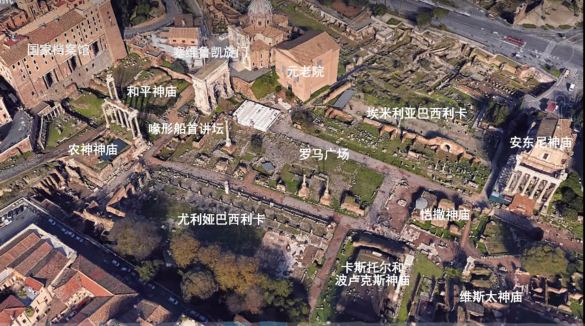

### 罗马大道

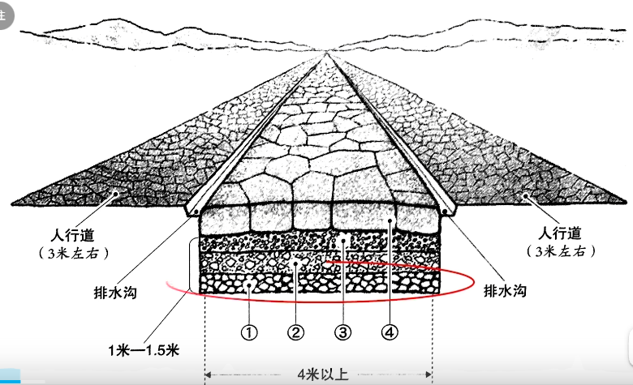

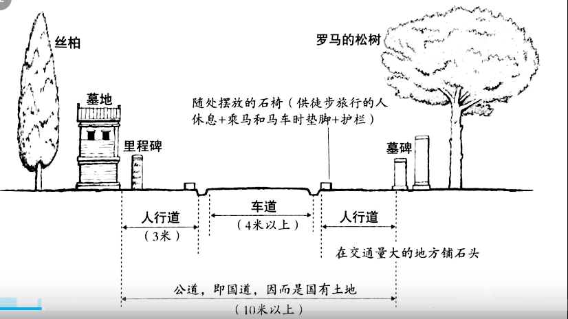

阿皮亚大道（罗马军队士兵修建）

8+7+15=30万公里的道路

### 广场

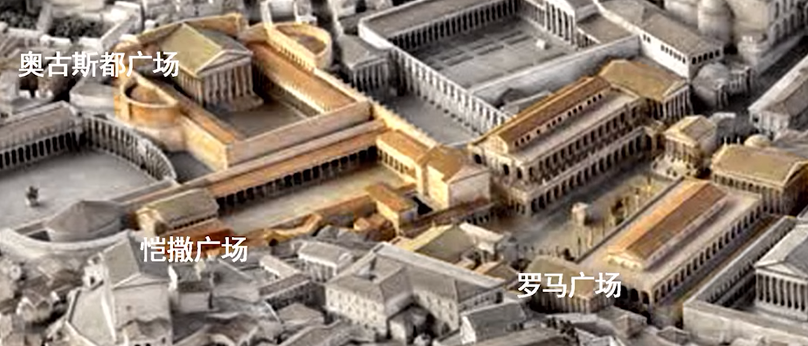

### 巴西利卡

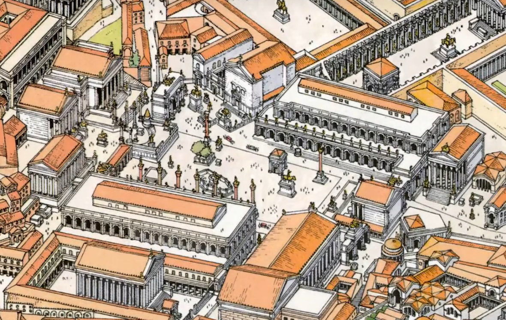

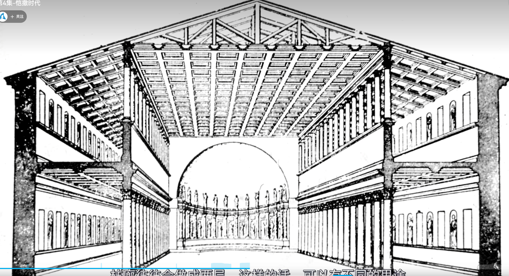


### 罗马神庙

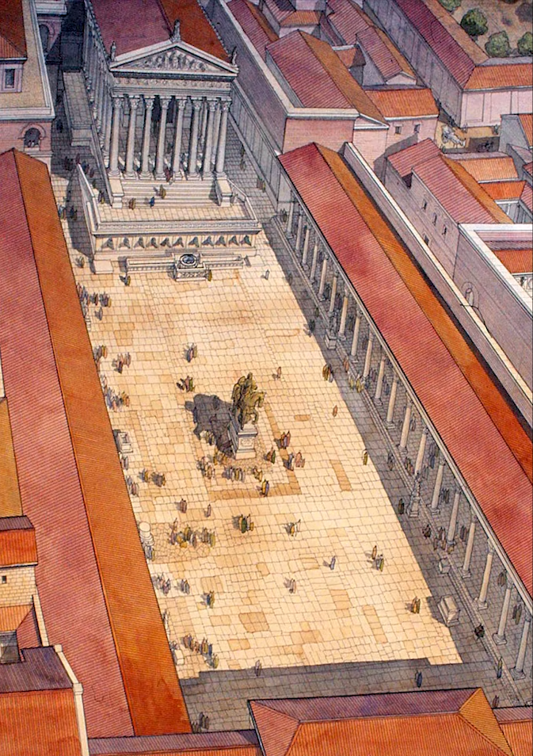


### 剧场

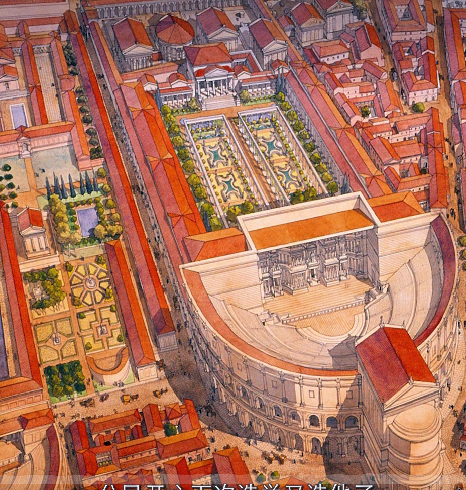

庞培剧场。凯撒在这里被刺杀

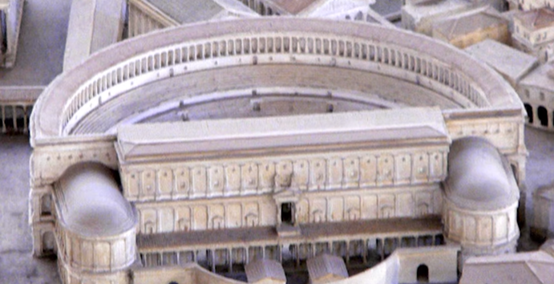

马塞卢斯剧场（第一座真正的罗马剧场）

> 马塞卢斯   奥古斯图的女婿


### 浴场

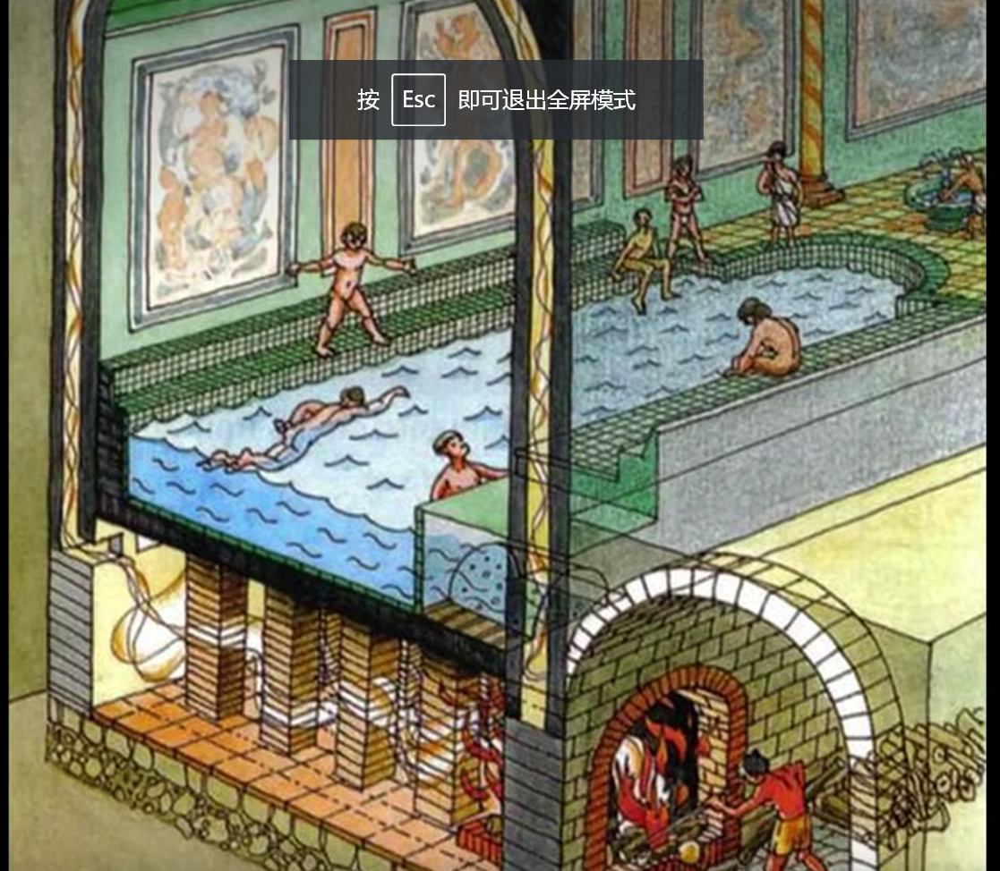

阿格里帕大浴场+ 少女输水到


### 基督教时代

君士坦丁大帝皈依基督教

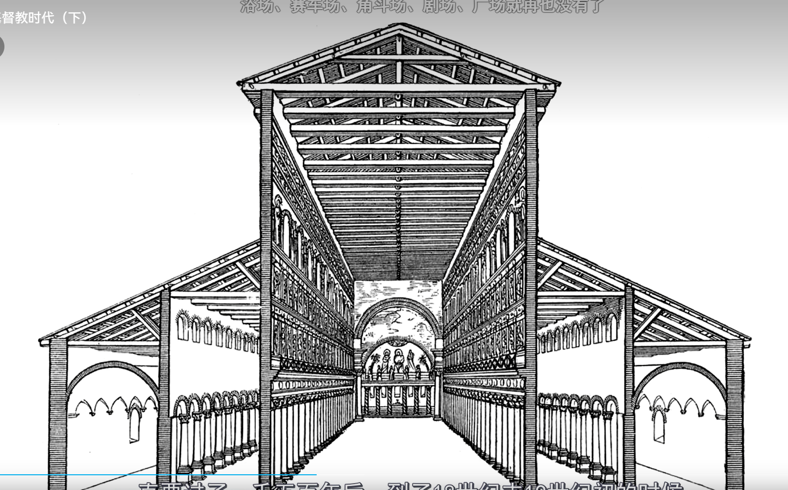

老圣彼得大教堂（继承巴西利卡）   第一座教堂建筑      采用木质架构    【】

罗马的公共建筑（角斗场、剧场、广场、巴西利卡、赛车场、浴场，神庙）就逐渐不再修建，混凝土技术也渐渐失传（一大遗憾），直到18世纪才被重新发明。

圣彼得-罗马教会为圣彼得的嫡传


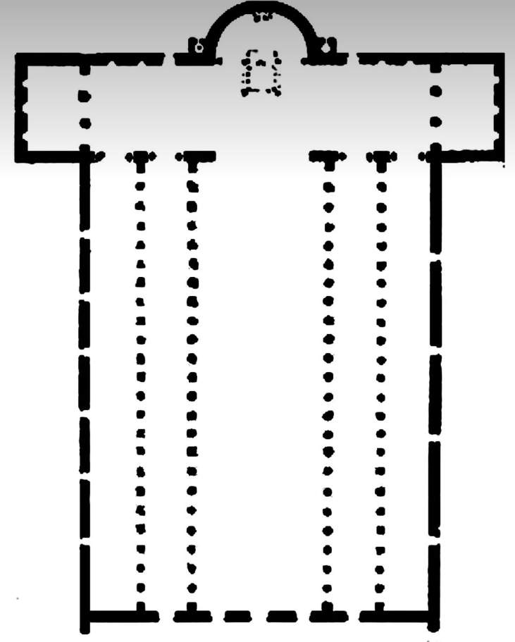

第一座拉丁十字教堂   天主教堂（继承自古罗马巴西利卡）


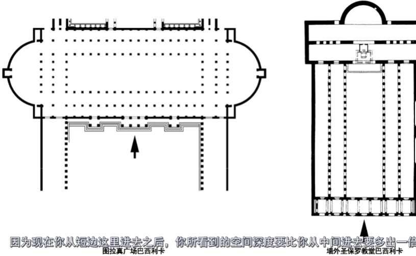

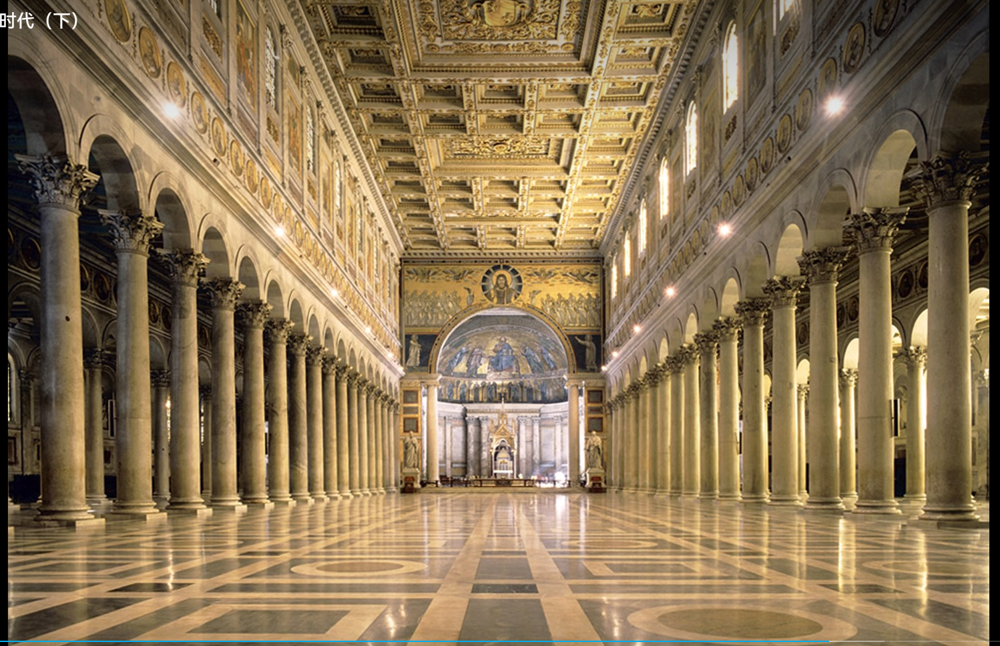

透视的运用


罗马和基督

```
尽管他们从来没有通过暴动或者恐怖活动等等这些极端的方式来试图推翻罗马政权，但是却总是以逃避出任公职或拒绝服兵役来进行消极反抗，在他们看来，虽然是生活在同一个国家却不肯相信他们上帝的人，比起那些外来的野蛮人入侵者来说是更可恶的敌人。宽容曾经是罗马社会最宝贵的品质，也是罗马从一个小城邦一路走来变成强大帝国的主要原因，可是现在，不知道宗教宽容为何物的基督教在帝国的肌体内部不断的复制增长，最终瓦解了罗马社会的根基-罗马人的公民意识，越来越少的人愿意靠自己的努力、拼搏、奋斗去战神困难、掌控命运、寻找光明，越来越多的人情愿把自己的命运交给一个主宰一切的神，或者是东方式的专制帝王。公民、法制和宽容的罗马就要让位给基督教的中世纪了。
```


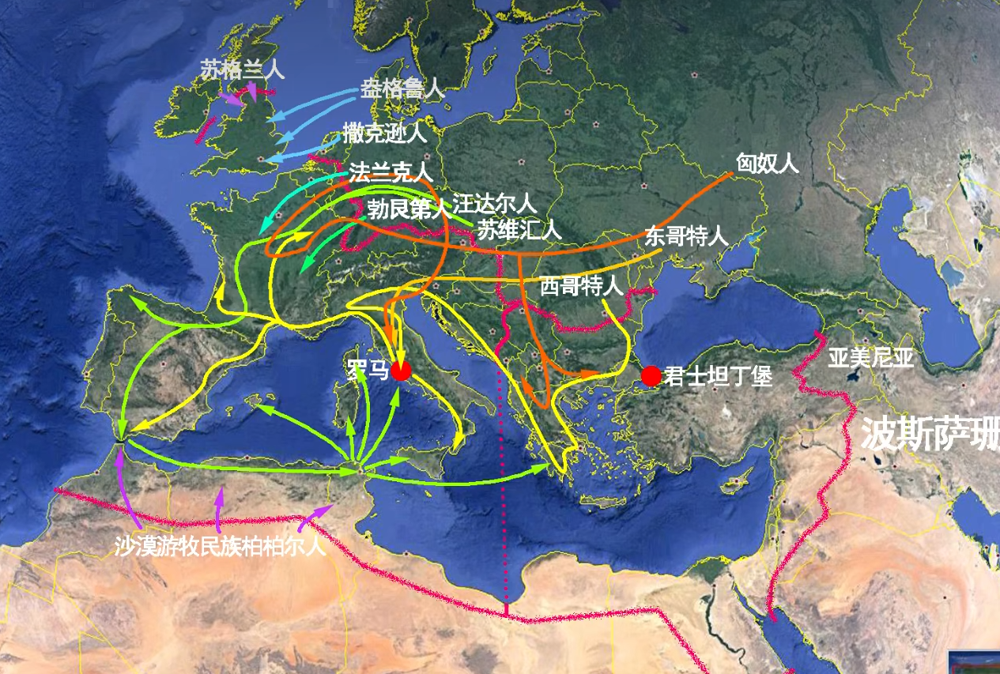


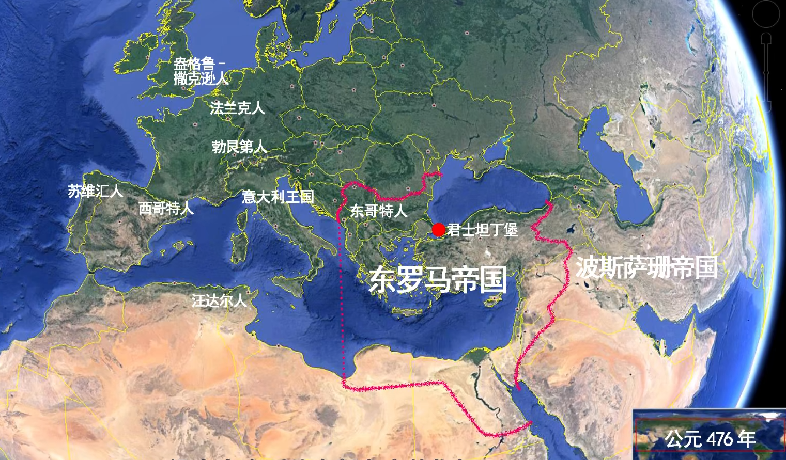


```
甚至城市的居民也从此不再被允许到公共浴场里面去洗澡了，因为在他人面前暴露身体，在教会看来，那就是一种淫秽的行为，就是一种罪恶。作为罗马文明象征的公共洗浴习俗就这样在基督教时代被禁止了。
```

**圣维塔莱集中式教堂**

东罗马帝国教堂--突出皇帝的重心，教士只是辅助。

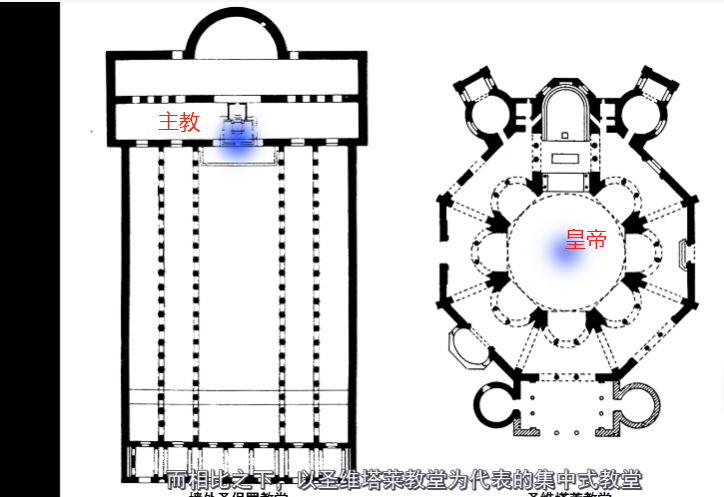


**圣索菲亚大教堂**

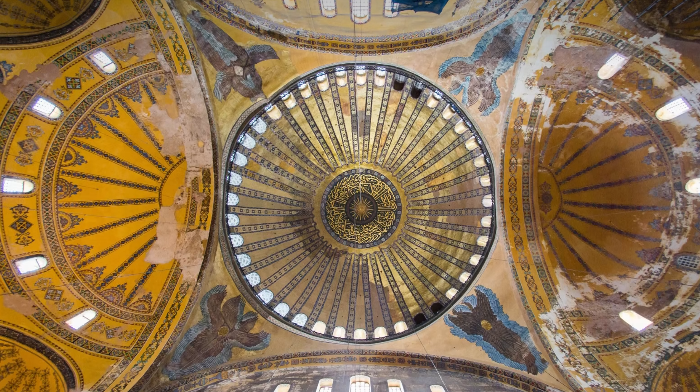

穹顶式巴西利卡（结合了巴西利卡和穹顶式的特点）