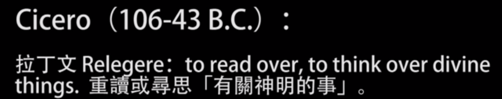
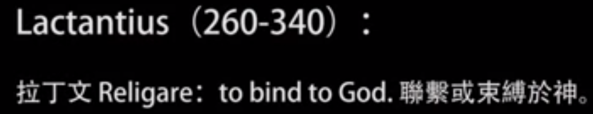
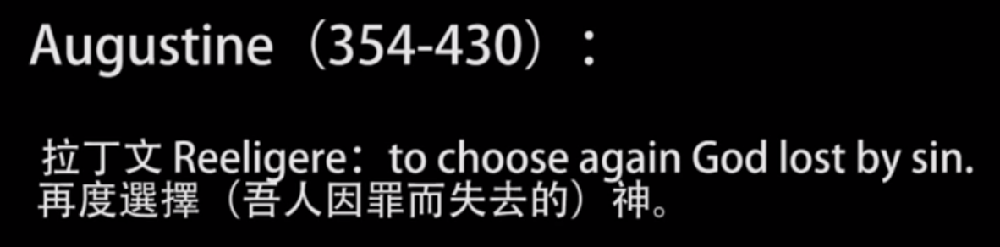

# 总述

[宗教哲学_傅佩荣](http://ocw.aca.ntu.edu.tw/ntu-ocw/ocw/cou/102S202/1)

宗教现象很普遍（在人类社会）

西方哲学（思考的方法，爱智慧，苏格拉底、柏拉图、亚里士多德）

中国的哲学（普遍）

## 哲学三要素

### 1 澄清概念

（通常人类社会的争吵都是概念的混淆）、

### 2 设定判定标准

（正信任、迷信） 行善（善恶的标准）、

### 3 建构系统

（需要建构系统  是否大哲学家是否建构系统，自然界和人类是两个大的范围，有原有本，自然界和有什么特点，一个字是变化  ，人类在世界上就找不到意义（理解的可能性：一个人说话不能被听懂是没有意义），不能理解为什么要有这样的人生。人活在世界都需要问问什么？才能被理解）

两个选择：一个是除了自然界和人类没有其他东西；另一个是认定自然界和人类还有来源和归属（有头有尾）；自然界是必然；人有自由，不可预测；

建构系统就是二加一：二就是自然界和人类，一就是根源；没有根源就成不了系统；

柏拉图：除了自然界和人类还有理性的世界（只能用理性去认识，相对的是感官(各种生物的感官中的世界是不同的)，万物是变化的不可靠的，怎么去认识事物---理性）

亚里士多德：神（最初的推动者）；

如果只谈自然界和宇宙，那么人生根本没有什么好谈的（渺小和短暂），人类有限的一生（追求名利、权利、富贵、美人），你再怎么伟大，然后有如何呢？

人作为人，这一切是什么？怎么来的，要往哪儿去，这一切是为了什么？

哲学的思维和宗教的发展是有配合的地方，都来自于人类追求最后的归属，最后的答案，最后的根源的愿望。方向是一样的方法是不同的。

哲学是理性（经验原则，除非有合理的怀疑，否则我可以相信我的经验）。

宗教的方法是信仰（根本没有明确的答案，你信就对了吗，不要问，没有明确的答案，你信就可以了吗。信仰和知道是不一样的）。

最聪明的回答，是用问题作为答案？记者问霍金你认为有外星人吗，宇宙这么大你怎么知道没有外星人呢？

政治哲学？从哲学来讨论政治里面每个概念怎么设定，标准怎么判定。

## 宗教哲学

宗教哲学是对宗教做哲学的思考跟反省。

宗教

宗教：宗教是多元的。

基督宗教：1 排他论  （其他宗教不能得到救赎）2 包含论（所有宗教都能得到救赎，但只有基督能得到最终的救赎） 3 多元论（如果存在最终的神，但人理解的神是多种多样的。能知者所知） 永远只能认识现象，而不能认识本体。

### 神

god pro nobis ()   Devis          神不可说，一说就经过了特定的语言，特定的文化来使用。每个人心中的神都是不一样的。

THEOS  神就是力量                theism（有神论）            atheism(无神论)      Monotheism（一神论），polytheism（多神论），thenotheism（交替神论）          atom（原子）

西塞罗：

重读或寻思有关神明的事

4bc-29ad        Before Christ; anno Domini(神的年)

联系或束缚于神

再度选择（吾人因罪而失去的）神------原罪论（起心动念）

### 宗教

宗教：宗教是信仰的体现（具体实现出来）。宗教是文化的一部分。（文化是人类生活的全盘表现，三个层次：器物、制度、理念）

人在世界上最怕五个字：重复而乏味(你为什么而活)，需要创造性（两种：从外；从内）。

所有超越的层次

#### 信仰

信仰：人与超越力量（超越界、超越者）之间的关系(人与超越界建立关系，所以与人生具有超越性，超越性有两种：超越死亡（人生的限制：痛苦、罪恶、死亡，前两者还可以相对的，死亡是绝对的）)信仰宗教没有怕死的；在世而不属于世（身、心（知、情、意、真、美、善）、灵（形如槁木，心如死灰 ））  身代表的绝对的界限、心代表可以沟通、灵代表完全打成一片。庄子的意思是降低身和心。所有的宗教都是在 往灵发展（无缘大慈，同体大悲；爱不认识的人  撒玛利亚人）精神 

关系带来改变（生命必然改变）：道德上的提升、灵性上的净化

超越界（transcendant）、内存界（immanent）。内存界：自然界和人类 用感觉和理性能掌握的  内存界之外的：为什么要知道之外的东西。==自然界和人类是不断的变化==，人生没有意义。人生为什么要有意义?如果你认为这个变化就是一切，人生不需要意义，那么你就不需要发言，不需要讨论问题。

超越界作为万物的来源与归属（所有的宗教界承认的）。

所有的价值是经过选择而体现的